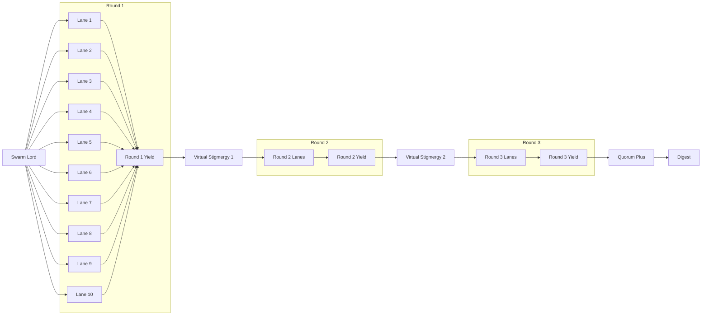
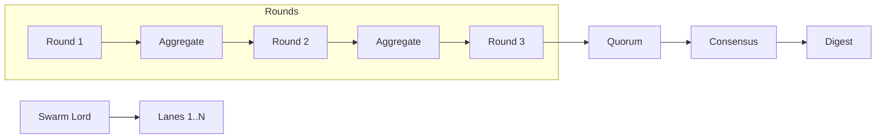

# Gen25 — Swarm orchestration: 10 lanes and 100 lanes (Vision)

BLUF
- The Swarm Lord of Webs orchestrates multiple PREY lanes in parallel (10-lane and 100-lane modes), each running up to 3 rounds.
- After each round, all lanes append receipts and artifacts; a virtual stigmergy step aggregates per-lane findings.
- Next round lanes consume prior-round aggregated evidence across all lanes (self-reinforcing knowledge), then continue.

## Parser-safe overview (10 lanes, 3 rounds)

Notes
- Each lane executes PREY: Perceive → React → Engage → Yield.
- Lanes append receipts at the end of each Yield for audit parity and learning signals.
- Virtual Stigmergy step aggregates lane-level yield summaries and findings to a shared view for the next round.
- Quorum Plus and Consensus run after the last round to validate and summarize results.

## N-lane generalization (100 lanes)

## Orchestration behavior
- Lanes: 10 or 100; per-lane model hints allowed (subset of allowlist) or fixed model per mission.
- Rounds: default 3; Swarm Lord spawns `attempt_1..attempt_3` directories per lane.
- Cross-lane learning:
  - After Round 1, aggregate all `yield_summary.yml` + `lane_findings.jsonl` per lane into a round-level bundle.
  - In Round 2, each lane's Perceive stage includes `prior_evidence_refs` to Round 1 bundle.
  - After Round 2, re-aggregate; Round 3 lanes Perceive include Round 2 bundle.
- Receipts: per lane per round append to `hfo_blackboard/obsidian_synapse_blackboard.jsonl`; include evidence_refs.
- Consensus and quorum: after the last round, run Quorum Plus; copy one artifact per lane into `CONSENSUS/per_lane/` and write `CONSENSUS/consensus_report.yml`.

## Artifacts per lane and round (pilot alignment)
- Perceive → `perception_snapshot.yml` (with `prior_round` and `prior_evidence_refs` for rounds > 1)
- React → `react_plan.yml` (links to perception and prior yield)
- Engage → `engage_report.yml` (links from react and prior yield; evidence includes `lane_findings.jsonl` and any `diagram_*.md` when present)
- Yield → `yield_summary.yml` (links to engage, lane findings, prior yields; includes a `conversation_trace`)

## Virtual stigmergy bundles (per round)
- Content: all lanes' `yield_summary.yml` plus extracted `findings` snapshots into a single `round_k_bundle.yml`.
- Location: under the run directory `hfo_crew_ai_swarm_results/YYYY-MM-DD/run-<ts>/`.
- Usage: included as `prior_evidence_refs` for the next round's Perceive; size-limited and de-duplicated.

## Contracts
- Inputs: mission intent (lanes, models, budgets), allowlist, rounds=3, max_workers, safety knobs.
- Outputs: per-lane PREY artifacts per round, round bundles, receipts, consensus report, digest.
- Success: lanes append receipts each round; attempt>1 artifacts include cross-lane `prior_evidence_refs`; quorum+ PASS.
- Failure: missing receipts or chain links; validator FAIL; out-of-budget or timeouts without partial digest.

## Safety and cost
- Allowlist enforced; reasoning high by default where supported.
- Transport resiliency: one retry on empty, relax response_format on retry; timeout ≤ 30s.
- Concurrency limits: `lanes.max_workers` caps parallelism; stagger starts for 100 lanes.
- Tripwires: round preview_rate targets, distinct sources threshold for quorum+, placeholder ban, line limits.

## Acceptance checklist
- 10-lane: 3 rounds executed; receipts appended per round; Round 2 and 3 Perceive include prior round bundles.
- 100-lane: same as 10-lane with `lanes.max_workers` and staggered scheduling; validator PASS across lanes.
- Consensus: `CONSENSUS/per_lane/` populated and `CONSENSUS/consensus_report.yml` exists.
- Digest: run-level digest includes quorum+ summary and pointers to bundles.

## Interfaces and allocations (initial)
- Orchestrator → `scripts/crew_ai/runner.py`
- Round bundler → `scripts/crew_ai/populate_lane_findings.py` and internal aggregator in runner
- Quorum+ → `scripts/crew_ai/quorum_plus.py`
- Trace analyzer → `scripts/crew_ai/analyze_traces.py`
- Receipts validator → `scripts/ci/validate_blackboard.py`
