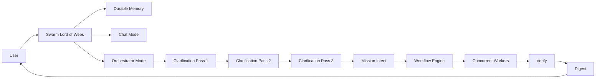

# Gen25 — Swarm Lord of Webs (Vision)

BLUF
- A 24/7 always-on agent with durable memory that is the single interface to the user.
- Two modes: Chat Mode (general agent) and Orchestrator Mode (clarifications → mission intent → concurrent workflow → verify → digest).
- Workers never talk to the user directly; Swarm Lord is the only facade.

Parser-safe diagram (high level)

Notes
- Chat Mode: day to day assistance via chat (e.g., Telegram) and later voice or visual.
- Orchestrator Mode: runs three clarification passes to produce a mission intent, then orchestrates concurrent workers.
- Verification: results are verified before digesting back to the user.
- Facade rule: only Swarm Lord interfaces with the user; workers communicate through the Swarm Lord.
- Workflow Engine may be Temporal or other orchestration; vendor neutral by design.
