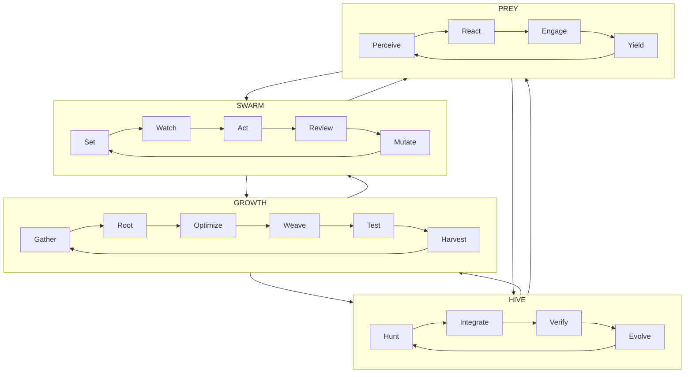

# Gen25 — HFO Workflows Holonic (Vision)

BLUF
- Four proven, bidirectional feedback loops compose holonically: HIVE, GROWTH, SWARM, PREY.
- Each loop stands alone and feeds the others; composition only, vendor neutral.

Names and mappings
- HIVE = Hunt Integrate Verify Evolve  (inspired by Double Diamond)
- GROWTH = Gather Root Optimize Weave Test Harvest  (maps to F3EAD)
- SWARM = Set Watch Act Review Mutate  (maps to D3A plus Mutate)
- PREY = Perceive React Engage Yield  (maps to Sense Make Sense Act plus Yield)

Parser-safe holonic diagram

Notes
- Holonic: each loop is a whole and a part; loops can run independently or as a nested composition.
- Alignment: HIVE hunts apex ideas, integrates, verifies, and evolves; GROWTH disseminates; SWARM coordinates decisions and delivery; PREY executes.
- Battle tested: each loop maps to established patterns to reduce risk and improve clarity.
- Keep labels ASCII, one arrow per line, and close every subgraph for compatibility.

Provenance
- vision_workflows_holonic_2025-11-06.md (2025-11-06)
