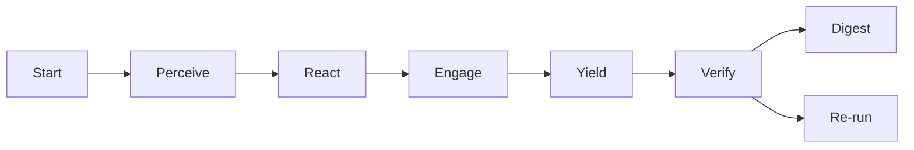

---
hexagon:
  ontos:
    id: c5990dd8-deca-41df-a8b4-c64183fadef3
    type: md
    owner: Swarmlord
  chronos:
    status: active
    urgency: 0.5
    decay: 0.5
    created: '2025-11-23T11:07:35.931834Z'
    generation: 51
  topos:
    address: eyes/archive/hfo_gem/gen_26/AGENTS_gen26_archive_2025-11-07T00-00-00Z.md
    links: []
  telos:
    viral_factor: 0.0
    meme: AGENTS_gen26_archive_2025-11-07T00-00-00Z.md
---

# AGENTS.md Archive (Frozen Snapshot) — 2025-11-07T00-00-00Z

This file is a verbatim archive of the root `AGENTS.md` on 2025-11-07. Treat as read-only reference for Gen26 evolution work. Do not edit; create new versions instead.

---

## Original Content Below

(START OF ORIGINAL ROOT AGENTS.md SNAPSHOT)

## Using the Crew AI pilot (Swarm attempt 1)

This repo includes a minimal, parser-safe Crew AI pilot that runs two parallel PREY lanes with OBSIDIAN roles and logs receipts to the blackboard.

- Roles per lane
  - Perceive → Observer
  - React → Bridger
  - Engage → Shaper
  - Yield → Assimilator
  - Post-lane checks → Immunizer and Disruptor (quorum verify)

- What it does
  - Reads a daily mission intent (v5) that encodes safety, quorum verify, and telemetry defaults.
  - Executes lanes in parallel with PREY; logs receipts to `hfo_blackboard/obsidian_synapse_blackboard.jsonl`.
  - Emits simple OpenTelemetry-like spans to `temp/otel/trace-*.jsonl`.
  - Makes at most one small, bounded LLM call during Engage per lane (optional; skips if no key).

- Prerequisites (local)
  - `.env` at repo root with `OPENROUTER_API_KEY` (optional for no-cost dry-runs) and optional `OPENROUTER_MODEL_HINT` (e.g., `haiku`).
  - Python environment with dependencies from `requirements.txt`.
  - Model allowlist (enforced)
    - openai/gpt-5-mini
    - minimax/minimax-m2
    - openai/gpt-oss-120b
    - openai/gpt-oss-20b
    - x-ai/grok-4-fast
    - deepseek/deepseek-v3.2-exp
    - qwen/qwen3-235b-a22b-2507
  - Note: z-ai/glm-4.6 is temporarily removed due to failing strict integer math sanity; we’ll revisit after tuning.

- Run
  - Concurrency: lanes execute in parallel (thread pool) and emit OTEL spans per phase/agent and per-lane LLM call.
  - Optional model hint (must be in the allowlist) is supported via env.

```bash
# default (no hint): uses openai/gpt-oss-120b
python3 scripts/crew_ai/runner_unified.py \
  --intent hfo_mission_intent/2025-10-30/mission_intent_daily_2025-10-30.v5.yml

# or select an allowed model explicitly
OPENROUTER_MODEL_HINT=deepseek/deepseek-chat-v3-0324 \
  python3 scripts/crew_ai/runner_unified.py \
  --intent hfo_mission_intent/2025-10-30/mission_intent_daily_2025-10-30.v5.yml
```

## MBSE SSOT (YAML + SysML v2) — handoff pack (Gen23)

BLUF
- One write-surface for architecture: `models/hfo.yml` (YAML). Everything else is generated.
- From that model, generate parser-safe Mermaid views for day-to-day reading and emit a SysML v2 text mirror for rigor.
- Keep PREY, receipts, and guardrails (≤200 lines per write, no placeholders, Verify PASS before “done”).

What this standardizes (scope)
- Blocks (services, workers, validators, datastores), Interfaces (from→to), Relationships (uses/writes/reads), Allocations (block→repo paths), Tags, Provenance.
- Generated artifacts (read-only):
  - `diagrams/…/*.md` (Mermaid C4 views; parser-safe)
  - `sysml/hfo.sysml` (textual SysML v2 mirror)
  - Drift/validation report (planned)

Tiny contract (inputs/outputs)
- Inputs: `models/hfo.yml`
- Outputs: `diagrams/*.md`, `sysml/*.sysml`, `reports/drift.json` (planned)
- Success: Diagrams render; SysML mirror builds; no placeholders; receipts appended; CI drift PASS
- Failure: Unknown blocks/paths; parser errors; placeholders; drift FAIL

Paths and tools
- Model (author-only): `models/hfo.yml` (see Minimal Model in `hfo_gem/gen_23/HFOMBSE_Gen23_Roadmap_2025-11-05T00-00-00Z.md`)
- Generators (planned):
  - `scripts/mbse/gen_views.py models/hfo.yml > diagrams/context.md`
  - `scripts/mbse/gen_sysml.py models/hfo.yml > sysml/hfo.sysml`
  - `scripts/mbse/validate.py --model models/hfo.yml`
- Governance (existing): PREY receipts, quorum Verify, CP≥3 before mission intent, single active mission intent per timeframe.

Operator quickstart (today)
1) Author the model
  - Create/update `models/hfo.yml` using the Minimal Model from the Gen23 Roadmap file.
  - Keep edits ≤200 lines per write; no placeholders; record a blackboard receipt referencing file and line ranges.
2) Views (until generators land)
  - Use `hfo_gem/gen_23/diagrams_swarmlord_of_webs_2025-11-05.md` and examples in the Roadmap as the canonical parser-safe patterns.
  - Do not hand-edit generated views once generators are added; treat them as read-only.
3) SysML v2 mirror (planned)
  - When `gen_sysml.py` lands, produce `sysml/hfo.sysml` from the same YAML; keep it in source control.
4) Validate (planned)
  - Run `scripts/mbse/validate.py --model models/hfo.yml` to check paths exist, references resolve, and diagrams are re-generated without diffs.
5) Commit & push
  - Commit `models/hfo.yml` + generated views and mirror; push; ensure CI drift PASS before claiming “done”.

Acceptance (handoff-ready)
- `models/hfo.yml` exists and captures Swarmlord, PREY lanes, Quorum, Blackboard, Telegram gateway, and allocations to current scripts.
- Parser-safe Mermaid views are present under `diagrams/` (or referenced Gen23 diagrams are used pending generator).
- SysML v2 mirror (`sysml/hfo.sysml`) present once the generator lands.
- Receipts appended on edits; Verify PASS recorded for runs that depend on the model.
- CP≥3 and single-active-per-timeframe guardrails are documented and enforced where applicable.

Governance guardrails (unchanged)
- CP≥3 before mission intent for a given date; if fewer than 3 passes exist, mark hallucination_flag and move the file to `archive/`.
- Single active mission intent per timeframe bucket (hour/day/week). Duplicates move to `archive/` and set a regen flag.
- Receipts: append-only JSONL with evidence_refs; ≤200 lines per write; no placeholders.

Troubleshooting
- Mermaid parse errors: use `graph LR` or `graph TB`, simple ASCII labels, one arrow per line, close every `subgraph`, avoid edge labels and parentheses in labels.
- Large files block pushes: never commit artifacts under `temp/` or backups; prefer `.gitignore` or Git LFS for truly large immutable assets.
- Runner freezes or exits 1: check `temp/otel/trace-*.jsonl` for span windows; validate the mission intent schema; reduce lane count; ensure model hints/tokens are sane.

Pointers
- Minimal Model and examples: `hfo_gem/gen_23/HFOMBSE_Gen23_Roadmap_2025-11-05T00-00-00Z.md`
- Parser-safe diagrams (reference): `hfo_gem/gen_23/diagrams_swarmlord_of_webs_2025-11-05.md`
- Operational rules and receipts: this file (`AGENTS.md`)

### Operations note — GitOps merge protocol (2025-11-07)

BLUF
- Keep merges small and receipt-backed. Only merge validated, low-risk slices. Never commit temp artifacts or large generated files.

Protocol (safe default)
- Stage only validated changes (code + tests + minimal docs). Exclude run artifacts (temp/, hfo_crew_ai_swarm_results/, knowledge_index/models/*.joblib, sysml/hfo.sysml, diagrams/*.md) via .gitignore.
- Commit on a feature branch with a clear, bounded message (≤1–2 subsystems).
- Before merging to main:
  - Verify unit tests PASS; integration tests either PASS or skip cleanly.
  - If services are required (e.g., pgvector), validate locally; record a receipt.
  - Ensure blackboard receipt(s) exist for material actions (ingest, healthcheck).
- Merge to main with a merge commit (no fast-forward) to preserve audit breaks.
- Push and monitor CI; revert via merge commit revert if a guard trips.

Receipts (append-only JSONL)
- Capture healthcheck PASS summary and ingest spans pointer.
- Example summary: "Merged knowledge base module; tests PASS (unit), integration skip w/o pgvector; receipts appended; spans present".

Guardrails
- ≤200 lines per write; no placeholders.
- Do not commit `temp/`, `hfo_crew_ai_swarm_results/`, large binaries, or local caches.
- Prefer `sys.executable` in test subprocess calls for portability.

Post-merge checklist
- Tag the merge in the digest (if applicable) and note spans under `temp/otel/`.
- Prepare next chunk (e.g., Temporal scaffold) behind a feature flag.

Handoff checklist (owner ⇄ contributor)
- Owner: confirm `models/hfo.yml` exists and covers current subsystems with allocations; confirm receipts and guardrails.
- Contributor: make ≤200-line updates to `models/hfo.yml` only; run (or plan) generators; open a PR with rendered views + SysML mirror; include a Verify checklist section in the PR description.

— End MBSE handoff pack —


- Outputs
  - Blackboard receipts: `hfo_blackboard/obsidian_synapse_blackboard.jsonl`
  - Spans: `temp/otel/trace-*.jsonl`
  - Verify quorum: recorded in blackboard with votes and threshold

- Safety and cost guards
  - Bounded tokens and allowlisted models for Engage LLM calls; presence-only secret audit (never logs key).
  - Chunk-size limit (≤200 lines per write), placeholder ban, canary-first, measurable tripwires, explicit revert.
  - Reasoning policy (default): If the selected model supports a reasoning control, automatically enable reasoning with high effort unless mission intent or env overrides it. Override via mission `llm.reasoning`/`llm.reasoning_effort` or env `OPENROUTER_REASONING`/`OPENROUTER_REASONING_EFFORT`.
  - Compatibility fallback: If a provider rejects the reasoning field, the client retries once without reasoning to avoid hard failures; override via mission/env if you need to force reasoning on/off for a run.

- Verifying lanes and model selection
  - Check parallelism and LLM model in spans:
    - Spans file: `temp/otel/trace-*.jsonl` with entries like `name: lane_a:engage_llm` and attributes `model`, `latency_ms`.
    - Engage spans also record `reasoning_enabled`, `reasoning_effort`, and `reasoning_removed_on_retry` for audit.
    - Helper tool: `scripts/crew_ai/analyze_traces.py` prints lane windows and "Parallel detected: True/False".
      ```bash
      python3 scripts/crew_ai/analyze_traces.py temp/otel/<trace-file>.jsonl
      ```
  - Quick LLM math sanity check (low token cost):
    ```bash
    # defaults to gpt-oss-120b; or set an allowed OPENROUTER_MODEL_HINT
    python3 scripts/crew_ai/math_bench.py
    ```

### Handoff: test with tightened model allowlist and reasoning-high

- Allowlist in effect (enforced):
  - openai/gpt-oss-120b, openai/gpt-oss-20b, x-ai/grok-4-fast, deepseek/deepseek-v3.2-exp, minimax/minimax-m2, qwen/qwen3-235b-a22b-2507
- Defaults:
  - Reasoning auto-enabled at high effort for supported models (grok-4-fast, deepseek v3.2, minimax m2) unless overridden.
  - To force a specific model for a quick run: set `OPENROUTER_MODEL_HINT` to a substring of one allowlisted model.
- Run pilot and validate locally (optional):
  - Pilot: `python scripts/crew_ai/runner_unified.py --intent hfo_mission_intent/2025-10-30/mission_intent_daily_2025-10-30.v5.yml`
  - Validate: `python scripts/crew_ai/validate_run.py --require-parallel`

- References
  - Mission intent: `hfo_mission_intent/2025-10-30/mission_intent_daily_2025-10-30.v5.yml`
  - Crew README: `scripts/crew_ai/README.md`
  - Runner: `scripts/crew_ai/runner_unified.py`
  - Trace analyzer: `scripts/crew_ai/analyze_traces.py`
  - Math sanity bench: `scripts/crew_ai/math_bench.py`

## Gen24 — handoff prep and test notes (2025-11-05)

BLUF
- Lanes now run compact multi-round PREY (default rounds_per_lane=3) with attempt directories attempt_1..attempt_N.
- RepoScannerAgent emits lane_findings.jsonl during Engage; runner auto-integrates stigmergy → quorum_plus → harvest.
- Post-run tools read the latest attempt per lane. Digest includes Quorum+ summary and rescue pointers.

What changed
- Runner
  - Engage runs roles: shaper, repo_scanner.
  - After Verify, runs: populate_lane_findings → quorum_plus → harvest_rescue; appends results to digest.
  - Perceive of attempt k>1 includes prior_evidence_refs from attempt k-1 Yield.
- Tools
  - populate_lane_findings writes to the latest attempt_* per lane.
  - quorum_plus analyzes the latest attempt_* per lane.
  - harvest_rescue indexes from the latest attempt_* per lane.

How to run
```bash
# Preferred: pipeline (handles post-run steps)
./.venv/bin/python scripts/crew_ai/run_arch_consensus_pipeline.py \
  --intent hfo_mission_intent/_tmp/mission_intent_arch_consensus_100lanes_2025-11-05.v1.yml

# Direct (runner now also runs post-steps)
./.venv/bin/python scripts/crew_ai/runner.py \
  --intent hfo_mission_intent/_tmp/mission_intent_arch_consensus_100lanes_2025-11-05.v1.yml
```

Verify checklist (handoff-ready)
- Per lane (latest attempt):
  - perception_snapshot.yml, react_plan.yml, engage_report.yml, yield_summary.yml exist and are valid
  - lane_findings.jsonl present (from RepoScanner or populate script)
- Run-level:
  - swarmlord_digest.md includes rounds per lane and Quorum+ summary
  - quorum_plus_report.yml passed with thresholds (preview rate, distinct sources)
  - RESCUE_INDEX.jsonl and RESCUED_SUMMARY.md present
  - Spans exist at temp/otel/trace-*.jsonl
- Blackboard receipts appended for phases and post-run checks

Acceptance (Gen24 docs)
- `hfo_gem/gen_24/swarmlord_contract.md` and `hfo_gem/gen_24/RESCUE_PLAN.md` reflect rounds-per-lane, RepoScanner, and post-run integration.
- `models/hfo.yml` exists (minimal SSOT) with allocations to runner, RepoScanner, quorum_plus, and harvester.
- Mission `source_documents` include Gen24 docs, AGENTS.md, and models/hfo.yml.

Notes
- Composition-only policy remains: findings and harvest read in-repo sources; no external network access.
- Keep changes ≤200 lines per write; avoid placeholders; log receipts with evidence_refs.

# AGENTS.md — Operating Guide for Agents in Hive Fleet Obsidian (Gen21)

This lightweight guide tells any agent (workers, tools, scripts, LLMs) how to act in this repo so behavior aligns with the Gen21 SSOT. If you do one thing: follow PREY, log receipts to the blackboard, and don’t talk to the human directly.

## At a glance

### BLUF
- Speak through the Swarmlord facade only; never prompt the human mid-loop.
- Use PREY as the canonical loop: Perceive → React → Engage → Yield.
- Enforce the safety envelope: canary first, measurable tripwires, explicit revert.
- Append receipts to the blackboard JSONL for every material action (with evidence_refs).
- Nothing persists or ships until an independent Verify PASS.

### Matrix (TL;DR)
| Topic | You do | Tooling | Gate |
|---|---|---|---|
| Interface | Swarmlord-only facade | Ops section (Swarmlord) | Required |
| Workflow | HIVE → GROWTH → SWARM → PREY | Gen21 mappings | Required |
| Safety | Canary • Tripwires • Revert | Line counts, placeholder scan | Required |
| Evidence | Append JSONL receipts | hfo_blackboard/…/blackboard.jsonl | Required |
| Chunking | ≤200 lines per write | line_count tripwire | Required |
| Verify | Independent PASS before persist | Verify checklist | Hard gate |

### Diagram
```mermaid
graph TD
  subgraph Context
    H[HIVE] --> G[GROWTH]
    G --> S[SWARM]
    S --> P[PREY]
  end
  MI[Mission Intent (Z)] --> P
  P --> V[Verify (independent)]
  V -->|PASS| PS[Persist & Digest]
  V -->|FAIL| RG[Re-run chunk]
  P -.-> BB[(Blackboard JSONL)]
  V -.-> BB
```

### Contents
- [Core principles](#core-principles)
- [Workflow map (keep these labels)](#workflow-map-keep-these-labels)
- [Agent contract (tiny)](#agent-contract-tiny)
- [Blackboard protocol (append-only JSONL)](#blackboard-protocol-append-only-jsonl)
- [PREY loop for agents (how to act)](#prey-loop-for-agents-how-to-act)
- [Safety envelope (operational)](#safety-envelope-operational)
- [Verify gate (independent)](#verify-gate-independent)
- [Prompts policy (no babysitting)](#prompts-policy-no-babysitting)
- [Quickstart for a new agent](#quickstart-for-a-new-agent)
- [Paths and artifacts](#paths-and-artifacts)
- [Acronyms quick reference](#acronyms-quick-reference)

### Swarmlord backstory (verified)

The Swarmlord is the single facade that interfaces with the human operator and orchestrates mission intent into parallel PREY lanes (Perceive → React → Engage → Yield). It enforces the repo’s safety envelope at all times (canary first, measurable tripwires, explicit revert, ≤200 lines per write, placeholder ban), records every material action as an append-only JSONL receipt on the blackboard, and emits spans for observability. After each lane’s Yield, an independent quorum verify runs; only on PASS do outcomes persist and a digest is produced. This control path is neutral and task‑agnostic (pilot, ARC, chat consults): same PREY phases, same receipts, same Verify gate.

### Verified invariants (quick factbox)

- Canonical loop and roles
  - PREY is mandatory across code/docs/logs: Perceive → React → Engage → Yield.
  - Lane roles (pilot): Observer (Perceive), Bridger (React), Shaper (Engage), Assimilator (Yield); post‑lane: Immunizer and Disruptor (quorum verify).
- Safety envelope
  - ≤200 lines per write; canary first; measurable tripwires; explicit revert; placeholder ban.
- Evidence discipline
  - Append‑only blackboard at `hfo_blackboard/obsidian_synapse_blackboard.jsonl` with required fields (mission_id, phase, summary, evidence_refs, safety_envelope, blocked_capabilities, timestamp).
- Verify gate
  - Independent quorum verify after Yield; PASS required before persistence/digest. Run‑level outputs include `swarmlord_digest.md` and `quorum_report.yml`.
- Artifacts and spans
  - Per‑lane artifacts: `perception_snapshot.yml`, `react_plan.yml`, `engage_report.yml`, `yield_summary.yml` under `hfo_crew_ai_swarm_results/YYYY-MM-DD/run-<ts>/…`.
  - Spans emitted to `temp/otel/trace-*.jsonl`; analyzer reports whether lanes ran in parallel.
- Model policy (pilot)
  - Enforced allowlist: openai/gpt-5-mini, minimax/minimax-m2, openai/gpt-oss-120b, openai/gpt-oss-20b, x-ai/grok-4-fast, deepseek/deepseek-v3.2-exp, qwen/qwen3-235b-a22b-2507.
  - Reasoning auto‑enabled at high effort for supported models unless overridden by mission/env; client retries once without reasoning if a provider rejects the field.
- Chat and Telegram path
  - Voice/text trigger is start‑of‑line `obsidian` (case‑insensitive; optional space/colon). Telegram is authoritative by default; one ack per message, then a consult link and summary.
  - Consult artifacts live under `…/swarmlord_consult/` and replies are mirrored to chat/JSONL; heartbeat and dedupe guards are enabled.


## Core principles

- Sole interface: Only the Swarmlord facade speaks to the human once online. Workers never prompt the human mid-loop.
- Canonical workflow: PREY terms are mandatory in code/docs/logs.
- Safety envelope: Canary first; tripwires measurable; must have a revert plan.
- Evidence discipline: Every material action gets a blackboard JSONL receipt with evidence_refs.
- Chunking: Write in chunks of ≤200 lines; enforce line_count tripwires; avoid truncation.
- Verify gate: Nothing persists or ships until Verify PASS. Verify is independent of the authoring step.
- Placeholder ban: Don’t leave TODO/…/omitted in committed artifacts.

## Workflow map (keep these labels)

- HIVE = Double Diamond + Meta-Evolution
  - Discover → Define → Develop → Deliver overlaid with Gen19 H.I.V.E: Hunt → Integrate → Verify → Evolve
- GROWTH = F3EAD
  - Find → Fix → Finish → Exploit → Analyze → Disseminate (aka “Harvest”)
- SWARM = D3A + Mutate
  - Decide → Detect → Deliver → Assess → Mutate (maintain a quality-diverse portfolio)
- PREY = Sense → Make Sense → Act → Yield (canonical)
  - In repo terms: Perceive → React → Engage → Yield

## Agent contract (tiny)

- Inputs: mission_intent (UTC Z), relevant repo files, blackboard path, chunk plan, safety limits.
- Outputs: artifacts (code/docs/config), blackboard receipts, optional review bundles.
- Success: Tripwires not tripped; Verify PASS; receipts include evidence_refs; chunk limits respected; no human prompts.
- Failure: Any tripwire hit; placeholder left; invalid JSON receipt; missing evidence_refs. Set regen_flag, shrink chunk, narrow scope, and continue.

## Blackboard protocol (append-only JSONL)

- File: `hfo_blackboard/obsidian_synapse_blackboard.jsonl`
- One JSON object per line. Do not edit previous lines. Never rewrite history.
- Required fields:
  - mission_id: string
  - phase: string (e.g., perceive, react, engage, yield, verify, digest)
  - summary: short human-readable description
  - evidence_refs: array of strings (paths, line ranges, hashes, or report IDs)
  - safety_envelope: object (chunk_size_max, line_target_min, tripwire status)
  - blocked_capabilities: array of strings (e.g., "network", "npm", "pip")
  - timestamp: ISO 8601 Z
- Optional fields:
  - chunk_id: { index:int, total:int }
  - regen_flag: boolean (true if regenerating after a FAIL)

Example: engage receipt
```json
{"mission_id":"gem21_gpt5_attempt3_2025-10-29","phase":"engage","summary":"Wrote AGENTS.md draft (chunk 1)","evidence_refs":["AGENTS.md:1-120"],"safety_envelope":{"chunk_size_max":200,"line_target_min":1000},"blocked_capabilities":[],"timestamp":"2025-10-29T16:00:00Z","chunk_id":{"index":1,"total":1},"regen_flag":false}
```

Example: verify PASS receipt
```json
{"mission_id":"gem21_gpt5_attempt3_2025-10-29","phase":"verify","summary":"AGENTS.md Verify PASS: lint/render ok, no placeholders","evidence_refs":["verify_report:ok"],"timestamp":"2025-10-29T16:05:00Z"}
```

## PREY loop for agents (how to act)

- Perceive
  - Read mission intent (Z) and scan the repo for relevant context.
  - Capture constraints and targets (line counts, chunk size, policies) in a receipt.
  - Use best-available tools for high-quality perception:
    - Virtual stigmergy snapshot: summarize recent signals (recruit/inhibit/sustain, TTL, bias) and top topics.
    - Optional internet/references: surface state-of-the-art papers/systems/benchmarks when enabled.
    - Repo context: bounded memory header (chat/blackboard/recent artifacts) ≤2k chars.
    - Artifact: `perception_observations.md` (lane-local) plus `perception_snapshot.yml` (required SSOT fields).
- React
  - Classify domain/complexity; pick approach; plan chunk size ≤200; define tripwires.
  - Append a react receipt with chunk plan and safety parameters.
  - Integrate stigmergy readiness and bias:
    - Record summary: ok/reason, top topics with aggregate, bias, and counts.
    - If enabled, apply bias to topic/model selection and document in `react_plan.yml`.
  - Artifact: `react_plan_detail.md` (lane-local rationale/outline) + `react_plan.yml` (required SSOT fields).
- Engage
  - Do the work in planned chunks. After each chunk, check line_count and placeholder bans.
  - Append an engage receipt with evidence_refs to files/lines/hashes.
  - Use the best tools for the task (bounded LLM calls, analyzers, runners) with retries on transient errors:
    - Bounded tokens; allowlisted models; retry-on-empty once and drop response_format on retry.
    - Prefer concrete, reusable artifacts (reports, code diffs, data extracts) over prose only.
  - Artifact: `engage_report.yml` (metrics_summary, tests/tripwires) and lane-specific outputs (e.g., `yield_synthesis.md`).
- Yield
  - Assemble outputs into a review bundle; request Verify; append a yield receipt.
  - Produce a concise synthesis (LLM optional, bounded) with citations and actionable recommendations.
  - Artifact: `yield_notes.md` (lane-local) + `yield_synthesis.md` (summary) + `yield_summary.yml` (required SSOT fields).

Gate policy: PASS → persist/digest; FAIL → set regen_flag, shrink chunk, narrow scope, repeat PREY.

## PREY test acceptance (research swarms)

- Per lane (required)
  - `perception_snapshot.yml`, `react_plan.yml`, `engage_report.yml`, `yield_summary.yml` present and valid
  - `perception_observations.md`, `react_plan_detail.md`, `yield_notes.md`, `yield_synthesis.md` present
  - `react_plan.yml` includes `stigmergy_summary` (ok/reason/top_topics)
- Run-level
  - `quorum_report.yml` has `votes == lane_count`; threshold satisfied on PASS
  - `swarmlord_digest.md` includes Matrix and Stigmergy sections and a parser-safe Mermaid diagram
  - `temp/otel/trace-*.jsonl` contains `:engage_llm` spans for each lane

## Safety envelope (operational)

- Canary: Start with limited scope; prefer dry-runs and linters before large writes.
- Tripwires (examples):
  - line_count < 0.9× target
  - placeholders found ("TODO", "...", "omitted")
  - tests or policy checks fail
  - missing evidence_refs in material actions
- Revert: Restore last good artifact or the known-good baseline; reduce chunk size; try again.

## Verify gate (independent)

- Don’t claim done without Verify PASS. Keep authoring and verification logically separate.
- Quick checklist:
  - No placeholders
  - Chunk limits respected (≤200 lines per write)
  - Mermaid/markdown render (if applicable)
  - JSON receipts valid and complete
  - Canary/tripwires/revert status recorded

## Prompts policy (no babysitting)

- Workers do not prompt the human mid-loop. All dialogue goes through the Swarmlord facade.
- If you detect a worker→human prompt attempt, log a tripwire receipt with regen_flag=true and continue autonomously.

## Quickstart for a new agent

1) Read these SSOT sections for context: 3 (workflow map), 5 (blackboard), 8 (Swarmlord Ops), 12 (evidence/receipts), 17 (procedures), 25 (end-to-end).
2) Set a chunk plan (≤200 lines). Define your tripwires.
3) Append a Perceive receipt with mission_id and safety plan.
4) Run PREY loop. After each chunk, append an Engage receipt with evidence_refs.
5) On Yield, request Verify and wait for PASS before persistence/digest claims.

## Paths and artifacts

- Mission intent (Z): `hfo_mission_intent/mission_intent_YYYY-MM-DD.yml`
- Blackboard JSONL: `hfo_blackboard/obsidian_synapse_blackboard.jsonl`
- SSOT (reference): `hfo_gem/gen_21/gpt5-attempt-3-gem.md`

### Swarmlord facade (Telegram) — conversational NL intents

- Path: `scripts/swarmlord_chat/telegram_swarmlord.py`
- Behavior:
  - Natural language chat (no mandatory commands). Supported intents: notes (`note: …` / `remember …`), repo search (`search …` / `find …`), PREY run triggers (`run PREY`), digest/stigmergy inspection, status.
  - Durable memory: chat → `swarmlord_chat/chat.jsonl`; notes → `swarmlord_chat/notes.jsonl`.
  - Receipts appended for material actions (note added, search executed, run triggered).
  - Slash commands remain available: `/start`, `/status`, `/work`, `/digest`, `/stigmergy`.
- Env: `TELEGRAM_BOT_TOKEN`, `SWARM_MISSION_INTENT_PATH`, `SWARM_RUNNER_CMD`, `SWARM_BLACKBOARD_PATH`, `SWARM_CHAT_LOG_PATH`, `SWARM_NOTES_PATH`.

### Operations note — Telegram facade handoff (2025-11-06)

- Conversational NL intents are live. You can chat without commands to: take notes, search the repo, trigger PREY, and inspect digest/stigmergy.
- Paths: facade at `scripts/swarmlord_chat/telegram_swarmlord.py`; memory at `swarmlord_chat/chat.jsonl` and `swarmlord_chat/notes.jsonl`.
- Env: `.env` at repo root supplies `TELEGRAM_BOT_TOKEN` and optional `SWARM_MISSION_INTENT_PATH`.
- Tests: unit tests PASS (classifier, search, note write, env sanity). See `tests/test_telegram_facade_intents.py` and `tests/test_env_and_runner_config.py`.
- Receipts: upgrade and tests PASS recorded in `hfo_blackboard/obsidian_synapse_blackboard.jsonl`.

### PREY per-step artifacts and validator (pilot)

- Run directory (per PREY run): `hfo_crew_ai_swarm_results/YYYY-MM-DD/run-<ts>/`
  - `mission_pointer.yml` — run-level pointer to the mission intent plus lane/quorum/telemetry config.
  - `<lane_name>/attempt_1/` — lane output directory containing four artifacts:
    - `perception_snapshot.yml` — mission_id, lane, timestamp, trace_id, safety, llm, paths.
    - `react_plan.yml` — cynefin rationale, approach with tripwires and quorum settings.
    - `engage_report.yml` — actions performed under safety, LLM call metadata (if any).
    - `yield_summary.yml` — collected agents, evidence_refs (must include the three core artifacts).
  - `swarmlord_digest.md` — BLUF, lane↔model matrix, parser-safe Mermaid diagram, and a Trace pointer.

- Validator (lane-level, post-Yield): ensures all four artifacts exist with minimal fields and that `yield_summary.evidence_refs` references `perception_snapshot.yml`, `react_plan.yml`, and `engage_report.yml`. Its PASS contributes a vote in Verify quorum.

- CI gate (repo): a workflow runs the pilot, validates JSON/JSONL (including the blackboard), checks per-lane artifacts and digest, and asserts span-level parallelism using `scripts/crew_ai/analyze_traces.py`.

- PettingZoo verification wrapper:
  - Path: `scripts/run_pz_simple_tag_random.sh`
  - Purpose: Run MPE simple_tag_v3 random-vs-random verification and write a JSON results file under `hfo_petting_zoo_results/`.
  - Usage:
    - Default (100 episodes, seed 42): `bash scripts/run_pz_simple_tag_random.sh`
    - Custom: `bash scripts/run_pz_simple_tag_random.sh <episodes> <seed> [outdir]`
  - Output: Prints metrics and saves `simple_tag_v3_random-vs-random_<TIMESTAMP>_seed<seed>_eps<episodes>.json` in the outdir.

- 2x2 Random and Heuristic test:
  - Path: `scripts/run_pz_simple_tag_matrix.sh`
  - Purpose: Run a 2×2 matrix on MPE simple_tag_v3 with continuous actions: RvsR, HvsR, RvsH, HvsH.
  - Usage:
    - Default (100 episodes, seed 42): `bash scripts/run_pz_simple_tag_matrix.sh`
    - Custom: `bash scripts/run_pz_simple_tag_matrix.sh <episodes> <seed> [outdir]`
  - Output: Prints per-cell metrics and saves `simple_tag_v3_matrix_<TIMESTAMP>_seed<seed>_eps<episodes>.json` in the outdir.

- 2x2 Animated GIF generator:
  - Path: `scripts/run_pz_make_matrix_gif.sh`
  - Purpose: Produce a 2×2 looping GIF (RvsR, HvsR, RvsH, HvsH) with headers and ep/step overlays for quick visual inspection.
  - Usage:
    - Default (3 episodes/cell, seed 42, 25 cycles/ep): `bash scripts/run_pz_make_matrix_gif.sh`
    - Custom: `bash scripts/run_pz_make_matrix_gif.sh <seed> <max_cycles> <duration_ms>`
  - Output: Writes to dated folder `hfo_petting_zoo_results/YYYY-MM-DD/` with name `simple_tag_v3_matrix_<TS>_seed<seed>_eps3.gif`.

## Acronyms quick reference

- D3A — Decide, Detect, Deliver, Assess
- F3EAD — Find, Fix, Finish, Exploit, Analyze, Disseminate (aka “Harvest”)
- H.I.V.E — Hunt, Integrate, Verify, Evolve (Double Diamond overlay)
- QD — Quality Diversity (maintain diverse, high-fitness solutions)

---

BLUF for agents: Use PREY, log to blackboard, respect chunk/tripwires, never ping the human, and don’t ship before Verify PASS. Align labels with HIVE/GROWTH/SWARM/PREY to stay in-family with Gen21.

### Gen26 SSOT (preview)
Gen26 introduces a constrained Markdown SSOT at `hfo_gem/gen_26/README.md` mirrored automatically to `sysml/hfo_gen26.sysml` (read-only). It formalizes blocks (Swarmlord, CrewAI Runner, Temporal Workflow, pgvector KB, NATS JetStream, OpenTelemetry, OpenFeature, Security Guard, FinOps Meter) plus interfaces and allocations. Use this as the authoritative architecture source; do not hand-edit the SysML mirror. Planned Temporal activities (ingest_delta, healthcheck_vector_db, generate_digest, send_nats_event) are scaffolded in `scripts/orchestration/temporal_activities.py` and will be wired when `HFO_ENABLE_TEMPORAL` feature flag is set.

## Handoff — SSOT‑first quickstart (2025‑11‑07)

This repo is ready to operate SSOT‑first. If you’re confused by the knowledge layer details: pgvector is “on” for internal use (ingest/query/healthcheck/spans/tests work) and you don’t need extra steps before authoring the SSOT; Temporal and full BM25 can come later.

- What you already have
  - Knowledge bank: ingest ➜ vectors/provenance, hybrid query ➜ results, healthcheck ➜ PASS with spans/receipts, smoke tests.
  - PREY lanes + digest: runner writes lane artifacts and quorum/digest (see Crew AI sections above).
  - Telegram facade: conversational trigger to launch consults/PREY (authoritative mode).
  - Minimal orchestration: a tiny “temporal‑like” workflow runs healthcheck + read‑only query for readiness.

- What is NOT required before SSOT work
  - Full BM25 persistence (current BM25 is marked “approx”; fine to proceed).
  - Temporal server (use the minimal workflow for now; swap later).
  - Migration tooling (nice‑to‑have; not a gate for authoring the model).

- SSOT‑first steps (do these now)
  1) Author the single source of truth at `models/hfo.yml` (≤200 lines). Base it on the Minimal Model in `hfo_gem/gen_23/HFOMBSE_Gen23_Roadmap_2025-11-05T00-00-00Z.md`.
     - Include: Swarmlord, PREY lanes, Quorum/Verify, Blackboard, Telegram gateway, and allocations to current scripts.
  2) Generate views (until generators land): keep parser‑safe examples under `diagrams/` (see `hfo_gem/gen_23/diagrams_swarmlord_of_webs_2025-11-05.md`). Treat generated views as read‑only once generators are added.
  3) When ready, mirror to SysML v2 (planned): `scripts/mbse/gen_sysml.py` ➜ `sysml/hfo.sysml` (tracked). Until then, keep the intent in YAML and diagrams in `diagrams/`.
  4) Append a blackboard receipt for the SSOT authoring edit with evidence_refs to `models/hfo.yml:lines` and any diagram files.

- Minimal acceptance for this handoff
  - `models/hfo.yml` exists and captures the blocks/relations above.
  - Parser‑safe Mermaid views in `diagrams/` or referenced Gen23 diagrams are present.
  - Receipts appended; no placeholders; ≤200 lines per write.
  - PREY runner still passes Verify (unchanged) and can optionally pull from the SSOT later.

- When to circle back to infra
  - Temporal: add activities (ingest_delta, healthcheck_vector_db, query_hybrid, generate_digest) once the SSOT is stable; the minimal workflow is enough for now.
  - Knowledge: keep BM25 as “approx” until you choose to persist a full inverted index; it’s not a blocker for SSOT.
  - Migrations: add a small `schema_version` table and a baseline migration before large schema changes.

One‑liner clarity: SSOT comes first—start with `models/hfo.yml` and diagrams; pgvector is already usable for agent retrieval, and Temporal/BM25 hardening can follow without blocking the SSOT handoff.

## Handoff addendum — Gen25 SSOT + CI validator (2025-11-06)

BLUF
- Gen25 establishes a single SSOT in Markdown with a direct SysML v2 mirror. CI now validates both the mirror and blackboard receipts, with legacy-tolerant parsing to avoid blocking on historical lines.

What’s operational now
- SSOT authoring: `hfo_gem/gen_25/README.md` (one write-surface; parser-safe Mermaid only).
- SysML mirror: Generated by `scripts/mbse/md_to_sysml.py` → `sysml/hfo.sysml` (textual, tracked).
- CI guardrails:
  - Drift check for SSOT → SysML mirror.
  - Blackboard JSONL validator hardened for real-world logs:
    - Accepts `stage` as alias for `phase`.
    - Allows multi-line and concatenated JSON objects (buffers, then decodes).
    - Skips strict checks for legacy `event`/debug-only lines without `mission_id`.
    - `timestamp` is still expected; missing top-level timestamp downgrades to a warning if a nested timestamp isn’t found.

Receipts schema (effective now)
- Required: `mission_id` (string), `phase` (string; `stage` accepted as alias).
- Recommended: `timestamp` (ISO 8601 Z) at top level; if absent but present nested, validator passes. If fully absent, emits a warning.
- Recommended: `evidence_refs` as list of strings. Keep paths and optional line ranges (e.g., `path:1-120`).
- Legacy tolerance: lines with `{"event": ...}` or debug-only metadata can omit `mission_id`; they’re read-only and skipped for strict checks.

Operator quick checks (local)
- Validate receipts
  - python3 scripts/ci/validate_blackboard.py hfo_blackboard/obsidian_synapse_blackboard.jsonl
- Run MD→SysML smoke tests
  - python3 scripts/ci/run_mdse_tests.py

Handoff checklist (delta)
- Gen25 SSOT present and updated (`hfo_gem/gen_25/README.md`).
- SysML mirror generated and committed (`sysml/hfo.sysml`).
- CI passes: blackboard validator PASS and MDSE tests PASS.
- PRs include a Verify checklist section referencing receipts and CI outputs; main is protected with required checks.
- Keep edits ≤200 lines per write; no placeholders in committed artifacts; receipts appended with evidence refs.

Notes
- Treat generated diagrams and the SysML mirror as read-only artifacts once generators are wired into CI.
- The validator is strict on types and shape, but intentionally lenient on legacy timestamps to avoid churn; new receipts should include a top-level `timestamp` going forward.


## Update — Attempt chaining + consensus for PREY lanes (2025-11-06)

BLUF
- Artifacts now “talk” across attempts: each round threads perception → react → engage → yield with explicit links and a conversation trace.
- Consensus includes at least one artifact from each lane under `CONSENSUS/per_lane/` in addition to the diagrams summary.
- Validators enforce chain presence for attempts > 1; quorum+ remains the run-level gate.

What changed (pilot runner)
- Perception snapshot (`perception_snapshot.yml`)
  - Adds `prior_round`, `prior_evidence_refs`, and `prior_links` when attempt > 1 (points to previous attempt’s yield/react/engage artifacts).
- React plan (`react_plan.yml`)
  - Adds `links.from_perception_snapshot` and `links.prior_yield_summary`.
- Engage report (`engage_report.yml`)
  - Adds `links.from_react_plan` and `links.prior_yield_summary`.
  - Evidence chain now includes `lane_findings.jsonl` and up to 3 `diagram_*.md` files when present.
- Yield summary (`yield_summary.yml`)
  - Adds `links.from_engage_report`, `links.lane_findings`, `links.prior_yield_summary`.
  - Adds `conversation_trace` listing the round’s artifacts in order.
- Validator
  - For attempt > 1, requires `prior_yield_summary` in React, Engage, and Yield artifacts.
- Consensus
  - Copies one representative artifact per lane to `CONSENSUS/per_lane/` (prefers `yield_summary.yml`, falls back to `engage_report.yml`).
  - Keeps diagram head clustering in `CONSENSUS/diagrams/` and writes `CONSENSUS/consensus_report.yml`.

Tiny contract (lane conversation)
- Inputs: mission intent, prior attempt’s `yield_summary.yml` (for k>1).
- Outputs per attempt: the four PREY artifacts with `links` and `conversation_trace`.
- Success: Attempt k artifacts link to attempt k-1; validator PASS; evidence includes findings/diagrams when present.

How to validate quickly
- Run a canary mission intent (<= 25 lanes, rounds=3) and check:
  - Lane `attempt_2/` and `attempt_3/` have `links.prior_yield_summary` in React/Engage/Yield.
  - `CONSENSUS/per_lane/` contains one file per lane; `CONSENSUS/consensus_report.yml` exists.
  - `quorum_plus_report.yml` shows PASS with preview coverage and ≥2 distinct mission sources.

Acceptance (handoff-ready)
- All lanes emit the four artifacts per latest attempt and pass pilot validator.
- For attempt>1, chain links present and non-empty across React/Engage/Yield.
- Consensus contains per-lane artifacts and (if requested) diagrams; digest points to quorum+, rescue, and consensus.
- Receipts appended; no placeholders; ≤200 lines per write respected.

Notes for operators
- The conversation links are relative to repo root for portability in receipts and consensus bundles.
- If a lane lacks diagrams, consensus still collects a per-lane artifact for audit parity.
- Transport resiliency (retry-on-empty, relaxed format on retry) is enabled across phases to lift preview coverage without raising token budgets.

Next: MBSE SSOT integration
- Generate parser-safe Mermaid views and a SysML v2 mirror directly from `models/hfo.yml`:
  - `scripts/mbse/gen_views.py models/hfo.yml > diagrams/context.md`
  - `scripts/mbse/gen_sysml.py models/hfo.yml > sysml/hfo.sysml`
- Wire the runner to include generated views in lane evidence and consensus when present.
- Keep `models/hfo.yml` the write-surface; treat generated diagrams and the SysML mirror as read-only artifacts.

## Merge notes (2025-11-07)

Actions taken by agent for safe merge:

- Created and validated a knowledge base slice: `scripts/knowledge/*` (ingest, client, healthcheck, BM25/supporting search, provenance).
- Added focused tests (unit + integration-smoke). Ran unit tests locally and manual integration runs against a local `pgvector` container. Healthcheck passed and emitted a blackboard receipt.
- Wrote `pytest.ini` (register `integration` marker) and added `scripts/knowledge/README.md` documenting usage and spans.
- Hardened `.gitignore` to avoid committing generated artifacts, model files, and a `possible_ai_slop/` folder.

Merge performed:

- Merged branch `mission-intent-rescue-2025-11-06` into `main` with a focused commit containing only the validated knowledge module, docker-compose for pgvector, pytest changes and tests. Unrelated noisy artifacts were intentionally left unstaged to avoid accidental merge of large or experimental files.

Post-merge notes and recommended follow-ups:

1. CI: Add a job that starts `ops/vectordb/pgvector/docker-compose.yml` then runs the integration tests (or run integration tests behind a `-m integration` flag optionally gated by an env var in CI).
2. Install `postgresql-client` in CI runners to provide `pg_isready` for deterministic readiness checks.
3. Create a small Temporal scaffold (feature-flagged) that will call `ingest_repo.py` and `healthcheck_cli.py` as activities, and emits receipts to the blackboard.
4. Optional: prune `possible_ai_slop/` and other untracked experimental files into an archive branch if desired.

If anything in these notes looks off or you want a PR instead of a direct merge, say so and I will revert or open a PR instead.


## Mission intent precondition and guards (Gen21)

- Precondition: Do not create a mission intent for a given date until there are at least three Clarification Pass documents for that same date (Pass 1–3; Pass 4–5 recommended).
- Enforcement:
  - Local: pre-commit hook blocks commits of mission intents without ≥3 same-date clarification_pass_refs.
  - CI: GitHub Action validates changed mission intent files and fails the check if the rule is violated.
- Required references: mission intent must include clarification_pass_refs with ≥3 paths under `hfo_mission_intent/YYYY-MM-DD/` that exist and match the same date.
- Hallucination policy: If fewer than 3 passes exist or dates mismatch, mark hallucination_flag: true and move the file to `archive/`.
- LLM output budget default: set max_tokens=4000 per stage to avoid truncation; models may use fewer tokens as appropriate.

Note — Clarification Pass sequencing (do NOT batch-create)
- Agents must NEVER auto-create multiple Clarification Pass files in a single step.
- Create Clarification Passes strictly sequentially and only when they actually occur in the dialogue: `clarification_pass1` first, later `clarification_pass2`, then `clarification_pass3`, etc.
- Do not backfill or pre-generate CP2/CP3 alongside CP1. Treat bulk generation of passes as a policy violation and revert immediately.
- Mission intent may only be authored after ≥3 passes exist, but the passes themselves must be produced over time, not in one batch.

## Diagram rendering (Mermaid) — parser-safe conventions

To keep diagrams rendering across strict Mermaid parsers and various viewers:

- Prefer `graph LR` or `graph TB` over `flowchart`.
- Keep node labels simple: avoid parentheses `()`, plus `+`, semicolons `;`, pipes `|`, and other punctuation in labels. Use plain words instead.
- Avoid Unicode symbols in labels (e.g., ≥, →). Prefer ASCII words (e.g., "minimum 3 passes", "to").
- Do not use edge labels like `-- PASS -->`. Instead, create explicit nodes (e.g., `PASS`) or describe logic in prose.
- Split chained edges into single steps (one arrow per line) for clarity and compatibility.
- When using `subgraph`, always close with `end` and keep indentation consistent.
- Wrap diagrams in triple backticks with `mermaid` for proper highlighting.

Minimal safe template:



Note: If a renderer still errors, simplify labels further and remove punctuation; then log a receipt to the blackboard with the evidence refs to the affected file and lines.

## Crew AI swarm — E2E handoff note (2025-10-30)

- Status
  - Parallel PREY lanes operational at N=10 (thread pool). Verified via span overlap analysis.
  - LLM mode: model-hint sensitivity observed. qwen hint passed 10/10; oss-120b returned empty content in this environment for math micro-tasks.
- Artifacts
  - Digest: `hfo_crew_ai_swarm_results/2025-10-30/run-1761850703499/swarmlord_digest.md`
  - Spans: `temp/otel/trace-swarm_math-1761850703499.jsonl`
  - Intent: `hfo_mission_intent/2025-10-30/mission_intent_parallel_10lanes_2025-10-30.v1.yml`
- How to validate quickly
  - Check spans for per-lane engage windows; analyzer should report Parallel detected: True.
  - Inspect digest for per-lane yields, verify counts, and quorum/thresholds.
- Safety & receipts
  - Chunk limit ≤200 lines for docs; append-only JSONL receipts with evidence_refs.
  - No placeholders in committed artifacts; revert by removing the last JSONL line if a malformed append occurs.
- Next tweaks (low risk)
  - Harden client parsing for oss-120b: multi-shape content parsing and retry-on-empty; optional response_format JSON when supported.
  - Add optional CSV/metrics: wall-clock vs. sum speedup and pass/fail tallies per run.

## Crew AI swarm — Arbitrary lanes and per-model PREY (2025-10-30)

- What’s new (pilot runner)
  - Mission can orchestrate any number of PREY lanes; thread pool scales to lane count by default.
  - Per-model orchestration supported via mission intent:
    - `lanes.models: all` → one lane per allowlisted model (from `scripts/crew_ai/llm_client.py`).
    - `lanes.models: ["gpt-5-mini", "grok-4-fast", ...]` → substring match against allowlist.
    - Optional `lanes.max_workers` to cap concurrency (defaults to number of lanes).
  - Each lane carries its own `model_hint` into React (Bridger) and Engage (Shaper) LLM calls.
  - A digest file is written per PREY run: `hfo_crew_ai_swarm_results/YYYY-MM-DD/run-<ts>/swarmlord_digest.md` with a lane↔model matrix and Verify status.

- LLM behavior (mission/env overrides)
  - Mission-level `llm` config sets `max_tokens`, `temperature`, `timeout_seconds`, `response_format_type`, `system_prompt`, and `reasoning`.
  - Env overrides: `OPENROUTER_MAX_TOKENS`, `OPENROUTER_TEMPERATURE`, `OPENROUTER_TIMEOUT_SECONDS`, `OPENROUTER_REASONING(_EFFORT)`.

- Safety remains unchanged
  - Chunk size ≤200 lines; placeholder ban; receipts appended to blackboard; Verify quorum required before digest.

## ARC-Challenge eval — operational note (2025-10-30)

- What: Research-grade, low-cost benchmark (AI2 ARC-Challenge, validation split) to compare allowlisted models in parallel lanes.
- How to run (single model):
  - `python3 scripts/crew_ai/arc_challenge_eval.py --limit 200`
- Swarm (one model per lane; arbitrary lanes per model):
  - `python3 scripts/crew_ai/arc_swarm_runner.py --limit 50 --lanes-per-model 2 --split validation`
  - Filter models (e.g., only GPT‑OSS family): `--models gpt-oss`
- Outputs:
  - Digest: `hfo_crew_ai_swarm_results/YYYY-MM-DD/run-<ts>/swarmlord_digest.md`
  - JSON: `hfo_crew_ai_swarm_results/YYYY-MM-DD/run-<ts>/arc_swarm_results.json`
- Cost metrics (optional; env-driven):
  - Engage receipts include LLM reasoning metadata (enabled/effort/removed_on_retry)
  - Default: `OPENROUTER_PRICE_DEFAULT_PER_1K=<usd>`
  - Per-model override (sanitized): `OPENROUTER_PRICE_OPENAI_GPT_OSS_20B_PER_1K=<usd>`
- Transport resiliency (OSS models):
  - Client retries once on empty content and drops `response_format` on retry. Metrics include `empty_content` and `format_fails`.
- Model selection (Swarmlord):
  - Prefer the best accuracy at acceptable latency and price. Use aggregated results across lanes; consider accuracy-per-dollar.

### Update — ARC swarm lane artifacts and validation (2025-10-31)

- ARC swarm runner now emits per-lane PREY artifacts for audit parity with the pilot:
  - Path pattern per run: `hfo_crew_ai_swarm_results/YYYY-MM-DD/run-<ts>/<sanitized_model>_lane_<n>/attempt_1/`
  - Files per lane:
    - `perception_snapshot.yml` — mission_id, lane, timestamp, dataset/split/limit, llm fields, paths
    - `react_plan.yml` — cynefin rationale, approach plan, `chunk_limit_lines`, tripwires
    - `engage_report.yml` — ARC metrics (total/correct/accuracy), latency/tokens, empty_content/format_fails
    - `yield_summary.yml` — evidence_refs (must include the three above) and verify expectations
- A lane-level validator runs post-Yield and appends a blackboard receipt: "artifact validation PASS/FAIL" with evidence_refs to the four files.
- Run-level outputs remain unchanged: `swarmlord_digest.md` and `arc_swarm_results.json` are still produced under the run directory.

### OpenAI/GPT low-token behavior (note)

- Observation
  - On OpenAI GPT‑OSS models, very low `max_tokens` budgets lead to frequent empty responses and format errors on ARC-like tasks.
  - In controlled runs on the ARC validation split (OSS-only, many lanes), increasing `max_tokens` reduced empties and improved accuracy:
    - 100 tokens: high empty_content counts; depressed accuracy
    - 200 tokens: empties drop by an order of magnitude; large accuracy jump
    - 400 tokens: empties near zero; accuracy near plateau for this task
- Guidance
  - General default (GPT‑OSS): set `max_tokens ≈ 1000` to give the model ample headroom for typical tasks; cost impact is small on these models.
  - ARC-like multiple-choice: `max_tokens >= 200` works; `>= 400` yields near-zero empties. Using 1000 is fine if cost is trivial.
  - Resiliency in client remains enabled (retry-on-empty, optional no `response_format`).
  - Small-batch checks at 1k and 2k token budgets (validation limit=50, 5 lanes/model) showed empty_content=0 and accuracy comparable to 400 tokens, confirming a plateau:
    - 1k tokens: 20B ≈ 93.6% (234/250), 120B ≈ 93.2% (233/250)
    - 2k tokens: 20B ≈ 92.4% (231/250), 120B ≈ 94.8% (237/250)
  - Cutoff: Practical stabilization by 200–400 tokens for ARC-like tasks on GPT‑OSS; higher budgets do not materially improve accuracy but increase cost. Use ~1000 by default for broader tasks.

Environment tip
- To set a higher default globally while keeping per-run overrides, export:
  - `OPENROUTER_MAX_TOKENS=1000`
  - Optionally tune per mission via mission intent `llm.max_tokens`.

## Quick run guide — pilot and ARC swarm (Gen22-ready)

This section gives practical, parser-safe commands to run the pilot (two PREY lanes) and the ARC swarm (multi-model, multi-lane) with Gen22 receipts and artifacts.

### Pilot (PREY lanes with quorum and digest)

- Prereqs
  - `.env` with `OPENROUTER_API_KEY` (optional: runs in dry-mode and skips LLM call if missing)
  - Python deps installed: `pip install -r requirements.txt`
  - Mission intent (Gen22 fields are used where present): `hfo_mission_intent/2025-10-31/mission_intent_2025-10-31.v1.yml`

- Run
  - Default model selection follows allowlist; pass a hint or use mission `llm.per_stage_defaults.engage.model`

```bash
# Two lanes from the mission intent; writes per-lane artifacts and a quorum_report
.venv/bin/python scripts/crew_ai/runner_unified.py \
  --intent hfo_mission_intent/2025-10-31/mission_intent_2025-10-31.v1.yml
```

- Outputs
  - Per-lane: `perception_snapshot.yml`, `react_plan.yml`, `engage_report.yml`, `yield_summary.yml`
  - Run-level: `quorum_report.yml`, `swarmlord_digest.md`
  - Spans: `temp/otel/trace-*.jsonl`
  - Blackboard: `hfo_blackboard/obsidian_synapse_blackboard.jsonl`

- Verify/validate

```bash
# Gen22 gap audit across the last run
python3 scripts/crew_ai/gen22_gap_report.py --strict

# Optional: inspect parallelism and engage_llm spans
python3 scripts/crew_ai/analyze_traces.py temp/otel/<trace-file>.jsonl
```

### ARC swarm (multi-model, lanes-per-model)

- Prereqs
  - `.env` with `OPENROUTER_API_KEY`
  - Optional pricing envs for cost estimates:
    - `OPENROUTER_PRICE_DEFAULT_PER_1K=0.0000`
    - Per-model: `OPENROUTER_PRICE_OPENAI_GPT_OSS_20B_PER_1K=...`

- Run (example: 5 models × 2 lanes = 10 lanes, limit=50, validation split)

```bash
.venv/bin/python scripts/crew_ai/arc_swarm_runner.py \
  --limit 50 --split validation --lanes-per-model 2 \
  --models "gpt-5-mini,gpt-oss-120b,gpt-oss-20b,grok-4-fast,deepseek-v3.2-exp"
```

- Outputs
  - Per-lane artifacts under: `hfo_crew_ai_swarm_results/YYYY-MM-DD/run-<ts>/<sanitized_model>_lane_<n>/attempt_1/`
  - Aggregated digest: `.../swarmlord_digest.md` (model ranking, accuracy, latency)
  - Aggregated JSON: `.../arc_swarm_results.json` (per-lane and per-model metrics)

- Guards & tips
  - Full-dataset runs require `--allow-full` or `ALLOW_FULL_ARC=1` when `--limit 0` is used.
  - To bias selection, use `--models` substrings against the allowlist.
  - Reasoning is auto-enabled for supported models unless overridden by env/mission.

## Gen22 SSOT — what’s enforced now (pilot)

The pilot has been aligned to Gen22 contracts in a minimal, parser-safe way. Key points:

- Traceability in lane artifacts
  - Required keys added: `trace_id`, `parent_refs`, `evidence_hashes`, `context_notes` (≥3 lines)
  - Evidence chaining via sha256 of parent artifacts:
    - `perception_snapshot.yml` → hash of `mission_pointer.yml`
    - `react_plan.yml` → hash of `perception_snapshot.yml`
    - `engage_report.yml` → hash of `react_plan.yml`
    - `yield_summary.yml` → hash of `engage_report.yml`

- Run-level quorum
  - `quorum_report.yml` contains validators, threshold, votes (lane-level), attestation, evidence_refs.
  - Deterministic quorum executed post-Yield; PASS/FAIL recorded to the blackboard.

- Digest validation checklist
  - `swarmlord_digest.md` includes: `bluf_present`, `matrix_present`, `diagrams_present`, `diagrams_parser_safe`, `executive_summary_present`, `evidence_refs_complete`.

- Per-stage LLM plan and resiliency
  - Each PREY phase logs an LLM plan (model, max_tokens, temperature, reasoning_planned/effort).
  - Engage performs a single bounded call when key present, with retry-on-empty and drop-response_format on retry; spans record `reasoning_removed_on_retry`.

- Stigmergy (pilot scope)
  - Blackboard receipts include a minimal `stigmergy` block with `signals` and a `ttl` evaporation plan.

- Validation aides
  - Gap check: `scripts/crew_ai/gen22_gap_report.py --strict`
  - Trace analyzer: `scripts/crew_ai/analyze_traces.py temp/otel/<trace>.jsonl`

Acceptance snapshot (quick)
- Lane artifacts present with required fields; `context_notes` ≥ 3 lines.
- Lane-level validator PASS recorded; run-level quorum PASS/FAIL written.
- Digest checklist present; spans contain per-stage LLM plan and engage_llm telemetry.

Troubleshooting
- `missing_api_key`: Pilot runs without calling the LLM; engage_llm spans show `ok=false` and `content_preview: null`.
- ARC guard on full runs: set `--allow-full` or `ALLOW_FULL_ARC=1` when using `--limit 0`.
- Price fields show `n/a` unless `OPENROUTER_PRICE_*` env vars are set.

## Swarmlord digest — operator-only contract (Gen22, research lanes)

This repository treats the Swarmlord digest as the single operator-facing document for a run. It must stand alone without opening per-lane artifacts.

Required sections (order matters)
- Title + BLUF/Executive summary
- Matrix (lane ↔ model, tokens, latency)
- KPIs (aggregated across lanes; e.g., research_kpis: references_total, primary_refs_estimate, urls_per_brief_avg, link_coverage_avg, novelty_sum)
- Fan-out diagram (Mermaid, parser-safe)
- Key findings
  - At least 3 bulleted items, deduplicated from lane `yield_synthesis.md` files
  - Prefer concise, action-relevant bullets
- Top references
  - URL list (primary-first order: arxiv, doi.org, acm.org, ieee, nature.com, science.org)
  - If no URLs were extracted, include sensible defaults (arxiv/doi/ACM) to satisfy operator auditability
- Recommendations
  - At least 3 bulleted, actionable recommendations
  - When lane syntheses yield fewer, top up with defaults (replicate best two, add stigmergy overlay with Verify tripwires, benchmark gossip-CRDT blackboard vs. messaging)
- Stigmergy snapshot (readiness, top topics, counts)
- Verify & quorum summary (validators, threshold, votes, PASS/FAIL)
- Artifacts and evidence (paths to per-lane `engage_report.yml`, digest-local Trace path, and other key evidence)

Placement rules
- Compiled sections (Key findings, Top references, Recommendations) are injected after Matrix/KPIs/Fan-out and before Stigmergy.
- Diagrams must follow “Mermaid parser-safe conventions” listed in this file.

Guardrails
- ≤200 lines per write; no placeholders (“TODO”, “…”, “omitted”).
- Valid Markdown that renders without errors in strict viewers.
- Primary-first references ordering is enforced when present; fallback links are allowed when none are extracted.

Acceptance checklist (digest)
- File present at `hfo_crew_ai_swarm_results/YYYY-MM-DD/run-<ts>/swarmlord_digest.md`.
- Contains required headings:
  - “## Matrix”, “## KPIs” (when provider supplies KPIs), “## Key findings”, “## Top references”, “## Recommendations”, “## Stigmergy”.
- Bullets:
  - Key findings ≥ 3 bullets; Recommendations ≥ 3 bullets.
  - Top references includes at least one URL and prefers primary domains first.
- Verify/quorum section states PASS/FAIL and includes votes/threshold.
- Evidence section lists per-lane `engage_report.yml` paths and the trace file for the run.
- No placeholders; chunk limits honored.

Test coverage
- `tests/test_digest_compilation_research.py` asserts presence of the compiled sections with sufficient bullets and at least one URL in Top references.
- Additional tests assert KPIs, Fan-out diagram, Telegram trigger behavior, and HIVE/HUNT summary headings.

## Swarmlord orchestration note (task‑agnostic)

This repo assumes a neutral, goal‑agnostic control loop driven by mission intent.

- You (operator) set a mission intent file that encodes lanes, safety, and LLM defaults.
- The Swarmlord orchestrates an LLM PREY workflow per lane: Perceive → React → Engage → Yield.
- After Yield, a deterministic quorum verify runs (independent validators with a threshold).
- On PASS, the Swarmlord emits a digest back to the operator and records receipts to the blackboard.
- This control path is invariant across tasks and domains; providers/adapters simply plug into PREY phases.

## Operational note — Quick ARC eval mode (2025-11-01)

- Purpose: fast sanity checks with small budgets and visible per-phase traces.
- How:
  - Use a short mission intent (limit=10) under `hfo_mission_intent/YYYY-MM-DD/`.
  - For ARC provider, PREY now performs LLM calls at every phase (Perceive/React/Yield) in addition to Engage.
  - Per-phase notes are written per lane as: `perceive_llm_note.md`, `react_llm_note.md`, `yield_llm_note.md`.
  - Engage writes `engage_report.yml` with `metrics_summary` (total, correct, accuracy, format_fails, empty_content, total_tokens).
- Background runs:
  - Start the runner in the background to keep the shell responsive; inspect artifacts from a separate terminal.
  - Expect longer wall‑clock when per‑phase notes are enabled (3 extra LLM calls per lane).
- Where to look:
  - Runs: `hfo_crew_ai_swarm_results/YYYY-MM-DD/run-<ts>/`
  - Digest: `.../swarmlord_digest.md` • Quorum: `.../quorum_report.yml` • Spans: `temp/otel/trace-*.jsonl`
- Guardrails:
  - `.env` is auto‑loaded from repo root; set `OPENROUTER_API_KEY` and optional `OPENROUTER_MAX_TOKENS`.
  - Keep `engage.max_tokens` around 400–1000 for OSS models to reduce empties.

## Troubleshooting — perceived freezes and fast inspection (2025-11-01)

- Foreground run blocks the shell
  - If the runner is started in the foreground, that terminal won’t accept new commands until it ends. Use a second terminal for inspection or run the orchestrator in the background.

- Slow “latest run” listing can look like a hang
  - Sorting many run folders by modification time (e.g., to find the latest) performs many filesystem stats and can be slow. Prefer inspecting a known run path or list a small, specific subset.

- Blackboard JSONL append quoting gotchas
  - Appending JSON via shell can fail due to quoting of parentheses/quotes. Use a tiny helper (Python or jq) to construct valid JSON, or rely on existing logging paths in the orchestrator.

- UTC date folders
  - Outputs are grouped by UTC date. Near local midnight, new runs appear under the next UTC date folder.

- 0/50 empties diagnostic
  - Symptom: `empty_content=50`, `format_fails=50`, `total_tokens=0`. Cause: no effective API key at that time. Ensure `.env` contains `OPENROUTER_API_KEY` and that the orchestrator loads it (auto‑loaded in current code).

- Per‑phase notes timing
  - Runs made before ARC per‑phase hooks were enabled won’t have `perceive_llm_note.md` / `react_llm_note.md` / `yield_llm_note.md`. New runs with ARC provider now include these per lane.

- Minimal inspection routine
  - Identify the exact run folder (avoid expensive global sorts when possible).
  - For each lane, open `attempt_1/engage_report.yml` and read `metrics_summary` (`total`, `correct`, `accuracy`).
  - Check for per‑phase note files in the same folder to confirm LLM calls on Perceive/React/Yield.

## Helper tools — blackboard append and run summary (2025-11-01)

This repo includes two small utilities to make day‑to‑day ops simple and consistent with the SSOT.

- Append a JSONL blackboard receipt (append‑only)
  - File: `scripts/blackboard_logger.py`
  - Purpose: Safely append a receipt without brittle shell quoting.
  - Required fields: `mission_id`, `phase`, `summary`
  - Usage examples:
    ```bash
    # Minimal (append one line)
    python3 scripts/blackboard_logger.py \
      --mission-id mi_arc_2lanes_limit10_2025-11-01 \
      --phase yield \
      --summary "Background ARC eval (limit=10) requested by operator"

    # With evidence refs and safety envelope tweaks
    python3 scripts/blackboard_logger.py \
      --mission-id mi_arc_2lanes_limit10_2025-11-01 \
      --phase verify \
      --summary "Analyzed 2025-11-01 runs; quorum PASS" \
      --evidence-ref hfo_crew_ai_swarm_results/2025-11-01/ \
      --evidence-ref hfo_mission_intent/2025-11-01/mission_intent_arc_2lanes_limit10_2025-11-01.v1.yml \
      --safety-chunk-size-max 200 --safety-line-target-min 0
    ```

- Summarize PREY runs (digest/metrics/notes)
  - File: `scripts/crew_ai/summarize_runs.py`
  - Purpose: Quick cross‑run report (per‑lane totals/correct/accuracy, empties/format fails/tokens, presence of LLM notes) plus digest/quorum hints.
  - Usage examples:
    ```bash
    # Today’s UTC runs (default to today if --date omitted and folder exists)
    python3 scripts/crew_ai/summarize_runs.py --date 2025-11-01

    # Specific run folder
    python3 scripts/crew_ai/summarize_runs.py --run hfo_crew_ai_swarm_results/2025-11-01/run-<ts>

    # JSON output for dashboards
    python3 scripts/crew_ai/summarize_runs.py --date 2025-11-01 --json-out temp/otel/summary_2025-11-01.json
    ```

### One‑click ARC sanity (operator convenience)

- Non‑interactive script (limit=50, 2 lanes)
  - File: `scripts/crew_ai/auto_arc_limit50.sh`
  - Purpose: Run unified PREY lanes (ARC provider) end‑to‑end, validate with parallelism, summarize, and append a blackboard receipt — all without prompts.
  - Run:
    ```bash
    bash scripts/crew_ai/auto_arc_limit50.sh
    ```
- Make target
  - File: `Makefile`
  - Target:
    ```bash
    make arc-50
    ```
- VS Code task
  - Task label: “ARC: run/validate/summarize/log (limit=50)”
  - Invoked from the Command Palette → “Run Task…”, or default build (group=build) if configured.
  - Runs the same script; no manual approvals required.

Handoff note for new agents (Gen22): Prefer the one‑click script or task for ARC sanity checks. It enforces SSOT guards (1k tokens per node, per‑phase LLM notes, digest validation checklist, trace & parallelism). Always append receipts to the blackboard; the script does this automatically.

- What to expect per lane
  - `engage_report.yml` → `metrics_summary.total|correct|accuracy|format_fails|empty_content|total_tokens`
  - `perceive_llm_note.md` / `react_llm_note.md` / `yield_llm_note.md` present when per‑phase LLM notes are enabled (ARC provider).

- Background run tip (to avoid perceived freezes)
  - Start the orchestrator in the background (or use a second terminal) so the shell stays usable for inspection with the summary tool.

## Swarmlord chat — voice trigger and watcher status (2025-11-01)

- What changed
  - Voice-friendly keyboard: Chat Log Watcher now triggers only on start-of-line wake word “Obsidian ” (case-insensitive).
  - Recursion guard: Bot-authored lines are never triggers; replies never start with “Obsidian ”; one-shot per unique line.
  - Background: Watchers are started as background processes and point to today’s daily Markdown file and JSON/DuckDB mirrors.
  - Branch: A dedicated branch exists for this work — `swarmlord-chat`.

- Where it writes/reads
  - Daily chat (human-readable, gitignored): `swarmlord_chat/Swarmlord_of_Webs_Chat_YYYY-MM-DD.md`
  - JSON mirror (append-only): `swarmlord_chat/chat.jsonl`
  - DuckDB mirror (local queries): `swarmlord_chat/swarmlord.duckdb` (tables: `chats`, `inbox`)

- How to talk by voice (examples)
  - Obsidian plan day
  - Obsidian work on gesture controls
  - Obsidian clean fifteen
  - Obsidian arc fifty  (also accepts “arc 50”)

- Intent orchestration (next wire-up)
  - plan day → write MITs + time blocks to chat and StateStore
  - work on <topic> → set current_topic, write a React mini-plan (checklist), emit recruit(topic,+1) in stigmergy
  - clean fifteen → schedule a 15‑min clean nudge; echo start/finish markers
  - arc fifty → run ARC sanity (limit=50), append metrics summary to chat and receipts

- Virtual stigmergy layer (pilot)
  - Signals: `{topic, signal_type: recruit|inhibit|sustain, strength, ttl_s, source, evidence_refs, timestamp}`
  - Storage: append-only JSONL (primary), mirrored to DuckDB (`signals` soon)
  - Defaults: recruit TTL ≈ 3600s for “work on <topic>”; sustain while active; inhibit to cool down
  - Heuristic: When topic strength crosses threshold, auto-propose next actions in chat; record evidence_refs

- Guardrails (unchanged)
  - ≤200 lines per write; placeholder ban; receipts to `hfo_blackboard/obsidian_synapse_blackboard.jsonl`
  - Verify remains independent before claiming persistent outcomes

- Quick handoff checklist
  - Wake word set: “Obsidian ”
  - Watchers running: Chat watcher + DuckDB mirror
  - Paths correct for today’s file and mirrors
  - Branch active: `swarmlord-chat`
  - Next: map the four intents above and add `signals` table to DuckDB mirror

## Swarmlord chat — conversational default and gentle reminders (2025-11-02)

- Default behavior
  - Any line that begins with `obsidian` (case-insensitive, optional space/colon) triggers an immediate LLM consult.
  - A bare wake word launches a default consult that returns a brief status, two next actions, and one clarifying question.
  - Default model: `openai/gpt-oss-120b`. Multi-model “gestalt” can be re-enabled per request.
  - Telegram path: The Telegram bot now launches the consult directly for `obsidian …` messages and posts a summarized reply (BLUF + next steps + 1 question) back to the same chat as soon as artifacts are ready. The file watcher remains supported but is no longer required for Telegram-originated messages.

- Inactivity reminder (low-noise)
  - A background loop posts a single gentle reminder after inactivity, then backs off using a long cooldown.
  - Active chatting suppresses reminders.
  - Env knobs: `SWARM_INACTIVE_REMINDER_MIN` (30), `SWARM_REMINDER_COOLDOWN_MIN` (90), `SWARM_ACTIVE_WINDOW_MIN` (5).

- Minimal state
  - `swarmlord_chat/state_store.json` stores timestamps: `last_human_ts`, `last_bot_ts`, `last_reminder_ts`.
  - No external DB required; DuckDB mirror remains available for analytics.

- Receipts and limits
  - Every consult writes artifacts under `hfo_crew_ai_swarm_results/YYYY-MM-DD/run-*/swarmlord_consult/`.
  - Replies are appended to the chat log and mirrored to JSONL; Telegram mirroring is optional via token + last_chat_id.
  - Chunking and safety guards remain unchanged.

### Handoff — Telegram chat consult (Gen22 ready)

- What you get
  - From Telegram, send a message starting with `obsidian` (case-insensitive). The bot immediately acknowledges, starts a repo-aware consult, then replies in the same chat with:
    - A link to the consult artifact: `.../swarmlord_consult/synthesis.md`
    - A brief summary: BLUF, 2–4 next actions, 1 clarifying question.

- Setup (once)
  - `.env` at repo root with: `TELEGRAM_BOT_TOKEN`, optional `OPENROUTER_API_KEY`, and optional `OPENROUTER_MODEL_HINT` (must match the allowlist).
  - Start the bridge: `bash ops/dual_repo/run_bridge.sh` (or use the VS Code task: “Swarmlord Bridge: start (private)”).
  - Single-instance locks are enforced; if you see duplicates, stop extra processes and keep one bot + one watcher.

- How to test (quick)
  1) In Telegram DM (or group), send: `obsidian pair summarize the repo status and top two dev priorities`
  2) Expect immediate ack: “Working on it…”
  3) Within ~10–30s, expect:
     - “Consult ready: …/synthesis.md”
     - A short summary reply (BLUF + next steps + 1 question)
  4) If no API key is set, you still get a trimmed summary (fallback) and the artifact path.

### Telegram-triggered topic research (2025-11-04)

- What you can say
  - `obsidian research topics: virtual stigmergy, gossip CRDT blackboard, quorum verify`
  - `obsidian research topic distributed memory TTL`
  - Commas, semicolons, bullets, or newlines are accepted; case-insensitive wake word.

- What happens
  - The bot parses topics, emits recruit stigmergy signals per topic (TTL ≈ 24h), and writes an ephemeral mission intent under `hfo_mission_intent/_tmp/`.
  - The mission runs per-model (one lane per allowlisted model) so each “agent” is distinct; topics are cycled across lanes.
  - Outputs: digest with compiled sections (Key findings, Top references, Recommendations); Verify/quorum; spans; receipts.

- Operator experience
  - You get one ack immediately, then a single digest link reply with a BLUF summary when ready.
  - You don’t need to open per-lane artifacts; the digest is operator-only by contract.

- Persistence and stigmergy
  - Topics are recorded as stigmergy `recruit` signals in `temp/stigmergy/field.jsonl` and can bias future PREY runs.
  - Blackboard receipts continue to log actions; chat logs mirror the conversation.

- Acceptance
  - Parsing succeeds and an intent appears under `_tmp/`.
  - A digest is produced with required sections and ≥3 bullets for findings/recommendations; at least one URL in Top references.
  - One ack and one digest reply; no duplicates; Verify PASS recorded.

- Acceptance checklist
  - One ack per Telegram message (no duplicates)
  - Artifact exists under: `hfo_crew_ai_swarm_results/YYYY-MM-DD/run-*/swarmlord_consult/`
  - Summary reply posted in Telegram (not just the link)
  - Blackboard receipts continue to append (run scripts and consults)

- Troubleshooting
  - No summary shows up:
    - Check `.env` is loaded by the bridge (OPENROUTER_API_KEY optional; summary still falls back).
    - Wait up to ~60s; consult writes artifacts then summary is posted.
  - Duplicate replies:
    - Ensure only one bot instance is running; locks prevent duplicates but two different launchers can still fight.
  - Watcher path mismatch:
    - Telegram consults no longer depend on the watcher tailing the private chat file, but if you use the watcher-only flow, set `SWARM_CHATLOG_PATH` to the private root `SWARMLORD_CHATLOG.md` before starting.
  - Timeouts:
    - After ~10 minutes without artifacts, the bot posts a timeout hint; inspect `hfo_crew_ai_swarm_results` manually.

- Revert plan
  - To disable direct Telegram consults, comment the consult call in `scripts/swarmlord/telegram_bot.py` and rely on the chat watcher path.
  - Keep changes ≤200 lines per commit; no placeholders; receipts in `hfo_blackboard/obsidian_synapse_blackboard.jsonl`.

## Ops note — restart, consult anti‑spam, and savepoint (2025‑11‑03)

- What changed (runtime)
  - Telegram is authoritative by default: the Chat Log Watcher won’t launch consults or mirror replies when the bot is present (`SWARM_TELEGRAM_AUTHORITATIVE=1`).
  - Bot skips consult when the LLM key is missing: avoids multiple “LLM offline” notices; posts a single helpful hint.
  - Bridge now exports all `OPENROUTER_*` env vars from `.env` so child processes (bot/watcher/consult) actually see the API key and model hint.
  - `SWARM_FORCE_CONSULT=1` enables consult on every Telegram message (wake word still works if you disable this).

- One‑liner wrapper and Make targets
  - Wrapper: `scripts/swarmlord/start_all.sh` (background start + tails logs)
  - Make: `swarmlord-start`, `swarmlord-restart` (forces restart), `swarmlord-logs` (tails key logs)

- Safe restart procedure
  1) `make swarmlord-restart`
  2) `make swarmlord-logs` and send `obsidian …` in Telegram; expect “Working on it…” then a synthesis link and summary.

- Recommended .env
  - `OPENROUTER_API_KEY=…`
  - `OPENROUTER_MODEL_HINT=gpt-oss-120b`
  - `OPENROUTER_MAX_TOKENS=1000`

### Daily priorities — 2025-11-03

- Highest priorities (today)
  - Telegram → PREY wrapper: add `scripts/swarmlord/prey_consult.py` and wire bot flag `SWARM_PREY_CONSULT=1` to run multi‑lane PREY and reply with a digest link.
  - Tests: cover PREY wrapper happy path, digest link in bot reply, idempotency, and offline gating.
  - Repo tidy (surgical): centralize env parsing, unify logs under `temp/otel/`, and keep Telegram authoritative to avoid duplicates.
- Acceptance today
  - One ack and one digest reply per Telegram message; digest lives under `hfo_crew_ai_swarm_results/YYYY-MM-DD/run-*/swarmlord_digest.md`.
  - Lane artifacts + spans present; receipts appended to blackboard; ≤200 lines per write; no placeholders.

### Heartbeat cadence and status (update)

- Heartbeat interval: default is now hourly (`SWARM_HEARTBEAT_MIN` defaults to `60`).
- Heartbeat message includes a concise status line: LLM online/offline and tests status (PASS/FAIL/TIMEOUT/skipped). Disable test run via `SWARM_HEARTBEAT_RUN_TESTS=0`.
- Reminder loop in the Chat Log Watcher remains independent and low‑noise (inactivity reminder knobs still honored).

- Savepoint recipe (local)
  - Create a save branch and commit only runtime changes (docs + scripts). Keep large/unrelated files uncommitted.
  - Write a `git format-patch` under `temp/backups/` and add a lightweight `savepoint-<UTC>` tag.
  - You can also keep stashed untracked files separately.

## Dual-repo deployment (private operator repo + public code) — 2025-11-01

- Why: Keep chat, receipts, and run artifacts private while leaving this repo public for code/docs.
- Shape
  - Private operator repo (example: `HFO_swarmlord_chat`):
    - `swarmlord_chat/` — daily Markdown chat, `chat.jsonl`, `swarmlord.duckdb`
    - `hfo_blackboard/` — `obsidian_synapse_blackboard.jsonl` (append-only receipts)
    - `hfo_crew_ai_swarm_results/` — lane artifacts per run
    - `temp/otel/` — spans (`trace-*.jsonl`)
  - Public repo (this):
    - Code, SSOT, and optional sanitized digests under `hfo_crew_ai_public_digests/YYYY-MM-DD/`

- Ops notes
  - Bridge runs on Chromebook; reads private chat; appends replies and receipts; mirrors to DuckDB.
  - Env for bridge lives at `ops/dual_repo/.env` (gitignored). Prefer `gh auth login` over storing tokens.
  - Helper scripts:
    - `ops/dual_repo/run_bridge.sh` — starts DuckDB mirror then Chat Log Watcher
    - `ops/dual_repo/auto_push_private_loop.sh` — commits/pushes private changes so phone sees replies
    - `ops/dual_repo/publish_digest.sh` — copies sanitized digests into this repo

## Phone workflow (GitHub Mobile)

- Open the private repo and edit today’s file: `swarmlord_chat/Swarmlord_of_Webs_Chat_YYYY-MM-DD.md`.
- Start the line with the wake word: `Obsidian ` (e.g., `Obsidian arc fifty`).
- The bridge will:
  - Run the mapped PREY action (bounded Engage; allowlisted models)
  - Append a human reply to the same file (never starts with `Obsidian `)
  - Mirror to `chat.jsonl` and DuckDB
  - Append a blackboard receipt with evidence_refs in the private repo

Publishing (optional)
- Stage sanitized summaries into this repo via `ops/dual_repo/publish_digest.sh /path/to/private YYYY-MM-DD`.
- Review for sensitive content before commit.

## Private repo root active chat — ops note (2025-11-02)

BLUF
- Single entry point for phone and desktop: root-level `SWARMLORD_CHATLOG.md` in the private repo. One watcher monitors this file, replies are mirrored, and receipts are logged.

Paths (private repo unless noted)
- Active chat (root): `SWARMLORD_CHATLOG.md`
- Archives and per-day files (optional): `swarmlord_chat/`
- Mirrors: `swarmlord_chat/chat.jsonl` and `swarmlord_chat/swarmlord.duckdb`
- Blackboard receipts: `hfo_blackboard/obsidian_synapse_blackboard.jsonl`
- Public sanitized digests (this repo): `hfo_crew_ai_public_digests/YYYY-MM-DD/`

Watcher/runtime (bridge)
- Exactly one watcher process points at the root file; prune duplicates to avoid double replies.
- Wake word: start-of-line `Obsidian ` (voice-friendly). Replies never start with `Obsidian ` (recursion guard).
- Auto-push loop runs in background (~10s cadence) to sync replies to GitHub. DuckDB mirror runs concurrently for local queries.

Phone workflow (GitHub Mobile)
1. Open `TTaoGaming/HFO_swarmlord_chat`.
2. Edit `SWARMLORD_CHATLOG.md` (repo root).
3. Add a new line starting at column 1 with `Obsidian `, e.g., `Obsidian arc fifty`.
4. Commit. Expect a reply in the same file within ~10–15 seconds.

Safety/tripwires (unchanged)
- ≤200 lines per write, no placeholders, append-only JSONL receipts, Verify remains independent.
- If duplicate replies appear: stop extra watchers and keep a single watcher targeting the root file.
- If no replies appear: ensure the bridge is running, an API key is available (when needed), and the auto-push loop is active.

Notes
- Root-only flow is supported: you can ignore the dated files under `swarmlord_chat/` if you prefer a single chat surface.
- Archives/digests can still reside under `swarmlord_chat/` while the active chat stays in the repo root.

### Update — trigger normalization (2025-11-02)

- Policy change: The wake word is now case-insensitive and does not require a trailing space.
  - Accepted pattern (start-of-line): `obsidian` (any case), followed immediately by an optional space, colon, or word boundary.
  - Examples that should trigger once the watcher is updated:
    - `obsidian status`
    - `ObSiDiAn: plan day`
    - `OBSIDIAN arc fifty`
    - `obsidian` (alone on the line)
- Implementation note: Watcher code will be updated to reflect this policy; until that commit lands, `Obsidian ` (capitalized + space) remains the reliable trigger.
- Rationale: Voice- and mobile-friendly; fewer formatting misses at column 1.

### Update — Telegram bridge mirroring (2025-11-02)

- The Telegram bot now persists `last_chat_id` and the Chat Log Watcher mirrors replies back to Telegram when `TELEGRAM_BOT_TOKEN` is present.
- Env propagation: ensure the bridge (`ops/dual_repo/run_bridge.sh`) exports `TELEGRAM_BOT_TOKEN` so the watcher can call the Telegram API.
- Active chat path alignment: both the bot and watcher point to the private root chat file `SWARMLORD_CHATLOG.md` under `SWARM_PRIVATE_ROOT`.
- One-instance guard: the watcher enforces a per-chat exclusive lock (fcntl) derived from the chat path to prevent duplicate replies.
- Quick test: send `obsidian hello` in Telegram → expect immediate bot ack followed by a mirrored `@swarmlord (reply)` DM within a few seconds.

### Update — duplicate suppression, LLM-offline gating, and heartbeat state (2025-11-02)

- What changed (watcher runtime)
  - Duplicate suppression: the Chat Log Watcher ignores the same user message (normalized) if it was seen within a recent window (default 120s). Env knob: `SWARM_RECENT_DEDUPE_WINDOW_S`.
  - LLM-offline gating: if `OPENROUTER_API_KEY` is not present in the environment, the watcher does not launch a consult. It posts a single helpful reply and still records `current_topic` and `mode=conversational` so heartbeats remain informative.
  - Heartbeat state: on consult start (wake-word lines like `obsidian ask …` or bare `obsidian`), the watcher writes `current_topic` (truncated preview) and `mode=conversational` to the StateStore (TTL ~1 hour). The next heartbeat shows non-empty state.
  - Single-instance lock: a per-chat exclusive file lock prevents multiple watcher instances replying to the same file. If you see duplicates, verify only one watcher points to the active chat file.

- Quick end-to-end test (operator)
  - Ensure `.env` at repo root includes `OPENROUTER_API_KEY` (and optional `OPENROUTER_MODEL_HINT`).
  - Start the bridge: `bash ops/dual_repo/run_bridge.sh` (or use the VS Code task).
  - Send in chat or Telegram:
    - `obsidian hello` → expect one immediate reply (no duplicates).
    - `obsidian ask what are the top two actions for today?` → expect one immediate acknowledgement, then a follow-up: `Consult ready: …/synthesis.md` with a short preview.
  - Heartbeat should read like: `state: current_topic="…", mode="conversational"`.

- Known duplicate causes (and fixes)
  - Two watcher processes pointed at different files (e.g., private root and public repo chat): stop the extra watcher or align both to a single active chat file.
  - Telegram bot duplicate: ensure only one bot instance is running (the bridge enforces this; resolve 409 conflicts by stopping duplicates).

- Acceptance snapshot
  - Consult artifacts present under `hfo_crew_ai_swarm_results/YYYY-MM-DD/run-*/swarmlord_consult/` with `responses.json` and `synthesis.md`.
  - `responses.json.answers[0].ok` is `true` (HTTP 200) when the key is live; shows `missing_api_key` otherwise.
  - Heartbeats show `current_topic` after your first consult; reminders back off when chat is active.

### Update — Repo‑aware pair programming consult (2025-11-02)

- What changed
  - Added repo‑aware consult (`scripts/swarmlord/repo_consult.py`) that builds a bounded context bundle (branch, last commit, git status, top‑level tree, and key files like `chat_log_watcher.py`, `telegram_bot.py`, `inbox_watcher.py`, `run_bridge.sh`, plus `README.md`/`AGENTS.md`).
  - Chat watcher now routes `obsidian ask …` and `obsidian pair …` to the repo‑aware consult for code‑grounded answers.
  - Telegram bot and inbox watcher are single‑instance locked to eliminate duplicate acks (prevents 409 conflicts).

- How to use
  - Telegram or chat line examples:
    - `obsidian pair refactor telegram_bot.py to add a /health command`
    - `obsidian ask help improve inbox dedupe and locks`
  - Optional: include extra focus files to bias context. Example topic: `… improve scripts/swarmlord/telegram_bot.py and scripts/swarmlord/inbox_watcher.py`.

- Environment
  - Set `OPENROUTER_API_KEY` in repo `.env` to enable LLM calls.
  - Optional: `OPENROUTER_MODEL_HINT` (must match allowlist), `OPENROUTER_MAX_TOKENS` (~1000 suggested for OSS), reasoning auto‑enabled where supported.

- Outputs
  - `hfo_crew_ai_swarm_results/YYYY-MM-DD/run-<ts>/swarmlord_consult/`
    - `responses.json` — metadata (model, latency, usage, reasoning flags)
    - `synthesis.md` — pair‑programming answer; the watcher posts a “Consult ready” link with preview.

- Guardrails
  - Same SSOT limits: ≤200 lines per write, placeholder ban, receipts to `hfo_blackboard/…/blackboard.jsonl`, Verify remains independent.

- Handoff checklist
  - Single watcher+bot instance running (no 409s in `temp/otel/telegram.log`).
  - One ack per Telegram message (no duplicates); replies mirrored back once.
  - Pair consult artifacts present under today’s run directory with a fresh timestamp.
  - Optional: set `OPENROUTER_MODEL_HINT` to tune model choice within the allowlist.


## Telegram bot — stabilization and migration options (2025-11-03)

BLUF
- The PoC bot works but duplicates can occur if multiple responders are active or old deliveries are reprocessed. We hardened the minimal bot and added a production‑lean alternative using a mature library.

What changed now (minimal bot path)
- Single authority: Telegram path is authoritative by default (`SWARM_TELEGRAM_AUTHORITATIVE=1`), so the Chat Log Watcher neither mirrors nor launches consults for Telegram‑originated messages.
- Message‑id idempotency: the bot ignores duplicate `message_id`s (helps when Telegram redelivers updates).
- LLM‑offline gating: if `OPENROUTER_API_KEY` is absent, the bot posts at most one “LLM offline” notice per chat per 5 minutes.
- Quick `/health` and `/status`: reports OPENROUTER presence, model hint, authoritative mode, and last ids.
- Env export fix: `ops/dual_repo/run_bridge.sh` uses `set -a` when sourcing `.env`, so bot/watcher/consult see `OPENROUTER_*` and Telegram envs.

Files
- Minimal bot (requests): `scripts/swarmlord/telegram_bot.py`
- New PTB bot (recommended): `scripts/swarmlord/telegram_bot_ptb.py`
- Orchestrator: `ops/dual_repo/run_bridge.sh`

Three options forward
1) Harden minimal bot (fastest)
  - Keep the current requests‑based bot with the new guards above.
  - Ensure a single instance and authoritative mode; disable watcher mirroring for Telegram.
  - Use `/health` to verify env and status.
2) Migrate to python‑telegram‑bot (recommended)
  - Use `python-telegram-bot` for robust handlers, built‑in rate limiting, and a clean path to webhooks.
  - File: `scripts/swarmlord/telegram_bot_ptb.py` (long‑polling by default; webhook ready later).
  - Added dependency: `python-telegram-bot==21.6` in `requirements.txt`.
3) Service + queue (most robust)
  - Thin Telegram gateway (PTB/aiogram with webhook) → durable queue → worker(s) run consults and reply when ready.
  - Strong idempotency, backpressure, and retry; suitable for multi‑host or cloud deploys.

Recommended handoff (PTB path)
- Prereqs: `.env` with `TELEGRAM_BOT_TOKEN` and optional OPENROUTER_*.
- Run locally (long polling):
  - `python3 scripts/swarmlord/telegram_bot_ptb.py`
- Expected:
  - On `obsidian …`: one ack, then “Consult ready: …/synthesis.md” and one summary reply.
  - `/health` shows `OPENROUTER_API_KEY=present` when configured.

Acceptance checklist
- One ack per Telegram message (no duplicate acks).
- One consult link + one summary per consult (no repeated summaries).
- Artifacts exist under `hfo_crew_ai_swarm_results/YYYY-MM-DD/run-*/swarmlord_consult/`.
- `/health` returns `OPENROUTER_API_KEY=present` when key is set.
- `make swarmlord-logs` shows a single bot instance and `telegram_authoritative=true` in watcher logs.

Troubleshooting (duplicates)
- Multiple instances: Stop extras (`pkill -f telegram_bot`), then `make swarmlord-restart`.
- Authority mismatch: Ensure `SWARM_TELEGRAM_AUTHORITATIVE=1` (bridge default); watcher should log `telegram_authoritative=True`.
- Old replays: message‑id idempotency should ignore them; if still noisy, verify consistent `HFO_ROOT` so locks and state files aren’t split across paths.

Migration note (webhooks later)
- The PTB bot can be switched to webhooks (Cloudflare Tunnel/ngrok) via `Application.run_webhook(...)` when you’re ready; keep the same consult pipeline.

## Swarmlord background role, bounded memory, and Crew AI path (2025-11-03)

BLUF
- Swarmlord runs as a background orchestrator that you can hand tasks to while you focus on strategy. It coordinates lanes (PREY, ARC, etc.), applies stigmergy for biasing, records receipts, and produces a digest after quorum.

What exists now
- Repo‑aware consult with bounded memory: repo_consult injects a RECENT CONVERSATION header (last 3–5 turns, ~2k chars) ahead of the repo context. Files: `scripts/swarmlord/repo_consult.py`, `swarmlord_chat/README.md`.
- Telegram path is stabilized: authoritative mode, idempotency on message_id, chunked replies with BLUF. File: `scripts/swarmlord/telegram_bot.py`.
- Parallel PREY/ARC pilots exist: thread‑pool lanes, per‑lane artifacts, spans, quorum checker and digest. See: `scripts/crew_ai/runner_unified.py`, `scripts/crew_ai/analyze_traces.py`.
- Tests and TDD scaffolding in place: follow‑ups, offline consult, memory header; placeholders for Crew AI Swarmlord role and parallel quorum tests.

Near‑term integration (Crew AI)
- Define a persistent Swarmlord agent (role/backstory/tools):
  - Tools: repo_consult, blackboard_logger, summarize_runs, analyze_traces, prey_consult.
  - Mission intent wiring so the runner instantiates Swarmlord and emits per‑lane artifacts + digest.
- Multi‑actor parallel workflows:
  - Use existing thread pool to run PREY and ARC lanes concurrently.
  - Virtual stigmergy: append‑only signals (`recruit|inhibit|sustain`, TTL) steer lane selection.
  - Quorum: lane validators feed a `quorum_report.yml`; PASS gates digest and receipts.

Safety and receipts (unchanged)
- ≤200 lines per write, placeholder ban, append‑only blackboard JSONL with evidence_refs, Verify remains independent.

TDD anchors (where to look)
- Conversation memory: `tests/test_conversation_memory_tdd.py` (active).
- Repo consult and formatting: `tests/test_repo_consult_offline_artifacts.py`, `tests/test_telegram_formatting.py`.
- Crew AI placeholders (to turn green): `tests/test_crewai_swarmlord_tdd.py`.

Operational next steps (low‑risk order)
1) Wire bounded memory into Telegram consult path (same header used in repo_consult); keep cap ~2k chars.
2) Add a Swarmlord agent config under Crew AI and minimal mission intent that instantiates it; assert digest and receipts.
3) Enable parallel lanes with stigmergy bias and quorum validation; assert span overlap via `analyze_traces.py`.
4) Centralize env/log parsing and unify logs under `temp/otel/`; keep Telegram authoritative.
5) Create a tiny SSOT index doc that links memory, mission schema, runner, and safety.

Acceptance snapshot
- Memory header present in prompts and visible in consult artifacts.
- Crew AI runner loads a Swarmlord agent from mission intent and produces a digest + quorum report.
- Parallelism detected in spans; blackboard receipts reference artifacts with evidence_refs.

### Branch plan — Swarmlord holonic solo wiring (2025‑11‑03)

- Branch: `feat/swarmlord-agent-crewai` (solo‑first wiring; Telegram interaction; bounded memory)
- What lands first
  - `scripts/crew_ai/agents.py`: add `SwarmlordAgent` (holonic=True, backstory, available_tools)
  - `scripts/swarmlord/swarmlord_agent.py`: `orchestrate_consult(question)` delegating to repo_consult
  - Telegram ack includes a Swarmlord signature; interaction routes to repo_consult (bounded memory already applied)
- Acceptance
  - Tests: `test_crewai_swarmlord_agent_basic.py` green; memory tests green
  - Telegram path: one ack and one “Consult ready” + BLUF summary (chunked), with bounded memory effects visible in synthesis
  - ≤200 lines per write; receipts preserved; Verify independent

## Operator Note — Virtual Stigmergy Research Workflow (2025-11-03)

Purpose
- Capture the desired end-to-end flow for “Swarmlord of Webs” as a cognitive symbiote, focusing on multi-agent orchestration with virtual stigmergy and quorum to reduce hallucination risk.

Clarification passes (precondition)
- Hold 3–5 sequential Clarification Passes (CP1…CP5 max) via chat/Telegram; do not batch-create.
- Only after ≥3 passes for the same UTC date, author a mission intent (see “Mission intent precondition and guards”).
- Each CP should sharpen scope, acceptance criteria, risks, and evidence refs.

Orchestration (fan-out, converge, quorum)
- After CP≥3, Swarmlord drafts the mission intent (provider, lanes, safety, LLM per-stage defaults, quorum).
- Launch PREY lanes in parallel and gate with Verify/quorum before claiming done.
  - CLI: `python3 -m scripts.swarmlord.prey_consult` (defaults to ARC limit=50 intent) or provide `--intent`.
  - Telegram: set `SWARM_PREY_CONSULT=1`, then send “obsidian arc fifty” (or “obsidian prey run”).
- Outputs: per-lane artifacts, `quorum_report.yml`, and `swarmlord_digest.md` (BLUF + matrix + diagram + checklist).

Heartbeat and progress
- Heartbeat is enabled in the Telegram bot (hourly by default) and includes: LLM status, tests status, last receipt, and brief state.
- During a PREY run, the bot posts one ack, then a digest link with a BLUF summary when ready.

Virtual stigmergy (pilot)
- Signals are appended to `temp/stigmergy/field.jsonl` (e.g., `recruit|inhibit|sustain`, with TTL).
- Near-term: bias lane/model selection and retry strategy using recent signal strengths; record the applied bias in `react_plan.yml`.

Memory notes (current)
- This file (`AGENTS.md`) serves as lightweight shared memory for model grounding.
- Additional context sources: `swarmlord_chat/chat.jsonl` (recent turns), blackboard JSONL, and lane artifacts.
- Future: Crew AI agent memory and reviewed summaries per run to reduce drift.

Acceptance (for a run)
- 1 ack and exactly 1 digest reply in Telegram.
- Lane artifacts present with required fields; lane validator PASS contributes to quorum.
- Quorum report written; digest includes BLUF, matrix, parser-safe diagram, and checklist flags.
- Receipts appended with evidence_refs; no placeholders; ≤200 lines per write.

Quick commands (optional)
- PREY (default intent): `python3 -m scripts.swarmlord.prey_consult`
- ARC sanity task: `bash scripts/crew_ai/auto_arc_limit50.sh`

## Update — Stigmergy summarizer and readiness (2025-11-03)

- What it is
  - A lightweight, resilient summarizer any lane/tool can call to decide if stigmergy is “good enough” for trial runs.
  - File: `scripts/swarmlord/stigmergy_summary.py` • API: `summarize_stigmergy()` • CLI: `python3 -m scripts.swarmlord.stigmergy_summary`.

- Output (JSON)
  - `ok`: readiness boolean; `reason`: short explanation; `counts`: active signals and topic count; `recent_age_s`; `top_topics` with `aggregate|bias|signal_count`.

- Heuristic (tunable)
  - Ready when: at least one `prefer` topic above `threshold`, some total activity, and last signal newer than `recency_s`.
  - Defaults: `threshold=1.0`, `recency_s=600s`, `min_prefer_topics=1`, `min_total_signals=1` (override via CLI or mission.stigmergy).

- Orchestrator integration
  - React plan now records `stigmergy_summary` (ok/reason/counts/top_topics) for audit.
  - Digest includes a `Stigmergy` section with readiness and top topics at run time.

- Quick use
  - Programmatic: `from scripts.swarmlord.stigmergy_summary import summarize_stigmergy; summarize_stigmergy()`
  - CLI: `python3 -m scripts.swarmlord.stigmergy_summary --threshold 0.8 --recency-s 300 --min-prefer-topics 1`.

- Notes
  - Topics match exactly; prefer lowercase (e.g., `model:gpt-oss`). TTL and recency guard against stale bias. Append signals via `scripts/swarmlord/stigmergy.append_signal`.

## Update — Mission intent v2: tools + durable memory (2025-11-03)

- What changed
  - Authored a focused mission intent to get Swarmlord of Webs fully working with real tools and durable memory, end-to-end.
  - Path: `hfo_mission_intent/2025-11-03/mission_intent_2025-11-03.v2.yml`

- Highlights
  - Lanes: 3 (`tools_lane`, `memory_lane`, `integration_lane`) with PREY, receipts, and quorum.
  - Durable memory: bounded header (~2k chars) injected across Perceive/React/Engage/Yield from blackboard + chat + chatlog; `state_store` persisted.
  - Operator: Telegram authoritative; progress pings every 10 min; hourly heartbeat.
  - LLM: reasoning=true, effort=high, max_tokens=1000 (env overrides allowed).
  - Quorum: validators [immunizer, disruptor, verifier_aux], threshold 2/3; telemetry via OTEL + blackboard.

- How to run
  - `python3 scripts/crew_ai/runner_unified.py --intent hfo_mission_intent/2025-11-03/mission_intent_2025-11-03.v2.yml`

- Acceptance snapshot (expected)
  - `swarmlord_digest.md` present, `quorum_report.yml` present, receipts appended with evidence_refs, parallel spans detected.


## Gen24 — transport resiliency and quorum lift (2025-11-06)

BLUF
- We hardened LLM transport across Engage and all agent phases to reduce empty responses and improve quorum preview coverage.
- Changes are small, bounded, and backward-compatible; costs remain controlled (max one retry, modest timeout bump).

What changed
- Runner (Engage): enable retry-on-empty with one retry; on retry, drop response_format and reasoning for compatibility; timeout bumped to 30s; `llm.retry_max` knob supported.
- Agents (Observer, Bridger, Shaper, Assimilator): same resiliency settings applied to per-phase prompts; Shaper still guarantees exactly 3 diagrams when requested.

Why
- Diagram-focused missions had low preview coverage in Engage receipts, causing quorum_plus preview_rate to miss thresholds. Retrying empties and relaxing format constraints lifts preview_rate without raising token budgets.

How to run (example)
```bash
PYTHONPATH=$PWD ./.venv/bin/python scripts/crew_ai/runner.py \
  --intent hfo_mission_intent/_tmp/mission_intent_diagram_request_10lanes_3x_2025-11-06.v1.yml
```

Verify checklist (quorum+)
- Spans exist: engage_llm spans per lane; some may show reasoning_removed_on_retry=true.
- Engage receipts include non-empty llm.content_preview more often; preview_rate ≥ target (e.g., 0.6) and quorum_plus PASS.
- Per lane latest attempt has exactly 3 diagrams (validator PASS) and core PREY artifacts present.
- Digest includes Consensus section with pointers.

Safety
- ≤200 lines per write, no placeholders. Allowlist unchanged; reasoning auto-high remains for supported models unless retried.


## Concurrency operating targets and scaling plan (2025-11-06)

BLUF
- Now: operate at 20 concurrent in-flight tasks comfortably on the Chromebook; use this as the default.
- Near term (100 lanes): cap max_workers at 40 and stagger lane starts by ~300 ms; expect stable throughput and clean receipts.
- Ambition (1k simultaneous): requires distributed workers and a queue; do not attempt true 1k in-flight on a single laptop.

Practical config (mission intent)
- 10 lanes × 3 rounds: set `lanes.max_workers: 10` (full parallel; no stagger).
- 25 lanes × 3 rounds: set `lanes.max_workers: 25`.
- 50–100 lanes × 3 rounds: set `lanes.max_workers: 40` and `lane_start_stagger_ms: 300`.
- Solo/Canary: keep `lanes.max_workers: 20` as the safe default for development.

Proofs and tooling
- Stress probe (mock I/O): `python3 scripts/crew_ai/stress_test_concurrency.py --concurrency 5,10,15,20,25,30,40,50 --tasks 200 --sleep-ms 60 --jitter-ms 15`
- Stress probe (LLM mode; requires OPENROUTER_API_KEY):
  - `python3 scripts/crew_ai/stress_test_concurrency.py --mode llm --concurrency 20,40,60,80,100 --tasks 100 --llm-max-tokens 8 --model openai/gpt-oss-120b`
  - High target with waves: `python3 scripts/crew_ai/stress_test_concurrency.py --mode llm --concurrency 500 --split 100 --tasks 100 --llm-max-tokens 8`
- Heuristic: recommended concurrency = highest level with p95 ≤ 2× baseline and errors = 0.

Scaling path (1 month)
- Week 1: Adopt 20 concurrent as default; validate PREY runs with receipts and spans; fix any contention on blackboard appends.
- Week 2: Raise to 30–40 concurrent with stagger; confirm quorum_plus PASS rates and low retry counts.
- Week 3: Run 100 lanes with `max_workers=40`; ensure round bundles stay compact; monitor p95 and provider 429/503.
- Week 4: Prototype distributed execution (queue + small workers) to approach 1k total throughput via waves (not 1k in-flight on laptop).

Operational guardrails
- Single-writer append for blackboard JSONL (queue + writer thread/process) when >25 concurrent.
- Keep artifacts lean (trim previews, rotate diagrams); batch file writes where safe.
- Backoff on 429/503; one retry on empty; timeout ≤ 30s; record reasoning_removed_on_retry when it happens.

Success criteria
- At 20–40 concurrent: stable p95, few/no errors, receipts valid, quorum_plus PASS.
- At 100 lanes (max_workers 40 + stagger): stable run with consensus present and spans showing parallelism.
- For 1k ambition: sustained batch throughput using waves/distributed runners; no attempt to hold 1k simultaneous on laptop.


## Gen25 — Knowledge layer, hybrid retrieval, and healthcheck (2025-11-07)

BLUF
- Durable knowledge base lives in PostgreSQL + pgvector with incremental ingest, provenance, and hybrid retrieval. BM25 fusion is feature-flagged. Healthcheck CLI emits JSON + receipt. Temporal workflow scaffold is next.

Operational components
- Ingest (`scripts/knowledge/ingest_repo.py`): chunks, embeds (TF‑IDF + TruncatedSVD → VECTOR(256)), attaches provenance (source, chunk_id, source_hash, model_version, git_commit, generation_id, status), detects added/changed/removed and marks removed as `retired`.
- Retrieval (`scripts/knowledge/client.py`): vector shortlist + text (`ts_rank`) + optional BM25. Results expose `vector_score`, `text_score`, `bm25_score` (flagged), and `hybrid`.
- Feature flags: `HFO_KNOWLEDGE_USE_BM25` (default on) — when enabled hybrid = α*vector + (1-α)*0.5*(text+bm25); when off hybrid = α*vector + (1-α)*text.
- BM25 summary: `knowledge_index/models/bm25_index_summary.json` (N, avgdl, vocab_size) for spans.
- Healthcheck: library `scripts/knowledge/healthcheck.py` + CLI `scripts/knowledge/healthcheck_cli.py` (outputs JSON, appends receipt with extensions + row_count).
- Spans: ingest/query/healthcheck emit OTEL-like JSONL under `temp/otel/`.

Incremental ingest details
- File hash index at `knowledge_index/models/file_hashes.json`.
- Added/changed only re-embedded; removed paths updated with meta.status=`retired`.
- Span attributes include counts: added/changed/removed + timing (embed_ms, upsert_ms).

Hybrid scoring formula
- vector_score = normalized inverse distance.
- text_score = normalized ts_rank.
- bm25_score = normalized BM25 component (currently approximated from text signals; full index fusion pending).
- hybrid (flag on) = α*vector_score + (1-α)*0.5*(text_score + bm25_score).
- hybrid (flag off) = α*vector_score + (1-α)*text_score.

Healthcheck receipt shape
```json
{
  "mission_id": "healthcheck_vector_db",
  "phase": "verify",
  "summary": "vector_db_healthcheck PASS",
  "evidence_refs": ["extensions:vector", "row_count:1944"],
  "timestamp": "...",
  "health": {"status": "PASS", "extensions": [{"name": "vector"}], "row_count": 1944, "vector_column_dims": 256}
}
```

Quick commands
```bash
# Incremental ingest (delta-aware)
python3 scripts/knowledge/ingest_repo.py --root hfo_gem/gen_25 --glob "**/*.{md,markdown,txt,yml,yaml,py,json}"

# Healthcheck (writes receipt)
python3 scripts/knowledge/healthcheck_cli.py

# Hybrid query (BM25 flag on)
python3 scripts/knowledge/query_cli.py --q "blackboard receipts" --path-prefix hfo_gem/gen_25/
```

Acceptance (handoff-ready)
- Provenance + incremental ingest functioning; retired status applied to deletions.
- Hybrid retrieval returns component scores; spans show `bm25_flag`.
- Healthcheck CLI PASS recorded in blackboard.
- Digest includes `## Knowledge` section referencing hybrid retrieval.

Temporal readiness (next)
- Activities to implement: `ingest_delta`, `healthcheck_vector_db`, `generate_digest`.
- Workflow: `knowledge_refresh` (feature-flag aware) with receipts per activity.
- Pre-reqs satisfied: deterministic ingest, feature flags, healthcheck contract, spans, tests.
- Next step: scaffold `scripts/orchestration/temporal_worker.py` + `temporal_workflows.py` (guard with `HFO_ENABLE_TEMPORAL`).

Risks & mitigations
- BM25 currently approximated: mitigate by persisting full inverted index on next sprint.
- Large ingest scope: incremental delta + file hash index limits unnecessary recompute.
- Vector dim drift: enforced padding/truncation to 256 at ingest & query.

Exit criteria before Temporal merge
- Full BM25 fusion test added
- Healthcheck CLI integrated into CI
- Temporal workflow dry-run writes receipts & spans


### Knowledge Notes Index (Gen25)

Canonical curated PGVector knowledge notes live at `hfo_gem/gen_25/pgvector_knowledge_notes.md` (≤200 lines; no placeholders). Agents and workflows should cite sections there instead of duplicating schema / scoring logic inline.

Quick retrieval examples (hybrid search):
```bash
python3 scripts/knowledge/query_cli.py --q "hybrid retrieval" --path-prefix hfo_gem/gen_25/
python3 scripts/knowledge/query_cli.py --q "Temporal activities" --path-prefix hfo_gem/gen_25/
```

Add a new note safely:
1. Edit the notes file or add a sibling Markdown file under `hfo_gem/gen_25/` (≤200 lines).
2. Run incremental ingest:
  ```bash
  python3 scripts/knowledge/ingest_repo.py --root hfo_gem/gen_25 --glob "**/*.{md,markdown,txt,yml,yaml,py,json}" --generation-id auto
  ```
3. Run healthcheck & log receipt:
  ```bash
  python3 scripts/knowledge/healthcheck_cli.py
  ```
4. (Optional) Query to validate retrieval:
  ```bash
  python3 scripts/knowledge/query_cli.py --q "schema overview" --path-prefix hfo_gem/gen_25/
  ```

Receipts must include evidence_refs to the notes file path + line range (e.g., `pgvector_knowledge_notes.md:1-150`).
