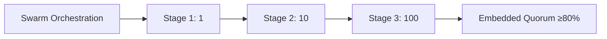

---
hexagon:
  ontos:
    id: 60b39157-76a0-4ca3-ab2c-a4f2aef1fde5
    type: md
    owner: Swarmlord
  chronos:
    status: active
    urgency: 0.5
    decay: 0.5
    created: '2025-11-23T11:07:35.945400Z'
    generation: 51
  topos:
    address: eyes/archive/hfo_gem/gen_27/diagrams/scaling_and_quorum.md
    links: []
  telos:
    viral_factor: 0.0
    meme: scaling_and_quorum.md
---

# Gen27 — Swarm Orchestration Staging

