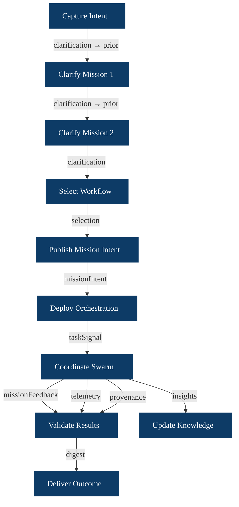
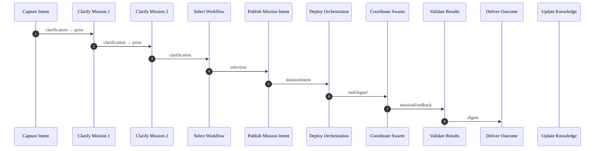
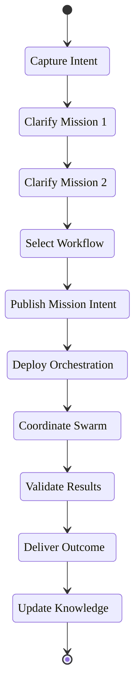
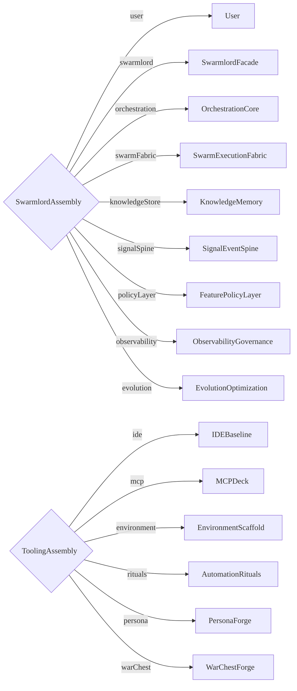
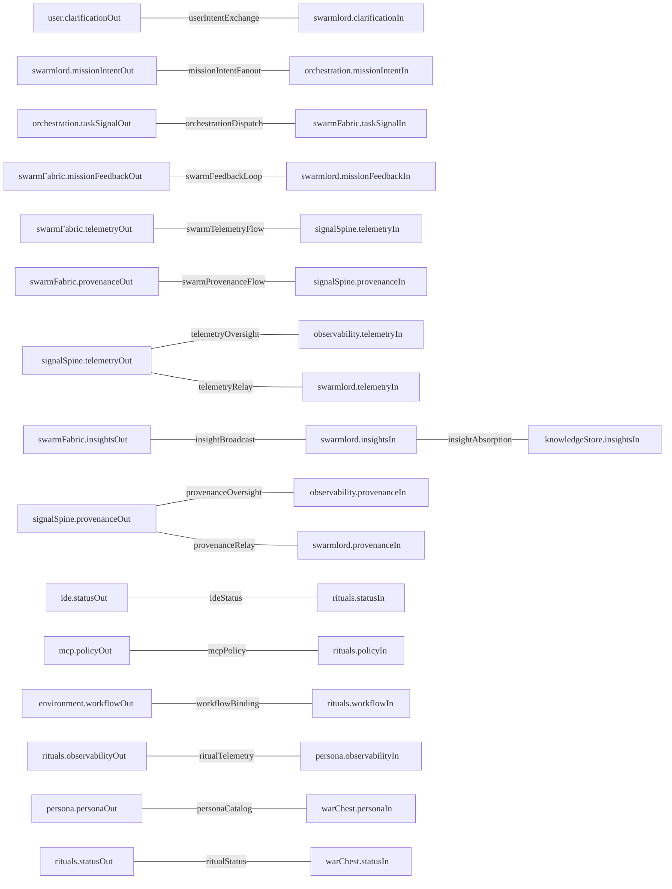
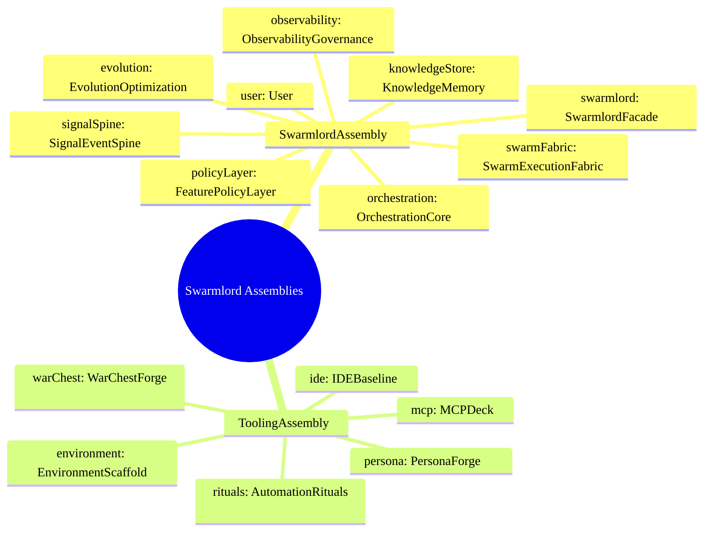
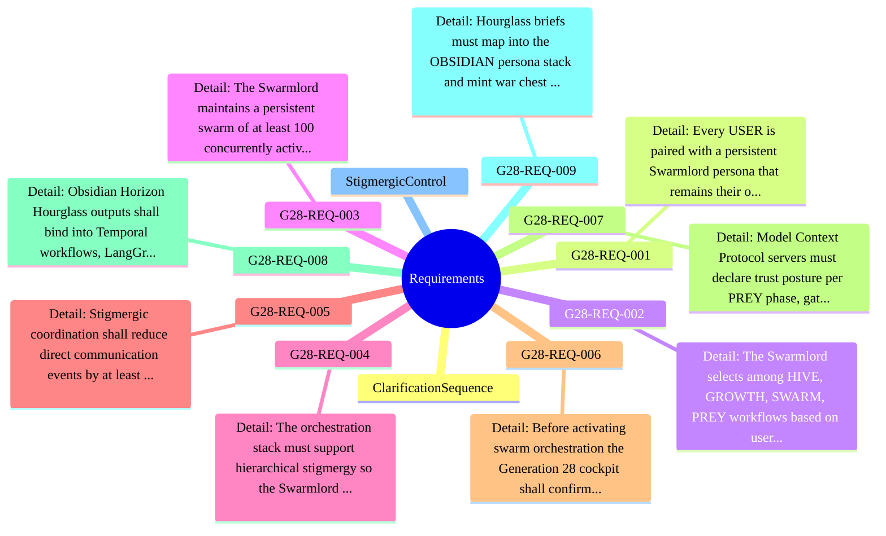
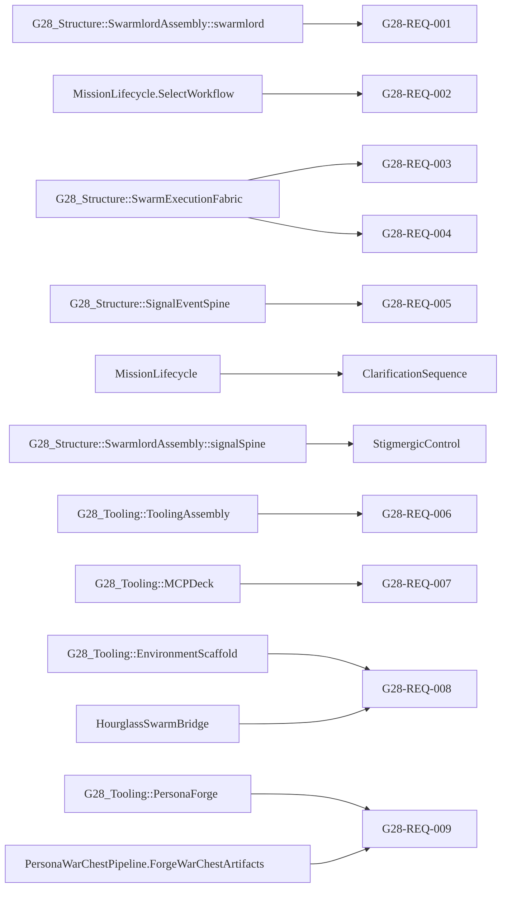

# Hive Fleet Obsidian SSOT – Visualizations

<!-- Generated by export_ssot_diagrams.py -->

## Mission Lifecycle

### Flowchart

### Sequence

### State Progression

## Structural Blocks

### Block Definition Diagram

```mermaid
%%{init: {'themeVariables': {'fontSize': '18px', 'lineHeight': '26px', 'fontFamily': 'Inter, Arial, sans-serif'}}}%%
classDiagram
    class AutomationRituals {
        +smokeIndicator : SmokeTestIndicator
        +hourglassBinding : HourglassIntegrationStatus
    }
    class EnvironmentScaffold {
        +devContainer : DevContainerBlueprint
        +workflowBinding : WorkflowEngineBinding
        +temporal : TemporalNamespace
        +langGraph : LangGraphProfile
        +eventSpine : EventSpineProfile
        +parallelCompute : ParallelComputeProfile
    }
    class EvolutionOptimization {
        +qdSupport : QualityDiversitySupport
    }
    class FeaturePolicyLayer {
        +featureSupport : FeaturePolicySupport
    }
    class IDEBaseline {
        +version : IDEVersionConstraint
        +extensions : ExtensionBaseline
        +runbook : ToolingRunbook
    }
    class KnowledgeMemory {
        +knowledgeSupport : KnowledgeCapability
    }
    class MCPDeck {
        +trustProfile : MCPTrustProfile
    }
    class ObservabilityGovernance {
        +telemetrySupport : TelemetrySupport
        +provenanceSupport : ProvenanceSupport
    }
    class OrchestrationCore {
        +workflowSupport : WorkflowSupportIndicator
    }
    class PersonaForge {
        +catalog : PersonaCatalog
    }
    class SignalEventSpine {
        +deliveryAssurance : DeliveryReliability
        +stigmergyReadback : StigmergyEfficiencyMetric
    }
    class SwarmExecutionFabric {
        +persistentAgentSpan : ConcurrentAgentCapacity
        +hierarchyPattern : HierarchicalScalingPattern
        +stigmergyEfficiency : StigmergyEfficiencyMetric
    }
    class SwarmlordAssembly {
        ...
    }
    class SwarmlordFacade {
        +personaName : PersonaIdentifier
        +persistentMemory : PersistentMemoryFlag
        +agentCapacity : ConcurrentAgentCapacity
    }
    class ToolingAssembly {
        ...
    }
    class User {
        +personaId : PersonaIdentifier
    }
    class WarChestForge {
        +artifacts : WarChestArtifact
        +fundingSignals : FundingTelemetry
    }
    SwarmlordAssembly *-- User : user
    SwarmlordAssembly *-- SwarmlordFacade : swarmlord
    SwarmlordAssembly *-- OrchestrationCore : orchestration
    SwarmlordAssembly *-- SwarmExecutionFabric : swarmFabric
    SwarmlordAssembly *-- KnowledgeMemory : knowledgeStore
    SwarmlordAssembly *-- SignalEventSpine : signalSpine
    SwarmlordAssembly *-- FeaturePolicyLayer : policyLayer
    SwarmlordAssembly *-- ObservabilityGovernance : observability
    SwarmlordAssembly *-- EvolutionOptimization : evolution
    ToolingAssembly *-- IDEBaseline : ide
    ToolingAssembly *-- MCPDeck : mcp
    ToolingAssembly *-- EnvironmentScaffold : environment
    ToolingAssembly *-- AutomationRituals : rituals
    ToolingAssembly *-- PersonaForge : persona
    ToolingAssembly *-- WarChestForge : warChest
```

### Assembly View

### Port Definitions

| Port | Attributes |
| --- | --- |
| ClarificationExchangePort | artifact: ClarificationArtifact |
| KnowledgeInsightPort | insight: KnowledgeInsight |
| MCPPolicyPort | policy: MCPTrustProfile |
| MissionFeedbackPort | feedback: MissionFeedback |
| MissionIntentPort | artifact: MissionIntentArtifact |
| ObservabilityPort | observability: ObservabilityProfile featureFlags: FeatureFlagProfile |
| PersonaOutputPort | personaSet: PersonaCatalog warChest: WarChestArtifact funding: FundingTelemetry |
| ProvenancePort | reference: ProvenanceReference |
| TaskSignalPort | signal: TaskSignal |
| TelemetryPort | record: TelemetryRecord |
| ToolingStatusPort | smokeStatus: SmokeTestIndicator integrationStatus: HourglassIntegrationStatus |
| WorkflowBindingPort | workflow: WorkflowEngineBinding temporalNs: TemporalNamespace langGraphProfile: LangGraphProfile eventSpine: EventSpineProfile parallelCompute: ParallelComputeProfile |

### Part Port Summary

| Part | Ports |
| --- | --- |
| AutomationRituals | statusIn: ToolingStatusPort policyIn: MCPPolicyPort workflowIn: WorkflowBindingPort observabilityOut: ObservabilityPort statusOut: ToolingStatusPort |
| EnvironmentScaffold | workflowOut: WorkflowBindingPort |
| IDEBaseline | statusOut: ToolingStatusPort |
| KnowledgeMemory | insightsIn: KnowledgeInsightPort |
| MCPDeck | policyOut: MCPPolicyPort |
| ObservabilityGovernance | telemetryIn: TelemetryPort provenanceIn: ProvenancePort |
| OrchestrationCore | missionIntentIn: MissionIntentPort taskSignalOut: TaskSignalPort |
| PersonaForge | observabilityIn: ObservabilityPort personaOut: PersonaOutputPort |
| SignalEventSpine | telemetryIn: TelemetryPort telemetryOut: TelemetryPort provenanceIn: ProvenancePort provenanceOut: ProvenancePort |
| SwarmExecutionFabric | taskSignalIn: TaskSignalPort missionFeedbackOut: MissionFeedbackPort telemetryOut: TelemetryPort provenanceOut: ProvenancePort insightsOut: KnowledgeInsightPort |
| SwarmlordFacade | clarificationIn: ClarificationExchangePort missionIntentOut: MissionIntentPort missionFeedbackIn: MissionFeedbackPort telemetryIn: TelemetryPort provenanceIn: ProvenancePort insightsIn: KnowledgeInsightPort |
| User | clarificationOut: ClarificationExchangePort |
| WarChestForge | statusIn: ToolingStatusPort personaIn: PersonaOutputPort warChestOut: PersonaOutputPort |

### Connector View

### Connector Table

| Connector | Source | Target |
| --- | --- | --- |
| userIntentExchange | user.clarificationOut | swarmlord.clarificationIn |
| missionIntentFanout | swarmlord.missionIntentOut | orchestration.missionIntentIn |
| orchestrationDispatch | orchestration.taskSignalOut | swarmFabric.taskSignalIn |
| swarmFeedbackLoop | swarmFabric.missionFeedbackOut | swarmlord.missionFeedbackIn |
| swarmTelemetryFlow | swarmFabric.telemetryOut | signalSpine.telemetryIn |
| telemetryOversight | signalSpine.telemetryOut | observability.telemetryIn |
| swarmProvenanceFlow | swarmFabric.provenanceOut | signalSpine.provenanceIn |
| provenanceOversight | signalSpine.provenanceOut | observability.provenanceIn |
| insightBroadcast | swarmFabric.insightsOut | swarmlord.insightsIn |
| insightAbsorption | swarmlord.insightsIn | knowledgeStore.insightsIn |
| telemetryRelay | signalSpine.telemetryOut | swarmlord.telemetryIn |
| provenanceRelay | signalSpine.provenanceOut | swarmlord.provenanceIn |
| ideStatus | ide.statusOut | rituals.statusIn |
| mcpPolicy | mcp.policyOut | rituals.policyIn |
| workflowBinding | environment.workflowOut | rituals.workflowIn |
| ritualTelemetry | rituals.observabilityOut | persona.observabilityIn |
| personaCatalog | persona.personaOut | warChest.personaIn |
| ritualStatus | rituals.statusOut | warChest.statusIn |

### Structural Mindmap

### Attribute Summary

| Part | Attributes |
| --- | --- |
| AutomationRituals | smokeIndicator: SmokeTestIndicator hourglassBinding: HourglassIntegrationStatus |
| EnvironmentScaffold | devContainer: DevContainerBlueprint workflowBinding: WorkflowEngineBinding temporal: TemporalNamespace langGraph: LangGraphProfile eventSpine: EventSpineProfile parallelCompute: ParallelComputeProfile |
| EvolutionOptimization | qdSupport: QualityDiversitySupport |
| FeaturePolicyLayer | featureSupport: FeaturePolicySupport |
| IDEBaseline | version: IDEVersionConstraint extensions: ExtensionBaseline runbook: ToolingRunbook |
| KnowledgeMemory | knowledgeSupport: KnowledgeCapability |
| MCPDeck | trustProfile: MCPTrustProfile |
| ObservabilityGovernance | telemetrySupport: TelemetrySupport provenanceSupport: ProvenanceSupport |
| OrchestrationCore | workflowSupport: WorkflowSupportIndicator |
| PersonaForge | catalog: PersonaCatalog |
| SignalEventSpine | deliveryAssurance: DeliveryReliability stigmergyReadback: StigmergyEfficiencyMetric |
| SwarmExecutionFabric | persistentAgentSpan: ConcurrentAgentCapacity hierarchyPattern: HierarchicalScalingPattern stigmergyEfficiency: StigmergyEfficiencyMetric |
| SwarmlordAssembly | — |
| SwarmlordFacade | personaName: PersonaIdentifier persistentMemory: PersistentMemoryFlag agentCapacity: ConcurrentAgentCapacity |
| ToolingAssembly | — |
| User | personaId: PersonaIdentifier |
| WarChestForge | artifacts: WarChestArtifact fundingSignals: FundingTelemetry |

## Requirements

### Table

| Name | ID | Text |
| --- | --- | --- |
| ClarificationSequence | — | — |
| G28_REQ_001_PersistentSwarmlord | G28-REQ-001 | Every USER is paired with a persistent Swarmlord persona that remains their only interface. The Swarmlord must coordinate up to 100 concurrent agents and deliver quorum-backed outcomes. |
| G28_REQ_002_HiveWorkflows | G28-REQ-002 | The Swarmlord selects among HIVE, GROWTH, SWARM, PREY workflows based on user intent while keeping the user insulated from internal complexity. |
| G28_REQ_003_PersistentSwarm | G28-REQ-003 | The Swarmlord maintains a persistent swarm of at least 100 concurrently active agents that can cycle through workflows without teardown between missions. |
| G28_REQ_004_HierarchicalScaling | G28-REQ-004 | The orchestration stack must support hierarchical stigmergy so the Swarmlord can fan out mission intent across subordinate clusters, enabling 10^6+ agents without direct control calls. |
| G28_REQ_005_StigmergyEfficiency | G28-REQ-005 | Stigmergic coordination shall reduce direct communication events by at least an order of magnitude compared to one-to-one agent polling, with results aggregated via a shared blackboard interface. |
| G28_REQ_006_ToolingBaseline | G28-REQ-006 | Before activating swarm orchestration the Generation 28 cockpit shall confirm a VS Code ≥1.105 stack with Copilot agent mode, Continue hybrid agents, and an auditable mcp.json trust profile via a repeatable smoke test (scripts/dev/check_tooling.sh). |
| G28_REQ_007_MCPTrustGuardrails | G28-REQ-007 | Model Context Protocol servers must declare trust posture per PREY phase, gating high-impact tools and logging approvals so swarm automation stays bounded. |
| G28_REQ_008_HourglassWorkflowBridge | G28-REQ-008 | Obsidian Horizon Hourglass outputs shall bind into Temporal workflows, LangGraph agent graphs, NATS JetStream subjects, Ray task pools, and Postgres/pgvector storage with OpenTelemetry and OpenFeature instrumentation. |
| G28_REQ_009_PersonaWarChest | G28-REQ-009 | Hourglass briefs must map into the OBSIDIAN persona stack and mint war chest artifacts with funding telemetry for mission reinvestment. |
| StigmergicControl | — | — |

### Relationship Graph

```mermaid
%%{init: {'themeVariables': {'fontSize': '18px', 'lineHeight': '26px', 'fontFamily': 'Inter, Arial, sans-serif'}}}%%
graph TD
    Root[Requirements]
    Req_ClarificationSequence["ClarificationSequence"]
    Root --> Req_ClarificationSequence
    Req_G28_REQ_001_PersistentSwarmlord["G28-REQ-001\nEvery USER is paired with a persistent Swarmlord persona ..."]
    Root --> Req_G28_REQ_001_PersistentSwarmlord
    Req_G28_REQ_002_HiveWorkflows["G28-REQ-002\nThe Swarmlord selects among HIVE, GROWTH, SWARM, PREY wor..."]
    Root --> Req_G28_REQ_002_HiveWorkflows
    Req_G28_REQ_003_PersistentSwarm["G28-REQ-003\nThe Swarmlord maintains a persistent swarm of at least 10..."]
    Root --> Req_G28_REQ_003_PersistentSwarm
    Req_G28_REQ_004_HierarchicalScaling["G28-REQ-004\nThe orchestration stack must support hierarchical stigmer..."]
    Root --> Req_G28_REQ_004_HierarchicalScaling
    Req_G28_REQ_005_StigmergyEfficiency["G28-REQ-005\nStigmergic coordination shall reduce direct communication..."]
    Root --> Req_G28_REQ_005_StigmergyEfficiency
    Req_G28_REQ_006_ToolingBaseline["G28-REQ-006\nBefore activating swarm orchestration the Generation 28 c..."]
    Root --> Req_G28_REQ_006_ToolingBaseline
    Req_G28_REQ_007_MCPTrustGuardrails["G28-REQ-007\nModel Context Protocol servers must declare trust posture..."]
    Root --> Req_G28_REQ_007_MCPTrustGuardrails
    Req_G28_REQ_008_HourglassWorkflowBridge["G28-REQ-008\nObsidian Horizon Hourglass outputs shall bind into Tempor..."]
    Root --> Req_G28_REQ_008_HourglassWorkflowBridge
    Req_G28_REQ_009_PersonaWarChest["G28-REQ-009\nHourglass briefs must map into the OBSIDIAN persona stack..."]
    Root --> Req_G28_REQ_009_PersonaWarChest
    Req_StigmergicControl["StigmergicControl"]
    Root --> Req_StigmergicControl
```

### Requirement Mindmap

### Satisfaction Table

| Requirement | Satisfied By |
| --- | --- |
| G28_REQ_001_PersistentSwarmlord | G28_Structure::SwarmlordAssembly::swarmlord |
| G28_REQ_002_HiveWorkflows | MissionLifecycle.SelectWorkflow |
| G28_REQ_003_PersistentSwarm | G28_Structure::SwarmExecutionFabric |
| G28_REQ_004_HierarchicalScaling | G28_Structure::SwarmExecutionFabric |
| G28_REQ_005_StigmergyEfficiency | G28_Structure::SignalEventSpine |
| ClarificationSequence | MissionLifecycle |
| StigmergicControl | G28_Structure::SwarmlordAssembly::signalSpine |
| G28_REQ_006_ToolingBaseline | G28_Tooling::ToolingAssembly |
| G28_REQ_007_MCPTrustGuardrails | G28_Tooling::MCPDeck |
| G28_REQ_008_HourglassWorkflowBridge | G28_Tooling::EnvironmentScaffold |
| G28_REQ_009_PersonaWarChest | G28_Tooling::PersonaForge |
| G28_REQ_008_HourglassWorkflowBridge | HourglassSwarmBridge |
| G28_REQ_009_PersonaWarChest | PersonaWarChestPipeline.ForgeWarChestArtifacts |

### Satisfaction Graph

