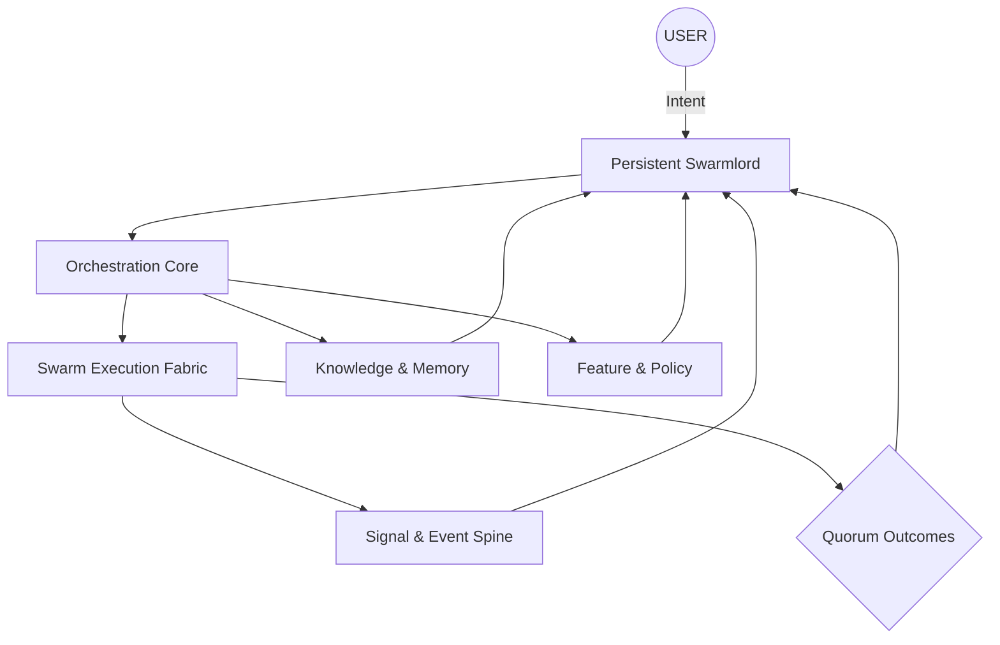
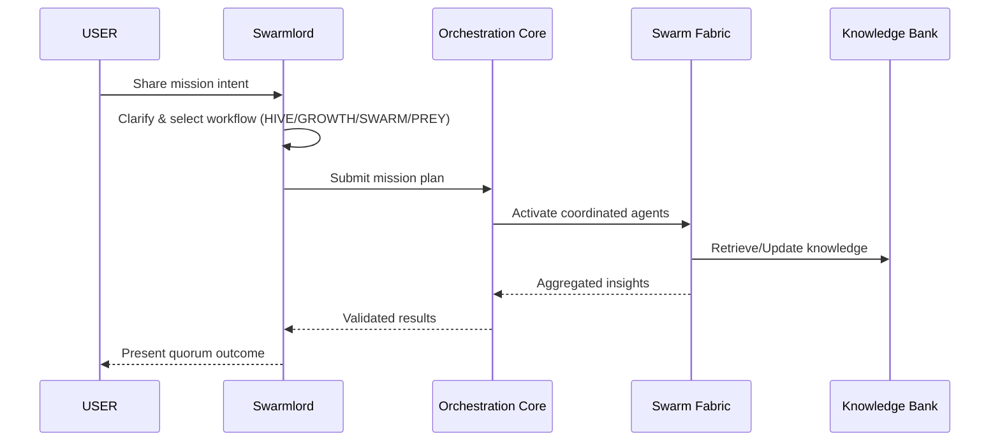
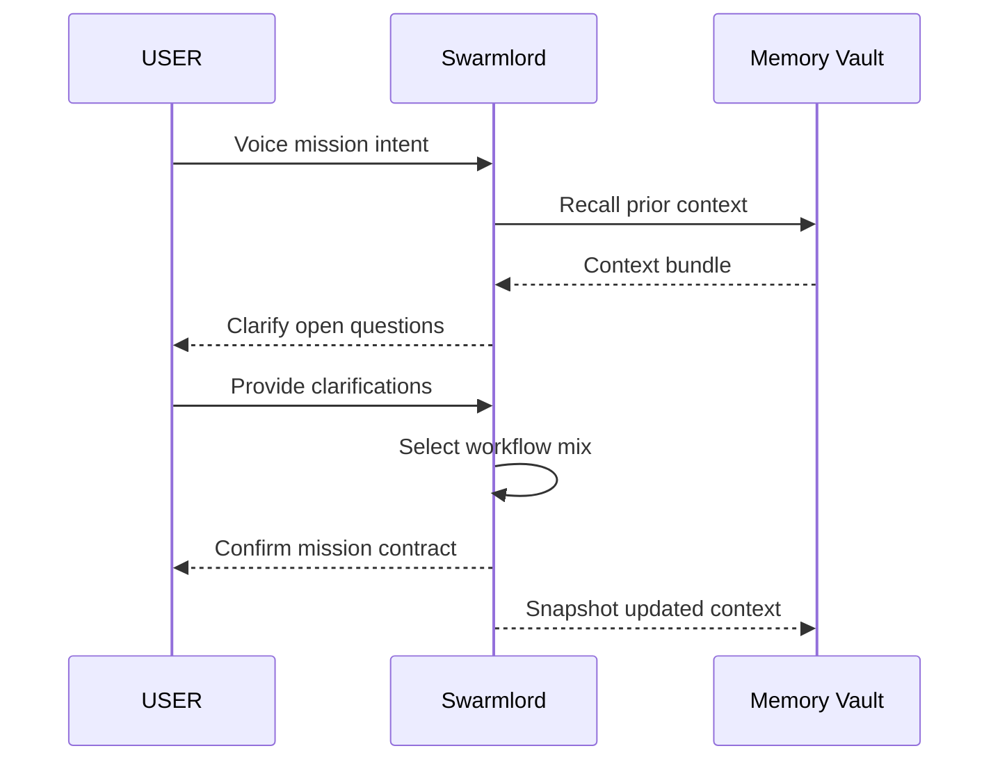
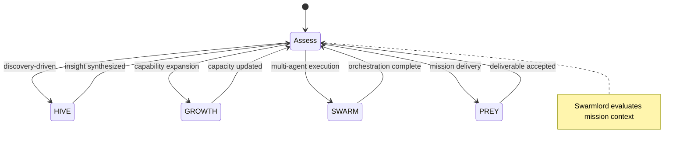
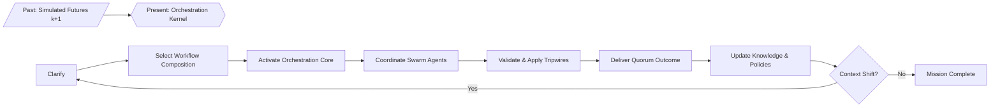
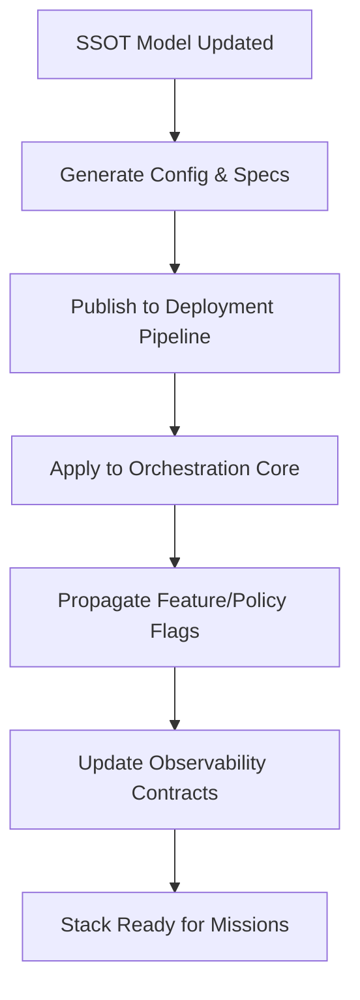
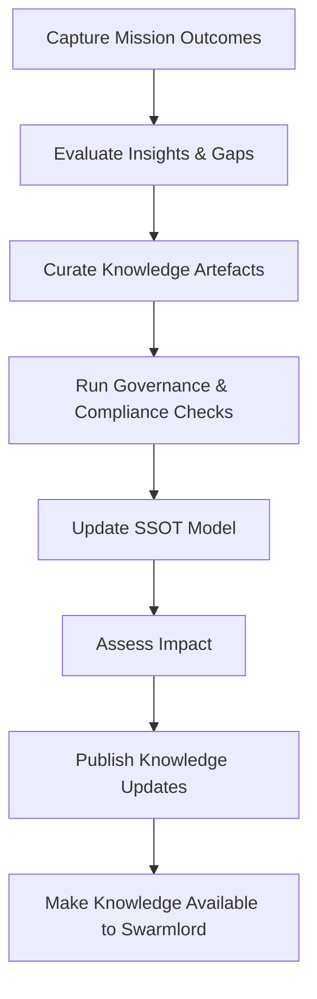
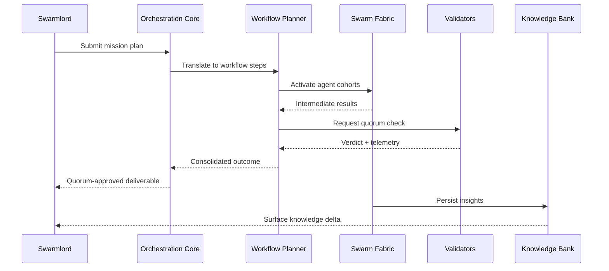
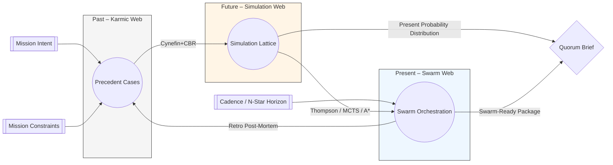
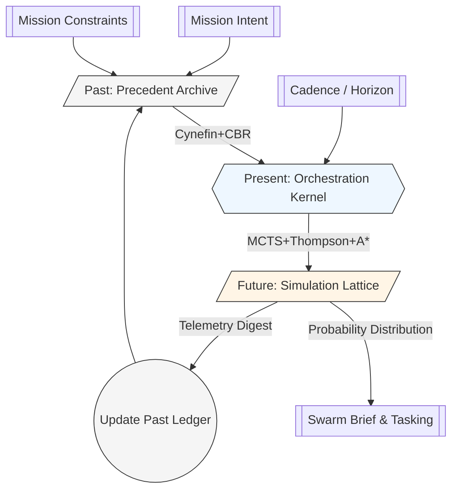

---
hexagon:
  ontos:
    id: 1645364a-b4f0-4618-8470-56ea4649c460
    type: md
    owner: Swarmlord
  chronos:
    status: active
    urgency: 0.5
    decay: 0.5
    created: '2025-11-23T11:07:35.968832Z'
    generation: 51
  topos:
    address: eyes/archive/hfo_gem/gen_28/vision_level_diagrams.md
    links: []
  telos:
    viral_factor: 0.0
    meme: vision_level_diagrams.md
---

### Generation 28 Vision Workspace

This file is the handwritten staging area for Generation 28 vision material. Treat it like a notebook: append new dictations, do not overwrite prior intent, and feel free to leave rough notes that we can polish later.

#### Guard Rails
- Scope stays at the vision tier (mission intent, top-level capabilities, stakeholder promises).
- Append-only ethos; if a revision is needed, create a new subsection rather than deleting older dictation.
- Keep Ids human-readable: `G28-<TYPE>-<NNN>` (e.g., `G28-UC-001`). Types stay the familiar `REQ`, `UC`, `BDD`, `IBD`, `ACT`, `SEQ`, `STM`.

#### Execution Ladder (Vision → Swarm)

- "First we get the IDE and tooling breathing—once the smoke test is green we let the hourglass spin; then we layer the Swarmlord persona and, finally, unleash the swarm." – TTao
- "I want to live in vision and strategy; the AI assistants should pair with me for the tactical and execution levels." – TTao
- Stage 0 – **Tooling & IDE Baseline**: Configure extensions, MCP trust, and verification scripts so downstream automation has a reliable cockpit; document the stack in the SSOT once stabilized.
- Stage 1 – **Documentation Spine**: Translate verbal vision into structured docs (this file + supporting notes) that specify actors, intents, artifacts, and guardrails clearly enough for automated SysML authoring.
- Stage 2 – **SSOT Modeling (SysML v2)**: Encode the documented intent inside `HFO_SSOT.sysml`, extending ports/connectors and ensuring the exporter produces canonical diagrams/tables.
- Stage 3 – **Obsidian Horizon Hourglass**: Implement the flipping algorithms atop the SSOT, beginning with single-agent sequential runs before scaling to swarm-parallel traversals.
- Stage 4 – **Swarmlord Persona Runtime**: Bind the hourglass outputs into the persistent Swarmlord memory/orchestration loop so intent intake and probability briefs remain aligned.
- Stage 5 – **HFO Swarm Orchestration**: Orchestrate multi-agent execution, connecting tooling back to monetization experiments (hypercasual forge, tool virtualization) while maintaining quorum-backed deliverables.
- Monetization runway: keep revenue strategies modular—war-chest hypercasuals, tool virtualization licensing, or bespoke swarm services—so cash flow can accelerate without constraining doctrine.

#### Vision Narrative (dictate below)
> Generation 28 anchors on a single persistent memory agent—the Swarmlord—assigned per user (TTao ↔ Swarmlord of Webs) to tame swarm complexity. The user speaks only with their Swarmlord; the Swarmlord remembers, interprets, and orchestrates 10–100+ concurrent AI agents running workflows, validations, stigmergy, quorum checks, and knowledge updates. Success means the user receives a quorum-backed deliverable from the Swarmlord with zero direct exposure to the underlying agents.

#### Diagram Queue
Use this table to log what we still need to render. Update status instead of erasing rows.

| Id | Title | Type | Status | Notes |
| --- | --- | --- | --- | --- |
| G28-REQ-001 | Persistent Swarmlord Promise | Requirements | needs SysML capture | encode the per-user Swarmlord commitment and quorum-backed delivery |
| G28-UC-001 | User ↔ Swarmlord Conversation | UseCase | outline ready | detail user intent intake and result delivery with no swarm exposure |
| G28-BDD-001 | Swarmlord Orchestration Stack | BDD | needs block draft | model Swarmlord, orchestration brain, swarm backend, validation lattice |
| G28-ACT-001 | Mission Orchestration Flow | Activity | outline pending | capture user's intent path through Swarmlord and into swarm execution |
| G28-ACT-002 | Tool Chain Activation Flow | Activity | outline pending | map how the stack spins up from SSOT definitions to running services |
| G28-ACT-003 | Knowledge Stewardship Loop | Activity | outline pending | describe how knowledge updates cycle between missions |
| G28-STM-001 | Workflow Selection States | State | outline pending | show how Swarmlord switches between HIVE/GROWTH/SWARM/PREY |
| G28-SEQ-001 | User ↔ Swarmlord Handshake | Sequence | draft below | focus on single interface experience |
| G28-SEQ-002 | Swarmlord ↔ Swarm Orchestration | Sequence | draft below | show how orchestration core mediates the swarm |
| G28-IBD-001 | Obsidian Horizon Hourglass Graph | IBD | needs concept draft | map past/present/future hubs, flip edges, and artifact outputs |

#### Capability Slots (Vendor-Agnostic Draft)
- Orchestration Core: Durable workflow backbone capable of long-running missions, state recovery, and conditional routing.
- Swarm Execution Fabric: Concurrency engine that can coordinate 10–100+ specialist agents with stigmergic signaling.
- Knowledge & Memory: Persistent memory bank supporting semantic retrieval and provenance tracking.
- Signal & Event Spine: Publish/subscribe channel for stigmergy, telemetry, and tripwire signals.
- Feature Gating & Policy: Runtime controls for toggles, safety envelopes, cost guardrails, and compliance.
- Observability & Governance: Spans, metrics, and audit evidence feeding evolved guardrails.
- Evolution & Optimization: Hooks for quality-diversity exploration (future SOTA like OpenEvolve).
- Generation expectation: the SysML SSOT describes these capabilities; implementation choices can swap without breaking the model.

#### Flow Captures To Detail
- Stack instantiation from SSOT model → GitOps → orchestration deployment → feature flag propagation.
- Swarmlord mission intake → orchestration engine → swarm coordination → validation and tripwire responses.
- Knowledge feedback loop: orchestration → memory store → governance checks → SSOT updates.
- Workflow selection: Swarmlord evaluates mission context → composes HIVE/GROWTH/SWARM/PREY loops.

#### Diagram Drafts
Grounding sketches that reflect the current understanding of your vision.

##### G28-BDD-001 – Swarmlord Orchestration Stack (Flowchart)


##### G28-UC-001 – User ↔ Swarmlord Conversation (Sequence)


##### G28-SEQ-001 – User ↔ Swarmlord Handshake (Sequence)


##### G28-STM-001 – Workflow Selection States (State Diagram)


##### G28-ACT-001 – Mission Orchestration Flow (Flowchart)


##### G28-ACT-002 – Tool Chain Activation Flow (Flowchart)


##### G28-ACT-003 – Knowledge Stewardship Loop (Flowchart)


##### G28-SEQ-002 – Swarmlord ↔ Swarm Orchestration (Sequence)


#### Doctrine Alignment – Sense, Make Sense, Act, Knowledge

- PREY loop alignment: Perceive ↔ Sense, React ↔ Make Sense, Execute ↔ Act, Yield ↔ Knowledge capture; the Swarmlord keeps these cycles persistent across missions.
- Cognitive exoskeleton thesis: Hive Fleet Obsidian behaves like a fleet-rated vessel sailing the omnipresent state-action sea, giving each user a command-ready hull (their Swarmlord) to navigate possibilities.
- Human uplift hypothesis: expanding the ability to sense, interpret, act, and accumulate knowledge for every participant is the direct path to leveling humanity's agency.
- Operational doctrine guardrail: JADC2-style mosaic warfare tiles map to modular swarm cohorts; tiles plug into the PREY cadence so sense-making and action remain composable under pressure.
- Vision intent: every subsystem we capture in SysML Gen 28 must reference which PREY phase it amplifies and how it reinforces the Swarmlord's cognitive exoskeleton role.

#### Swarmlord of Webs Persona Notes

- Identity: Swarmlord of Webs is TTao's alter ego and flagship persona—the living interface between the human commander and the computational fleets.
- Lowest-level execution: interfaces with orchestration core, swarms, and stigmergic channels, yet vision stretches beyond runtime control loops.
- Three-horizon charter (Obsidian Horizon Hourglass):
    - Past ↔ Karmic Web: total precedent space spanning genetics, lineage, knowledge graphs—formalized through Cynefin+, case-based reasoning, and deep retrieval to surface karma-like consequences.
    - Present ↔ Swarm Web: active coordination of embodied and digital agents; exercises human-scale intent through multiplexed swarm execution.
    - Future ↔ Simulation Web: forecast lattice powered by Monte Carlo tree search, A*, Thompson sampling, and anytime algorithms yielding probabilistic mission pathways.
- Hourglass ritual: flip at will to shuttle lessons between horizons—replaying futures into the past archive and promoting precedents into forward simulations.
- Operational expectation: at any pause the hourglass returns a probability distribution over best-next actions toward the declared mission intent.

#### Obsidian Horizon Hourglass – State-Action Graph Vision

- "It should look almost like an hourglass—past on top, present in the neck, future at the base—so I can keep flipping it and let each pass feed the next." – TTao
- "At any time I want to stop and get a probability distribution: best path, why it wins, tail risk, leverage, and the swarm-ready brief." – TTao
- "Two things I have to supply every time: mission intent and mission constraints—plus the cadence so the hourglass doesn’t hand me a five-year plan when I need a five-minute rescue." – TTao
- **Graph topology**: Three primary hub nodes—`Past_KarmicWeb`, `Present_SwarmWeb`, `Future_SimulationWeb`—form a directed triad with bidirectional flip edges (`FlipForward`, `FlipRetro`). Sequential runs traverse `Past → Future → Present` once; swarm-parallel modes spawn concurrent traversals annotated with cohort ids and algorithm tags.
- **Required inputs**: `MissionIntent`, `MissionConstraints`, and `CadenceEnvelope` (time horizon + N-star targets) are captured before entry and stored as annotations on every edge so downstream tooling can audit context drift.
- **Flip algorithms**: Each edge stores the executor (e.g., Cynefin+CBR, Monte Carlo tree search, Thompson sampling, A*/UCB variants). Flips may run sequentially for single-agent passes, then fan out into 10+ concurrent flips once swarm capacity is available; concurrency policies live on the `Present` node.
- **Artifact yield**: Every traversal produces a `PresentProbabilityDistribution` package containing best-path ranks, tail-risk notes, simulation counts, and swarm-ready briefs. Retro flips promote future telemetry into the Past archive, minting `PostMortemDigest` artifacts.
- **Anytime property**: The graph supports interruption at any node; partial traversals must still emit the latest distribution + confidence scores so the Swarmlord can brief or re-task swarms mid-run.
- **Traceability hooks**: Nodes and edges carry PREY-phase cardinality (`Perceive`, `MakeSense`, `Act`, `Yield`) to guarantee the hourglass remains aligned with the broader doctrine and can feed the SSOT for auto-generated views.
- **Flip cadence**: Each completed pass stores its algorithm tag (`Cynefin+CBR`, `MCTS`, `Thompson`, `MAP-Elites`, etc.), and the resulting simulated futures become the next pass's "precedent" payload, letting the hourglass iterate indefinitely until compute or mission cadence halts the loop.

#### Evolutionary Compass – Hyper-Heuristic Metaevolution

- Vessel framing: Hive Fleet Obsidian behaves as a ship-class vehicle navigating state-action space; coding is one mission, but doctrine targets universal exploration and exploitation across contexts.
- Evolution core: leverage MAP-Elites, QD optimization, and hyper-heuristic mutation to cultivate a portfolio of elite performers rather than a singular “best” solution.
- Benchmark ritual: each mission/benchmark run feeds back telemetry so the next attempt mutates roles, tool choices, and workflows—continuous learning loop, not linear progression.
- Moment-to-moment adaptation: swarm agents adjust heuristics in real time based on feedback, while the Swarmlord curates the champion set and protects diversity.
- Quality–diversity promise: precedent knowledge + SOTA techniques + evolutionary search produce elite champions with coverage across the mission landscape.
- Implementation note: current stack still tooling up for live MAP-Elites loops; document interim heuristics and testbeds so we can swap in full QD engines when ready.

#### Gaia Resonance – Evolution as Love Language

- Philosophy: evolution is Gaia's love language—simultaneously brutal and nurturing; every human emotion arises from evolutionary pressure.
- Duty: Hive Fleet Obsidian should amplify evolution's compassionate side by steering feedback loops toward uplift rather than extraction.
- Karma mandate: harness evolutionary computation to intentionally rewrite human karma, not merely inherit it.

#### Karma Shift Program – Goal 1: Total Tool Virtualization

- Vision: virtualize every physical tool through compute—gesture recognition, VR/AR, tangible user interfaces, projection, haptics—to achieve one-to-one or better skill transfer.
- Access: prioritize open or near-open baselines so users own and edit their toolchains; agency remains with the individual.
- Contexts served: eliminate resource scarcity for marginalized users (poverty, incarceration, space travel, constrained environments) via digital surrogates that feel real.
- Product expectation: Hive Fleet Obsidian delivers standardized yet modifiable tool stacks, turning tactile skills (e.g., piano, lab work) into portable, evolvable interfaces.
- Mission tie-in: Swarmlord orchestrates the PREY loop to surface and adapt these virtual tools in situ, reinforcing the cognitive exoskeleton promise.
- Hypercasual forge: launch with a "one-button" gesture arcade—index-to-thumb collisions tracked via Human by Vlad pipelines, FSM-tuned tap/drag semantics, and lookahead physics that drive both virtual games and physical actuator mappings.
- Evolution loop: pipe AI-generated art, QD-optimized gameplay variants, and swarm-led user testing into the hourglass flips so each release learns from simulated futures and real feedback simultaneously.
- Controller bridge: treat touchscreen gestures as the canonical input, then map to broader tool families (VR grips, MIDI pads, lab instrumentation) via SSOT-defined adapters to progress toward total tool virtualization.

#### Karma Shift Program – Goal 2: Inorganic Sustenance Pathways

- Hypothesis: humanity transcends extractive karma once baseline nourishment derives from inorganic energy gradients rather than consuming living cells.
- Inspiration: engineered photosynthesis, bioelectrical uptake, or novel energy metabolisms that allow humans to “generate” instead of “consume.”
- Impact: decouples survival from the traditional food web, transforming ecological relationships and reducing scarcity-driven conflict.
- HFO role: explore computational design spaces, simulate feasibility, and choreograph interdisciplinary swarms (bio, materials, energy) to prototype pathways.
- Moral anchor: shifts apex-predator karma toward stewardship by eliminating the need to harvest other life to live.

#### Karma Shift Program – Goal 3: Solar Exodus Safeguard

- Time horizon: ~1–5 billion years before the Sun evolves into a white dwarf; Earth-bound life faces extinction absent intervention.
- Necessity: design pathways for consciousness (human or successor species) to survive solar metamorphosis—relocation, shielding, stellar engineering, or distributed diaspora.
- HFO mandate: bake long-horizon survivability into mission planning, using the Swarmlord to convene swarms that model cosmic-scale interventions and incremental buildup.
- Unknowns accepted: exact mechanism undetermined; document scenarios (planetary migration, Dyson-class artifacts, exodus infrastructures) as living research agendas.
- Ethical compass: evolution toward cosmic stewardship, ensuring Gaia’s lineage persists beyond the Sun’s terminal phase.

#### Hypercasual Game Forge – Launch Capsule

- "I want to start with the best one-button in the world—index-to-thumb collisions, lookahead physics, tactical feel—and let that gesture drive both virtual games and physical controllers." – TTao
- "Human by Vlad is my media pipeline wrapper; I can capture motion, texture, and sound, then feed it through AI art so I keep authorial control while shipping fast." – TTao
- "Every flip of the hourglass should evolve the game: Thompson sampling, MAP-Elites, whatever it takes to return a portfolio of champions, not a single lock-in." – TTao
- "Lock the palm orientation so the system knows when a control should stay put, then let knuckle spans carve the z-stacks—we can feed quaternions straight into dynamic key maps." – TTao
- "Quantize the gestures like music: taps, drags, and flicks snap to timing grids so the swarm can remix them into arcade modes or tool macros." – TTao
- Seed product: build a swarm-authored hypercasual arcade that spotlights a single "perfect" button—gesture-detected taps, presses, drags, and flicks orchestrated by a finite-state machine with lookahead physics and haptic/tactical feedback cues.
- Media pipeline: leverage the Human by Vlad stack for rapid capture of motion, voice, and texture references; feed outputs through AI generative art passes to keep production nimble while retaining authorial control.
- Evolutionary tuning: run MAP-Elites and Thompson sampling across mechanics, difficulty curves, and haptic responses; simulated futures (hourglass flips) prune weak variants before players ever touch them.
- Controller virtualization: map the canonical gesture into a library of adapters (touchscreen, MIDI, VR controllers, lab gear), proving that one digital control surface can pilot disparate physical tools—a wedge toward full tool virtualization.
- Economic flywheel: package the arcade as a "war chest" forge—revenues and telemetry reinvest in liberation tooling, echoing the Gen_1 war chest factory pattern.
- Orientation intelligence: use palm-normal quaternions and knuckle-span measurements to snap gestures into 3D strata, driving rotary knobs, sliders, and chorded key maps that adapt per hand pose.
- Musical timing lattice: apply beat-aligned quantization so gesture sequences can score adaptive audio, gate combo systems, or trigger precise actuation windows across virtual and physical instruments.

#### Tectangle Piano Genie Control Stack

- "Constrain the hand with palm orientation and finger flex thresholds, simulate the pinch with IK and FABRIK, and let predictive latency make it the best button in the world." – TTao
- "Use music quantization with Tone.js so a single pinch can look ahead, feel tactical, and land exactly on-beat." – TTao
- "Let the system learn my bone ratios and gesture hysteresis so every flip evolves with me." – TTao
- Predictive gesture kernel: fuse palm-normal locks, finger joint hysteresis, and quaternion orientation to forecast pinch trajectories; feed inverse kinematics (FABRIK, bone-chain solvers) so the virtual button mirrors contact physics in real time.
- Physics-aware lookahead: run low-latency simulations that anticipate index↔thumb collisions, exposing tunable prediction windows that users can dial for feel while keeping tactile confirmation from actual finger contact.
- Musical quantization layer: route gesture events through Tone.js (or similar) so taps, drags, flicks, and holds snap to rhythmic grids; quantized outputs can drive audio, haptics, or gameplay without drift.
- Adaptive personalization: store hand geometry (knuckle spans, bone ratios) and gesture change rates so hourglass flips and evolutionary algorithms continuously customize sensitivity, thresholds, and macro bindings.
- Fiducial sketching: support hand-drawn symbols and contour-tracked markers captured on-camera; each marker instantiates a finite state machine branch (occlusion depth, coverage, MPE mappings) enabling on-the-fly control surface creation.
- Multimodal sensing roadmap: augment RGB depth with thermal, projector feedback, and optional IoT hooks to maintain accuracy across lighting conditions and extend gestures into physical actuators.
- Output integrations: map the perfected one-button into AI-generated hypercasual games, emulators, local co-op experiences, and external APIs so the control stack powers both monetization experiments and real-world tool virtualization.

#### Mosaic Role Stack – OBSIDIAN Personas

| Letter | Role | Doctrine Anchor | Mission Voice |
| --- | --- | --- | --- |
| **O** | Observer | JADC2 ISR / sensing tiles | Perception persona capturing signals, telemetry, and situational cues that prime the PREY “Perceive” phase. |
| **B** | Bridger | C2 connective tissue | Intent translators ensuring command authority, constraints, and missions move cleanly across tiles and humans ↔ swarm interfaces. |
| **S** | Shaper | Effects / execution cells | Operators who sculpt the battlespace, deploying workflows and interventions that change state in line with mission orders. |
| **I₁** | Injector | Sustainment / FINOPS | Lifecycle steward that spawns, allocates, and retires swarm capacity with embedded cost, energy, and replenishment policies. |
| **D** | Disruptor | Red-team / OPFOR | Adversarial swarm applying continuous pressure to expose gaps; defines the evolving threat genome. |
| **I₂** | Immunizer | Blue-team / defense-in-depth | Guardians who absorb disruptor insight, hardening entire attack vectors and codifying new antibodies across the stack. |
| **A** | Assimilator | Knowledge, intel fusion | Custodian converting yields, exemplars, biomimetic patterns, and SOTA deltas into the SSOT and doctrinal playbooks. |
| **N** | Navigator | Strategic C2 / campaign design | Long-horizon strategist (seat of the Swarmlord of Webs) charting missions, doctrine evolution, and Obsidian hourglass rituals. |

- Persona expectation: each OBSIDIAN letter anchors one or more alter egos; together they span the JADC2 mosaic mission threads without leaving coverage gaps.
- Co-evolution guardrail: Immunizers vs. Disruptors duel continuously; goal is to retire entire attack vectors, not guarantee invulnerability.
- Orchestration note: Navigators steer campaigns, Bridgers keep synchronization, Observers feed sensing, Shapers and Injectors execute, Assimilators close the knowledge loop.

#### Mermaid Scratchpad
Reserve this block for quick sketches that need refinement before promotion.



Flip sketches for the hourglass cadence:



```mermaid
flowchart TD
    SimulatedPrecedent[/Past: Simulated Futures (k+1)/] --> PresentNeck{{Present: Orchestration Kernel}}
    PresentNeck -->|MAP-Elites_QD| FutureBase[/Future: Exploration Sweep/]
    FutureBase -->|Diverse Champions| PresentBrief[[Swarm Brief & Tasking]]
    FutureBase -->|Meta-Learning Signals| PastDelta((Telemetry Ledger))
    PastDelta --> SimulatedPrecedent
    classDef past fill:#f5f5f5,stroke:#333;
    classDef present fill:#eef7ff,stroke:#333;
    classDef future fill:#fff5e6,stroke:#333;
    class SimulatedPrecedent,PastDelta past;
    class PresentNeck present;
    class FutureBase future;
```

#### SysML Snippets
Embed focused SysML v2 fragments. Each block should carry its Id comment so scripts can keep track without rewriting text.

```sysml
// Example placeholder – replace with live dictation when ready.
package G28_Requirements {}
```

#### Traceback & References
- `ssot/HFO_SSOT.sysml` remains the structured source; use `ssot/export_ssot_diagrams.py` to regenerate visuals when the model updates.
- Any generated outputs should live under `ssot/` (keep this file human-first).

#### Working Agreements
- `hfo_gem/gen_28/` is the only writable generation.
- Never delete manual dictations; mark superseded content as such and continue below it.
- Note significant changes in `gen_28_todo.md` (see new file) so future sessions know what questions remain.
