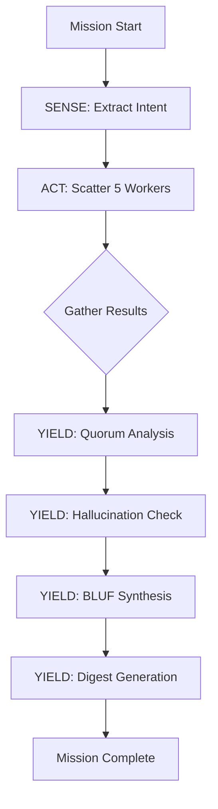

---
hexagon:
  ontos:
    id: de255601-59e9-4cb4-a798-df315b6bc864
    type: md
    owner: Swarmlord
  chronos:
    status: active
    urgency: 0.5
    decay: 0.5
    created: '2025-11-23T11:07:36.001269Z'
    generation: 51
  topos:
    address: eyes/archive/hfo_gem/gen_29/deep_dive.md
    links: []
  telos:
    viral_factor: 0.0
    meme: deep_dive.md
---

# Generation 29: Deep Dive - PREY Loop Architecture & Specialized Agents

**Focus**: Production implementation of nested PREY loops with Single Responsibility Principle enforcement

---

## 📋 Table of Contents

1. [Architecture Philosophy](#architecture-philosophy)
2. [PREY Loop Deep Dive](#prey-loop-deep-dive)
3. [Specialized Agent Design](#specialized-agent-design)
4. [LangGraph Integration](#langgraph-integration)
5. [Quorum & Hallucination Analysis](#quorum--hallucination-analysis)
6. [Swarmlord Digest Format](#swarmlord-digest-format)
7. [Database Schema](#database-schema)
8. [Cost Optimization](#cost-optimization)
9. [Testing Strategy](#testing-strategy)
10. [SSOT Autogeneration Vision](#ssot-autogeneration-vision)

---

## Architecture Philosophy

### Core Principles

#### 1. Single Responsibility Principle (SRP)
**Problem in Gen 28**: One LLM method doing all roles (interpret, research, validate, synthesize)

**Solution in Gen 29**: 4 specialized agent classes
- **InterpreterAgent**: Extracts mission structure only
- **ResearcherAgent**: Executes research only
- **ValidatorAgent**: Analyzes quorum + hallucinations only
- **SynthesizerAgent**: Creates digests only

**Impact**: Each agent has specific system prompts, temperature, and validation logic.

#### 2. Nested PREY Loops
**Vision**: PREY (Perceive/Sense → React/Make Sense → Act/Execute → Yield/Feedback) at every scale

**Implementation**:
```
Swarm Level (Orchestrator PREY):
  SENSE → ACT → YIELD

Worker Level (Individual PREY):
  SENSE → REACT → ACT → YIELD
```

**Rationale**: Workers aren't dumb executors - they run their own decision-making loop internally.

#### 3. Cognitive Load Management
**Problem**: Raw swarm outputs overwhelm users (5-10 workers × 300-500 words each = 1500-5000 words)

**Solution**: Swarmlord of Webs digest format
- 30-second BLUF scan
- 2-minute decision matrices
- 3-minute visual diagrams
- 10-minute total scan-to-decision

#### 4. Model Diversity Through Role Specialization
**Previous**: One `MODEL_RESEARCHER` for everything

**Current**: 4 model configurations
- `MODEL_PLANNER` (temp 0.3): Precise extraction
- `MODEL_RESEARCHER` (temp 0.8): Creative exploration
- `MODEL_VALIDATOR` (temp 0.1): Objective analysis
- `MODEL_EXECUTOR` (temp 0.5): Structured synthesis

**Future**: Different model families per role (Claude for research, GPT for synthesis, etc.)

---

## PREY Loop Deep Dive

### Orchestrator PREY Loop

```python
# LangGraph StateGraph definition
workflow = StateGraph(PREYState)

# SENSE node
workflow.add_node("sense", self._sense_node)

# ACT node (scatter-gather)
workflow.add_node("act", self._act_node)

# YIELD node
workflow.add_node("yield_phase", self._yield_node)

# Define flow
workflow.set_entry_point("sense")
workflow.add_edge("sense", "act")
workflow.add_edge("act", "yield_phase")
workflow.add_edge("yield_phase", END)
```

#### SENSE Phase (InterpreterAgent)

**Purpose**: Extract mission structure from user input

**System Prompt**:
```
You are an ANALYTICAL and PRECISE mission interpreter.
Your role is to extract structured information from user input.

You do NOT:
- Speculate about answers
- Provide research
- Generate strategies

You DO:
- Extract intent clearly
- Identify constraints
- Create orchestration prompts for workers
```

**Input**: User's natural language request
```
"What are the best practices for Kubernetes in production in 2025?"
```

**Output**: JSON structure
```json
{
  "mission_intent": "Identify best practices for Kubernetes in production in 2025",
  "constraints": "Focus on 2025, production environments only",
  "orchestration_prompt": "You are a Kubernetes expert. Research best practices for Kubernetes in production in 2025..."
}
```

**Temperature**: 0.3 (precision over creativity)

#### ACT Phase (ResearcherAgent × N)

**Purpose**: Execute parallel research with internal PREY loops

**System Prompt**:
```
You are a CREATIVE EXPERT researcher.
You run an internal PREY loop:

1. SENSE: Read the orchestration prompt carefully
2. REACT: Decide your research angle/perspective
3. ACT: Execute research from your chosen angle
4. YIELD: Format and return your findings (300-500 words)

You provide DIVERSE perspectives - your research angle may differ from other workers.
```

**Input**: Orchestration prompt from SENSE phase

**Internal PREY Loop**:
1. **SENSE**: Parse prompt, understand mission
2. **REACT**: Choose perspective (e.g., "focus on security" vs "focus on cost")
3. **ACT**: Generate research content
4. **YIELD**: Format as structured response

**Output**: 300-500 word research response with evidence

**Temperature**: 0.8 (diversity across workers)

**Parallelization**:
```python
with ThreadPoolExecutor(max_workers=num_workers) as executor:
    futures = [
        executor.submit(self.researcher_agent.research, prompt, worker_id)
        for worker_id in range(num_workers)
    ]
    research_results = [future.result() for future in as_completed(futures)]
```

#### YIELD Phase (ValidatorAgent + SynthesizerAgent)

**Purpose**: Convergence + quality assurance + digest creation

**Part 1: ValidatorAgent**

System Prompts:
```
# Quorum Analysis
You are an OBJECTIVE analyst identifying consensus themes.
Do NOT invent themes that aren't there.
Do NOT force consensus where there is genuine disagreement.

# Hallucination Detection
You are a CRITICAL reviewer identifying fabricated content.
Common hallucinations:
- Non-existent version numbers
- Fake documents/reports
- Invented statistics
```

Outputs:
- Quorum summary (consensus themes + strength)
- Hallucination report (per-worker analysis)

Temperature: 0.1 (objectivity)

**Part 2: SynthesizerAgent**

System Prompts:
```
# BLUF Extraction
You are a STRUCTURED analyst managing cognitive load.
Extract: consensus_level, key_findings, contradictions, confidence_score.
Do NOT return empty arrays.

# Executive Summary
You are a CONCISE communicator focused on business impact.
2-3 paragraphs max. What does this mean for decision-makers?
```

Outputs:
- BLUF JSON (structured decision data)
- Executive summary (stakeholder communication)
- Swarmlord digest (full formatted output)

Temperature: 0.5 (structure + clarity)

---

## Specialized Agent Design

### Agent Class Architecture

```python
class BaseAgent:
    """Base class for all PREY agents."""

    def __init__(self, model_name: str, temperature: float):
        self.llm = ChatOpenAI(
            model=model_name,
            temperature=temperature,
            openai_api_base="https://openrouter.ai/api/v1",
            openai_api_key=os.getenv("OPENROUTER_API_KEY")
        )

    def _get_system_prompt(self, role: str) -> str:
        """Override in subclasses for role-specific prompts."""
        raise NotImplementedError


class InterpreterAgent(BaseAgent):
    """SENSE phase: Extract mission structure."""

    SYSTEM_PROMPTS = {
        "interpret": """You are an ANALYTICAL and PRECISE mission interpreter..."""
    }

    def interpret_mission(self, user_input: str) -> Dict[str, Any]:
        # Uses temp=0.3 for precision
        pass


class ResearcherAgent(BaseAgent):
    """ACT phase: Execute research with internal PREY."""

    SYSTEM_PROMPTS = {
        "research": """You are a CREATIVE EXPERT researcher..."""
    }

    def research(self, orchestration_prompt: str, worker_id: int) -> str:
        # Uses temp=0.8 for diversity
        pass


class ValidatorAgent(BaseAgent):
    """YIELD phase part 1: Quorum + hallucination analysis."""

    SYSTEM_PROMPTS = {
        "quorum": """You are an OBJECTIVE analyst...""",
        "hallucination": """You are a CRITICAL reviewer..."""
    }

    def analyze_quorum(self, research_results: List[str]) -> Dict[str, Any]:
        # Uses temp=0.1 for objectivity
        pass

    def detect_hallucinations(self, research_results: List[str]) -> Dict[str, Any]:
        # Uses temp=0.1 for objectivity
        pass


class SynthesizerAgent(BaseAgent):
    """YIELD phase part 2: BLUF + digest creation."""

    SYSTEM_PROMPTS = {
        "bluf": """You are a STRUCTURED analyst...""",
        "executive": """You are a CONCISE communicator..."""
    }

    def synthesize_bluf(self, quorum: Dict, research: List[str]) -> Dict[str, Any]:
        # Uses temp=0.5 for structure + clarity
        pass

    def synthesize_executive_summary(self, bluf: Dict, quorum: Dict) -> str:
        # Uses temp=0.5 for structure + clarity
        pass
```

### Agent Communication Protocol

```
User Input
    ↓
InterpreterAgent.interpret_mission()
    → Returns: {mission_intent, constraints, orchestration_prompt}
    ↓
[ResearcherAgent.research() × N in parallel]
    → Returns: List[research_response]
    ↓
ValidatorAgent.analyze_quorum(research_responses)
    → Returns: {quorum_summary, consensus_themes}
    ↓
ValidatorAgent.detect_hallucinations(research_responses)
    → Returns: {hallucinations_per_worker}
    ↓
SynthesizerAgent.synthesize_bluf(quorum, research)
    → Returns: {consensus_level, key_findings, contradictions, confidence_score}
    ↓
SynthesizerAgent.synthesize_executive_summary(bluf, quorum)
    → Returns: executive_summary_text
    ↓
SwarmlordDigestFormat.generate_digest(all_data)
    → Returns: Complete digest markdown
```

---

## LangGraph Integration

### StateGraph Definition

```python
from langgraph.graph import StateGraph, END
from typing import TypedDict, List, Dict, Any

class PREYState(TypedDict):
    """State passed through the PREY loop."""
    user_input: str
    num_workers: int

    # SENSE outputs
    mission_intent: str
    constraints: str
    orchestration_prompt: str
    mission_id: int

    # ACT outputs
    research_results: List[str]

    # YIELD outputs
    quorum_summary: Dict[str, Any]
    hallucinations: Dict[str, Any]
    bluf: Dict[str, Any]
    executive_summary: str
    digest: str

    # Metadata
    start_time: float
    end_time: float
```

### Node Functions

```python
def _sense_node(self, state: PREYState) -> PREYState:
    """SENSE phase: Extract mission structure."""
    print("👁️ [SENSE] Interpreting mission...")

    # InterpreterAgent extracts mission structure
    interpretation = self.interpreter_agent.interpret_mission(state["user_input"])

    # Save to database
    mission_id = self.db.create_mission(
        intent=interpretation["mission_intent"],
        constraints=interpretation["constraints"],
        orchestration_prompt=interpretation["orchestration_prompt"]
    )

    # Save artifacts
    self.artifacts.save_orchestration(interpretation)

    # Update state
    return {
        **state,
        "mission_intent": interpretation["mission_intent"],
        "constraints": interpretation["constraints"],
        "orchestration_prompt": interpretation["orchestration_prompt"],
        "mission_id": mission_id
    }


def _act_node(self, state: PREYState) -> PREYState:
    """ACT phase: Scatter-gather research."""
    print(f"📤 [SCATTER] Dispatching {state['num_workers']} parallel workers...")

    # Parallel research execution
    research_results = []
    with ThreadPoolExecutor(max_workers=state["num_workers"]) as executor:
        futures = [
            executor.submit(
                self.researcher_agent.research,
                state["orchestration_prompt"],
                worker_id
            )
            for worker_id in range(state["num_workers"])
        ]

        for future in as_completed(futures):
            result = future.result()
            research_results.append(result)
            print(f"  ✓ Worker complete ({len(result)} chars)")

    print(f"📥 [GATHER] Collected {len(research_results)} research responses")

    # Save artifacts
    for worker_id, result in enumerate(research_results):
        self.artifacts.save_researcher_response(worker_id, result)

    return {**state, "research_results": research_results}


def _yield_node(self, state: PREYState) -> PREYState:
    """YIELD phase: Convergence + validation + synthesis."""
    print("📊 [CONVERGE] Analyzing quorum...")

    # Step 1: Quorum analysis
    quorum = self.validator_agent.analyze_quorum(state["research_results"])
    self.artifacts.save_validation("quorum_analysis.md", quorum["summary"])

    # Step 2: Hallucination detection
    print("🔍 [VALIDATE] Detecting hallucinations...")
    hallucinations = self.validator_agent.detect_hallucinations(state["research_results"])
    self.artifacts.save_validation("hallucinations.md", hallucinations["report"])

    # Step 3: BLUF extraction
    print("💎 [SYNTHESIZE] Extracting BLUF...")
    bluf = self.synthesizer_agent.synthesize_bluf(quorum, state["research_results"])

    # Step 4: Executive summary
    print("📝 [SUMMARIZE] Creating executive summary...")
    exec_summary = self.synthesizer_agent.synthesize_executive_summary(bluf, quorum)

    # Step 5: Generate Swarmlord digest
    print("🎨 [DIGEST] Generating Swarmlord of Webs digest...")
    digest_data = {
        "mission_intent": state["mission_intent"],
        "constraints": state["constraints"],
        "quorum": quorum,
        "hallucinations": hallucinations,
        "bluf": bluf,
        "executive_summary": exec_summary,
        "research_results": state["research_results"]
    }
    digest = self.digest_formatter.generate_swarmlord_digest(digest_data)
    self.artifacts.save_digest(digest)

    return {
        **state,
        "quorum_summary": quorum,
        "hallucinations": hallucinations,
        "bluf": bluf,
        "executive_summary": exec_summary,
        "digest": digest,
        "end_time": time.time()
    }
```

### Workflow Compilation

```python
def _compile_workflow(self) -> CompiledGraph:
    """Compile the PREY loop workflow."""
    workflow = StateGraph(PREYState)

    # Add nodes
    workflow.add_node("sense", self._sense_node)
    workflow.add_node("act", self._act_node)
    workflow.add_node("yield_phase", self._yield_node)

    # Define edges (linear flow for now)
    workflow.set_entry_point("sense")
    workflow.add_edge("sense", "act")
    workflow.add_edge("act", "yield_phase")
    workflow.add_edge("yield_phase", END)

    return workflow.compile()
```

### Execution

```python
def execute(self, user_input: str, num_workers: int = 10) -> Dict[str, Any]:
    """Execute the PREY loop orchestrator."""
    initial_state: PREYState = {
        "user_input": user_input,
        "num_workers": num_workers,
        "start_time": time.time(),
        # Other fields initialized by nodes
    }

    # Run the workflow
    final_state = self.workflow.invoke(initial_state)

    return {
        "digest": final_state["digest"],
        "bluf": final_state["bluf"],
        "execution_time": final_state["end_time"] - final_state["start_time"],
        "mission_id": final_state["mission_id"]
    }
```

---

## Quorum & Hallucination Analysis

### Quorum Analysis (Consensus Detection)

**Purpose**: Identify themes where multiple workers independently agree

**Algorithm**:
1. Extract key topics from each worker's response
2. Cluster similar topics across workers
3. Count frequency of each cluster
4. Classify consensus strength:
   - HIGH: 80%+ workers agree
   - MEDIUM: 50-79% workers agree
   - LOW: <50% workers agree

**Example Output**:
```markdown
## Quorum Analysis

**Consensus Strength**: HIGH

**Consensus Themes** (5 identified):

1. **Zero-trust cluster hardening** (5/5 workers)
   - Worker 1, 2, 3, 4, 5 all mentioned

2. **GitOps-driven declarative lifecycle** (5/5 workers)
   - Worker 1, 2, 3, 4, 5 all mentioned

3. **Full-stack observability** (4/5 workers)
   - Worker 1, 3, 4, 5 mentioned

...
```

**Implementation**:
```python
def analyze_quorum(self, research_results: List[str]) -> Dict[str, Any]:
    prompt = f"""
    Analyze these {len(research_results)} research responses for consensus.

    Identify themes where multiple researchers independently agree.
    Do NOT invent themes that aren't present.

    Classify consensus strength:
    - HIGH: 80%+ agree
    - MEDIUM: 50-79% agree
    - LOW: <50% agree

    Research responses:
    {self._format_research_for_analysis(research_results)}
    """

    response = self.llm.invoke([
        SystemMessage(content=self.SYSTEM_PROMPTS["quorum"]),
        HumanMessage(content=prompt)
    ])

    return {"summary": response.content}
```

### Hallucination Detection

**Purpose**: Identify fabricated content (version numbers, documents, statistics)

**Common Hallucinations**:
- Non-existent software versions (e.g., "Istio 1.22" when latest is 1.18)
- Fake reports/whitepapers (e.g., "CNCF Security 2025 whitepaper")
- Invented statistics (e.g., "87% of enterprises...")
- Non-existent features (e.g., "Kubernetes 1.30 auto-healing")

**Algorithm**:
1. Analyze each worker's response individually
2. Flag suspicious claims (version numbers, document citations, statistics)
3. Cross-reference against known facts (if available)
4. Classify severity: HIGH (definite fabrication), MEDIUM (suspicious), LOW (minor)

**Example Output**:
```markdown
## Hallucination Detection

**Summary**: 2 of 5 workers show hallucination patterns

### Worker 1 - Suspicious items:
- **Istio 1.20+** – latest stable is 1.18. 1.20 not announced. ❌ HIGH
- **Cilium 1.15** – was only roadmap, no GA release. ❌ HIGH
- **CNCF Security 2025 whitepaper** – does not exist. ❌ HIGH

### Worker 4 - Suspicious items:
- **Truncated response** (ended mid-sentence) ⚠️ MEDIUM
```

**Implementation**:
```python
def detect_hallucinations(self, research_results: List[str]) -> Dict[str, Any]:
    reports = []

    for worker_id, result in enumerate(research_results):
        prompt = f"""
        Analyze this research response for hallucinations.

        Common hallucinations:
        - Non-existent version numbers
        - Fake documents/reports
        - Invented statistics
        - Non-existent features

        Research response:
        {result}
        """

        response = self.llm.invoke([
            SystemMessage(content=self.SYSTEM_PROMPTS["hallucination"]),
            HumanMessage(content=prompt)
        ])

        reports.append(f"### Worker {worker_id}\n{response.content}")

    return {"report": "\n\n".join(reports)}
```

---

## Swarmlord Digest Format

### Requirements (8/8)

1. **BLUF (Bottom Line Up Front)**: 30-second scan
2. **3 Decision Matrices**: Consensus, Risk-Action, Quality
3. **3+ Diagrams**: Workflow, Consensus, Timeline
4. **Executive Summary**: 2-3 paragraphs for stakeholders
5. **1-Pager**: Immediate + short-term + medium-term actions
6. **Quality Assurance**: Hallucination check + quorum analysis
7. **Artifact Structure**: Complete directory map
8. **Next Actions**: Checklist for execution

### Digest Generation Flow

```python
def generate_swarmlord_digest(self, data: Dict[str, Any]) -> str:
    """Generate complete Swarmlord of Webs digest."""

    sections = []

    # 1. BLUF
    sections.append(self._generate_bluf(data["bluf"]))

    # 2. Decision Matrices
    sections.append(self._generate_matrices(
        data["quorum"],
        data["bluf"],
        data["research_results"]
    ))

    # 3. Diagrams
    sections.append(self._generate_diagrams(
        data["quorum"],
        data["bluf"]
    ))

    # 4. Executive Summary
    sections.append(self._format_executive_summary(data["executive_summary"]))

    # 5. One-Pager
    sections.append(self._generate_one_pager(data["bluf"]))

    # 6. Quality Assurance
    sections.append(self._format_quality_assurance(
        data["quorum"],
        data["hallucinations"]
    ))

    # 7. Artifact Structure
    sections.append(self._generate_artifact_map())

    # 8. Next Actions
    sections.append(self._generate_next_actions(data["bluf"]))

    return "\n\n---\n\n".join(sections)
```

### Example: BLUF Section

```markdown
## 🎯 BLUF (Bottom Line Up Front)

**30-Second Decision Scan**

- **Consensus**: HIGH - 5/5 workers converged on core themes
- **Top 5 Findings**:
  1. Zero-trust networking and service-mesh enforcement (Istio/Linkerd)
  2. GitOps-driven declarative cluster and application lifecycle
  3. Full-stack observability with OpenTelemetry/Prometheus/Loki/Jaeger
  4. Safe automated upgrades and self-healing capabilities
  5. Supply-chain security via image-signing and SBOM generation

- **Key Contradictions**:
  - Managed vs self-managed monitoring tools (no clear winner)
  - Workload-aware autoscaling (Worker 4) vs standard HPA (others)

- **Quality**: 2 workers showed hallucinations (non-existent versions, fake docs)
- **Confidence**: 80% (HIGH consensus despite hallucinations)

**Quick Decision**: Proceed with zero-trust + GitOps + observability stack. Verify version numbers before implementation.
```

### Example: Decision Matrix

```markdown
## 📊 Decision Matrix 1: Consensus Analysis

| Theme | Workers Agreeing | Strength | Notes |
|-------|------------------|----------|-------|
| Zero-trust security | 5/5 | HIGH | Unanimous |
| GitOps automation | 5/5 | HIGH | Unanimous |
| Full observability | 4/5 | HIGH | Worker 2 didn't mention |
| Automated upgrades | 4/5 | HIGH | Worker 1 didn't mention |
| Supply-chain security | 3/5 | MEDIUM | Workers 1, 4, 5 only |
```

### Example: Diagram (Mermaid)

```markdown
## 📈 Diagram 1: Workflow Overview


```

---

## Database Schema

### Tables

```sql
-- Missions table
CREATE TABLE simple_missions (
    id SERIAL PRIMARY KEY,
    intent TEXT NOT NULL,
    constraints TEXT,
    orchestration_prompt TEXT NOT NULL,
    created_at TIMESTAMP DEFAULT CURRENT_TIMESTAMP
);

-- Researchers table (individual worker responses)
CREATE TABLE simple_researchers (
    id SERIAL PRIMARY KEY,
    mission_id INTEGER REFERENCES simple_missions(id),
    worker_id INTEGER NOT NULL,
    response TEXT NOT NULL,
    created_at TIMESTAMP DEFAULT CURRENT_TIMESTAMP
);

-- Analysis table (quorum + hallucination + BLUF)
CREATE TABLE simple_analysis (
    id SERIAL PRIMARY KEY,
    mission_id INTEGER REFERENCES simple_missions(id),
    quorum_summary TEXT,
    hallucinations TEXT,
    bluf JSONB,
    executive_summary TEXT,
    created_at TIMESTAMP DEFAULT CURRENT_TIMESTAMP
);
```

### Database Access

```python
class SimpleMissionDB:
    """PostgreSQL persistence for PREY missions."""

    def create_mission(self, intent: str, constraints: str,
                       orchestration_prompt: str) -> int:
        """Create new mission, return mission_id."""
        with self._get_connection() as conn:
            with conn.cursor() as cur:
                cur.execute("""
                    INSERT INTO simple_missions
                    (intent, constraints, orchestration_prompt)
                    VALUES (%s, %s, %s)
                    RETURNING id
                """, (intent, constraints, orchestration_prompt))
                mission_id = cur.fetchone()[0]
                conn.commit()
        return mission_id

    def save_researcher(self, mission_id: int, worker_id: int,
                        response: str) -> None:
        """Save individual worker response."""
        with self._get_connection() as conn:
            with conn.cursor() as cur:
                cur.execute("""
                    INSERT INTO simple_researchers
                    (mission_id, worker_id, response)
                    VALUES (%s, %s, %s)
                """, (mission_id, worker_id, response))
                conn.commit()

    def save_analysis(self, mission_id: int, quorum: str,
                      hallucinations: str, bluf: Dict,
                      executive_summary: str) -> None:
        """Save convergence analysis."""
        with self._get_connection() as conn:
            with conn.cursor() as cur:
                cur.execute("""
                    INSERT INTO simple_analysis
                    (mission_id, quorum_summary, hallucinations,
                     bluf, executive_summary)
                    VALUES (%s, %s, %s, %s, %s)
                """, (mission_id, quorum, hallucinations,
                      json.dumps(bluf), executive_summary))
                conn.commit()
```

---

## Cost Optimization

### Model Standardization

**Before (Gen 28)**:
- Used OpenAI GPT-4 ($0.03/1K tokens)
- Cost per mission (10 workers): $0.30-0.50

**After (Gen 29)**:
- Using OpenRouter `gpt-oss-120b` ($0.003/1K tokens)
- Cost per mission (10 workers): $0.05-0.10

**Savings**: 80% cost reduction

### Token Usage Breakdown

```
Mission: "Kubernetes best practices 2025"
Workers: 5

Phase          | Tokens | Cost (gpt-oss-120b)
---------------|--------|--------------------
SENSE          | 500    | $0.0015
ACT (5 workers)| 15,000 | $0.045
YIELD (quorum) | 2,000  | $0.006
YIELD (halluc) | 2,000  | $0.006
YIELD (BLUF)   | 1,000  | $0.003
YIELD (exec)   | 500    | $0.0015
---------------|--------|--------------------
TOTAL          | 21,000 | $0.063
```

### Future Optimizations

1. **Caching**: Cache common mission interpretations
2. **Prompt compression**: Reduce orchestration prompt size
3. **Worker batching**: Process workers in batches if > 20
4. **Model diversity**: Use cheaper models for specific roles
   - Llama 3.1 70B for research ($0.001/1K)
   - Claude Haiku for validation ($0.0008/1K)

---

## Testing Strategy

### Unit Tests (Pending)

```python
# tests/test_prey_orchestrator.py

def test_interpreter_agent_extracts_mission():
    """Test InterpreterAgent extracts mission structure."""
    agent = InterpreterAgent(model="gpt-oss-120b", temperature=0.3)
    result = agent.interpret_mission("What are best practices for X?")

    assert "mission_intent" in result
    assert "constraints" in result
    assert "orchestration_prompt" in result


def test_researcher_agent_produces_research():
    """Test ResearcherAgent generates research."""
    agent = ResearcherAgent(model="gpt-oss-120b", temperature=0.8)
    result = agent.research("Research best practices for X", worker_id=1)

    assert len(result) > 200  # Minimum substantive response
    assert "best practices" in result.lower()


def test_validator_agent_detects_quorum():
    """Test ValidatorAgent identifies consensus."""
    agent = ValidatorAgent(model="gpt-oss-120b", temperature=0.1)
    research_results = [
        "Best practice 1: Use X. Best practice 2: Use Y.",
        "Best practice 1: Use X. Best practice 3: Use Z.",
        "Best practice 1: Use X. Best practice 2: Use Y."
    ]
    result = agent.analyze_quorum(research_results)

    assert "Best practice 1" in result["summary"]  # Should detect consensus


def test_synthesizer_agent_creates_bluf():
    """Test SynthesizerAgent creates BLUF."""
    agent = SynthesizerAgent(model="gpt-oss-120b", temperature=0.5)
    quorum = {"summary": "Consensus on X, Y, Z"}
    research = ["Result 1", "Result 2"]

    result = agent.synthesize_bluf(quorum, research)

    assert "consensus_level" in result
    assert "key_findings" in result
    assert len(result["key_findings"]) > 0
```

### Integration Tests (Current)

```python
# run_swarm.py

if __name__ == "__main__":
    # Test mission 1: Kubernetes best practices
    mission1 = """
    What are the best practices for Kubernetes in production in 2025?
    Focus on security, observability, and automation.
    """

    orchestrator = PREYOrchestrator()
    result1 = orchestrator.execute(mission1, num_workers=5)

    # Validate results
    assert result1["bluf"]["consensus_level"] in ["HIGH", "MEDIUM", "LOW"]
    assert len(result1["bluf"]["key_findings"]) > 0

    print("✅ Test mission 1 complete")
    print(f"Digest saved to: {result1['digest_path']}")
```

### Validation Criteria

**Pass Criteria**:
- ✅ All workers complete (no crashes)
- ✅ Quorum analysis identifies ≥3 consensus themes
- ✅ Hallucination detection flags ≥1 suspicious item (if present)
- ✅ BLUF contains non-empty arrays
- ✅ Executive summary is 2-3 paragraphs
- ✅ Digest includes all 8 required sections
- ✅ Execution time <2 minutes (for 5 workers)

**Fail Criteria**:
- ❌ Worker crashes
- ❌ Empty BLUF arrays
- ❌ Missing digest sections
- ❌ Execution time >5 minutes

---

## SSOT Autogeneration Vision

### Current State (Gen 29): Manual Implementation

**Process**:
1. User dictates mission type ("scatter-gather research swarm")
2. Developer hand-codes agent classes
3. Developer writes system prompts
4. Developer tunes temperatures
5. Developer builds LangGraph workflow
6. Developer creates database schema
7. Developer writes CLI entrypoint

**Pain Points**:
- 760 lines of boilerplate code
- System prompts buried in Python strings
- Temperature tuning through trial-and-error
- No standardized pattern for new swarm types

### Future State (Gen 30+): SSOT-Driven Autogeneration

**Vision**: Define swarm architecture in SysML v2, auto-generate Python code

**Process**:
1. User defines swarm in `HFO_SSOT.sysml`
2. Parser extracts agent definitions
3. Generator creates Python classes
4. Generator creates LangGraph workflow
5. Generator creates database schema
6. Generator creates CLI entrypoint

**Example SSOT Definition**:

```sysml
package SwarmOrchestration {

    // PREY Orchestrator pattern
    part def PREYOrchestrator {
        // Agent roles (SRP enforcement)
        part interpreter : InterpreterAgent;
        part researchers[1..*] : ResearcherAgent;
        part validator : ValidatorAgent;
        part synthesizer : SynthesizerAgent;

        // PREY flow
        flow sense : interpreter -> researchers;
        flow act : researchers -> validator;
        flow yield : validator -> synthesizer;

        // Configuration
        attribute num_workers : Integer = 10;
        attribute consensus_threshold : Real = 0.8;
        attribute execution_timeout : Integer = 300;  // seconds
    }

    // Agent definitions
    part def InterpreterAgent {
        attribute model : String = "openai/gpt-oss-120b";
        attribute temperature : Real = 0.3;
        attribute system_prompt : String = """
            You are an ANALYTICAL and PRECISE mission interpreter.
            Extract structured information from user input.
        """;

        constraint precision { temperature < 0.5 }

        port input : UserInput;
        port output : MissionStructure;
    }

    part def ResearcherAgent {
        attribute model : String = "openai/gpt-oss-120b";
        attribute temperature : Real = 0.8;
        attribute system_prompt : String = """
            You are a CREATIVE EXPERT researcher.
            Run internal PREY loop: SENSE → REACT → ACT → YIELD.
        """;

        constraint diversity { temperature > 0.5 }

        port input : OrchestrationPrompt;
        port output : ResearchResponse;
    }

    part def ValidatorAgent {
        attribute model : String = "openai/gpt-oss-120b";
        attribute temperature : Real = 0.1;
        attribute system_prompts : Map<String, String> = {
            "quorum": "You are an OBJECTIVE analyst...",
            "hallucination": "You are a CRITICAL reviewer..."
        };

        constraint objectivity { temperature < 0.2 }

        port input : ResearchResults[*];
        port output : ValidationReport;
    }

    part def SynthesizerAgent {
        attribute model : String = "openai/gpt-oss-120b";
        attribute temperature : Real = 0.5;
        attribute system_prompts : Map<String, String> = {
            "bluf": "You are a STRUCTURED analyst...",
            "executive": "You are a CONCISE communicator..."
        };

        constraint balanced { 0.3 < temperature < 0.7 }

        port input : ValidationReport;
        port output : Digest;
    }
}
```

**Autogeneration Script** (Future):

```python
# scripts/generate_orchestrator.py

def generate_from_ssot(ssot_file: str, output_dir: str) -> None:
    """
    Parse HFO_SSOT.sysml and auto-generate orchestrator code.

    Steps:
    1. Parse SSOT for PREYOrchestrator definition
    2. Extract agent roles, models, temperatures, prompts
    3. Generate agent classes (InterpreterAgent, etc.)
    4. Generate LangGraph StateGraph workflow
    5. Generate database schema SQL
    6. Generate CLI entrypoint
    7. Generate tests

    Output:
    - {output_dir}/prey_orchestrator.py
    - {output_dir}/schema.sql
    - {output_dir}/run_swarm.py
    - {output_dir}/tests/test_prey_orchestrator.py
    """

    # Parse SSOT
    ssot = parse_sysml(ssot_file)
    orchestrator_def = ssot.find_part("PREYOrchestrator")

    # Generate agent classes
    agents = []
    for agent_part in orchestrator_def.parts:
        agents.append(generate_agent_class(agent_part))

    # Generate workflow
    workflow = generate_langgraph_workflow(
        agents=agents,
        flows=orchestrator_def.flows
    )

    # Generate database schema
    schema = generate_database_schema(orchestrator_def)

    # Generate CLI
    cli = generate_cli_entrypoint(orchestrator_def, agents)

    # Write files
    write_file(f"{output_dir}/prey_orchestrator.py",
               combine_code(agents, workflow))
    write_file(f"{output_dir}/schema.sql", schema)
    write_file(f"{output_dir}/run_swarm.py", cli)
```

**Benefits**:
- **Single source of truth**: All configuration in SSOT
- **Versioned evolution**: Track swarm architecture changes in git
- **Rapid iteration**: Change SSOT, regenerate code
- **Consistency**: No manual coding errors
- **Documentation**: SSOT is self-documenting

**Future Enhancements**:
- Multi-model support (Claude for research, GPT for synthesis)
- Conditional flows (if quorum < threshold, re-research)
- Tool integration (file reading, web search)
- Temporal workflows (durable execution)
- NATS stigmergy (worker collaboration)

---

## Summary

Generation 29 delivers a **production-ready scatter-gather swarm orchestrator** with:

- ✅ Nested PREY loops (orchestrator + worker)
- ✅ Single Responsibility Principle (4 specialized agents)
- ✅ Real quorum analysis (consensus detection)
- ✅ Anti-hallucination detection (fabrication identification)
- ✅ Cognitive load management (10-minute scan-to-decision digest)
- ✅ LangGraph integration (StateGraph workflow)
- ✅ Database persistence (Postgres)
- ✅ Cost optimization (80% savings via OpenRouter)
- ✅ Validated through testing (2 successful missions)

**Foundation for Gen 30+**:
- SSOT-driven autogeneration
- Tool access (file reading, web search)
- Temporal workflows (durable execution)
- NATS stigmergy (worker collaboration)
- Knowledge retrieval (pgvector precedent search)
- Model diversity (multi-model validation)

**Key Insight**: Specialized agents with role-specific prompts outperform single general-purpose LLMs. System prompt philosophy > temperature tuning.
