# Obsidian Hourglass Visual Models

**Date**: 2025-11-11
**Generation**: 29
**Purpose**: Visual representation of state-action space web model
**Updated**: 2025-11-11 - Added geometric hourglass structure

---

## Geometric Structure: Literal Hourglass in State-Action Space

```mermaid
graph TB
    subgraph PAST["PAST CONE (Expanding Backwards)"]
        P_TOP[/"Search Depth = ∞<br/>Radius = MAX"/]
        P1[Research Papers<br/>Decades of Info]
        P2[Open Source Code<br/>GitHub/GitLab]
        P3[Training Data<br/>Billions of Docs]
        P4[Internet Knowledge<br/>Web Search]
        P5[Local Archives<br/>pgvector]
        P_TOP -.->|expanding| P1
        P_TOP -.->|expanding| P2
        P_TOP -.->|expanding| P3
        P_TOP -.->|expanding| P4
        P_TOP -.->|expanding| P5
        P1 --> P_NARROW
        P2 --> P_NARROW
        P3 --> P_NARROW
        P4 --> P_NARROW
        P5 --> P_NARROW
    end

    P_NARROW["⧖ PRESENT DIAMETER ⧖<br/>───────────────<br/>Radius = f(budget, time, energy, agents)<br/>CONSTRAINED WAIST<br/>───────────────"]

    subgraph FUTURE["FUTURE CONE (Expanding Forward)"]
        P_NARROW --> F1
        P_NARROW --> F2
        P_NARROW --> F3
        P_NARROW --> F4
        P_NARROW --> F5
        F1[Monte Carlo Sim 1<br/>Success: 70%]
        F2[Monte Carlo Sim 2<br/>Success: 60%]
        F3[VM Probe A<br/>Real Experiment]
        F4[A* Path 1<br/>High Risk]
        F5[Thompson Sample<br/>Explore]
        F1 -.->|expanding| F_BOTTOM
        F2 -.->|expanding| F_BOTTOM
        F3 -.->|expanding| F_BOTTOM
        F4 -.->|expanding| F_BOTTOM
        F5 -.->|expanding| F_BOTTOM
        F_BOTTOM[\"Projection Horizon = Days<br/>Radius = MAX"\]
    end

    style PAST fill:#2a1a4d,stroke:#7c3aed,stroke-width:3px
    style P_NARROW fill:#dc2626,stroke:#fca5a5,stroke-width:4px
    style FUTURE fill:#1a2d1a,stroke:#22c55e,stroke-width:3px
    style P_TOP fill:#7c3aed,stroke:#a78bfa,stroke-width:2px
    style F_BOTTOM fill:#22c55e,stroke:#86efac,stroke-width:2px
```



---

## Three Horizons as State-Action Spaces


---

## The Flip Operation (Geometric Swap)


---

## Diameter Equations (Resource Constraints)

```mermaid
graph LR
    subgraph Inputs["Resource Inputs"]
        B[Budget: $100]
        T[Time: 24 hours]
        E[Energy: 80%]
        A[Agents: 10]
        C[Compute: 4 CPUs]
    end

    subgraph Calculation["Diameter Calculation"]
        F1["d₁ = budget / cost_per_agent"]
        F2["d₂ = time * throughput"]
        F3["d₃ = √(energy × compute)"]
        MIN["d_present = min(d₁, d₂, d₃)"]
    end

    subgraph Output["Present Diameter"]
        D["Diameter = 8 agents<br/>───────────<br/>Can explore 8 parallel<br/>configurations"]
    end

    B --> F1
    T --> F2
    E --> F3
    C --> F3
    A --> F1

    F1 --> MIN
    F2 --> MIN
    F3 --> MIN

    MIN --> D

    style Inputs fill:#3b82f6,stroke:#60a5fa,stroke-width:2px
    style Calculation fill:#f59e0b,stroke:#fcd34d,stroke-width:2px
    style Output fill:#dc2626,stroke:#fca5a5,stroke-width:3px
    style D fill:#ef4444,stroke:#fca5a5,stroke-width:4px
```



---

## Recursive Flipping Loop (Convergence)


---

## Constrained State-Action Web (Graph Structure)

```mermaid
graph LR
    subgraph States["State Space (Nodes)"]
        S0[Mission Config:<br/>intent, constraints,<br/>time_horizon]
        S1[Swarm Config A:<br/>10 agents,<br/>temp=0.7]
        S2[Swarm Config B:<br/>5 agents,<br/>temp=0.3]
        S3[Execution State:<br/>partial results,<br/>cost=$50]
        S4[Terminal:<br/>success prob=85%]
    end

    subgraph Actions["Action Space (Edges)"]
        S0 -->|hunt_precedents<br/>P=0.9| S1
        S0 -->|hunt_precedents<br/>P=0.1| S2
        S1 -->|execute_swarm<br/>cost=$30| S3
        S2 -->|execute_swarm<br/>cost=$15| S3
        S3 -->|validate_quorum<br/>P=0.7| S4
        S3 -->|flip_to_future<br/>P=0.3| S1
        S1 -->|simulate<br/>P=0.5| S4
    end

    subgraph Constraints["Constraint Boundaries"]
        C1[Budget: cost ≤ $100]
        C2[Time: duration ≤ 1 hour]
        C3[Quality: quorum ≥ 70%]
        C4[Safety: hallucinations ≤ 5%]
    end

    S0 -.->|enforces| C1
    S3 -.->|monitors| C1
    S3 -.->|monitors| C2
    S4 -.->|validates| C3
    S4 -.->|validates| C4

    style S0 fill:#3b82f6,stroke:#60a5fa,stroke-width:2px
    style S4 fill:#22c55e,stroke:#86efac,stroke-width:2px
    style C1 fill:#ef4444,stroke:#fca5a5,stroke-width:2px
    style C2 fill:#ef4444,stroke:#fca5a5,stroke-width:2px
    style C3 fill:#f59e0b,stroke:#fcd34d,stroke-width:2px
    style C4 fill:#f59e0b,stroke:#fcd34d,stroke-width:2px
```



---

## Integration with PREY Loop (Nested Execution)


---

## Probability Distribution Output (Artifact Format)


---

## Comparison: Gen 28 (Temporal) vs Gen 29 (State-Action Web)


---

## SysML v2 Model Preview (Conceptual)

```sysml
package ObsidianHourglass {

    // State space definition
    attribute def MissionConfig {
        attribute intent: String;
        attribute constraints: ConstraintSet;
        attribute timeHorizon: Duration;
    }

    attribute def SwarmConfig {
        attribute numAgents: Integer;
        attribute roles: String[*];
        attribute temperatures: Real[*];
        attribute models: String[*];
    }

    attribute def ExecutionState {
        attribute partialResults: String[*];
        attribute quorumStatus: Real;
        attribute costSpent: Real;
        attribute timeElapsed: Duration;
    }

    // Action space definition
    enum def HourglassAction {
        huntPrecedents;
        executeSwarm;
        simulateFutures;
        flipHourglass;
        publishArtifact;
    }

    // Constraint definitions
    attribute def ConstraintSet {
        attribute maxBudget: Real;
        attribute maxTime: Duration;
        attribute minQuality: Real;
        attribute maxRisk: Real;
    }

    // Value function outputs
    attribute def ProbabilityDistribution {
        attribute outcomes: Outcome[*];
        attribute bestPath: String;
        attribute confidence: Real;
        attribute evidence: EvidenceSummary;
    }

    attribute def Outcome {
        attribute description: String;
        attribute probability: Real;
        attribute expectedValue: Real;
        attribute risk: String;
    }

    // Flip algorithm interface
    abstract part def FlipAlgorithm {
        in attribute currentState: ExecutionState;
        in attribute horizon: String;  // PAST, PRESENT, FUTURE
        out attribute nextAction: HourglassAction;
        out attribute nextState: ExecutionState;
    }

    part def ThompsonSampling :> FlipAlgorithm {
        // Bayesian multi-armed bandit
    }

    part def MonteCarloTree :> FlipAlgorithm {
        // Tree search with rollouts
    }

    part def AStar :> FlipAlgorithm {
        // Goal-directed heuristic search
    }

    // Main orchestrator
    part def HourglassOrchestrator {
        part precedentHunter: PrecedentHunter;
        part swarmExecutor: SwarmExecutor;
        part simulationEngine: SimulationEngine;
        part validator: Validator;
        part flipAlgorithm: FlipAlgorithm;

        in attribute missionConfig: MissionConfig;
        out attribute artifact: ProbabilityDistribution;

        action flip(state: ExecutionState, horizon: String) : ExecutionState;
        action anytimeStop() : ProbabilityDistribution;
    }
}
```

---

## Next Steps for SysML v2 Implementation

1. **Define complete state space blocks** in `Obsidian_Hourglass_StateActionWeb.sysml`
2. **Model transition probabilities** as part/connector attributes
3. **Encode constraint boundaries** as requirement elements
4. **Define flip algorithm interfaces** with inputs/outputs
5. **Connect to PREY orchestrator** via composition relationships
6. **Map to OBSIDIAN roles** (Navigator, Observer, Shaper, etc.)
7. **Generate diagrams automatically** using updated `export_ssot_diagrams.py`

---

**Status**: Visual models complete. Ready for SysML v2 encoding and orchestrator implementation.
