---
hexagon:
  ontos:
    id: 937b1473-1731-48d3-b307-95138c62a8bf
    type: md
    owner: Swarmlord
  chronos:
    status: active
    urgency: 0.5
    decay: 0.5
    created: '2025-11-23T11:07:36.022497Z'
    generation: 51
  topos:
    address: eyes/archive/hfo_gem/gen_31/HFO_SCATTER_GATHER_DIAGRAMS.md
    links: []
  telos:
    viral_factor: 0.0
    meme: HFO_SCATTER_GATHER_DIAGRAMS.md
---
# HFO Scatter-Gather Visual Diagrams

**Generation**: 31
**Date**: 2025-11-14

---

## Diagram 1: High-Level Scatter-Gather Flow


---

## Diagram 2: V²C Validation Flow


---

## Diagram 3: Multi-Model Roster Architecture


---

## Diagram 4: Artifact Directory Structure

```mermaid
graph TB
    subgraph "hfo_swarm_runs/2025-11-14/run_HHMMSS_topic/"
        ROOT[📁 Run Directory]

        DIGEST[📄 DIGEST.md<br/>★ Read This First ★]

        subgraph "01_orchestration/"
            O1[mission.json<br/>Intent, Constraints]
            O2[orchestrator_prompt.md<br/>Generated Prompt]
        end

        subgraph "02_research/"
            R1[researcher_01.md<br/>DeepSeek v3.1]
            R2[researcher_02.md<br/>GPT-4o-mini]
            R3[...<br/>8 more files]
            R10[researcher_10.md<br/>Qwen 2.5]
        end

        subgraph "03_validation/"
            V1[quorum_analysis.md<br/>Consensus Detection]
            V2[hallucinations.md<br/>Fabrication Flags]
        end

        subgraph "04_synthesis/"
            S1[executive_summary.md<br/>BLUF + Findings]
        end

        subgraph "05_hive_guards/"
            H1[summary.md<br/>PASS/WARN/FAIL]
            H2[guard_01_swarm_run.md<br/>Detailed Results]
        end
    end

    ROOT --> DIGEST
    ROOT --> O1
    ROOT --> O2
    ROOT --> R1
    ROOT --> R2
    ROOT --> R3
    ROOT --> R10
    ROOT --> V1
    ROOT --> V2
    ROOT --> S1
    ROOT --> H1
    ROOT --> H2

    style DIGEST fill:#ffd700,stroke:#ff6347,stroke-width:4px
```



---

## Diagram 5: Fractal Holonic Scaling (L0 → L3)


---

## Diagram 6: Smart Timeout Scaling Formula


---

## Diagram 7: Tool Access Architecture


---

## Diagram 8: Hive Guards Validation

```mermaid
graph TB
    subgraph "Artifact Directory"
        AD[run_HHMMSS_topic/]
    end

    subgraph "Guard 1: Swarm Run Validator"
        G1[Load artifacts directory]

        subgraph "Checks (Static - No LLM)"
            C1[✓ DIGEST.md exists?]
            C2[✓ 10 researcher files?]
            C3[✓ Each >100 chars?]
            C4[✓ quorum_analysis.md?]
            C5[✓ hallucinations.md?]
            C6[✓ Fractal nesting valid?]
        end

        D1{All checks<br/>pass?}

        P[✅ PASS]
        W[⚠️ WARN]
        F[❌ FAIL]
    end

    subgraph "Output"
        O1[summary.md<br/>Status + Details]
    end

    AD --> G1
    G1 --> C1
    C1 --> C2
    C2 --> C3
    C3 --> C4
    C4 --> C5
    C5 --> C6
    C6 --> D1

    D1 -->|0 errors| P
    D1 -->|1-5 warnings| W
    D1 -->|>0 errors| F

    P --> O1
    W --> O1
    F --> O1

    style P fill:#90ee90
    style W fill:#ffd700
    style F fill:#ff6b6b
```



---

## Diagram 9: Cost Breakdown per Mission


---

## Diagram 10: Execution Timeline


---

## How to View These Diagrams

### In VS Code with Extension

1. Install: `Markdown Preview Mermaid Support` extension
2. Open this file in VS Code
3. Press `Ctrl+Shift+V` (or `Cmd+Shift+V` on Mac)
4. Diagrams will render inline

### In GitHub

- GitHub automatically renders Mermaid diagrams in markdown
- Just view this file in the web interface

### Export to PNG/SVG

```bash
# Using mermaid-cli (mmdc)
npm install -g @mermaid-js/mermaid-cli

# Convert to PNG
mmdc -i HFO_SCATTER_GATHER_DIAGRAMS.md -o diagrams.png

# Convert to SVG
mmdc -i HFO_SCATTER_GATHER_DIAGRAMS.md -o diagrams.svg
```

---

**Status**: ✅ COMPLETE
**Generation**: 31
**Date**: 2025-11-14
