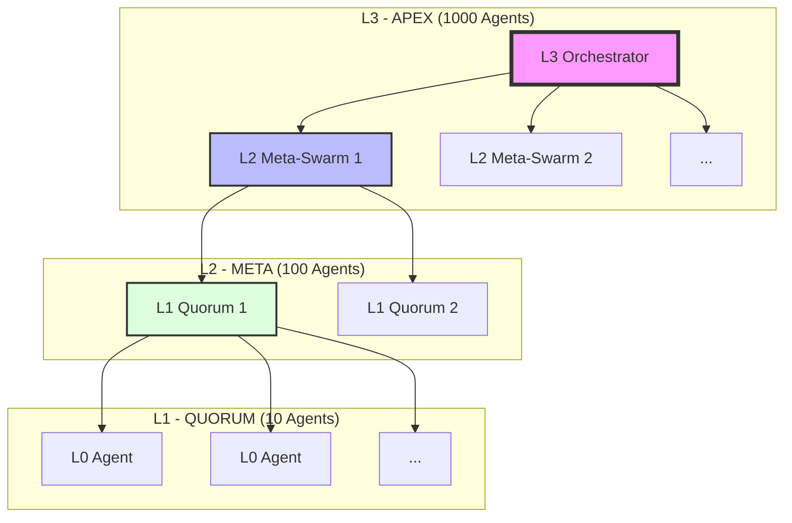
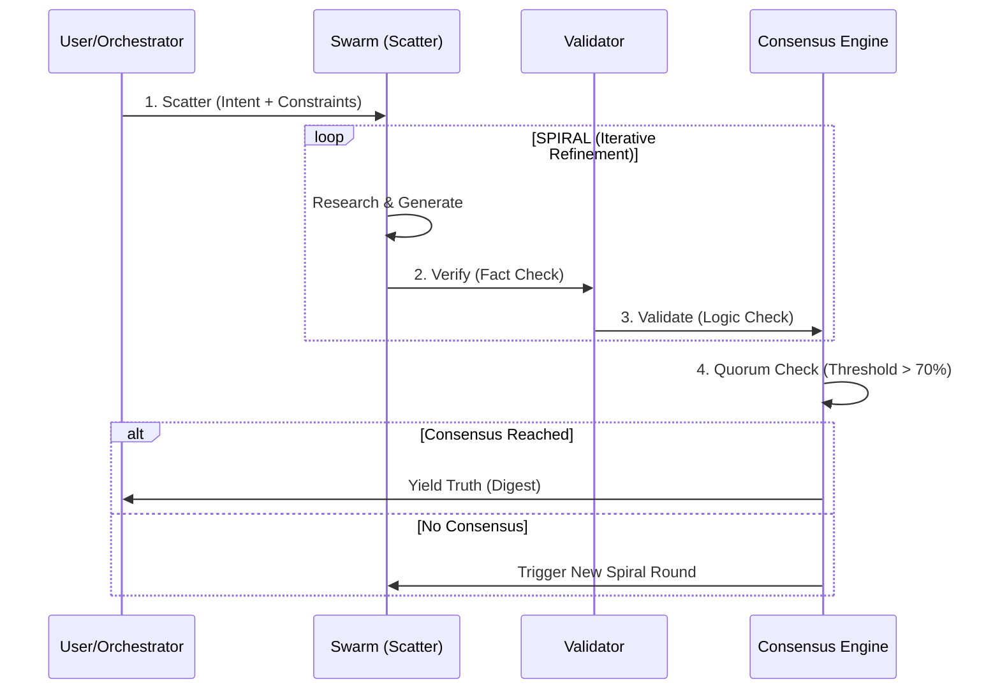

# Hive Fleet Obsidian Gen 33.1: Vision & Pattern Matrix

> **Status**: Active / Documentation Layer
> **Ingestion Source**: Gen 1-33 (Gemini 3 Pass)
> **Focus**: High-Level Patterns, Vendor-Neutral Architecture, Fractal Holarchy

---

## 1. Bottom Line Up Front (BLUF)

**Mission Intent**: To maximize "kids helped" as a function of Revenue, Cost, and Lifespan.
**Strategic Horizon**: Eradicate human starvation and cognitive scarcity across a 100-year timeline.
**Methodology**: A biological, evolutionary swarm architecture that follows the **Adopt → Adapt → Ascend** cycle. The system is designed to be vendor-neutral, self-healing, and fractally scalable from a single agent to a distributed super-organism.

---

## 2. The Obsidian Matrix (Core Pattern Language)

This matrix defines the immutable axioms that govern the Hive Fleet, independent of underlying LLM vendors or specific code implementations.

| Pattern | Type | Definition | Function |
| :--- | :--- | :--- | :--- |
| **V²C-SPIRAL-QUORUM** | Protocol | **Verify** (check facts), **Validate** (check logic), **Consensus** (check agreement). **SPIRAL** (iterative refinement). **QUORUM** (majority vote). | Ensures truth and reduces hallucination through multi-agent cross-validation. |
| **Fractal Holarchy** | Structure | A nested hierarchy where every level (L0, L1, L2...) is both a whole and a part. | Enables infinite scaling. L1 (10 agents) has the same interface as L0 (1 agent). |
| **Obsidian Hourglass** | Algorithm | A metaphor for constraint-based planning. **Past Cone** (Precedents), **Present Waist** (Constraints), **Future Cone** (Planning Horizon). | Balances historical knowledge with future goals under strict resource constraints. |
| **Stigmergy Mesh** | Coordination | Indirect coordination via the environment (digital pheromones). Agents communicate by modifying shared artifacts. | Decouples agents. No direct message passing required; prevents bottlenecking. |
| **The 8 Roles** | Taxonomy | Functional archetypes: Observer, Bridger, Shaper, Injector, Disruptor, Immunizer, Assimilator, Navigator. | Specialization of labor within the swarm. |

---

## 3. System Diagrams

### A. Fractal Holonic Scaling (The Log10 Law)

The architecture scales logarithmically. Each layer wraps the layer below it, presenting a unified interface upwards.

### B. V²C-SPIRAL-QUORUM Protocol

The standard operating procedure for truth generation.

---

## 4. Deep Dive: Core Axioms

### The Fractal Holarchy (L0-L3)
*   **L0 (Individual)**: A single agent execution. Fast, cheap, high variance.
*   **L1 (Quorum)**: 10 agents running in parallel. High reliability via consensus. The "Atomic Unit" of truth.
*   **L2 (Meta-Swarm)**: 100 agents (10 x L1). Used for complex, multi-domain problems.
*   **L3 (Apex)**: 1000 agents. Strategic, long-horizon campaigns.

### The 8 Obsidian Roles
1.  **Observer**: Sensors. Monitors environment and data streams.
2.  **Bridger**: Translator. Converts intent between layers/languages.
3.  **Shaper**: Architect. Defines structure and constraints.
4.  **Injector**: Provider. Supplies resources and context.
5.  **Disruptor**: Red Team. Tests for weaknesses and edge cases.
6.  **Immunizer**: Blue Team. Heals and protects the system.
7.  **Assimilator**: Learner. Integrates new knowledge into memory.
8.  **Navigator**: Commander. Sets direction and strategy (The Swarmlord).

### Stigmergy & Coordination
Agents do not talk to agents. Agents talk to the **Blackboard** (Filesystem/DB).
*   **Attractors**: Validated patterns that pull the swarm towards success.
*   **Repulsors**: Known failures or "toxic" patterns to avoid.
*   **Decay**: Information has a half-life. If not re-validated, it fades (TTL).

---

> **Note**: This document is a synthesized view of the Hive Fleet's memory as of Gen 33. It represents the "Soul" of the system, distinct from the "Body" (Code).
