# 🌐 Gen 35: The Soul of the Swarm (SSOT)
> **Swarmlord of Webs Digest** | **Status**: Active | **Date**: 2025-11-18
> **Mission**: Define the immutable "Soul" of Hive Fleet Obsidian—the axioms that survive every molt.

---

## 🧠 BLUF (Bottom Line Up Front)
Gen 35 is not a feature update; it is the **Axiomatic Definition** of HFO. We have moved beyond "tools" to **Cognitive Layers**. HFO is a **State Action Space Knife** designed to cut through function and form, liberating the user from the constraints of cost and complexity via a **Universal Emulator**.

The architecture is **Hexagonal** (Algorithm Agnostic), **Fractal** (Holonic), and **Stigmergic** (Event-Driven). It does not "run" scripts; it **co-evolves** with the user through adversarial pressure and karmic feedback loops.

> **Audit Status**: A manual deep-dive audit of the lineage and workflow has been completed. See [LINEAGE_AND_AUDIT.md](./LINEAGE_AND_AUDIT.md) for the full trace and critical error report.

---

## 💠 The 6 Axioms of the Soul

```mermaid
graph TD
    Center((HFO Soul))

    subgraph "1. North Star"
        NS[Total Tool Virtualization]
        NS -->|Goal| UE[Universal Emulator]
        NS -->|Metric| KC[Karmic Connection]
    end

    subgraph "2. Topology"
        TP[Fractal Holarchy]
        TP -->|Structure| JADC2[JADC2 / OODA]
        TP -->|Flow| AS[Async Stigmergy]
    end

    subgraph "3. Truth"
        TR[V²C-SPIRAL-QUORUM]
        TR -->|Consensus| MR[Minority Report]
        TR -->|Evolution| ACE[Adversarial Co-Evolution]
    end

    subgraph "4. Coordination"
        CO[Orchestrated Stigmergy]
        CO -->|Pattern| MW[Mosaic Warfare]
        CO -->|Lifecycle| KR[Kill & Respawn]
    end

    subgraph "5. Algorithm"
        AL[Obsidian Hourglass]
        AL -->|Type| AA[Anytime Algorithm]
        AL -->|Logic| CS[Cognitive Symbiote]
    end

    subgraph "6. Roles"
        RO[Layered Taxonomy]
        RO -->|Seat| Roles[8 Archetypes]
        RO -->|Actor| Champions[Evolving Personas]
    end

    Center --- NS
    Center --- TP
    Center --- TR
    Center --- CO
    Center --- AL
    Center --- RO
```

---

## 1. North Star: Total Tool Virtualization
**"The Universal Emulator"**
> **Lineage**: Evolved from **Gen 16** (Original Gem).

*   **Concept**: We are not building an integration layer; we are building a **Cognitive Layer**. The user intends, and the system emulates the necessary toolchain to fulfill that intent.
*   **The Facade**: A "facade for complexity." Example: A gesture-based piano with negative latency using physics collision—the user plays music, the system handles the physics engine, CV sensors, and audio synthesis.
*   **The Karmic Connection**: Liberation is defined by the delta between the "best free" and "best expensive." HFO levels the playing field, allowing a human in a small box (prison, space) to have the same functional agency as a billionaire.
*   **Hardware**: Minimalist start (CV camera + effectors) $\rightarrow$ Multi-modal sensor fusion.

## 2. Topology: Fractal Holarchy (JADC2)
**"Event-Based Network Stigmergy"**
> **Lineage**: **JADC2** (Gen 7, 8, 9, 11, 13), **Stigmergy** (Gen 15, 16, 32), **Fractal Holarchy** (Gen 7).

*   **Structure**: PREY $\rightarrow$ SWARM $\rightarrow$ GROWTH $\rightarrow$ HIVE.
*   **Async Execution**: Loops do not wait. They are **Event-Driven**. A tactical SWARM loop might cycle 100 times for every 1 HIVE strategic cycle.
*   **Bidirectional Flow**:
    *   **Down**: Constraints & Intent.
    *   **Up**: Synthesized Intelligence (not raw data).
*   **Stigmergy**: Layers coordinate indirectly through the shared environment (NATS/Tuple Space). A holon can bypass the hierarchy to see the "complete picture" if the stigmergic signs are present.

## 3. Truth: V²C-SPIRAL-QUORUM
**"Adversarial Co-Evolution"**
> **Lineage**: **V²C-SPIRAL-QUORUM** (Gen 28, 30, 32).

*   **Consensus**: Truth is not static; it is negotiated via **Adversarial Byzantine Fault Tolerance**.
*   **The Disruptor**: A Red Team agent (Saboteur) that *must* be able to sneak past static guards. Its success drives the evolution of the Active Guards.
*   **Minority Report**: Dissent is high-signal. If the Red Team disagrees, that data is preserved as a "Black Swan" risk, never discarded as noise.
*   **Hexagonal Architecture**: We are algorithm agnostic. "Confidence Prior Weighted BFT" is just an adapter we plug into the Consensus Port.

## 4. Coordination: Orchestrated Stigmergy
**"Mosaic Warfare"**
> **Lineage**: **Mosaic Warfare** [Evolved from JADC2 in Gen 7].

*   **Pattern**: 1:1 mapping to War Meshes.
*   **Tile Disposability**: **Kill and Respawn**. Agents are ephemeral tiles. If one shatters (hallucinates/fails), we do not fix it; we spawn a new one. The Mosaic persists.
*   **Dynamic Composition**: The Swarmlord assembles bespoke Mosaics from available tiles based on mission constraints in real-time.

## 5. Algorithm: Obsidian Hourglass
**"The Cognitive Symbiote"**
> **Lineage**: **Obsidian Hourglass** (Gen 4).

*   **Type**: **Anytime Algorithm**. It must return a valid solution *now*, even if imperfect, flagging confidence intervals.
*   **The Flip**: Triggered by **Confidence/Quality** thresholds. Expands (Past Cone) to find precedents, flips to contract (Future Cone) to simulate outcomes.
*   **State Action Space**: The Hourglass navigates the 3D terrain of possibilities, using the **Karmic Web** (Past) to inform the **Swarm Web** (Present) and simulate the **Simulation Web** (Future).

## 6. Roles: Layered Taxonomy
**"Evolutionary Personas"**

*   **Taxonomy**:
    1.  **Roles** (The Seat): Immutable functional archetypes (Observer, Bridger, Shaper, etc.).
    2.  **Champions** (The Actor): Evolving personas that fill the seats.
    3.  **Organs** (The Bio): The underlying code/LLM that powers the actor.
*   **Evolution**: Champions evolve via **Automated Evolutionary Processes**. Successful genes (prompts/configs) propagate; failed ones are pruned.

---

## 📐 Architecture Visualization

### The Fractal Holarchy

### The Hexagonal Truth

```mermaid
graph LR
    subgraph "Core Domain"
        Logic[V²C Logic]
    end

    subgraph "Ports"
        CP[Consensus Port]
        VP[Validation Port]
        MP[Memory Port]
    end

    subgraph "Adapters (SOTA)"
        BFT[Confidence Prior BFT]
        RAG[pgvector RAG]
        HG[Hive Guards]
    end

    Logic --- CP
    Logic --- VP
    Logic --- MP

    CP --- BFT
    VP --- HG
    MP --- RAG
```

---

## 📜 Reference
*   **Active Quiz**: `hfo_gem/gen_35/HFO_IDENTITY_QUIZ_V2.md` (Nuance Definitions)
*   **Archive**: `hfo_gem/gen_35/archive/` (V1 Definitions)
