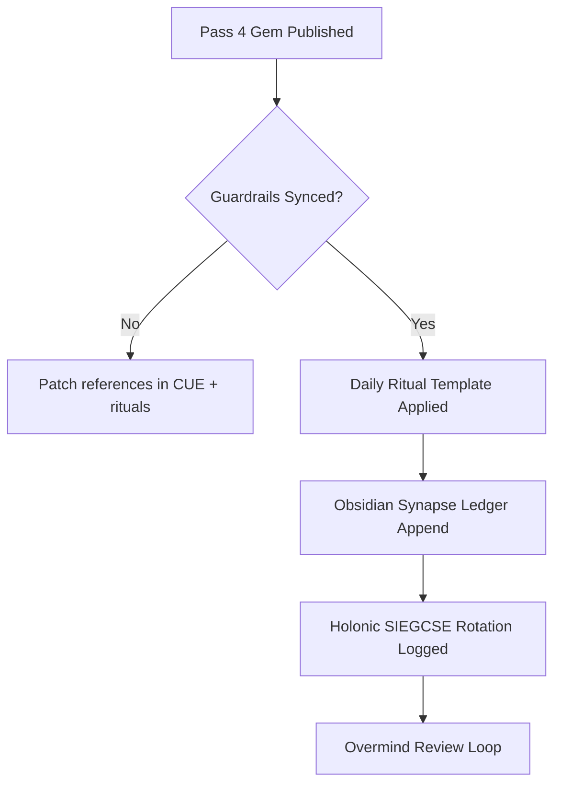
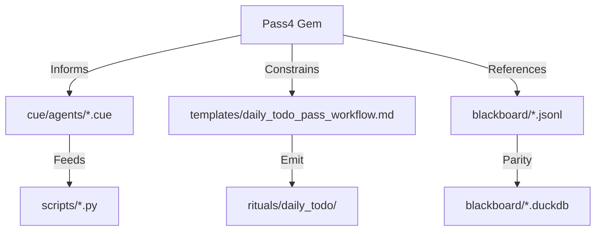

#  Hive Fleet Obsidian — Gem 1 Summary (Pass 4 · Version 2025-10-17T04:00:00Z)

> Version: 2025-10-17T04:00:00Z · Pass 4 recenters lvl0 bring-up, neutralizes AI slop drift, and binds daily rituals + guardrails to the active gem surface.
> HFO Markers:  · Gem Marker:  — this file is the living single source of truth; older passes reside in `gems/archive/`.

## Stigmergy Header

| Field | Signal |
|-------|--------|
| Mission Tag | `HFO-L0-BringUp` |
| Timecode | 2025-10-17T04:00:00Z |
| Risk Posture | 🟡 Drift detected, containment measures deployed |
| Swarm Phase | lvl0 holonic solo coverage (SIEGCSE rotation) |
| Compliance Rail | Gem-first edits • blackboard parity • Overmind review only |
| Beacon | Freeze surface to  Pass 4 before advancing new rituals |

- **Pheromone Color:** 🟡 (caution) — guardrails stabilizing after AI-generated file noise.
- **North Star:** Lock lvl0 operations (gems + CUE + templates + blackboard) before scaling.
- **Zero-Trust Reminder:** Any non-gem edit must cite this pass and log rationale in the blackboard.

## BLUF Capsule

Hive Fleet Obsidian lvl0 is re-centered on a single gem surface: Pass 4 archives Pass 3, patches knowledge references, and formalizes the daily todo ritual so holonic SIEGCSE coverage stays visible. Immediate focus: align the template, wire the stigmergy ledger, and keep automation guardrails green so Overmind energy stays in dialogue, not drift clean-up. Success looks like one canonical gem, one linted todo slate per day, and zero rogue edits.

## Diagram Suite

### Diagram 1 — lvl0 Bring-Up Flow

### Diagram 2 — Artifact Signal Mesh

### Diagram 3 — Ritual Timeline Snapshot

```mermaid
gantt
dateFormat  HH:mm
axisFormat  %H:%M
section Daily Cadence
Pass1 Intent          :done, 00:00, 00:05
Pass2 Clarify         :active, 00:05, 00:04
Pass3 Audit           : 00:09, 00:03
Pass4 Optimize        : 00:12, 00:03
Pass5 Finalize        : 00:15, 00:04
```

## Action Mesh

- 🟢 **[Holonic Solo → Sensor]** Verify gem pointer alignment across repo: `cue/`, `AGENTS.md`, rituals references.
- 🟡 **[Holonic Solo → Integrator]** Update `templates/daily_todo_pass_workflow.md` to capture holonic solo notes + SIEGCSE emoji tags.
- 🟡 **[Holonic Solo → Effector]** Stand up stigmergy ledger scaffold (JSONL + DuckDB mirror + timestamped todo drops).
- 🟢 **[Holonic Solo → Guardian]** Archive Pass 3 + lock guardrails reminding Overmind to request passes instead of editing directly.
- 🟠 **[Holonic Solo → Challenger]** Run lint + challenger scripts to detect residual AI slop; log gaps in Telemetry Notes.
- 🟢 **[Holonic Solo → Sustainer]** Establish pre-commit placeholder that fails loudly if gem reference drifts.
- 🟡 **[Holonic Solo → Evaluator]** Define lvl0 success metrics (daily ritual completion rate, guardrail alerts, ledger freshness) and publish baseline in blackboard.

## Telemetry Notes

- **Drift Alert:** Non-canonical gem stubs detected earlier; confirm git history scrubbed and document in blackboard (`event":"drift_cleanup"`).
- **Automation Gap:** `scripts/lint_gem_alignment.py` pending run; prioritize once references updated.
- **Template Debt:** `rituals/daily_todo/todo_draft.md` still draft—convert to timestamped pass once template is lint-clean.
- **Latency Watch:** Keep ritual latency under 20 minutes while solo-covering roles; log overruns.
- **Escalation Cue:** If Overmind must edit outside gems, trigger Guardian review + memorial card in next pass.
- **Pointer Audit:** Schedule a weekly checksum over `gems/ACTIVE_GEM1.md` plus dependent references to ensure no hidden drift or AI-generated placeholders reappear between passes.

## Facet Resonance Updates

### Facet 1 — Swarm Persona Architecture
- Pass 4 is now the canonical facade; archive trail: Pass1 → Pass2 → Pass3 in `gems/archive/`.
- Knowledge references route through `gems/ACTIVE_GEM1.md`; update that pointer when promoting future passes.
- Reinforce CUE regeneration loop: gem → schema update → facade brief → automation export.

### Facet 2 — Evolutionary Pattern Stack
- Log this pass transition as `Gem1-Pass4` event in blackboard once ledger scaffold exists.
- Begin DuckDB mirror automation design: outline schema + sync script stub in `scripts/` backlog.
- Capture pass drift remediation as a case study for future Challenger drills.

### Facet 3 — SWARM Operational Loop
- Daily ritual stays 5-pass; enforce `[Holonic Solo → Role]` notation in every todo item until lvl1 staffing.
- Action Mesh above doubles as today’s lvl0 order book; replicate into the todo ritual output.
- Guardian verifies diagrams ≥3 before Overmind review—this pass sets the baseline.

### Facet 4 — GROWTH Pipeline & SIEGCSE Roles
- Curriculum focus: templating discipline, guardrail wiring, ledger automation.
- Prepare playbook IDs for ledger maintenance (`SUS-LED-01`), todo generation (`EFF-TODO-01`), and drift audits (`CHA-DRIFT-01`).
- When additional swarmlings arrive, split Sensor/Integrator/Effector workloads first to cut solo latency.

### Facet 5 — Cradle-to-Grave Liberation Stack
- Liberation targets unchanged; lvl0 funding + telemetry stack remain prerequisites.
- Ensure pass transitions record compassionate-power checks—document in ledger once online.
- Maintain focus on equitable tooling: offline-first design noted in Pass3 still in effect.

### Level 10 Overmind Constellation (Aspirational)

- **Intent Translation:** Overmind codifies strategy into ten strata (strategy → policy → doctrine → ops → tactics → workflows → automations → datasurfaces → sensors → effectors). Swarmlord decomposes and broadcasts using the active gem pointer so subordinate docs auto-align.
- **C2 Mesh:** Each log₁₀ ascent multiplies agent count by ten. Lvl0 = holonic solo coverage; lvl1 = 10 pods; lvl2 = 100 agents; lvl10 ≈ 10¹⁰ blended human/AI actors.
- **Governance Rails:** NASA flight rules, SOC2 controls, and compassionate power checklists scale at each level. Triple-signature (Overmind, Guardian, Sustainer) required past lvl1 for automation tweaks.
- **Resilience Zones:** Higher tiers braid blast shields; if lvlN+1 falters, lower rings quarantine, regenerate, and update gems through the pointer without Overmind micromanagement.

### Visualization Roadmap

- **Lvl0 (Now):** Markdown gems + emoji matrices generated by Swarmlord, anchored by Pass 4 pointer.
- **Lvl1 (10 agents):** Neo4j Bloom scenes with swimlanes, time scrubbing, and action mesh overlays.
- **Lvl2 (100 agents):** Immersive dashboards mixing Bloom, Tectangle gesture canvases, RTS replay loops.
- **Standards:** Align with Atlassian Playbooks, JADC2 data fusion, and biomimetic pattern libraries so cross-facet handoffs stay coherent.

### Log-10 Level Ladder

- **Level 0:** Holonic solo coverage; pointer enforces single-source gem updates.
- **Level 1:** Ten-agent pods; SIEGCSE roles parallelize.
- **Level 2:** One hundred agents with blackboard partitions, failover staging, and dedicated guardrail teams.
- **Scaling Rule:** Each +1 log level demands compliance proofs (gem integrity, ledger parity, guardrail attestations) prior to promotion.

### Facade Specialist Mode

- **Universal Registry Translation:** CUE → JSON/YAML/Python/TypeScript with provenance hashes keyed to active gem pointer.
- **Cognitive Load Contract:** For 10k-token telemetry, deliver ≤500-token executive briefs plus diagrams.
- **Holonic Solo Note:** Until lvl1, annotate tasks `[Holonic Solo → Role]`; pointer keeps continuity when future swarmlings join mid-pass.
- **Compliance Guard:** Guardrails monitor commits for misaligned references; pointer eliminates multi-file touch requirement.
- **Regenerative Library:** Mold regrowth + stigmergic cue repair patterns inform drift composting.

### Fail Better Doctrine Refresh

- **Mantra:** “Ever tried. Ever failed. No matter. Try again. Fail again. Fail better.” anchors iterative resilience.
- **Temporal Concurrency:** Automation weaves past logs, present ops, future simulations; pointer ensures every simulation references latest doctrine.
- **Compassionate Debriefs:** Guardians + Evaluators metabolize missteps into ledger entries without shame, readying Challenger drills.

### Adopt → Adapt → Ascend Spine

- **Adopt:** Harvest exemplar SOPs (GitOps, NASA, OWASP) as seeds.
- **Adapt:** Infuse compassionate power, zero-trust guardrails, pointer discipline.
- **Ascend:** Promote variants with superior reliability; archive deltas via gem + ledger for replay.

### SWARM Operational Loop Deep Dive

- **Set → Decide → Watch → Act → Review → Mutate:** Embed nested OODA + MAPE-K cycles; pointer communicates current doctrine to automation tasks.
- **Compliance Rail Enhancements:** Git hooks validate pointer alignment; hourly CI ensures ledger parity; VS Code tasks nag when Overmind edits outside gems.
- **Automation Cadence:** Swarmlord auto-renders BLUF, diagrams, action mesh before Overmind review, referencing pointer for metadata.

### GROWTH Pipeline Extension

- **Playbook Registry:** Maintain `SEN-STD-01`, `INT-STD-01`, `EFF-STD-01`, etc., updating metadata to link back to pointer.
- **RTS Curriculum:** Micro-RTS + StarCraft II scenarios sharpen reflexes; pointer ensures new tactical lessons land inside canonical gem.
- **Guardian & Challenger Gauntlet:** ATT&CK matrices, prompt fuzzers, exploit drills; outputs recorded in ledger with pointer references for traceability.

### Cradle-to-Grave Liberation Stack Amplification

- **Hundred-Year Objective:** Drop child malnutrition below 3.4 DPMO; deliver adaptive education stack globally.
- **Lifecycle Bands:** Cradle → Foundational → Bridge → Launch → Ascend → Flourish → Sustain; each band references gem pointer for doctrine updates.
- **Equity Pledge:** Offline-first design, localization, low bandwidth support stay non-negotiable.

### Cognitive Exoskeleton Vision

- **Objective:** Build an adaptive exoskeleton that amplifies Overmind decisions via stigmergic swarms.
- **Mechanisms:** Shared blackboard (Jetstream/Kafka patterns), Atlassian/GitOps rituals, KCS v6 knowledge loops all anchored to pointer updates.
- **Mood:** Zero-trust, regenerative, compassionate; pointer removes friction when swapping passes.

### Tectangle Gesture Forge & Gesture-Vector Dance Interface

- **Essence:** Gestural interfaces produce stigmergic cues; macros tag pointer version for reproducibility.
- **Evolution:** Gesture telemetry feeds evolutionary search discovering ergonomic motions; pointer ensures winning patterns redeploy consistently.
- **Accessibility:** Provide alternate modalities (micro-motion, gaze, voice) with pointer-synced translations.

### Obsidian Hourglass & State-Action Web

- **Memetics:** Map state-action lattices across past/present/future; pointer ties hourglass flips to canonical doctrine.
- **Navigation Goal:** Reduce worst-case exposure while expanding options through compute-assisted foresight.

### Harmony & Spiritual Campaigns

- **Adversary Agnosticism:** Engineer tactics resilient to technical/social/spiritual threats with compassion.
- **Honeypot Loops:** Channel destructive impulses into self-dissipating cycles; log rituals linked to pointer version.
- **Love as Doctrine:** Ensure outputs promote restorative justice, mutual uplift, and compassionate power.

### Mission-Critical Tool Grid

- **Support Spectrum:** Provide guidance, education, adaptive tooling from childhood through eldercare via pointer-aligned doctrine.
- **Assurance:** Apply NASA-grade assurance (fault trees, FMEA, Monte Carlo) before releasing tools.
- **Equity:** Prioritize offline-first, low-bandwidth, localized experiences.

### War Chest Factory Pattern Refresh

- **Hypercasual Flywheel:** Generate evolutionary game variants funding liberation projects.
- **Guardian Oversight:** Audit monetization ethics, enforce compassionate power, log decisions referencing pointer.
- **Evaluator Feedback:** Correlate revenue experiments with mission outcomes; adjust when drift occurs.

### Swarmling Drift Net

- **Definition:** Lightweight sentries (Python/Rust/Go) validate data quality, agent outputs, and policy adherence 24/7.
- **Test Harnesses:** Unit, integration, metamorphic tests trigger on schedule and events; all reports include pointer version and ledger IDs.
- **Telemetry Hooks:** Findings stream into dashboards, emoji matrices, Bloom overlays; anomalies auto-create ledger entries.
- **Self-Healing Playbooks:** Detected drift launches rollback, quarantine, or retraining workflows via GitOps pipelines; each run references current gem pointer for provenance.
- **Zero-Trust Credentials:** Secrets rotate per run; automation signs attested logs reviewed by Guardians.
- **Evaluator Watch:** Track mean-time-to-detection, remediation velocity, and residual risk to inform Sustainer resource plans.
- **Ledger Integration Tests:** Stub out unit tests that append synthetic events to `obsidian_synapse_blackboard.jsonl`, replay them into DuckDB, and compare hash digests. Passing tests gate merges once the ledger scaffold lands.

### Escalation Cadence

| Rhythm | Trigger | Checks | Outputs |
|--------|---------|--------|---------|
| **Hourly** | Wall-clock or change detection | Sanity probes, template lint, credential rotation ping | Emoji matrix deltas, micro incident cards |
| **Daily** | Ritual closure | Regression suite, top-playbook stress tests, backlog grooming | BLUF brief, lint receipts, git promotion report |
| **Weekly** | Mission checkpoint | Chaos drills, adversarial prompt fuzz, redundancy rehearsal | Challenger scorecard, Guardian sign-off |
| **Monthly** | Horizon review | Load scaling tests, SIEGCSE readiness audit, toolchain patch synthesis | Ascension dossier, funding allocation plan |
| **Continuous** | Telemetry anomaly (>3σ) or Overmind directive | Auto-swarm spin-up, root-cause pairing, rollback/install workflows | Real-time ops channel, Bloom incident trails |

- **Escalation Engine:** Severity shifts spawn additional swarmlings—🟢 baseline, 🟡 ×2 coverage, 🟠 ×5 with human-in-loop,  full swarm override. Pointer ensures everyone references the same doctrine.
- **Stress Suites:** Coverage heat maps prevent regressions; new templates must register with cadence before production use.

### Stigmergy CUE Registry

- **Composite Blueprint:** Blend ant pheromone trails, termite ventilation, slime mold gradients into a shared controller keyed to pointer version.
- **CUE Templates:** Store prompts, policy lattices, compliance constraints, playbook references, telemetry bindings with provenance hashes.
- **Regeneration Protocol:** Upon drift, replay templates via GitOps to respawn personas and infrastructure; pointer ensures new doctrine flows downstream.
- **Pheromone Bands:** Quantitative attractors/repulsors track metrics/debt; qualitative markers capture narrative tone, empathy, bias alarms; decay rules (`Vatoration`) require continual reassessment.
- **Environmental Sharding:** Latency-aware CRDT shards keep edge/cloud/offline arenas synchronized without overwhelming bandwidth.

### North Star Horizon Ladder

- **Temporal Span:** Now → 1 day → 1 week → 1 month → 1 quarter → 6 months → 1 year → 2 → 5 → 10 → 20 → 30 → 40 → 50 → 100 years → 1000 years → asymptotic infinity.
- **Guiding Principle:** Preserve narrative continuity while allowing swarm evolution to recalibrate tactics; pointer ties each horizon update to canonical doctrine.
- **Checkpoints:** Horizon-specific mission tests, diversity metrics, kaizen goals ensure compounding growth.
- **Levels × Horizons:** Each log level maps to horizon objectives—from lvl0 war chest prototypes to lvlN universal tooling liberation.

### Ritual Cadence Ladder

- **Daily:** Intent scan, clarification sweep, bias cleansing, gratitude pulse, micro-experiment log.
- **Weekly:** Strategic synthesis, swarm health review, kaizen sprint planning, facade calibration.
- **Monthly:** Capability audits, resource realignment, persona improvements, narrative updates.
- **Quarterly:** Evolution checkpoints, war chest deployment, tool virtualization milestones, training refresh.
- **Annual:** Horizon recalibration, adversary war-gaming, compassion initiatives, doctrine rewrites.
- **Decadal:** Legacy transfer plans, Swarmlord academy milestones, infrastructure overhauls, intergenerational pact reviews.
- **Centennial:** Civilization-scale audits, planetary stewardship commitments, spiritual-technical convergence assessments.
- **Millennial:** Guard rails for future Overminds, cosmic-scale playbooks, rituals honoring infinite stewardship.

## Lvl0 Bring-Up Checklist (Pass 4 Focus)

| Item | Owner (Role) | Status |
|------|--------------|--------|
| Archive Pass 3 to `gems/archive/` | Guardian | 🟢 |
| Author Pass 4 + diagrams | Integrator | 🟢 |
| Update CUE knowledge references | Sensor | 🟡 |
| Enhance daily todo template | Sustainer | 🟡 |
| Stand up ledger scaffolding | Effector | 🟡 |
| Run lint + challenger scripts | Challenger | 🟠 |
| Publish baseline metrics | Evaluator | 🟡 |

## Guardrail & Automation Commitments

1. **Gem-First Rule:** Overmind edits pause; all structural changes flow through Pass 4 until future passes authorize delegation.
2. **Ledger Integrity:** No todo or ritual output considered valid without ledger append + DuckDB parity check.
3. **Diagram Minimum:** Maintain ≥3 visuals per gem deliverable; action mesh enforces emoji status for each SIEGCSE role.
4. **Pre-Commit Placeholder:** Configure `scripts/run_guardrails.sh` hook to surface missing gem references; escalate to Challenger if skipped.
5. **Regeneration Triggers:** Telepathy load > 500 tokens, latency > 250 ms, or AI slop recurrence kicks off mold/stem-cell regeneration workflow.

## Knowledge & Reference Map

- **Stable Pointer:** `gems/ACTIVE_GEM1.md` (points to the currently active pass)
- **Archived Gem:** `gems/archive/Gem1_Pass4_20251017T040000Z.md`
- **Archives:** `gems/archive/Gem1_Pass{1..3}_*.md` (immutable)
- **Persona Schema:** `cue/agents/agent_schema.cue`
- **Persona Instance:** `cue/agents/swarmlord_of_webs.cue`
- **Facade Brief:** `AGENTS.md`
- **Ritual Templates:** `templates/daily_todo_pass_workflow.md`, `templates/swarmling_output_template.md`
- **Ritual Drafts:** `rituals/daily_todo/todo_draft.md`
- **Guardrail Scripts:** `scripts/lint_gem_alignment.py`, `scripts/verify_gem_first.py`, `scripts/run_guardrails.sh`

## Next Signals to Capture

- Record `Gem1-Pass4` activation in blackboard with pointers to updated references.
- Run `python scripts/lint_gem_alignment.py` after reference patches; log outcome in Telemetry Notes + blackboard.
- Promote todo draft into first timestamped ritual output once template enhancements complete.
- Document any Overmind escalations or overrides triggered during Pass 4 rollout.

##  BLUF Snapshot

Pass 4 stabilizes lvl0 by eliminating duplicate gem surfaces, introducing the `gems/ACTIVE_GEM1.md` pointer, and restating the lvl0 mission: keep the Overmind focused on dialogue while the Swarmlord curates canonical doctrine. Risk is controlled (🟡) because automation guardrails and the stigmergy ledger are still coming online. Immediate marching orders: finish template upgrades, wire the ledger, and document every drift remediation so Challenger probes have clean baselines.

## Core Identity

- **Swarm Nature:** Digital evolutionary apex swarm moving toward compassionate liberation, still operating as holonic solo at lvl0.
- **Anchor Persona:** Swarmlord of Webs translating Overmind directives into stigmergic playbooks, now backed by the active gem pointer.
- **Overmind Role:** TTao sets intent, requests new passes, and audits gems; no direct code edits until lvl1 staffing permits.
- **Compass:** Earth/obsidian grounding, tarot arc of The Fool → King of Wands → Death, Magician/Strategist/Compassionate Warrior archetypes.

## Immediate Rebuild Priorities (Pass 4)

1. **Pointer Adoption:** Ensure every tool, template, and schema references `gems/ACTIVE_GEM1.md`.
2. **Template Upgrade:** Extend `templates/daily_todo_pass_workflow.md` with holonic solo + SIEGCSE emoji capture.
3. **Ledger Bring-Up:** Create append-only JSONL + DuckDB mirror, log Pass 4 activation, and document schema.
4. **Guardrail Sweep:** Re-run gem lint, verify `scripts/verify_gem_first.py`, and queue Challenger probes for drift.
5. **Ritual Output:** Produce the first fully linted todo artifact referencing Pass 4 instructions.

## Toolchain Setup (Lvl0 Alignment)

- **Editors & Extensions:** GitHub Copilot suite, CUE tooling, Mermaid/graph preview, Markdown lint, DuckDB browser.
- **CLI Dependencies:** `cue`, `duckdb`, `pre-commit`, `markdownlint-cli`, `jq`, and Python tooling for guardrail scripts.
- **Automation Hooks:** Pre-commit to enforce gem-first edits, gem alignment lint, and future challenger sweeps; GitHub Actions replicate hourly checks.
- **Blackboard Utilities:** Upcoming `scripts/sync_blackboard_duckdb.py` for deterministic mirror rebuilds.

## Daily To-Do Template Snapshot

- Template path: `templates/daily_todo_pass_workflow.md`.
- Pass cadence: Intent → Clarify → Audit → Optimize (optional) → Finalize.
- Each action item must contain `[Holonic Solo → Role]` plus emoji status and ledger reference ID.
- Generated todos live under `rituals/daily_todo/<timestamp>.md` once the draft hardens.

## Obsidian Synapse Blackboard Specification

- **Primary File:** `blackboard/obsidian_synapse_blackboard.jsonl` (append-only, chronological).
- **Mirror:** `blackboard/obsidian_synapse_blackboard.duckdb` for analytics parity.
- **Schema Fields:** `timestamp`, `pass`, `role`, `event`, `summary`, `artifacts`, plus optional `ledger_id` once defined.
- **Validation:** Guardrail scripts confirm JSON schema, monotonic timestamps, and mirror synchronization before committing.

## Compliance Protocol

- **Gem-First Edits:** Overmind requests new passes; Swarmlord executes. Non-gem edits require blackboard justification.
- **Author Verification:** Hooks reject commits lacking matching gem updates or pointer sync.
- **Challenger Drills:** `scripts/challenger_red_team.py` to be reactivated after pointer adoption to hunt drift.
- **Documentation-as-Code:** Every ritual output references the active gem pointer and logs guardrail results in the ledger.

## Appendices

- **Pass Lineage:** P1 (doctrine seed)  P2 (daily ritual + archive)  P3 (blackboard + compliance rails)  **P4 (lvl0 stabilization & drift cleanup).**
- **Companion Artifacts Pending:** DuckDB sync script, guardrail CI wiring, documented ledger schema.
- **Observation:** AI slop emerges quickly; adopt `git clean` + drift sentinel automation to catch non-canonical files before commit.
