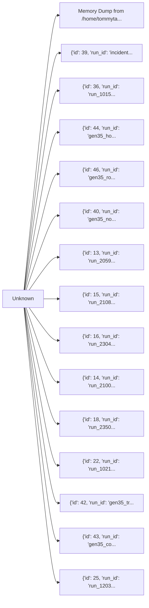

```mermaid
graph LR
    node9553["Memory Dump from /home/tommyta..."]
    Source_4773714694461814220[Unknown] --> node9553
    node8111["{'id': 39, 'run_id': 'incident..."]
    Source_4773714694461814220[Unknown] --> node8111
    node8103["{'id': 36, 'run_id': 'run_1015..."]
    Source_4773714694461814220[Unknown] --> node8103
    node6089["{'id': 44, 'run_id': 'gen35_ho..."]
    Source_4773714694461814220[Unknown] --> node6089
    node54["{'id': 46, 'run_id': 'gen35_ro..."]
    Source_4773714694461814220[Unknown] --> node54
    node8123["{'id': 40, 'run_id': 'gen35_no..."]
    Source_4773714694461814220[Unknown] --> node8123
    node984["{'id': 13, 'run_id': 'run_2059..."]
    Source_4773714694461814220[Unknown] --> node984
    node986["{'id': 15, 'run_id': 'run_2108..."]
    Source_4773714694461814220[Unknown] --> node986
    node987["{'id': 16, 'run_id': 'run_2304..."]
    Source_4773714694461814220[Unknown] --> node987
    node985["{'id': 14, 'run_id': 'run_2100..."]
    Source_4773714694461814220[Unknown] --> node985
    node989["{'id': 18, 'run_id': 'run_2350..."]
    Source_4773714694461814220[Unknown] --> node989
    node9544["{'id': 22, 'run_id': 'run_1021..."]
    Source_4773714694461814220[Unknown] --> node9544
    node8129["{'id': 42, 'run_id': 'gen35_tr..."]
    Source_4773714694461814220[Unknown] --> node8129
    node8130["{'id': 43, 'run_id': 'gen35_co..."]
    Source_4773714694461814220[Unknown] --> node8130
    node7646["{'id': 25, 'run_id': 'run_1203..."]
    Source_4773714694461814220[Unknown] --> node7646
```
