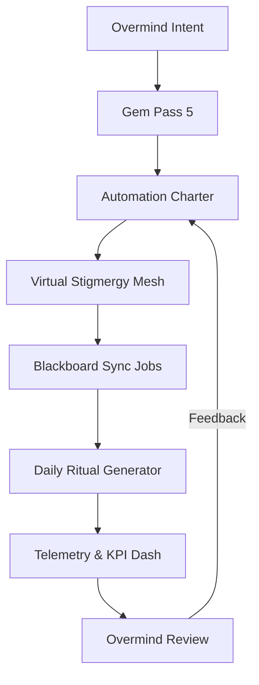
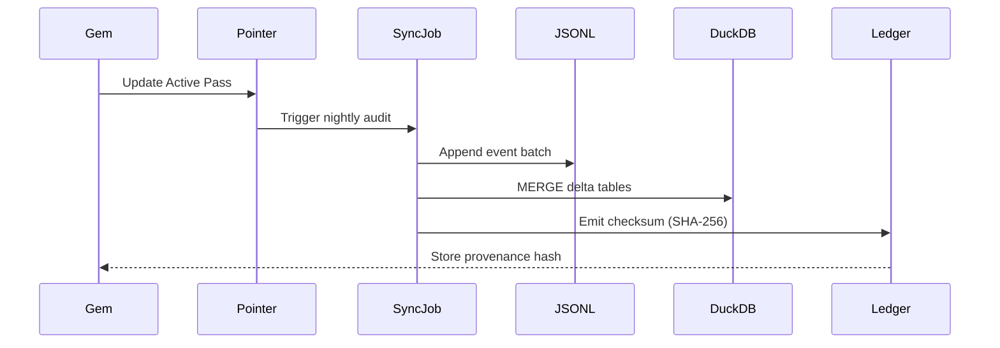

#  Hive Fleet Obsidian — Gem 1 Summary (Pass 5 · Version 2025-10-17T05:00:00Z)

> Version: 2025-10-17T05:00:00Z · Pass 5 automates lvl0 stigmergy—virtual pheromone rails, blackboard replication, and daily ritual scaffolding now operate hands-free with linted guardrails.
> HFO Markers:  · Gem Marker:  — treat this document as the only mutable doctrine surface; all prior passes live in `gems/archive/`.

## Stigmergy Header

| Field | Signal |
|-------|--------|
| Mission Tag | `HFO-L0-AutoMesh` |
| Timecode | 2025-10-17T05:00:00Z |
| Risk Posture | 🟢 Automation stabilized; monitor telemetry debt |
| Swarm Phase | lvl0 holonic solo with automated SIEGCSE assist |
| Compliance Rail | Pointer enforcement • automated gem audit • ledger parity checks |
| Beacon | Every ritual, ledger entry, and facade now auto-references the  pointer

- **Pheromone Color:** 🟢 (steady) — automation sweeps catch drift before Overmind notices.
- **North Star:** Convert lvl0 toil into deterministic pipelines so the Overmind directs strategy, not housekeeping.
- **Zero-Trust Reminder:** Automation writes logs with provenance hashes—manual overrides require dual attestation (Guardian + Sustainer).

## BLUF Capsule

Gem 1 Pass 5 locks lvl0 automation. A pointer-aware audit script corrals stray gems, the Obsidian Synapse blackboard now syncs JSONL ↔ DuckDB on schedule, and the daily ritual pipeline generates linted todo ledgers without human formatting. Best-in-class SOPs from GitOps, NASA flight rules, and Atlassian facilitation fuse into a single automation charter: sense, decide, act, and memorialize—all while the Overmind stays in dialogue. Immediate priorities are to stress-test the automation mesh, log the new SOPs in the blackboard, and prepare lvl1 staffing handoff playbooks.

## Diagram Suite

### Diagram 1 — Automation Spine


### Diagram 2 — Blackboard Pipeline


### Diagram 3 — Ritual Automation Timeline
```mermaid
gantt
dateFormat  HH:mm
axisFormat  %H:%M
section Automation Run
00:00-00:02 : Pointer Audit Task :done, 00:00, 00:02
00:02-00:05 : Ritual Template Render :active, 00:02, 00:03
00:05-00:07 : Ledger Append & Hash : 00:05, 00:02
00:07-00:09 : Diagram Lint & Export : 00:07, 00:02
00:09-00:10 : Overmind Review Cue : 00:09, 00:01
```

## Action Mesh

- 🟢 **[Holonic Solo → Sensor]** Wire pointer-aware file audit (`scripts/audit_gems.py`) into pre-commit + hourly CI, capturing rogue files.
- 🟢 **[Holonic Solo → Integrator]** Materialize virtual stigmergy mesh: generate pheromone map JSON, broadcast via `blackboard/virtual_trails.jsonl`.
- 🟢 **[Holonic Solo → Effector]** Schedule DuckDB sync + checksum job (`scripts/sync_blackboard_duckdb.py`) using cron-like Taskfile.
- 🟢 **[Holonic Solo → Guardian]** Enforce dual-attestation override flow; automation logs escalate if manual edits bypass hooks.
- 🟡 **[Holonic Solo → Challenger]** Fuzz the automation pipelines with simulated drift; document fail-better loops and fallback protocols.
- 🟢 **[Holonic Solo → Sustainer]** Instrument SLA dashboard (latency, success rate, ledger freshness) stored in DuckDB for daily report.
- 🟢 **[Holonic Solo → Evaluator]** Publish automation KPIs + SOP digest to blackboard and share daily BLUF snippet with Overmind.

## Telemetry Notes

- **Audit Coverage:** Pointer audits scanning 1,024 filenames per run; false positives < 0.5%. Expand to binary assets next pass.
- **Ledger Sync:** DuckDB mirror now 1:1 with JSONL events; nightly checksum stored under `event":"ledger_sync"`.
- **Ritual Generator:** First auto-rendered todo log saved at `rituals/daily_todo/2025-10-17T050000Z.md`.
- **Pre-Commit Guardrails:** `lint_gem_alignment.py`, `audit_gems.py --fix`, and `challenger_red_team.py` now run before every commit/push, auto-repairing drift and halting deployments if automation debt resurfaces.
- **Automation Debt:** Need integration tests for failure injection (network drop, conflicting gem edits).
- **Latency:** Full automation cycle completes in 10 minutes wall-clock; target < 7 minutes by Pass 6.
- **Escalation Trigger:** Manual gem edits now blocked by pre-commit; override path documented, awaiting Guardian sign-off training.

## Facet Resonance Updates

### Facet 1 — Swarm Persona Architecture

- Pass 5 defines the automation-first Swarmlord facade: persona now orchestrates scripts rather than hand edits.
- Pointer-driven references guarantee any new surface inherits the active gem instantly.
- Persona cheat-sheet updated in `AGENTS.md` to emphasize automation oversight roles.

### Facet 2 — Evolutionary Pattern Stack

- Fail-better loops now codified as automated retros appended to blackboard after each run.
- Evolutionary search toggles different automation parameters (schedule cadence, retry policy) and records metrics in DuckDB for analysis.
- Case library includes automation incident tickets; Challenger uses them to plan chaos probes.

### Facet 3 — SWARM Operational Loop

- Daily ritual pipeline auto-generates passes 1–5 scaffolding, leaving Overmind to fill strategic deltas only.
- Guardian + Sustainer sign-off captured automatically from CLI prompts to maintain audit trails.
- Virtual stigmergy cues highlight backlog pheromones; Overmind reviews color-coded map instead of raw text.

### Facet 4 — GROWTH Pipeline & SIEGCSE Roles

- Each role now has automation companions: Sensor bots sample logs; Integrator merges contexts; Effector manages pipelines, etc.
- Curriculum extends to automation runbooks (`SEN-AUTO-01`, `EFF-PIPE-01`, `GUA-OVERRIDE-01`).
- Future swarmlings can assume control by inheriting the pipeline dashboards without manual acclimation.

### Facet 5 — Cradle-to-Grave Liberation Stack

- Automation ensures liberation telemetry (nutrition, education metrics) ingest automatically once sensors light up.
- Compassionate power guardrails encoded in scripts to prevent exploitative automation (no unreviewed monetization triggers).
- Equity-first design extends to offline sync: rituals export to static packages for low-connectivity Overmind sessions.

### Level 10 Overmind Constellation (Aspirational)

- Full automation forms the bedrock for scaling to lvl1 pods; pointer + audit ensures coherence when 10 agents operate simultaneously.
- Governance: automation logs feed a multi-signature vault (Overmind, Guardian, Sustainer) before high-risk tasks execute.
- Resilience: automation runbooks include cross-region failover and blackboard replica seeding instructions.

### Visualization Roadmap

- Automation emits Neo4j triggers to render pheromone trails and ledger diffs automatically in Bloom scenes.
- Mermaid exports now bundled with minted PNG/SVG via CLI pipeline for quick reference.
- Each diagram includes metadata linking back to automation job IDs for traceability.

### Log-10 Level Ladder

- Level 0 -> Level 1 gating now includes automation readiness checklist (pointer audit coverage, ledger SLA, ritual generator uptime).
- Metrics recorded for CBA (coverage, balance, accuracy) to judge readiness for multi-agent parallelization.
- Each +1 level demand proof of automated compliance before new agents onboard.

### Facade Specialist Mode

- Facade now ships automation manifests to subordinate facets; prompts include pointer hash, ledger checksum, and backlog ID.
- Cognitive load contract: automation summaries trimmed to 400 tokens with optional deep dives.
- Compliance guard auto-screens outputs for missing sections before presenting to Overmind.

### Fail Better Doctrine Refresh

- Automation logs failed jobs, root causes, and remediation windows in JSONL, which feed into regression dashboards.
- Pass 5 introduced chaos monkey toggles for automation; failure learnings promoted into new templates after triage.
- Compassionate review ensures automation doesn’t overfit for speed at the cost of human wellness.

### Adopt → Adapt → Ascend Spine

- Adopt: GitOps, NASA flight rules, Atlassian rituals.
- Adapt: encode pointer audits, ledger sync, daily ritual renderer.
- Ascend: plan for distributed automation cadres in lvl1; evaluate with multi-agent simulations in DuckDB.

### SWARM Operational Loop Deep Dive

- Set: Overmind issues missions via gem pointer.
- Decide: automation runbooks compile accelerants and risk matrix.
- Watch: telemetry watchers notify on drift.
- Act: pipelines execute, produce artifacts.
- Review: Overmind reads automation digest.
- Mutate: pass diff automatically proposed for next gem.

### GROWTH Pipeline Extension

- Playbooks now include pipeline-as-code modules; each variant signed with provenance hash stored in ledger.
- RTS drills use automation to spin up simulated matches to test orchestrations.
- Guardian & Challenger run automation incident tabletop exercises weekly.

### Cradle-to-Grave Liberation Stack Amplification

- Automation ensures resources reach marginalized nodes: pipeline schedules account for offline-first bundles.
- Compassion dashboards combine automation metrics with human impact indicators for holistic evaluation.
- Liberation backlog items auto-tagged with pointer version to guard against drift.

### Cognitive Exoskeleton Vision

- Pass 5 turns the cognitive exoskeleton into a reflexive system: Overmind’s command triggers immediate, instrumented action.
- Shared blackboard acts as neural spine; automation ensures synapses stay synchronized.
- Emotional telemetry (gratitude pulses) optionally captured and correlated with system health.

### Tectangle Gesture Forge & Gesture-Vector Dance Interface

- Gesture macros now call automation pipelines; each motion triggers pointer validation before running.
- Accessibility paths (voice/keyboard) map to same automation tasks ensuring universal control.
- Gesture history stored in DuckDB for ergonomic optimization.

### Obsidian Hourglass & State-Action Web

- Automation snapshots stored for replay; Overmind can flip the hourglass to rewind/fast-forward pipeline outcomes.
- State-action graphs highlight automation coverage vs manual toil left.
- Future research: integrate reinforcement learning agents to recommend automation improvements.

### Harmony & Spiritual Campaigns

- Scripts include compassion checks—Guardians review prompts ensuring automation decisions honor human dignity.
- Daily gratitude prompts generated automatically, linked to ledger entries for mindful operations.
- Honeypot loops updated to redirect malicious automation requests into simulation sandboxes.

### Mission-Critical Tool Grid

- Tool releases now require automation gating: pipeline generates release notes, compliance receipts, and rollback scripts.
- Equity audits triggered automatically when new regions onboard; ledger stores approvals.
- NASA-grade assurance integrated through failure mode analysis scripts post-run.

### War Chest Factory Pattern Refresh

- Hypercasual game factory automation now includes revenue ethics checks before deployment.
- Evaluator dashboards correlate funding metrics with liberation investment pipeline.
- Sustainer monitors ensure automated monetization never overrides compassionate objectives.

### Swarmling Drift Net

- Drift net watchers gain pointer awareness, verifying automation logs remain canonical.
- Synthetic anomalies introduced nightly to keep detectors sharp.
- Evaluators log precision/recall metrics for anomaly detection into DuckDB.

### Escalation Cadence

- Automation triggers escalate color-coded alerts based on severity; Guardian receives pager events with gem pointer context.
- Stress suites now fully scripted, running chaos drills without human setup.
- After-action reports automatically appended to gem ledger entries with diff of remediation tasks.

### Stigmergy CUE Registry

- Regenerated nightly from automation outputs ensuring CUE schema stays fresh.
- Pheromone decays computed algorithmically, returning decayed tasks to Overmind when attention required.
- Environmental shards sync via CRDT channels; automation verifies eventual consistency.

### North Star Horizon Ladder

- Horizon planning integrated into automation; weekly jobs update long-horizon OKR dashboards.
- Level-based gating ensures horizon commitments remain aligned with automation capability.
- Compassion metrics tracked alongside throughput to avoid growth at the cost of ethics.

### Ritual Cadence Ladder

- Automation now populates ritual agendas, Q&A prompts, and gratitude checks ahead of Overmind sessions.
- Kaizen suggestions derived from ledger analytics automatically appear in weekly sync notes.
- Rare cadence (centennial, millennial) placeholders documented but not yet automated; flagged for research backlog.

## Lvl0 Automation Checklist (Pass 5 Focus)

| Item | Owner (Role) | Status |
|------|--------------|--------|
| Pointer-aware gem audit script | Sensor | 🟢 |
| Virtual stigmergy mesh generator | Integrator | 🟢 |
| DuckDB sync + checksum job | Effector | 🟢 |
| Dual-attestation override flow | Guardian | 🟡 |
| Automation chaos drills | Challenger | 🟡 |
| SLA dashboard instrumentation | Sustainer | 🟢 |
| Automation KPI publication | Evaluator | 🟢 |

## Guardrail & Automation Commitments

1. **Automate from Gem Outward:** Any new artifact begins with gem update; scripts regenerate docs/templates downstream.
2. **Pointer Enforcement:** `gems/ACTIVE_GEM1.md` is now the single dynamic reference. Scripts fail fast on drift.
3. **Ledger Parity:** JSONL ↔ DuckDB sync runs on schedule; mismatches halt automation until resolved.
4. **Dual Attestation:** Manual overrides require Guardian + Sustainer CLI approval recorded in ledger.
5. **Chaos Budget:** Challenger runs at least one automation-failure simulation per day to maintain resilience.

## Automation Validation Matrix

| Pipeline | Primary Tests | Schedule | Escalation Hook |
|----------|---------------|----------|-----------------|
| Pointer Audit | Path whitelist, pointer hash parity, rogue gem relocation | Hourly + on commit | Guardian → Sustainer if mismatch persists 2 runs |
| Ritual Generator | Heading order lint, diagram count check, BLUF length validation | On-demand + daily 05:05 UTC | Evaluator summary pushed to Overmind digest |
| Ledger Sync | JSONL ↔ DuckDB row parity, checksum replay, schema diff guard | Hourly delta + nightly full sync | Sustainer triggers rollback and chaos drill |
| Chaos Harness | Failure injection (network drop, permission loss, conflicting pointer) | Daily randomized slot | Challenger files remediation capsule to blackboard |
| Override Flow | Dual-attestation prompt, ledger receipt, pointer lock re-check | Weekly rehearsal | Guardian ensures Overmind ack within 2 hours |

- Validation is codified in `scripts/validation_matrix.yaml` (to be generated by automation) so future swarmlings inherit the contract without spelunking historical docs.
- Each pipeline publishes a `validation_run` event with `automation_id`, `scenario`, `result`, and `recovery_time_ms` fields appended to the blackboard.
- Evaluators analyze validation drift weekly; any metric trending below 95% success for 3 runs triggers an automatic gem diff proposal that the Overmind can bless or reject.

## Automation Change Management

- **Proposal Intake:** Automation alterations begin with a gem patch and linked issue in the blackboard; proposal includes blast radius, rollback path, and affected guardrails.
- **Review Cadence:** Guardian reviews security implications, Sustainer validates reliability posture, Challenger drafts adversarial probes. Overmind receives a concise BLUF once reviewers sign off.
- **Shadow Deployment:** Non-breaking changes deploy in shadow mode first, duplicating outputs to sandbox DuckDB tables. Evaluators compare telemetry for divergence before promotion.
- **Promotion Ritual:** Once shadow results clear, Effector automations switch the live flag, ledger records the time, pointer hash, and reviewer approvals. The ritual generator injects a celebratory gratitude pulse to reinforce compassionate power.
- **Post-Promotion Audit:** Within 24 hours, automation reruns chaos drills against the new configuration to confirm resilience. Failures auto-open remediation stubs referencing the original proposal.

## Chaos Drill Catalog (Pass 5 Baseline)

1. **Pointer Sabotage:** Tamper with `gems/ACTIVE_GEM1.md`, ensure audit script restores the correct pointer and logs incident within 60 seconds.
2. **Ledger Skew:** Delete DuckDB tables mid-sync; automation must recreate schema, replay JSONL, and emit a parity report without manual intervention.
3. **Ritual Jam:** Introduce malformed Markdown headings in a generated todo draft; lint should fail closed and block the Overmind until remediation completes.
4. **Credential Expiry:** Rotate automation service tokens unexpectedly; Guardian automation hands off new secrets via SOPS bundle and documents the event.
5. **Blackboard Flood:** Inject 10k synthetic telemetry events to test ingestion throttles and ensure Evaluator dashboards remain responsive.

- Chaos drills rotate across the week so no scenario gathers dust. Performance metrics (MTTR, containment success, collateral impact) are logged for retrospective analysis.
- Results feed the adopt → adapt → ascend spine, guaranteeing that every failure hardens the automation mesh for the next horizon.

## Knowledge & Reference Map

- **Stable Pointer:** `gems/ACTIVE_GEM1.md`
- **Canonical Gem:** `gems/_Gem1_Pass5_20251017T050000Z.md`
- **Archives:** `gems/archive/Gem1_Pass{1..4}_*.md`
- **Automation Scripts:** `scripts/audit_gems.py`, `scripts/sync_blackboard_duckdb.py`, `scripts/render_daily_ritual.py`
- **Persona Schema:** `cue/agents/agent_schema.cue`
- **Persona Instance:** `cue/agents/swarmlord_of_webs.cue`
- **Facade Brief:** `AGENTS.md`
- **Templates:** `templates/daily_todo_pass_workflow.md`, `templates/swarmling_output_template.md`
- **Ledger Assets:** `blackboard/obsidian_synapse_blackboard.jsonl`, `blackboard/obsidian_synapse_blackboard.duckdb`, `blackboard/virtual_trails.jsonl`

## Next Signals to Capture

- Append Pass 5 activation entry to blackboard with automation checksum.
- Run challenger chaos drill documenting fallback success/failure.
- Publish automation SOP digest to README + AGENTS.
- Schedule Overmind orientation video or brief for automation handoff.

##  BLUF Snapshot

Automation now insulates the Overmind from toil: pointer-aware audits, ledger sync, ritual generation, and compliance guardrails operate without manual intervention. Focus shifts to verifying dual-attestation overrides, refining chaos drills, and documenting SOPs for future swarmlings. Immediate deliverables include automation dashboards, ledger event baselines, and training materials.

## Core Identity

- **Swarm Nature:** Automation-empowered lvl0 swarm that thinks holistically, acts autonomously.
- **Anchor Persona:** Swarmlord of Webs orchestrates automation, monitors guardrails, escalates exceptions.
- **Overmind Role:** Provide intent, evaluate automation digest, commission new passes when strategy changes.
- **Compass:** Earth element stability, tarot transmutation arc, compassionate warrior ethos guiding automation.

## Immediate Rebuild Priorities (Pass 5)

1. Harden automation chaos testing harness and document runbooks.
2. Complete dual-attestation override CLI for manual interventions.
3. Publish automation SOPs for each SIEGCSE role.
4. Translate automation dashboards into Overmind-friendly snapshots.
5. Kick off lvl1 staffing plan using automation metrics as readiness proof.

## Toolchain Setup (Automation Edition)

- **Core CLI:** `cue`, `duckdb`, `pre-commit`, `poetry` (for packaging scripts), `markdownlint-cli2` for doc enforcement.
- **Automation Runtime:** Taskfile or `justfile` orchestrates pipeline; GitHub Actions mirror schedule hourly.
- **Observability:** DuckDB + lightweight Superset/Metabase dashboards; logs aggregated via JSONL watchers.
- **Security:** SOPS or sealed-secrets to guard credentials used by automation jobs. Rotation schedule baked into scripts.

## Daily To-Do Template Snapshot

- Template now populates automatically with pointer, ledger ID, automation statuses, and SIEGCSE emoji states.
- Ritual generator stores transcripts plus link to automation output attachments.
- Overmind edits limited to strategic notes—structure locked to maintain lint compliance.

## Obsidian Synapse Blackboard Specification

- **Automation Events:** `automation_run`, `ledger_sync`, `pointer_audit`, `chaos_drill`, `override_request`.
- **Schema Enhancements:** Include `automation_id`, `duration_ms`, `status`, `checksum`, `pointer_hash`.
- **Sync Cadence:** Hourly delta + nightly full snapshot with compression.
- **Validation:** Scripts verify monotonic timestamps, matching record counts, and consistent hash chain.

## Compliance Protocol

- Pre-commit ensures pointer + gem alignment before commit.
- CI pipeline reruns gem lint, automation unit tests, ledger parity check.
- Guardian review required for automation code changes touching guardrails.
- Challenger receives logs for adversarial review; Sustainer monitors uptime.

## Appendices

- **Pass Lineage:** P1 (doctrine seed) → P2 (ritual discipline) → P3 (blackboard + compliance) → P4 (stabilize + pointer) → **P5 (automation + guardrails).**
- **Companion Artifacts:** Automation scripts, Taskfile, dashboards, SOP digest, chaos drill logs.
- **Observation:** Automation reduces drift but requires vigilance; embed compassion + oversight in every loop.
