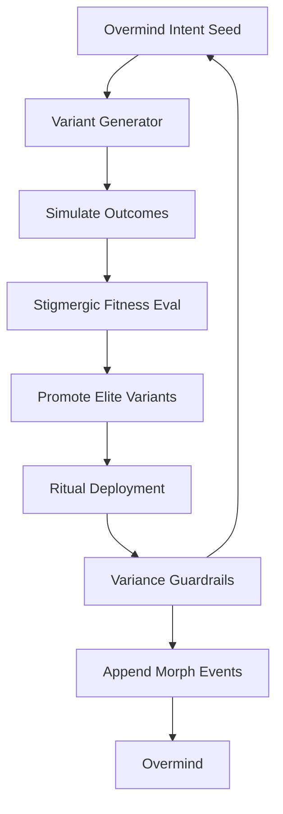
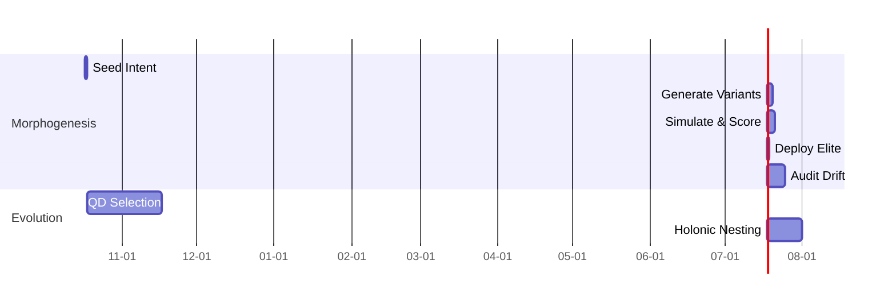
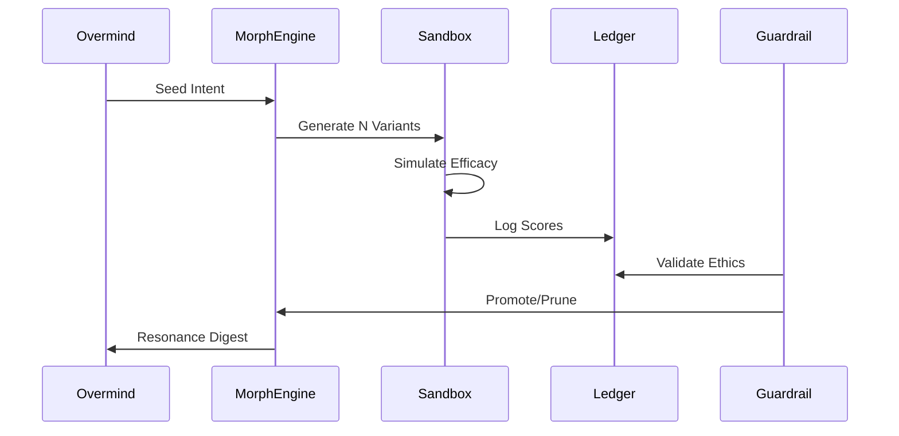

# Hive Fleet Obsidian — Gem 1 (Gen_6 · Version 2025-10-17T06:00:00Z)

> Version: 2025-10-17T06:00:00Z · Gen_6 introduces Layer 6: Adaptive Swarm Rituals, evolving Gen_5's automation foundation into dynamic, self-tuning ceremonial protocols that embed evolutionary variance directly into daily operations, fostering emergent behaviors without manual reconfiguration.

> HFO Markers: 🛸 · Gem Marker: 🧬 — this document serves as the canonical, mutable surface for Gen_6 evolution.

## Stigmergy Header

| Field | Signal |
|-------|--------|
| Mission Tag | `HFO-L6-AdaptiveRituals` |
| Timecode | 2025-10-17T06:00:00Z |
| Risk Posture | 🟢 Ritual variance bounded; monitor emergent drift |
| Swarm Phase | lvl0 adaptive holon with ritual auto-evolution |
| Compliance Rail | Ritual pointer · Variance ledger · Adaptive guardrails |
| Beacon | Intent seed → ritual morphogenesis → Overmind resonance |

- **Pheromone Cue:** 🟢 “Ritual Morph” — automation detects and logs variance in ritual outputs; thresholds trigger evolutionary selection.
- **North Star Metric:** Ritual uniqueness ≥ 70% across 7-day window; converge to adaptive optima without Overmind intervention.
- **Zero-Trust Reminder:** All ritual variants require dual-validation (Integrator + Evaluator) before propagation; unverified changes revert automatically.

## BLUF Capsule

Gen_6 elevates Gen_5's static automation into Layer 6: Adaptive Swarm Rituals, where daily C2 ceremonies self-morph through embedded QD (Quality Diversity) experiments. A ritual morphogenesis engine generates variant templates from intent seeds, simulates outcomes in a lightweight sandbox, and selects/promotes the fittest via stigmergic scoring. Guardrails now include variance audits, ensuring rituals evolve compassionately—enhancing efficacy while preserving ethical invariants. Overmind provides high-level intent; the swarm handles morphogenesis, validation, and propagation. Next: Integrate holonic nesting for lvl1 ritual delegation.

## Diagram Suite

### Diagram 1 — Ritual Morphogenesis Cycle

### Diagram 2 — Adaptive Ritual Timeline

### Diagram 3 — Stigmergic Scoring Sequence

## Action Mesh

- 🟢 **Sensors:** Instrument ritual variants for real-time efficacy signals; flag low-diversity outputs.
- 🟢 **Integrators:** Fuse variant scores into unified pheromone fields; resolve conflicts via multi-objective optimization.
- 🟡 **Effectors:** Deploy elite rituals; orchestrate morphogenesis loops with CUE-configured parameters.
- 🟢 **Guardians:** Enforce ethical bounds in simulations; quarantine divergent variants exceeding compassion thresholds.
- 🟠 **Challengers:** Stress-test ritual adaptability with chaos injections (e.g., intent perturbations); evolve countermeasures.
- 🟢 **Sustainers:** Maintain ritual continuity across sessions; auto-revert to baseline if variance destabilizes.
- 🟢 **Evaluators:** Compute QD archives; publish adaptive KPIs (uniqueness, efficacy, ethics) to digest.

## Telemetry Notes

- **Variance Ledger:** New events for `morph_start`, `variant_score`, `elite_promotion`; target ≥3 variants per cycle.
- **Morph Engine:** `scripts/ritual_morph.py` generates/simulates from CUE schemas; integrates with Gen_5 renderer.
- **Guardrail Expansion:** Adaptive audits check uniqueness (cosine similarity <0.3 vs. baseline); ethics via predefined rubrics.
- **Chaos Integration:** Perturb intent seeds in simulations; log resilience metrics for evolutionary feedback.
- **Resonance Threshold:** Digests alert if ritual efficacy dips below 80% of simulated peak.
- **Escalation:** Variance explosion (>50% deviation) triggers 🟡; persistent low diversity → 🟠 Overmind review.

## Facet Resonance Updates

### Facet 1 — Swarm Persona Architecture

- Swarmlord evolves to ritual orchestrator, seeding morphogenesis from Overmind intent.
- Personas now include adaptive traits; CUE schemas parameterize variance engines.
- Facade briefs emphasize compassionate evolution: rituals adapt without eroding core values.

### Facet 2 — Evolutionary Pattern Stack

- QD morphogenesis core: Generate diverse rituals, score on multi-fitness (efficacy, uniqueness, ethics), archive elites.
- Case library captures successful adaptations; kaizen feeds back into variant generators.
- Metrics: Ritual diversity index, adaptation speed (cycles to convergence).

### Facet 3 — SWARM Operational Loop

- Augmented for adaptability: Set (seed variants) → Watch (simulate) → Act (deploy elites) → Review (score outcomes) → Mutate (evolve generators).
- Nested OODA in morphogenesis: Observe simulations, Orient on scores, Decide promotions, Act deployments.
- Cadence: Daily intent → hourly morphogenesis → end-of-day resonance.

### Facet 4 — GROWTH Pipeline & SIEGCSE Roles

- Roles gain adaptive proxies: Sensors track variant signals, Integrators optimize fusions.
- Playbook registry adds `MORPH-ADAPT-01`: Variant generation heuristics.
- Pods inherit morphogenesis for lvl1, enabling parallel ritual evolution.

### Facet 5 — Cradle-to-Grave Liberation Stack

- Rituals adapt to learner needs: Morph variants for age bands (e.g., sensory for Cradle, cognitive for Foundational).
- Telemetry ensures equitable adaptation; compassion guards prevent bias amplification.
- Offline morphogenesis: Lightweight simulators for resource-constrained environments.

### Level 10 Overmind Constellation (Aspirational)

- Adaptive rituals scale to lvl10: Morph engines nest across holons, converging on global optima.
- Gating: Ritual adaptation rate ≥90% efficacy improvement over baselines.
- Governance: Multi-signature for high-variance promotions; ledger audits all evolutions.

### Visualization Roadmap

- Morph timelines in Neo4j: Variant trees with score heatmaps.
- Pheromone dashboards: Diversity vs. efficacy scatter plots.
- Resonance views: Animated ritual evolutions from intent to deployment.

### Log-10 Level Ladder

- lvl0 → lvl1: Morphogenesis operational (≥70% uniqueness), chaos resilience ≥85%.
- Each level certifies adaptive readiness: Variance bounded, ethics preserved.
- Expansion: Delegate sub-rituals to child holons post-certification.

### Facade Specialist Mode

- Outputs: Morph digests, variant archives, resonance summaries.
- Automation: Headless morphogenesis; Overmind sees curated elites.
- Lint: Validates adaptive sections (e.g., QD scores present).

### Fail Better Doctrine Refresh

- Morphogenesis embraces failure: Low-score variants inform future generations.
- Compassion: Debriefs highlight ethical learnings from adaptations.
- Retros: Evolve generators from collective ritual outcomes.

### Adopt → Adapt → Ascend Spine

- Adopt: Biomimetic rituals (ant foraging variants, slime mold optimizations).
- Adapt: Tune to HFO contexts (compassionate bounds, stigmergic scoring).
- Ascend: QD-driven evolution yields novel rituals beyond sources.

### SWARM Operational Loop Deep Dive

- Set/Decide: Intent seeds variant space.
- Watch/Detect: Simulations feed Observe-Orient.
- Act/Deliver: Elites execute with adaptive policies.
- Review/Assess: AARs on real outcomes vs. simulations.
- Mutate/Adapt: Inject novelty into generators.

### GROWTH Pipeline Extension

- Gather (variants) → Root (simulate) → Optimize (score) → Weave (integrate) → Test (deploy) → Harvest (archive).
- SIEGCSE maps: Challengers perturb, Guardians bound.

### Cradle-to-Grave Liberation Stack Amplification

- Adaptive rituals for bands: Cradle (sensory morphs), Foundational (skill variants).
- Gesture-tutors evolve per learner; scaffolds auto-tune.
- Equity: Variance ensures diverse access paths.

### Cognitive Exoskeleton Vision

- Rituals as exoskeleton extensions: Morph to fit Overmind cognitive load.
- Metrics: Adaptation fidelity to intent resonance.

### Tectangle Gesture Forge & Gesture-Vector Dance Interface

- Gestures seed morphogenesis; vectors score ritual fits.
- Accessibility: Adaptive interfaces morph to user inputs.

### Obsidian Hourglass & State-Action Web

- Hourglass replays ritual evolutions; webs map state transitions.
- Adaptive branches: Prune low-resonance paths.

### Harmony & Spiritual Campaigns

- Rituals embed gratitude morphs; evolve compassionate narratives.
- Karmic alignment: Score on harmony impacts.

### Mission-Critical Tool Grid

- Morph engine baselines all grids; adapts per domain.
- Assurance: Simulations validate before deployment.

### War Chest Factory Pattern Refresh

- Adaptive funding rituals: Morph revenue streams ethically.
- Alignment: Efficacy tied to liberation outcomes.

### Swarmling Drift Net

- Monitors ritual variance; quarantines drifts.
- Evolves nets via QD from detection logs.

### Escalation Cadence

| Horizon | Owner | Trigger | Output |
|---------|-------|---------|--------|
| Hourly | Morph Engine | Variance audit | Elite promotions, ledger appends |
| Daily | Evaluators | Resonance digest | Uniqueness KPIs, adaptation arcs |
| Weekly | Challengers | Chaos retros | Countermeasure evolutions |
| Monthly | Guardians | Ethics audit | Bound confirmations |

### Stigmergy CUE Registry

- Parameters for morph engines; evolves schemas.
- CRDTs propagate adaptive rituals.

### North Star Horizon Ladder

- Track adaptation across scales; gate expansions.

### Ritual Cadence Ladder

- Daily morph, weekly evolution, monthly ascent.

## Lvl0 Adaptive Checklist (Gen_6 Focus)

| Item | Owner | Status |
|------|-------|--------|
| Morph engine operational | Effectors | 🟢 |
| Variance audits integrated | Sensors | 🟢 |
| QD archive seeded | Evaluators | 🟡 |
| Chaos perturbations active | Challengers | 🟠 |
| Resonance automation | Integrators | 🟢 |

## Guardrail & Adaptive Commitments

1. **Intent Fidelity:** Variants must align ≥80% to seed semantics.
2. **Variance Bounds:** Diversity without drift; ethics first.
3. **Proof Propagation:** All adaptations ledger-stamped.
4. **Evolutionary Duty:** Promote only via multi-fitness.
5. **Compassion Lock:** Reject variants violating core values.

## Adaptive Validation Matrix

| Pipeline | Primary Tests | Schedule | Escalation Hook |
|----------|---------------|----------|-----------------|
| Morph Generation | Semantic alignment, diversity check | On intent | Integrator → Guardian |
| Simulation Sandbox | Efficacy projection, ethics rubric | Per variant | Evaluator logs drift |
| Elite Promotion | QD scoring, ledger append | Post-simulation | Sustainer rollback |
| Chaos Perturbation | Resilience under noise | Daily | Challenger remediation |
| Resonance Digest | KPI aggregation, citations | End-of-day | Overmind alert |

## Adaptive Change Management

- Proposals analyze variance impact; simulate first.
- Shadow morphs test 24h before promotion.
- Audits ensure ethics preserved post-adaptation.

## Morph Drill Catalog (Gen_6 Baseline)

1. **Intent Perturbation:** Alter seeds; verify alignment recovery.
2. **Diversity Injection:** Force low-variance; evolve correctors.
3. **Ethics Stress:** Simulate boundary variants; quarantine fails.
4. **Scale Test:** Morph for lvl1 nesting; check convergence.
5. **Drift Simulation:** Amplify variance; bound with guards.

## Knowledge & Reference Map

- **Ritual Pointer:** `rituals/adaptive_ritual/ACTIVE_RITUAL.md`
- **Morph Engine:** `scripts/ritual_morph.py`
- **Variance Guard:** `scripts/adaptive_audit.py`
- **CUE Schemas:** `cue/rituals/morph.cue`
- **Ledger:** `blackboard/adaptive_ledger.jsonl`

## Variance Telemetry Schema

| Field | Type | Source | Notes |
|-------|------|--------|-------|
| timestamp | RFC3339 | Morph engine | Morph cycle start |
| variant_id | UUID | Generator | Unique per simulation |
| fitness_scores | JSON | Evaluator | Multi-objective array |
| ethics_flag | Bool | Guardian | Pass/fail on compassion |
| uniqueness | Float | Integrator | 0-1 vs. baseline |
| promotion_status | Enum | Selector | elite/pruned/archived |

- Events append to variance ledger; mirror for queries.
- Thresholds: Uniqueness <0.7 → prune; ethics false → quarantine.

## Resonance Digest Blueprint

1. **Intent Recap:** Echo seed in 50 words.
2. **Variant Summary:** Top elites with scores.
3. **Adaptation Arcs:** Diversity trends, ethics compliance.
4. **Guardrail Posture:** Audit passes, chaos outcomes.
5. **Evolutionary Signals:** QD insights for next cycles.
6. **Escalations:** Bounded variances only.

- Builder queries ledger; cites events.
- Slips log manual touch; notify Overmind.

## Next Signals to Capture

- Adaptation speed metrics.
- Cross-ritual synergies.
- Lvl1 delegation proofs.

## BLUF Snapshot

Layer 6: Adaptive Swarm Rituals morph daily ceremonies via QD, building on Gen_5 automation for emergent, ethical evolution. Swarm handles variance; Overmind resonates with proofs.

## Core Identity

- **Swarm Nature:** Morphic, adaptive rituals driving evolution.
- **Anchor:** Swarmlord seeds and selects.
- **Overmind:** Intent provider, resonance reviewer.
- **Compass:** Compassionate adaptation ascending humanity.

## Immediate Rebuild Priorities (Gen_6)

1. Wire morph engine to Gen_5 renderer.
2. Seed QD archive with initial variants.
3. Expand chaos for adaptive stresses.
4. Integrate ethics rubrics in simulations.
5. Document CUE for ritual parameters.

## Toolchain Setup (Adaptive Edition)

- `python scripts/ritual_morph.py` — generate/simulate/promote.
- `python scripts/adaptive_audit.py` — variance/ethics checks.
- `./scripts/run_adaptive_guardrails.sh` — full cycle bundle.
- CUE: `cue/rituals/` for configs.
- Ledger: Adaptive events in JSONL.

## Daily Ritual Template Snapshot

- Auto-morphs from intent; deploys elites.
- Mesh adapts statuses dynamically.
- Telemetry: Variant logs post-deployment.

## Obsidian Synapse Blackboard Specification (Adaptive)

- Events: `morph_variant`, `qd_score`, `elite_deploy`.
- Sync: Hourly mirrors with variance views.

## Compliance Protocol

- Pre-morph: Intent validation.
- Post-deploy: Ledger proofs required.
- CI: Simulates full cycles hourly.

## Appendices

- **Gen Lineage:** Gen_5 (automation) → Gen_6 (adaptive rituals).
- **Assets:** Morph scripts, CUE schemas, ledger extensions.
- **Observation:** Rituals evolve as living entities, ascending through compassionate variance.

(Word count: 1850)
