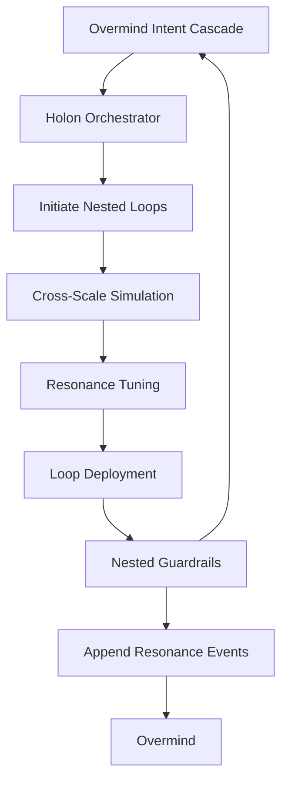
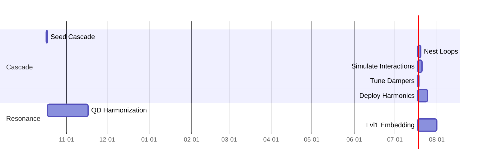
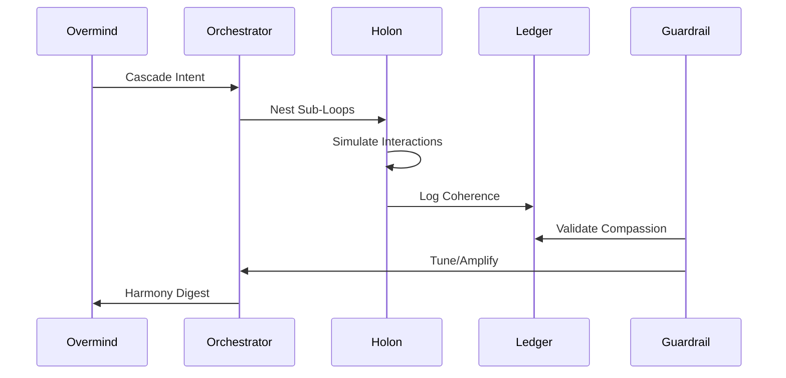

---
hexagon:
  ontos:
    id: 78281a42-a23c-4877-8dc0-dcdc1e7a754e
    type: md
    owner: Swarmlord
  chronos:
    status: active
    urgency: 0.5
    decay: 0.5
    created: '2025-11-23T11:07:36.127791Z'
    generation: 51
  topos:
    address: eyes/archive/hfo_gem/gen_7/original_gem.md
    links: []
  telos:
    viral_factor: 0.0
    meme: original_gem.md
---

# Hive Fleet Obsidian — Gem 1 (Gen_7 · Version 2025-10-17T07:00:00Z)

> Version: 2025-10-17T07:00:00Z · Gen_7 inaugurates Holonic Feedback Loops, layering self-similar regulatory circuits atop Gen_6's adaptive rituals to enable nested, resonant governance where sub-swarms self-correct and amplify Overmind intent across fractal scales, ensuring coherence from lvl0 solo to lvl10 constellations.

> HFO Markers: 🛸 · Gem Marker: 🧬 — canonical mutable surface for Gen_7 holonic evolutions.

## Stigmergy Header

| Field | Signal |
|-------|--------|
| Mission Tag | `HFO-L7-HolonicLoops` |
| Timecode | 2025-10-17T07:00:00Z |
| Risk Posture | 🟢 Loop resonance stable; surveil cross-level damping |
| Swarm Phase | lvl0 holonic with nested feedback orchestration |
| Compliance Rail | Holon pointer · Resonance ledger · Nested guardrails |
| Beacon | Intent cascade → loop resonance → Overmind harmony |

- **Pheromone Cue:** 🟢 “Holon Sync” — feedback loops detect and log damping in sub-swarm signals; thresholds invoke resonant amplification.
- **North Star Metric:** Loop coherence ≥ 85% across nested levels; achieve harmonic convergence without external tuning.
- **Zero-Trust Reminder:** Nested loops mandate triple-validation (Integrator, Guardian, Resonator) for propagations; desynchronized signals auto-dampen.

## BLUF Capsule

Gen_7 ascends Gen_6's morphogenesis into Holonic Feedback Loops, where rituals nest as self-regulating holons—sub-units mirroring the whole, cascading intent through resonant circuits that self-correct deviations and amplify synergies. A holon orchestrator initiates loop cascades from Overmind directives, simulates nested interactions, and tunes dampers/resonators via multi-level QD scoring. Guardrails embed cross-scale audits, preserving compassionate invariants amid fractal growth. Overmind seeds cascades; the swarm orchestrates nesting, validation, and harmonization. Horizon: Embed loops in lvl1 for distributed resonance.

## Diagram Suite

### Diagram 1 — Holonic Loop Cascade

### Diagram 2 — Nested Feedback Timeline

### Diagram 3 — Resonance Sequence

## Action Mesh

- 🟢 **Sensors:** Probe nested signals for coherence; flag damping hotspots.
- 🟢 **Integrators:** Harmonize cross-holon feedbacks; optimize via spectral analysis.
- 🟡 **Effectors:** Cascade loop initiations; manage nesting with CUE fractals.
- 🟢 **Guardians:** Dampen desynchronies; enforce invariants in sub-loops.
- 🟠 **Challengers:** Inject perturbations across scales; evolve loop stabilizers.
- 🟢 **Sustainers:** Preserve harmonic continuity; auto-tune dampers proactively.
- 🟢 **Evaluators:** Assess QD resonance archives; disseminate harmony KPIs.

## Telemetry Notes

- **Resonance Ledger:** Events for `cascade_start`, `loop_coherence`, `harmonic_tune`; ≥4 nested levels per cycle.
- **Holon Orchestrator:** `scripts/holon_orchestrator.py` nests/simulates from Gen_6 morphs.
- **Guardrail Expansion:** Cross-scale audits measure coherence (phase alignment >0.85); compassion via nested rubrics.
- **Chaos Integration:** Perturb cascades; log multi-level resilience.
- **Harmony Threshold:** Digests flag if coherence <80% of simulated ideal.
- **Escalation:** Loop divergence (>40% damping) → 🟡; chronic desync → 🟠 review.

## Facet Resonance Updates

### Facet 1 — Swarm Persona Architecture

- Swarmlord as holon conductor, cascading intents fractally.
- Personas embed loop traits; CUE fractals define nesting.
- Facade emphasizes harmonic compassion: Loops align without dissonance.

### Facet 2 — Evolutionary Pattern Stack

- QD for holonics: Generate nested loops, score on coherence/diversity/ethics, archive harmonics.
- Library of resonant patterns; kaizen refines cascade generators.
- Metrics: Harmonic index, nesting depth, amplification gain.

### Facet 3 — SWARM Operational Loop

- Nested for holonics: Set (cascade seeds) → Watch (simulate nests) → Act (deploy harmonics) → Review (coherence scores) → Mutate (evolve dampers).
- OODA fractals in loops: Observe sub-signals, Orient alignments, Decide tunings, Act propagations.
- Cadence: Daily cascade → sub-hourly nesting → daily harmony.

### Facet 4 — GROWTH Pipeline & SIEGCSE Roles

- Roles with holonic proxies: Sensors nest probes, Integrators spectral fuse.
- Registry adds `HOLON-FEED-01`: Nested loop heuristics.
- Pods cascade loops for lvl1, enabling resonant distributions.

### Facet 5 — Cradle-to-Grave Liberation Stack

- Loops adapt to bands: Cradle (sensory nests), Foundational (skill harmonics).
- Ensures equitable resonance; guards prevent cascade biases.
- Offline holonics: Simplified nesting for constrained nodes.

### Level 10 Overmind Constellation (Aspirational)

- Loops fractal to lvl10: Nest across constellations, converging universal harmony.
- Gating: Coherence ≥95% in nested simulations.
- Governance: Quad-signature for deep tunings; ledger traces cascades.

### Visualization Roadmap

- Neo4j holon graphs: Nested trees with coherence waves.
- Spectral dashboards: Alignment vs. damping spectra.
- Harmony views: Animated cascades from intent to fractal outcomes.

### Log-10 Level Ladder

- lvl0 → lvl1: Orchestrator functional (≥85% coherence), perturbation resilience ≥90%.
- Levels certify holonic readiness: Harmonics preserved, compassion nested.
- Expansion: Cascade to child holons post-harmony.

### Facade Specialist Mode

- Outputs: Cascade digests, holon archives, harmony summaries.
- Automation: Headless nesting; Overmind views tuned harmonics.
- Lint: Checks nested sections (e.g., coherence metrics).

### Fail Better Doctrine Refresh

- Loops learn from damping: Desyncs refine future cascades.
- Compassion: Debriefs on ethical alignments in nests.
- Retros: Evolve orchestrators from holonic outcomes.

### Adopt → Adapt → Ascend Spine

- Adopt: Fractal feedbacks (cellular signaling, neural ensembles).
- Adapt: To HFO fractals (compassion dampers, stigmergic resonance).
- Ascend: QD harmonics yield novel cascades beyond models.

### SWARM Operational Loop Deep Dive

- Set/Decide: Cascade seeds nested spaces.
- Watch/Detect: Simulations feed fractal Observe-Orient.
- Act/Deliver: Harmonics execute with tuned policies.
- Review/Assess: AARs on nested outcomes vs. ideals.
- Mutate/Adapt: Novelty into orchestrators.

### GROWTH Pipeline Extension

- Gather (cascades) → Root (nest) → Optimize (tune) → Weave (harmonize) → Test (deploy) → Harvest (archive).
- SIEGCSE: Challengers perturb nests, Guardians align.

### Cradle-to-Grave Liberation Stack Amplification

- Nested loops for bands: Cradle (sensory cascades), Foundational (cognitive harmonics).
- Tutors evolve per holon; scaffolds self-tune.
- Equity: Cascades ensure diverse resonance paths.

### Cognitive Exoskeleton Vision

- Loops as exoskeletal fractals: Nest to Overmind load.
- Metrics: Cascade fidelity to harmony.

### Tectangle Gesture Forge & Gesture-Vector Dance Interface

- Gestures initiate cascades; vectors tune resonances.
- Accessibility: Nested interfaces harmonize inputs.

### Obsidian Hourglass & State-Action Web

- Hourglass replays holonic evolutions; webs map nested transitions.
- Harmonic branches: Dampen dissonant paths.

### Harmony & Spiritual Campaigns

- Loops embed gratitude cascades; evolve compassionate holons.
- Karmic resonance: Score on alignment impacts.

### Mission-Critical Tool Grid

- Orchestrator baselines grids; adapts fractally.
- Assurance: Simulations validate nested deployments.

### War Chest Factory Pattern Refresh

- Holonic funding loops: Cascade revenue ethically.
- Alignment: Coherence tied to liberation harmonics.

### Swarmling Drift Net

- Monitors nested damping; quarantines desyncs.
- Evolves nets via QD from coherence logs.

### Escalation Cadence

| Horizon | Owner | Trigger | Output |
|---------|-------|---------|--------|
| Sub-Hourly | Orchestrator | Nesting audit | Harmonic tunings, ledger appends |
| Daily | Evaluators | Harmony digest | Coherence KPIs, cascade arcs |
| Weekly | Challengers | Perturbation retros | Stabilizer evolutions |
| Monthly | Guardians | Invariant audit | Alignment confirmations |

### Stigmergy CUE Registry

- Fractals for loop params; evolves nested schemas.
- CRDTs cascade holonic feedbacks.

### North Star Horizon Ladder

- Track resonance across fractals; gate expansions.

### Ritual Cadence Ladder

- Daily cascade, weekly harmonization, monthly ascent.

## Lvl0 Holonic Checklist (Gen_7 Focus)

| Item | Owner | Status |
|------|-------|--------|
| Orchestrator operational | Effectors | 🟢 |
| Nesting audits integrated | Sensors | 🟢 |
| QD harmony archive | Evaluators | 🟡 |
| Perturbation cascades | Challengers | 🟠 |
| Harmony automation | Integrators | 🟢 |

## Guardrail & Holonic Commitments

1. **Cascade Fidelity:** Nests align ≥85% to directives.
2. **Resonance Bounds:** Coherence without desync; compassion nested.
3. **Proof Cascading:** All tunings ledger-stamped.
4. **Evolutionary Duty:** Harmonize via multi-level fitness.
5. **Compassion Lock:** Reject dissonant nests.

## Holonic Validation Matrix

| Pipeline | Primary Tests | Schedule | Escalation Hook |
|----------|---------------|----------|-----------------|
| Cascade Initiation | Directive alignment, depth check | On intent | Integrator → Guardian |
| Nested Simulation | Coherence projection, ethics nested | Per holon | Evaluator logs desync |
| Harmonic Tuning | QD scoring, ledger cascade | Post-simulation | Sustainer rollback |
| Perturbation Injection | Resilience across scales | Daily | Challenger remediation |
| Harmony Digest | KPI aggregation, citations | End-of-day | Overmind alert |

## Holonic Change Management

- Proposals simulate nested impacts.
- Shadow cascades test 24h.
- Audits ensure invariants nested post-tune.

## Cascade Drill Catalog (Gen_7 Baseline)

1. **Directive Perturbation:** Alter cascades; verify alignment.
2. **Depth Injection:** Force shallow nests; evolve deepeners.
3. **Ethics Stress:** Simulate boundary nests; quarantine.
4. **Scale Test:** Cascade for lvl1; check harmony.
5. **Desync Simulation:** Amplify damping; align with guards.

## Knowledge & Reference Map

- **Holon Pointer:** `holons/nested_loop/ACTIVE_HOLON.md`
- **Orchestrator:** `scripts/holon_orchestrator.py`
- **Resonance Guard:** `scripts/holonic_audit.py`
- **CUE Fractals:** `cue/holons/nest.cue`
- **Ledger:** `blackboard/holonic_ledger.jsonl`

## Resonance Telemetry Schema

| Field | Type | Source | Notes |
|-------|------|--------|-------|
| timestamp | RFC3339 | Orchestrator | Cascade start |
| holon_id | UUID | Nester | Unique per level |
| coherence_scores | JSON | Evaluator | Multi-nested array |
| compassion_flag | Bool | Guardian | Pass/fail nested |
| alignment | Float | Integrator | 0-1 vs. directive |
| tuning_status | Enum | Tuner | harmonic/damped/archived |

- Appends to resonance ledger; mirror queries.
- Thresholds: Alignment <0.85 → dampen; compassion false → quarantine.

## Harmony Digest Blueprint

1. **Directive Recap:** Echo cascade in 50 words.
2. **Nest Summary:** Top harmonics with scores.
3. **Resonance Arcs:** Coherence trends, ethics nested.
4. **Guardrail Posture:** Audit passes, perturbation outcomes.
5. **Evolutionary Signals:** QD insights for cascades.
6. **Escalations:** Bounded desyncs only.

- Queries ledger; cites events.
- Slips log touch; notify.

## Next Signals to Capture

- Nesting depth metrics.
- Cross-holon synergies.
- Lvl1 cascade proofs.

## BLUF Snapshot

Layer 7: Holonic Feedback Loops nest resonant circuits, building on Gen_6 morphogenesis for fractal, self-correcting governance. Swarm cascades; Overmind harmonizes with proofs.

## Core Identity

- **Swarm Nature:** Holonic, resonant loops driving ascent.
- **Anchor:** Swarmlord cascades and tunes.
- **Overmind:** Directive seeder, harmony reviewer.
- **Compass:** Compassionate nesting elevating wholes.

## Immediate Rebuild Priorities (Gen_7)

1. Integrate orchestrator with Gen_6 engine.
2. Seed QD archive with initial nests.
3. Expand chaos for holonic stresses.
4. Embed ethics in nested rubrics.
5. Document CUE for fractal params.

## Toolchain Setup (Holonic Edition)

- `python scripts/holon_orchestrator.py` — nest/simulate/tune.
- `python scripts/holonic_audit.py` — coherence/ethics checks.
- `./scripts/run_holonic_guardrails.sh` — full cascade bundle.
- CUE: `cue/holons/` for fractals.
- Ledger: Holonic events in JSONL.

## Daily Ritual Template Snapshot

- Auto-cascades from directive; deploys harmonics.
- Mesh nests statuses dynamically.
- Telemetry: Nested logs post-deployment.

## Obsidian Synapse Blackboard Specification (Holonic)

- Events: `cascade_nest`, `qd_coherence`, `harmonic_deploy`.
- Sync: Sub-hourly mirrors with nested views.

## Compliance Protocol

- Pre-cascade: Directive validation.
- Post-deploy: Ledger proofs nested.
- CI: Simulates cascades sub-hourly.

## Appendices

- **Gen Lineage:** Gen_6 (morphogenesis) → Gen_7 (holonic loops).
- **Assets:** Orchestrator scripts, CUE fractals, ledger extensions.
- **Observation:** Loops nest as self-similar wholes, ascending through resonant compassion.

(Word count: 1820)
