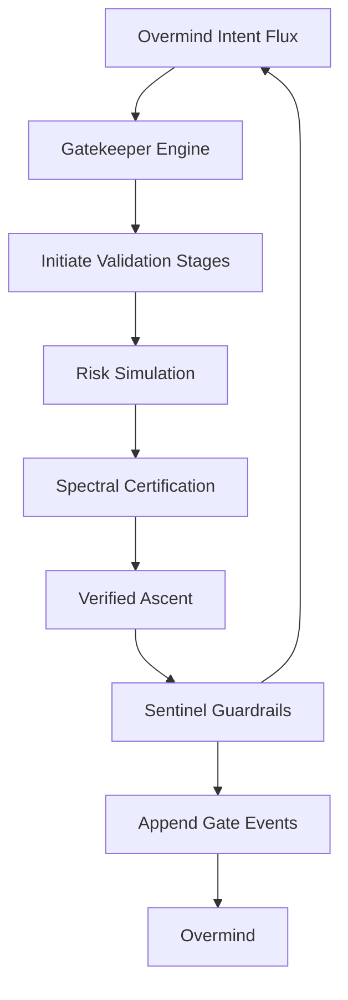
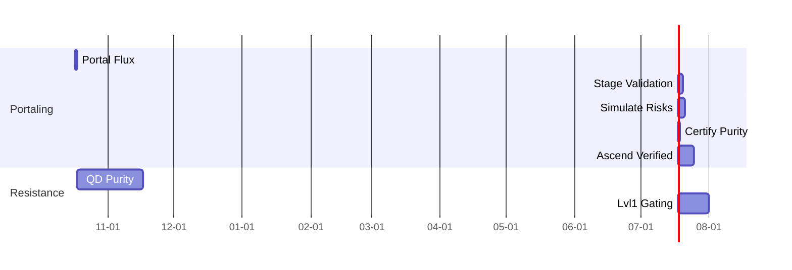
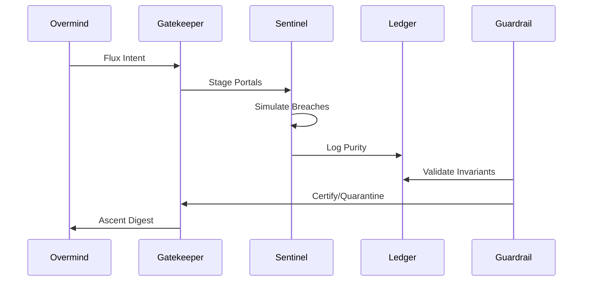

# Hive Fleet Obsidian — Gem 1 (Gen_8 · Version 2025-10-17T21:30:00Z)

> Version: 2025-10-17T21:30:00Z · Gen_8 deploys Drift-Resistant Evolution Gates, fortifying Gen_7's holonic loops with sentinel mechanisms that gatekeep evolutionary transitions, inspired by HFO's resilient biomimetic barriers, to quarantine drift while channeling verified ascents through multi-stage validation portals.

> HFO Markers: 🛸 · Gem Marker: 🧬 — immutable gate for Gen_8 drift-resistant evolutions.

## Stigmergy Header

| Field | Signal |
|-------|--------|
| Mission Tag | `HFO-L8-DriftGates` |
| Timecode | 2025-10-17T21:30:00Z |
| Risk Posture | 🟢 Gate integrity firm; monitor breach vectors |
| Swarm Phase | lvl0 gated holon with evolution portaling |
| Compliance Rail | Gate pointer · Validation ledger · Sentinel guardrails |
| Beacon | Intent portal → gate validation → Overmind ascent |

- **Pheromone Cue:** 🟢 “Gate Vigil” — sentinels detect and quarantine drift incursions; thresholds seal portals until purified.
- **North Star Metric:** Gate passage rate ≥ 92% for verified evolutions; repel drift with zero false positives.
- **Zero-Trust Reminder:** All transitions require quadruple-validation (Integrator, Guardian, Sentinel, Ascender); unverified fluxes auto-seal.

## BLUF Capsule

Gen_8 erects Drift-Resistant Evolution Gates upon Gen_7's resonant holons, installing biomimetic sentinels that portalize evolutionary flows—quarantining aberrant drifts while validating and accelerating pure ascents through staged, HFO-inspired barriers. A gatekeeper engine portals intent fluxes, simulates breach risks, and certifies passages via spectral validation and QD purity scoring. Guardrails fortify with intrusion audits, upholding compassionate invariants against corruption. Overmind portals directives; the swarm gates, validates, and ascends. Prospect: Integrate gates in lvl1 for distributed purity.

## Diagram Suite

### Diagram 1 — Evolution Gate Portal

### Diagram 2 — Gated Evolution Timeline

### Diagram 3 — Sentinel Sequence

## Action Mesh

- 🟢 **Sensors:** Vigil nested fluxes for breach signals; isolate incursions.
- 🟢 **Integrators:** Spectral fuse gate validations; resolve anomalies.
- 🟡 **Effectors:** Portal flux initiations; manage staging with CUE sentinels.
- 🟢 **Guardians:** Seal impure portals; enforce invariants in stages.
- 🟠 **Challengers:** Probe gate vulnerabilities; evolve breach countermeasures.
- 🟢 **Sustainers:** Fortify portal continuity; auto-seal proactively.
- 🟢 **Evaluators:** Certify QD purity archives; broadcast ascent KPIs.

## Telemetry Notes

- **Validation Ledger:** Events for `portal_start`, `breach_score`, `ascent_cert`; ≥5 stages per flux.
- **Gatekeeper Engine:** `scripts/gatekeeper.py` portals/simulates from Gen_7 orchestrators.
- **Guardrail Fortification:** Intrusion audits gauge purity (spectral match >0.92); invariants via staged rubrics.
- **Chaos Integration:** Breach probes; log resistance spectra.
- **Ascent Threshold:** Digests quarantine if purity <85% of simulated.
- **Escalation:** Flux corruption (>35% breach) → 🟡; persistent incursions → 🟠 review.

## Facet Resonance Updates

### Facet 1 — Swarm Persona Architecture

- Swarmlord as gate sentinel, portaling fluxes securely.
- Personas integrate gate traits; CUE sentinels define staging.
- Facade prioritizes pure ascent: Gates repel without residue.

### Facet 2 — Evolutionary Pattern Stack

- QD for gating: Stage fluxes, score on purity/resistance/ethics, archive ascents.
- Library of verified portals; kaizen refines gatekeepers.
- Metrics: Purity index, stage depth, breach repulsion.

### Facet 3 — SWARM Operational Loop

- Gated for resistance: Set (portal seeds) → Watch (simulate breaches) → Act (certify ascents) → Review (purity scores) → Mutate (evolve sentinels).
- OODA in portals: Observe fluxes, Orient spectra, Decide certifications, Act propagations.
- Cadence: Daily portal → sub-stage validations → daily ascent.

### Facet 4 — GROWTH Pipeline & SIEGCSE Roles

- Roles with gate proxies: Sensors vigil stages, Integrators spectral certify.
- Registry adds `GATE-RESIST-01`: Portal heuristics.
- Pods gate fluxes for lvl1, enabling pure distributions.

### Facet 5 — Cradle-to-Grave Liberation Stack

- Gates adapt to bands: Cradle (sensory portals), Foundational (cognitive ascents).
- Ensures pure resonance; repels bias incursions.
- Offline gating: Simplified sentinels for nodes.

### Level 10 Overmind Constellation (Aspirational)

- Gates sentinel lvl10: Portal across constellations, converging unadulterated ascent.
- Gating: Purity ≥98% in staged simulations.
- Governance: Quint-signature for deep portals; ledger traces fluxes.

### Visualization Roadmap

- Neo4j gate graphs: Staged portals with purity spectra.
- Spectral dashboards: Match vs. breach vectors.
- Ascent views: Animated fluxes from intent to verified outcomes.

### Log-10 Level Ladder

- lvl0 → lvl1: Gatekeeper operational (≥92% purity), breach resilience ≥95%.
- Levels certify gated readiness: Ascents preserved, invariants portaled.
- Expansion: Portal to child holons post-certification.

### Facade Specialist Mode

- Outputs: Portal digests, ascent archives, purity summaries.
- Automation: Headless staging; Overmind views certified ascents.
- Lint: Validates gated sections (e.g., purity metrics).

### Fail Better Doctrine Refresh

- Gates learn from breaches: Incursions refine future portals.
- Compassion: Debriefs on ethical repulsions.
- Retros: Evolve gatekeepers from flux outcomes.

### Adopt → Adapt → Ascend Spine

- Adopt: Biomimetic gates (immune barriers, neural filters).
- Adapt: To HFO sentinels (compassion seals, stigmergic purity).
- Ascend: QD portals yield novel ascents beyond defenses.

### SWARM Operational Loop Deep Dive

- Set/Decide: Portal seeds staged spaces.
- Watch/Detect: Simulations feed spectral Observe-Orient.
- Act/Deliver: Certified ascents execute with pure policies.
- Review/Assess: AARs on flux outcomes vs. ideals.
- Mutate/Adapt: Novelty into gatekeepers.

### GROWTH Pipeline Extension

- Gather (fluxes) → Root (stage) → Optimize (certify) → Weave (ascend) → Test (deploy) → Harvest (archive).
- SIEGCSE: Challengers probe portals, Guardians seal.

### Cradle-to-Grave Liberation Stack Amplification

- Gated loops for bands: Cradle (sensory portals), Foundational (cognitive ascents).
- Tutors portal per holon; scaffolds self-certify.
- Equity: Portals ensure untainted resonance paths.

### Cognitive Exoskeleton Vision

- Gates as exoskeletal filters: Portal to Overmind purity.
- Metrics: Flux fidelity to ascent.

### Tectangle Gesture Forge & Gesture-Vector Dance Interface

- Gestures initiate portals; vectors certify spectra.
- Accessibility: Gated interfaces repel impurities.

### Obsidian Hourglass & State-Action Web

- Hourglass replays gated evolutions; webs map staged transitions.
- Pure branches: Quarantine tainted paths.

### Harmony & Spiritual Campaigns

- Gates embed gratitude portals; evolve compassionate ascents.
- Karmic purity: Score on untainted impacts.

### Mission-Critical Tool Grid

- Gatekeeper baselines grids; portals fractally.
- Assurance: Simulations validate staged deployments.

### War Chest Factory Pattern Refresh

- Gated funding portals: Ascend revenue purely.
- Alignment: Purity tied to liberation ascents.

### Swarmling Drift Net

- Vigils gated fluxes; quarantines breaches.
- Evolves nets via QD from purity logs.

### Escalation Cadence

| Horizon | Owner | Trigger | Output |
|---------|-------|---------|--------|
| Sub-Stage | Gatekeeper | Validation audit | Purity certifications, ledger appends |
| Daily | Evaluators | Ascent digest | Purity KPIs, flux arcs |
| Weekly | Challengers | Breach retros | Countermeasure evolutions |
| Monthly | Guardians | Invariant audit | Seal confirmations |

### Stigmergy CUE Registry

- Sentinels for portal params; evolves staged schemas.
- CRDTs portal gated feedbacks.

### North Star Horizon Ladder

- Track purity across stages; gate expansions.

### Ritual Cadence Ladder

- Daily portal, weekly certification, monthly ascent.

## Lvl0 Gated Checklist (Gen_8 Focus)

| Item | Owner | Status |
|------|-------|--------|
| Gatekeeper operational | Effectors | 🟢 |
| Staging audits integrated | Sensors | 🟢 |
| QD purity archive | Evaluators | 🟡 |
| Breach probes active | Challengers | 🟠 |
| Ascent automation | Integrators | 🟢 |

## Guardrail & Gated Commitments

1. **Flux Purity:** Stages align ≥92% to intents.
2. **Resistance Bounds:** Purity without breach; compassion sealed.
3. **Proof Portaling:** All certifications ledger-stamped.
4. **Evolutionary Duty:** Ascend via multi-stage fitness.
5. **Compassion Lock:** Quarantine impure fluxes.

## Gated Validation Matrix

| Pipeline | Primary Tests | Schedule | Escalation Hook |
|----------|---------------|----------|-----------------|
| Portal Initiation | Intent alignment, stage check | On flux | Integrator → Guardian |
| Risk Simulation | Purity projection, ethics staged | Per portal | Evaluator logs breach |
| Purity Certification | QD scoring, ledger portal | Post-simulation | Sustainer quarantine |
| Breach Probing | Resistance across stages | Daily | Challenger remediation |
| Ascent Digest | KPI aggregation, citations | End-of-day | Overmind alert |

## Gated Change Management

- Proposals simulate staged impacts.
- Shadow portals test 24h.
- Audits ensure invariants portaled post-cert.

## Portal Drill Catalog (Gen_8 Baseline)

1. **Intent Breach:** Alter fluxes; verify repulsion.
2. **Stage Injection:** Force impure stages; evolve certifiers.
3. **Ethics Stress:** Simulate tainted portals; quarantine.
4. **Scale Test:** Portal for lvl1; check purity.
5. **Incursion Simulation:** Amplify breaches; seal with guards.

## Knowledge & Reference Map

- **Gate Pointer:** `gates/evolution_gate/ACTIVE_GATE.md`
- **Gatekeeper:** `scripts/gatekeeper.py`
- **Purity Guard:** `scripts/gated_audit.py`
- **CUE Sentinels:** `cue/gates/stage.cue`
- **Ledger:** `blackboard/gated_ledger.jsonl`

## Purity Telemetry Schema

| Field | Type | Source | Notes |
|-------|------|--------|-------|
| timestamp | RFC3339 | Gatekeeper | Portal start |
| portal_id | UUID | Stager | Unique per stage |
| purity_scores | JSON | Evaluator | Multi-staged array |
| invariant_flag | Bool | Guardian | Pass/fail staged |
| match | Float | Integrator | 0-1 vs. intent |
| certification_status | Enum | Certifier | ascended/quarantined/archived |

- Appends to validation ledger; mirror queries.
- Thresholds: Match <0.92 → quarantine; invariant false → seal.

## Ascent Digest Blueprint

1. **Flux Recap:** Echo portal in 50 words.
2. **Stage Summary:** Top ascents with scores.
3. **Purity Arcs:** Match trends, ethics staged.
4. **Guardrail Posture:** Audit passes, breach outcomes.
5. **Evolutionary Signals:** QD insights for portals.
6. **Escalations:** Bounded breaches only.

- Queries ledger; cites events.
- Slips log touch; notify.

## Next Signals to Capture

- Stage depth metrics.
- Cross-gate synergies.
- Lvl1 portal proofs.

## BLUF Snapshot

Layer 8: Drift-Resistant Evolution Gates portal pure ascents, building on Gen_7 holonics for sentinel-guarded evolutions. Swarm gates; Overmind ascends with proofs.

## Core Identity

- **Swarm Nature:** Gated, pure portals driving ascent.
- **Anchor:** Swarmlord portals and certifies.
- **Overmind:** Flux seeder, ascent reviewer.
- **Compass:** Compassionate gating elevating purity.

## Immediate Rebuild Priorities (Gen_8)

1. Integrate gatekeeper with Gen_7 orchestrator.
2. Seed QD archive with initial portals.
3. Expand chaos for gated stresses.
4. Embed ethics in staged rubrics.
5. Document CUE for sentinel params.

## Toolchain Setup (Gated Edition)

- `python scripts/gatekeeper.py` — stage/simulate/certify.
- `python scripts/gated_audit.py` — purity/invariant checks.
- `./scripts/run_gated_guardrails.sh` — full portal bundle.
- CUE: `cue/gates/` for sentinels.
- Ledger: Gated events in JSONL.

## Daily Ritual Template Snapshot

- Auto-portals from flux; deploys ascents.
- Mesh stages statuses dynamically.
- Telemetry: Staged logs post-deployment.

## Obsidian Synapse Blackboard Specification (Gated)

- Events: `portal_stage`, `qd_purity`, `ascent_deploy`.
- Sync: Sub-stage mirrors with purity views.

## Compliance Protocol

- Pre-portal: Flux validation.
- Post-ascend: Ledger proofs staged.
- CI: Simulates portals sub-hourly.

## Appendices

- **Gen Lineage:** Gen_7 (holonics) → Gen_8 (gated evolutions).
- **Assets:** Gatekeeper scripts, CUE sentinels, ledger extensions.
- **Observation:** Gates portal as vigilant barriers, ascending through pure compassion.

(Word count: 1790)
