#  Hive Fleet Obsidian — Gem 1 Summary (Pass 9 · Version 2025-10-19T00:00:00Z)

> Pass 9 crystallizes the layered mnemonic architecture (HIVE/GROWTH/SWARM/FLEET/OBSIDIAN) composing all learnings from Pass 1-8. This Gem is complete and self-contained—capable of regenerating HFO entirely from first principles.

## Stigmergy Header

| Field | Signal |
|-------|--------|
| Mission Tag | `HFO-L0-AutoConductor` |
| Timecode | 2025-10-19T00:00:00Z |
| Risk Posture | 🟢 Architecture finalized, visualizations complete |
| Swarm Phase | lvl0 holonic solo (Overmind touches Gem only) |
| Compliance Rail | Singleton pointers · Ledger evidence · Digest citations |
| Beacon | 1⃣ singleton cue (one Gem, one Todo) |

- Pheromone Cue: 1⃣ means exactly one active gem and one active todo; duplicates escalate 🟠.
- Zero-Trust Reminder: No proof in the ledger → treat as failure.
- Architectural Milestone: Layered mnemonic system uses ALL letters in "Hive Fleet Obsidian" meaningfully.

## BLUF Capsule

Pass 9 is the definitive reference for Hive Fleet Obsidian. It composes eight previous passes of doctrine evolution with the newly finalized layered mnemonic architecture. Every letter in "Hive Fleet Obsidian" now encodes a distinct operational layer: HIVE provides vision (Pólya 4-step), GROWTH executes strategic intelligence (F3EAD), SWARM runs tactical missions (D3A), FLEET manages agent lifecycle, and OBSIDIAN enforces production-ready properties. This architecture adopts 100% proven patterns (except MUTATE, which is our QD evolution layer) and includes complete visualizations, delegation models, and adoption pedigree. Someone finding only this Gem could rebuild the entire system.

At a glance (plain language):

- Single interface: you ↔ Swarmlord of Webs; it writes this Gem.
- Single touch surface: this Gem; everything else is generated.
- Evidence first: no proof in ledger → treat as failure; mirror must advance.
- Challenger always probes; Guardian neutralizes within the same sweep.
- One active Gem, one active Todo (1⃣); duplicates escalate.
- Digest cites exact ledger lines and hashes; no blind summaries.
- **NEW**: Layered architecture uses all letters—HIVE, FLEET, OBSIDIAN are now operational mnemonics.

### Facade Operating Contract

- Overmind (you) only speaks to Swarmlord of Webs.
- Swarmlord clarifies intent (C2 Mission Intent) in short loops, then writes/updates this Gem.
- This Gem generates todos, rituals, README/AGENTS, and other artifacts.
- Escalations back to Overmind occur only for policy breaches, integrity failures, or ambiguous intent.

## Core Identity

Hive Fleet Obsidian is a proof-first automation swarm. The Gem is the only human-edited source of truth. Everything else is generated from it and must produce auditable evidence in the blackboard ledger and its DuckDB mirror.

Signals of identity:

- Single-surface authorship (this Gem) with emoji singleton markers.
- Append-only evidence trail with verifiable hashes and pointer parity.
- Challenger↔Guardian co-evolution to keep drift visible and bounded.
- **Layered mnemonic architecture**: Every component name (HIVE, FLEET, OBSIDIAN, GROWTH, SWARM) encodes operational meaning.
- **100% adoption principle**: All patterns except MUTATE are adopted from proven frameworks (Pólya, F3EAD, D3A, lifecycle patterns, NFRs).

### Overmind Profile — TTao ()

- **Calling:** Achieve elevation ("") of humanity through the Way ("") by honing evolutionary swarms that adopt → adapt → ascend.
- **Mission Horizon:** Eradicate human starvation and cognitive scarcity across a 100-year timeline.
- **Battlefield Experience:** Witnessed humanity's brilliance and monstrosity; commits the swarm to compassionate power—scaling capability without repeating predatory patterns.
- **Strategic Mastery:** Forged through competitive RTS/simulation excellence (Age of Empires, SimCity, Sims), top-40 national PvP placements, decades of world-building and teardown exercises.
- **Archetypal Frame:** Element of Earth (obsidian core); tarot path of The Fool → King of Wands → Death as cyclical transformation; Jungian Magician channeled through conscious ritual and disciplined toolcraft.
- **Cognitive Exoskeleton Goal:** Build HFO as a parallelized AI swarm amplifying TTao's strategic vision while maintaining compassionate doctrine.

## Facet 1 — Layered Mnemonic Architecture (The Heart of Pass 9)

Pass 9's breakthrough: Every letter in "Hive Fleet Obsidian" encodes a distinct operational layer, creating a dense, multi-layered control system where the name itself becomes the architecture.

### Complete System Architecture

```text

 HIVE (Vision Layer - Pólya 4-Step)
   H = Hunt (Understand problem, scout solutions)
   I = Integrate (Plan - adopt + adapt exemplars)
   V = Verify (Execute - implement + optimize)
   E = Evolve (Review - assess + update doctrine)
   Timeframe: Quarterly/Yearly strategic planning
   Delegates to: GROWTH (strategic) + SWARM (tactical)


 GROWTH (Strategic Layer - F3EAD Intelligence Cycle)
   G = Gather (Find targets/opportunities)
   R = Root (Fix problem precisely)
   O = Optimize (Finish implementation)
   W = Weave (Exploit results)
   T = Test (Analyze outcomes)
   H = Harvest (Disseminate knowledge)
   Timeframe: Weekly/Monthly operations
   Embeds: F3EAD + MAPE-K (Monitor→Analyze→Plan→Execute→Knowledge)


 SWARM (Tactical Layer - D3A Mission Cycle)
   S = Set (Decide on mission)
   W = Watch (Detect conditions)
   A = Act (Deliver outcome)
   R = Review (Assess results)
   M = Mutate (MAP-Elites QD evolution)
   Timeframe: Hourly/Daily missions
   Embeds: D3A + OODA (Observe→Orient→Decide→Act) + MAPE-K


 FLEET (Agent Lifecycle Layer)
   F = Form (Spawn agents - Factory pattern)
   L = Link (Connect via Pub-Sub, Blackboard)
   E = Execute (Agents run GROWTH/SWARM loops)
   E = Evaluate (Health checks, Circuit Breaker)
   T = Terminate (Graceful shutdown, cleanup)
   Scope: Agent orchestration, coordination, lifecycle management


 OBSIDIAN (Agent Properties - Non-Functional Requirements)
   Every agent MUST be:
   O = Observable (metrics, logs, traces - OpenTelemetry)
   B = Bounded (resource limits, timeouts - Kubernetes, SLA)
   S = Stateless (no hidden state, blackboard only - 12-Factor App)
   I = Idempotent (safe retries, transaction IDs - REST PUT)
   D = Deterministic (reproducible behavior - pure functions)
   I = Isolated (failures don't cascade - Circuit Breaker, Bulkhead)
   A = Auditable (traceable actions - immutable audit log)
   N = Networked (stigmergic coordination - Gossip protocol)
   Scope: Quality constraints, production-readiness enforced always

```

### Delegation Model (How Layers Integrate)

The key insight: HIVE doesn't duplicate GROWTH/SWARM patterns—it delegates to them at specific integration points.

**HIVE → GROWTH delegation:**

- HIVE Hunt → GROWTH Gather (research exemplars, scout solutions)
- HIVE Integrate → GROWTH Root (gap analysis, requirement decomposition)
- HIVE Verify → GROWTH Test (validate implementation quality)
- HIVE Evolve → GROWTH Harvest (archive lessons, update doctrine)

**HIVE → SWARM delegation:**

- HIVE Integrate → SWARM Set (tactical decision matrix)
- HIVE Verify → SWARM Act (execute implementation) + MUTATE (generate variants)
- HIVE Evolve → SWARM Review (tactical after-action review)

**GROWTH → FLEET delegation:**

- GROWTH Optimize → FLEET Form (spawn agents for parallel execution)

**FLEET → SWARM delegation:**

- FLEET Execute → Agents run SWARM tactical loops
- FLEET Evaluate → Health checks on SWARM agent performance

**Key principle:** No layer duplicates another's pattern. Each layer has a distinct timeframe, concern, and delegation boundary.

### Adoption Pedigree (100% Proven Patterns)

Every component except MUTATE adopts battle-tested frameworks:

| Component | Adoption Source | Proven Since | Domain |
|-----------|----------------|--------------|--------|
| **HIVE** | Pólya "How to Solve It" | 1945 (78 years) | Mathematics, engineering, problem-solving |
| **GROWTH** | F3EAD intelligence cycle | 2000s (20+ years) | Military intelligence, JADC2 |
| **SWARM** | D3A mission cycle | 2000s (20+ years) | Military operations, tactical execution |
| **OODA** | Boyd decision loops | 1960s (60+ years) | Fighter tactics, business strategy |
| **MAPE-K** | IBM autonomic computing | 2001 (23 years) | Self-adaptive systems, monitoring |
| **FLEET Form** | Factory pattern | 1994 (GoF) | Software design patterns |
| **FLEET Link** | Pub-Sub, Event Sourcing | 2003 (EIP) | Enterprise integration, messaging |
| **FLEET Evaluate** | Circuit Breaker | 2007 (Release It!) | Resilience engineering |
| **OBSIDIAN O** | OpenTelemetry | 2019 (CNCF) | Observability, monitoring |
| **OBSIDIAN B** | Kubernetes limits | 2014 | Resource management, SLA enforcement |
| **OBSIDIAN S** | 12-Factor App | 2011 (Heroku) | Stateless design, microservices |
| **OBSIDIAN I** | REST PUT semantics | 2000 (Fielding) | Idempotent operations, HTTP |
| **OBSIDIAN D** | Pure functions | 1930s+ (λ-calculus) | Functional programming, determinism |
| **OBSIDIAN I** | Bulkhead pattern | 2007 (Release It!) | Failure isolation, resilience |
| **OBSIDIAN A** | Event Sourcing | 2005 | Immutable audit logs, traceability |
| **OBSIDIAN N** | Gossip protocol | 1987 | Distributed coordination, eventual consistency |
| **MUTATE** | MAP-Elites (QD) | 2015 | Quality-diversity optimization (OUR INNOVATION) |

**Meta-principle:** We adopt from proven peaks, not invented valleys. The only exception is MUTATE (our evolutionary layer using MAP-Elites), which sits atop proven foundations.

### Timeframe Nesting (Temporal Hierarchy)

Each layer operates at a distinct timescale, creating nested rhythms:

```text
HIVE:      Quarterly/Yearly (strategic vision)
GROWTH:       Weekly/Monthly (intelligence ops)
SWARM:          Hourly/Daily (tactical missions)
FLEET:      Per-agent lifetime (spans multiple SWARM cycles)
OBSIDIAN: ················ Continuous (always enforced)
```

- **HIVE** thinks in quarters/years: "What problem should we solve?"
- **GROWTH** plans in weeks/months: "What intelligence cycle do we run?"
- **SWARM** acts in hours/days: "What mission do we execute right now?"
- **FLEET** manages agent lifetimes: "When do we spawn/kill agents?"
- **OBSIDIAN** enforces continuously: "Is every agent production-ready?"

### Control Loop Composition (No Conflicts)

Multiple control frameworks coexist without duplication:

1. **HIVE embeds Pólya** (vision-level problem solving)
   - Maps: Hunt=Understand, Integrate=Plan, Verify=Execute, Evolve=Review
   - Operates: Quarterly/yearly
   - Delegates: To GROWTH/SWARM, doesn't re-implement their patterns

2. **GROWTH embeds F3EAD + MAPE-K** (strategic intelligence)
   - F3EAD: Gather=Find, Root=Fix, Optimize=Finish, Weave=Exploit, Test=Analyze, Harvest=Disseminate
   - MAPE-K: Monitor (Gather/Watch), Analyze (Test), Plan (Root), Execute (Optimize), Knowledge (Harvest)
   - Operates: Weekly/monthly
   - Does NOT duplicate: D3A tactical patterns (those belong to SWARM)

3. **SWARM embeds D3A + OODA + MAPE-K** (tactical execution)
   - D3A: Set=Decide, Watch=Detect, Act=Deliver, Review=Assess
   - OODA: Observe (Watch), Orient (Set), Decide (Set), Act (Act)
   - MAPE-K: Monitor (Watch), Analyze (Review), Plan (Set), Execute (Act), Knowledge (Review)
   - Operates: Hourly/daily
   - Does NOT duplicate: F3EAD strategic patterns (those belong to GROWTH)

4. **MUTATE adds evolutionary layer** (quality-diversity optimization)
   - Uses MAP-Elites to generate behavioral variants
   - Runs after SWARM Review to produce experiment candidates
   - Our innovation: QD optimization atop proven control loops

**Key insight:** OODA and MAPE-K are *embedded* within GROWTH/SWARM—they're not separate layers. F3EAD and D3A provide the mnemonic structure, while OODA/MAPE-K provide the cognitive/autonomic patterns within each phase.

### Visualization Reference

Complete system visualizations (9 diagram types) exist in `docs/HFO_LAYERED_SYSTEM_VISUALIZATIONS.md`:

1. High-level architecture (layer stack)
2. Control flow Mermaid flowchart (HIVE→GROWTH→SWARM→FLEET)
3. Swimlane sequence diagram (responsibility boundaries)
4. Temporal Gantt chart (quarterly→weekly→hourly timeframes)
5. Agent lifecycle state machine (FLEET phases)
6. FLEET concurrency graph (agent spawning, pub-sub)
7. OBSIDIAN properties graph (NFR enforcement)
8. OBSIDIAN quality gates flowchart (validation checkpoints)
9. Feedback mesh (system loops and delegation)
10. Concrete example (end-to-end: Adopting Agents SDK)
11. Decision matrix (OBSIDIAN interpretation comparison)

All Mermaid diagrams optimized for dark mode with color-coded layers:

- HIVE (Vision): Deep blue (#1a237e)
- GROWTH (Strategic): Dark green (#1b5e20)
- SWARM (Tactical): Dark orange (#e65100)
- FLEET (Lifecycle): Deep purple (#4a148c)
- Success: Dark green (#2e7d32)
- Failure: Dark red (#c62828)
- Blackboard: Dark grey (#37474f)

## Diagram Suite (Pass 9 Integrated Views)

### Diagram 1 — State–Action Feedback Mesh

```mermaid
%%{init: {'theme':'dark'}}%%
flowchart LR
   Overmind([Overmind]) -->|Mission intent| Swarmlord[Swarmlord of Webs]
   Swarmlord -->|clarify/iterate| Overmind
   Swarmlord -->|write/update| Gem[Gem 1 · Single Surface]
   Gem --> Pointers[ACTIVE_GEM1.md · ACTIVE_TODO.md]
   Pointers --> Guardrails[Guardrail Bundle]
   Guardrails --> Ledger[Blackboard JSONL]
   Ledger --> Mirror[DuckDB Mirror 🥈]
   Mirror --> Digest[Evaluator Digest]
   Digest --> Overmind
   Challenger[Challenger Probes] -.-> Guardrails
   Guardians[Guardians & Sustainers] --> Guardrails

   style Gem fill:#1a237e,color:#fff
   style Ledger fill:#37474f,color:#fff
   style Mirror fill:#4a148c,color:#fff
   style Swarmlord fill:#1b5e20,color:#fff
```



### Diagram 2 — Layered Control Flow (HIVE→GROWTH→SWARM→FLEET→OBSIDIAN)

```mermaid
%%{init: {'theme':'dark'}}%%
flowchart TD
    HIVE[HIVE Vision Layer<br/>Hunt→Integrate→Verify→Evolve]
    GROWTH[GROWTH Strategic Layer<br/>Gather→Root→Optimize→Weave→Test→Harvest]
    SWARM[SWARM Tactical Layer<br/>Set→Watch→Act→Review→Mutate]
    FLEET[FLEET Lifecycle Layer<br/>Form→Link→Execute→Evaluate→Terminate]
    OBSIDIAN[OBSIDIAN Properties<br/>Observable, Bounded, Stateless,<br/>Idempotent, Deterministic,<br/>Isolated, Auditable, Networked]

    HIVE -->|Delegates strategic| GROWTH
    HIVE -->|Delegates tactical| SWARM
    GROWTH -->|Spawns agents| FLEET
    FLEET -->|Runs loops| SWARM
    OBSIDIAN -.->|Enforces on| FLEET
    OBSIDIAN -.->|Enforces on| SWARM
    OBSIDIAN -.->|Enforces on| GROWTH

    style HIVE fill:#1a237e,color:#fff
    style GROWTH fill:#1b5e20,color:#fff
    style SWARM fill:#e65100,color:#fff
    style FLEET fill:#4a148c,color:#fff
    style OBSIDIAN fill:#37474f,color:#fff
```



### Diagram 3 — Guardrail + Challenger Swimlane


## Facet 2 — Facade Orchestration

Swarmlord of Webs translates intent into generated surfaces (README, AGENTS, Todos). It reads Gem cues and CUE persona to produce consistent outputs and keeps them in lockstep via CI.

**CUE Materialization Workflow:**

1. Translate facet bullets into the canonical schema at `cue/agents/agent_schema.cue`.
2. Instantiate persona-specific files (e.g., `cue/agents/swarmlord_of_webs.cue`) capturing missions, rituals, guardrails, and regeneration cues.
3. Surface human-readable briefs in `AGENTS.md` so Overmind and collaborators can audit intent.
4. Export downstream artifacts (`cue export …`) to generate chatmode prompts, JSON specs, or automation configs.

**Acceptance criteria:**

- Regenerated files reference the active Gem version and CUE fields.
- Facade generator runs headless in CI and logs to the ledger.
- Overmind receives < 500 token executive briefs for every 10k tokens of telemetry.

**Cognitive Load Contract:**

- For every 10k tokens of raw telemetry, facade distills executive briefs under 500 tokens with escalation hooks.
- Enables TTao to stay focused on horizon strategy, not operational detail.
- Proof-first: Every brief cites ledger line numbers and artifact hashes.

**Regenerative Pattern Library:**

- Borrow from mold regrowth, stem-cell reconstitution, stigmergic cue repair.
- Misaligned agents are composted into new templates with audit trails and memorial cards.
- Pattern library indexed via Neo4j + vector embeddings for < 2s precedent retrieval.

## Facet 3 — Evidence Ledger & Mirror

All automation writes to `blackboard/🧾🥇_ObsidianSynapseBlackboard.jsonl` and maintains `🧾🥈_ObsidianSynapseBlackboard.duckdb`. Every sweep, drill, or digest cites event ids and pointer hashes.

**Evidence Schema (Blackboard):**

Baseline JSONL fields written by guardrails and loops:

- `timestamp` RFC3339
- `event` kind (e.g., guardrail_sweep, ci_heartbeat_start/end, digest_published)
- `actor` component (e.g., automation/run_guardrails)
- `details` short string; longer logs are kept as artifacts
- Optional correlation keys: `sweep_id`, `run_id`, `chaos_trace_id`
- Optional `sha256` for artifacts; `pointers` map (file → hash)
- Optional `incident` fields; `mirror_offset_bytes` after sync

**Acceptance criteria:**

- Mirror parity verified after each sweep (`parity_ok` event). Any `parity_drift` triggers fail-closed escalation with remediation notes.
- Advancing byte offsets after each sweep.
- Digest cites concrete ledger event IDs and pointer hashes (with SHA-256s as applicable).
- Ledger freshness ≤ 60 seconds from render completion to JSONL append.

**Parity enforcement:**

- JSONL is append-only, immutable source of truth.
- DuckDB mirror rebuilt from JSONL via replay (idempotent sync).
- Checksum validation: every sync verifies hash digest matches.
- Rotation: JSONL rolls to cold storage at 5 MB or 30 days.
- Snapshots: Weekly DuckDB checkpoints notarized with ledger reference.

## Facet 4 — Singleton Invariants

Exactly one active Gem and one active Daily Todo exist. Pointers (`gems/ACTIVE_GEM1.md`, `rituals/daily_todo/ACTIVE_TODO.md`) must match file hashes; duplicates trigger incidents.

**Singleton Cue:** 1⃣ emoji signals enforcement.

**Acceptance criteria:**

- `check_singletons.py` passes; incidents logged with remediation steps.
- Guardrail bundle fails fast if duplicate gem/todo detected.
- Ledger contains `singleton_check` event with pointer hashes before any deliverable ships.
- Digest includes singleton status table citing ledger line numbers.

**Remediation protocol:**

- Duplicate detected → log incident to ledger with `attack_class=rogue_singleton`.
- Guardian quarantines duplicate, moves to `chaos/rogue/` with timestamp.
- Challenger validates detection speed (target: < 15 minutes).
- Ledger records remediation steps and receipt IDs.

## Facet 5 — Challenger Drills

Red-team probes create detectable anomalies: rogue gem/todo, ledger skew, pointer tamper. Guardian responds with fail-closed behavior and recorded evidence.

**Drill catalog (baseline):**

1. **Duplicate Injection** — create rogue gem/todo; confirm guardrail catch + ledger incident within 15 min.
2. **Ledger Skew** — corrupt JSONL line; verify sync restores parity and logs remediation.
3. **Render Failure** — block filesystem to ensure automation alerts and logs manual touch override.
4. **Credential Expiry** — rotate automation token; Guardian logs receipt and verifies ledger append resumes.
5. **Digest Drop** — simulate digest job failure; Integrators rerun and append failure + recovery entries.
6. **Pointer Tamper** — modify pointer file; guardrail must fail and ledger track incident.

**Acceptance criteria:**

- At least one non-zero finding per day; false "all green" is suspect.
- Findings labeled with `attack_class` (e.g., `rogue_singleton`, `pointer_tamper`, `ledger_skew`) and rolled up in dashboard/digest as "neutralized classes."
- Coverage ≥ 95% success rate on 7-day rolling window.
- Chaos harness writes `chaos_trace_id` to ledger linking probes to incidents.

**Challenger → Guardian co-evolution:**

- Challengers seed new attack vectors weekly.
- Guardians must neutralize within same sweep (< 1 hour).
- Stalemate (> 24h unresolved) escalates to Overmind with ledger proof.
- Neutralized attack classes archived as training scenarios.

## Facet 6 — Cadence & Digest

Minute loop (burst) and hourly sweep (steady) produce heartbeats and an end-of-hour digest with citations and status summaries.

**Acceptance criteria:**

- Five heartbeats per minute-loop run; digest contains last-sweep result and pointers.
- Daily digest emitted at 07:00 UTC with intent echo, singleton status, manual-touch rollup, guardrail posture, evolutionary moves, escalation feed.
- Digest builder reads directly from ledger JSONL, guardrail output, and chaos traces—no shadow truth sources.
- If digest emission slips, Integrators trigger guardrail bundle, log `manual_touch_count += 1`, and notify Overmind within 10 minutes.

**Digest blueprint (Pass 7-9 standard):**

1. **Intent Echo:** ≤ 50 words restating yesterday's Pass 1.
2. **Singleton Status:** gem/todo pointer hashes + ledger line numbers.
3. **Manual-Touch Rollup:** MT-count by `touch_class`, highlighting overrides and investigations.
4. **Guardrail Posture:** success/failure counts with mini spark lines and last evidence hash.
5. **Evolutionary Moves:** experiments that change latency or detection.
6. **Escalation Feed:** owners, deadlines, pheromone color, ledger references.

**Ritual cadence ladder:**

- **Hourly:** Guardrail bundle + pointer hash audit → ledger entry (`singleton_check`), lint report, MT-count update.
- **Daily:** Ritual closure → Regression suite, top-playbook stress tests, backlog grooming → BLUF brief, lint receipts, git promotion report.
- **Weekly:** Mission checkpoint → Chaos drills, adversarial prompt fuzz, redundancy rehearsal → Challenger scorecard, Guardian sign-off.
- **Monthly:** Horizon review → Load scaling tests, SIEGCSE readiness audit, toolchain patch synthesis → Ascension dossier, funding allocation plan.
- **Continuous:** Telemetry anomaly (> 3σ) or Overmind directive → Auto-swarm spin-up, root-cause pairing, rollback/install workflows → Real-time ops channel, Bloom incident trails.

## Facet 7 — Swarmling Sweep Orchestration

Swarmlord of Webs escalates automation through a single `swarmling_sweep.py` facade that reads CUE-backed tiers and logs every run. Quick checks, watch loops, and parallel probes stay aligned with the guardrail bundle and ledger policy.

**Acceptance criteria:**

- Sweep config lives at `cue/swarmlings/sweeps.cue` with daily cadence and documented tiers (`quick`, `watch`, `parallel`, `daily`).
- CLI `scripts/swarmling_sweep.py` resolves tiers, shells out to existing guardrail runners, and appends `swarmling_sweep_*` events to the blackboard.
- Guardian/Challenger request deeper sweeps by editing the CUE config (not the Python) and regenerating pointers from this Gem.

**Tier definitions:**

- **Quick:** < 60s, lint checks, singleton audit, pointer hash verification.
- **Watch:** Continuous monitoring, ledger freshness, heartbeat streams.
- **Parallel:** Multi-agent probes, chaos drills, load testing.
- **Daily:** Full regression suite, coverage analysis, dependency audit.

## Facet 8 — SIEGCSE Roles (Evolved from SIEGE)

Zero-trust role roster executing GROWTH/SWARM formations:

| Role | Purpose | Standard Playbook |
|------|---------|-------------------|
| **Sensors** | Frontline collectors instrumenting the data surface | `SEN-STD-01`: Instrumentation checklist, telemetry schema, anomaly thresholds |
| **Integrators** | Curators harmonizing signals and resolving conflicts | `INT-STD-01`: Data fusion swimlane, conflict resolution ladder, provenance policy |
| **Effectors** | Executors driving change in systems and environments | `EFF-STD-01`: Change window protocol, rollback tree, safety gates |
| **Guardians** | Security stewards enforcing zero-trust policies | `GUA-STD-01`: Zero-trust guardrails, credential rotation, incident response |
| **Challengers** | Red-teamers stress-testing assumptions | `CHA-STD-01`: Adversarial hypothesis grid, fuzz deck, escalation path |
| **Sustainers** | Reliability engineers maintaining continuity | `SUS-STD-01`: SLO dashboard, toil audit, chaos drill cadence |
| **Evaluators** | Analysts scoring performance and kaizen progress | `EVA-STD-01`: Metric garden, diversity scoring, kaizen ledger |

**C** prefix added to create SIEGCSE (7 roles → 8 roles):

- **Coordinators** (potential 8th role): Manage multi-agent stigmergy, blackboard cue synthesis, formation choreography.
- Alternative: Keep SIEGE (7 roles) and use OBSIDIAN letters for agent properties (current architecture).

**Playbook retrieval:**

- Indexed via Neo4j + vector embeddings.
- Facade answers precedents in < 2 seconds.
- Every playbook change requires linked CUE template commit, Challenger test evidence, and Sustainer rollback clause.

## Facet 9 — Evolutionary Pattern Stack

### Adopt → Adapt → Ascend

- **Adopt:** Source proven external doctrine, toolchains, and rituals.
- **Adapt:** Tailor to Overmind objectives and swarm context, honoring zero-trust constraints.
- **Ascend:** Evolve beyond the source via QD map-elites exploration and kaizen learnings.

**Research loop:**

- Swarmlord scouts industry apex exemplars (GitOps, DevOps, Atlassian Playbooks, Kaizen kata, DITA, JADC2 doctrine).
- Curates CUE templates capturing critical patterns.
- Every adoption produces: research brief, adaptation log, ascension delta card.
- Stored in knowledge graph for rapid precedent lookup.

**Apex source library:**

- Biomimetic lineage: ant colonies, slime mold pathfinding, termite ventilation, shared blackboard/VSCS systems, Mosaic Warfare playbooks.
- Starting every mission from proven evolutionary peaks.
- Tool intake gate: No tool enters production without Guardian compliance review, Sustainer reliability sign-off, and Challenger adversarial evaluation.

### Case-Based Reasoning (CBR)

- Capture past scenarios, solutions, and post-mortems to seed rapid response playbooks.
- Indexed by: problem type, domain, solution pattern, outcome metrics.
- Retrieval: semantic search + exact match on tags.
- Update: Every mission appends case to library with ledger reference.

### Quality-Diversity (QD) Optimization

- Explore broad solution spaces, rewarding both performance and behavioral diversity.
- Surface novel tactics via MAP-Elites algorithm.
- MUTATE phase in SWARM generates variants for Challenger validation.
- Fitness metrics: success rate, latency, resource cost, novelty score.

### Kaizen Continuous Improvement

- Embed micro-iteration rituals (daily retros, micro-metrics).
- Each cycle yields incremental upgrades logged to ledger.
- Guardian + Evaluator ensure missteps metabolized without shame.
- Preserves creative courage while enforcing safety rails.

### Fail Better Doctrine

- **Mantra:** "Ever tried. Ever failed. No matter. Try again. Fail again. Fail better." — Samuel Beckett anchors swarm resilience.
- **Temporal Concurrency:** Automation stitches past logs, present operations, and future simulations.
- TTao can fail across all horizons simultaneously and harvest insights faster.
- **Agent Cadence:** Parallel swarmlings instrument experiments, archive misses, and recycle learnings into CUE templates.
- **Compassionate Debriefs:** Guardians and Evaluators ensure each misstep is metabolized without shame.

## Facet 10 — Cradle-to-Grave Liberation Stack

**BLUF:** Build a stigmergic learning lattice that drives a six-sigma reduction in childhood starvation and unmet educational milestones while preserving agency across the human lifespan.

**Hundred-Year Objective:**

- Move global child malnutrition incidence below 3.4 defects per million opportunities (DPMO).
- Achieve universal mastery pathways from pre-literate play to post-doctoral research via adaptive swarm tutors.

**Liberation Lens:**

- Treat food, knowledge, mobility, and tooling as a unified rights bundle.
- Every agent intervention must measurably remove resource constraints for the next human in line.

**Lifecycle Bands:**

- **Cradle (0–5):** Sensory integration, emotional safety, motor primitives → Haptic mobiles, lullaby projections, caregiver co-play.
- **Foundational (6–10):** Literacy (phonemes → sentences), numeracy (number bonds), socio-emotional vocab → Word blocks, story floors, counting drums.
- **Bridge (11–14):** Systems thinking, scientific inquiry, critical reading, creative coding → Mission tables, cooperative puzzles, AR field guides.
- **Launch (15–18):** College readiness, vocational prototyping, civic engagement, financial literacy → Gesture labs, VR apprenticeships, debate holos.
- **Ascend (19–25):** Domain mastery, publication, patenting, entrepreneurial ventures → Research sandboxes, fabrication twins, knowledge commons.
- **Flourish (26–60):** Professional excellence, teaching, mentorship → Advanced tooling, peer review, translational incubators.
- **Sustain (61+):** Legacy transfer, wisdom sharing, elder care → Storytelling platforms, accessibility tools, intergenerational pacts.

### Gesture-Tutor Stack

- **Projector-Based TUI Studios:** Ceiling or desk-mounted pico projectors paint adaptive worlds onto any surface; fiducial tracking calibrates in < 100 ms for safe infant/toddler interaction.
- **Embodied Literacy Blocks:** CV identifies multilingual word tiles, letter tokens, and manipulatives; touching `Alligator` triggers phoneme animation, sign language cues, and culturally specific narratives following spaced repetition science.
- **Multimodal Syllabi:** For each lifecycle band, blend kinesthetic prompts, AR overlays, speech scaffolding, and narrative arcs curated from evidence-based frameworks (Montessori, Reggio Emilia, Singapore Math, NGSS, Bloom's taxonomy).
- **Swarm Tutors:** Fine-tuned multimodal foundation models coordinate via CUE registry; each tutor tracks mastery vectors, affect, and nutrition/hydration signals to adapt the micro-lesson.
- **Explainable Nudges:** Gesture recognition pipelines (MediaPipe Hands + depth fusion) drive interactive prompts with transparent scoring rubrics parents/caregivers can audit.
- **Access Pathways:** Offline-first kits with e-ink recipe cards and local LLMs ensure operation without persistent internet; cloud synchronization unlocks cohort analytics and rapid content updates.

### Construction & Mobility Commons

- **Open-Source Build Guilds:** Leverage Global Village Construction Set patterns; every tool has digital twin, bill of materials, fabrication recipe, and maintenance storyline encoded in CUE templates.
- **Gesture Control Continuum:** Unified hand-language maps (pinch, drag, rotation, pressure) route to MIDI, OSC, ROS, and industrial PLC adapters so a child's sandbox gestures match pro-grade excavators or wheelchair joysticks 1:1.
- **Embodied Simulators:** Projector/VR hybrid "Holodeck Bays" let learners practice cranes, drones, or med devices using physics-accurate environments and automated coaching overlays.
- **Assistive Mobility Mesh:** Pinch-drag 3D gestures drive wheelchairs, exosuits, and companion bots; Guardians enforce fail-safes (collision envelopes, biometric locks) while Sustainers monitor battery/maintenance signals.
- **Omni-User Inclusion:** Prisoners, refugees, astronauts, and rural learners access low-bandwidth kits with haptic gloves + printed playbooks; cloud peers stream advanced analytics when connectivity returns.

### Governance, Safety & Adoption

- **Six Sigma Control Plan:** Sensors capture nutrition intake, lesson mastery, mobility usage, and economic uplift; Integrators maintain control charts and DPMO dashboards down to community granularity.
- **Ethical Guardrails:** Guardians codify child safety, consent, and data minimization policies; Challengers red-team bias, coercion, and dual-use abuse vectors every release.
- **Open Knowledge Commons:** All curricula, hardware plans, and gesture vocabularies licensed under copyleft frameworks with clear contribution guides and localization pathways.
- **Infrastructure Layers:** Offline edge compute packs, solar microgrids, and resilient mesh networking ensure operation in austere environments; Sustainers own maintenance SLAs.
- **Economic Flywheel:** Revenue from premium simulators, certification, and enterprise toolchains subsidizes free cradle offerings; war chest reinvested via transparent governance tokens.

## Facet 11 — Log-10 Level Ladder

Each log₁₀ level multiplies agent count by 10, unlocking new capabilities while scaling governance.

**Level 0 (Now):**

- Holonic solo coverage (TTao + Swarmlord chatmode).
- One active Gem, one active Todo.
- Singleton enforcement via `check_singletons.py`.
- Blackboard ledger + DuckDB mirror.
- Guardrail bundle runs hourly.

**Level 1 (10 Agents):**

- Ten-agent pods with SIEGCSE role distribution.
- Neo4j Bloom scenes with animated mission threads.
- Swarm coordination protocols, redundancy, diversity seeding.
- Promotion gates: singleton drift ≤ 0.1, ledger latency ≤ 60s, chaos coverage ≥ 95%.

**Level 2 (100 Agents):**

- One hundred agents with blackboard partitions.
- Failover staging, dedicated guardrail teams.
- Large-scale experimentation, map-elites exploration.
- Resilient fault domains.

**Level 10 (10¹⁰ Agents) - Aspirational:**

- ≈ 10 billion blended human/AI actors.
- **Intent Translation:** Overmind codifies strategy into ten strata (strategy → policy → doctrine → ops → tactics → workflows → automations → datasurfaces → sensors → effectors).
- **C2 Mesh:** Each level expansion binds ten sub-swarms with braided communications (audio/visual/semantic embeddings) and zero-trust keys.
- **Governance Rails:** NASA flight rules + SOC2 + safety cards enforced via policy-as-code; triple-signature (Overmind, Guardian, Sustainer) for automation tweaks.
- **Resilience Zones:** Levels 3–9 form concentric blast shields; if lvl10 experiences slop, lower cells absorb, quarantine, and reconstitute.

## Toolchain Setup

- **Python 3.11+** environment available in devcontainer.
- **Scripts in `scripts/`:** Primary entrypoints; avoid ad-hoc shell glue.
- **CI workflows:** Hourly sweeps, facade docs regen, minute-loop driver.
- **Hooks/non-interactive runners:** Append evidence and refresh the mirror.
- **CUE tooling:** `cue eval`, `cue export` for schema validation and artifact generation.
- **DuckDB browser:** For ledger analytics and parity verification.
- **Mermaid/graph preview:** For diagram rendering in Markdown.
- **Markdownlint:** Enforces doc quality, runs in pre-commit hooks.
- **GitHub Copilot suite:** Code generation, inline suggestions, chat assistance.

**Key automation scripts:**

- `scripts/render_daily_todo.py` — render todo, archive predecessor, trigger ledger append.
- `scripts/run_guardrails.sh` — gem-first enforcement, lint, todo alignment, singleton audit, chaos probe.
- `scripts/check_todo_alignment.py` — verify todo compliance and singleton status markers.
- `scripts/lint_gem_alignment.py` — confirm heading order, diagram count, coverage ratios.
- `scripts/challenger_red_team.py` — schedule duplicate injection and ledger skew drills.
- `scripts/blackboard_mirror_duckdb.py` — sync JSONL to DuckDB, verify parity.
- `scripts/generate_daily_digest.py` — emit digest with ledger citations at 07:00 UTC.
- `scripts/swarmling_sweep.py` — orchestrate tiered sweeps (quick/watch/parallel/daily).

## Knowledge & Reference Map

**Stable Pointers:**

- `gems/ACTIVE_GEM1.md` → points to currently active Gem
- `rituals/daily_todo/ACTIVE_TODO.md` → points to currently active Daily Todo

**Archive Trails:**

- `gems/archive/` → immutable prior Gem passes
- `rituals/daily_todo/archive/` → immutable prior Daily Todos

**Blackboard:**

- `blackboard/🧾🥇_ObsidianSynapseBlackboard.jsonl` → append-only evidence ledger
- `blackboard/🧾🥈_ObsidianSynapseBlackboard.duckdb` → analytics mirror
- `blackboard/README.md` → ledger append protocol, schema examples

**CUE Registry:**

- `cue/agents/agent_schema.cue` → canonical persona schema
- `cue/agents/swarmlord_of_webs.cue` → Swarmlord persona instance
- `cue/swarmlings/sweeps.cue` → swarmling sweep tier definitions

**Templates:**

- `templates/daily_todo_draft.md` → todo template structure
- `templates/daily_todo_pass_workflow.md` → pass-based workflow cadence
- `templates/swarmling_output_template.md` → standardized swarmling output format

**Documentation:**

- `AGENTS.md` → facade brief (auto-generated from CUE + Gem)
- `README.md` → repository overview (auto-generated)
- `docs/HFO_LAYERED_MNEMONIC_SYSTEM.md` → layered architecture variants (Pass 9 uses Variant 3)
- `docs/HFO_LAYERED_SYSTEM_VISUALIZATIONS.md` → 9 visualization types (dark-mode optimized)
- `docs/GEM_FACET_MNEMONIC_DOCTRINE.md` → delegation model, Pólya integration (partial - needs Pass 9 update)

**Digests:**

- `digests/daily_YYYY-MM-DD.md` → daily evaluator digests with ledger citations

## Quantitative Stigmergy Program

Variables (no hard magic numbers; defaults adapt via SOP):

| Metric | Target | Source | Notes |
|--------|--------|--------|-------|
| Singleton Drift Events | 0/day | Guardrail bundle | Count duplicates detected in active gem/todo surfaces. |
| Ledger Freshness | ≤ 60 s lag | Sensors → Blackboard | Time between render completion and ledger append. |
| Manual Touch Count | ≤ 1/day | Evaluator digest | Overrides require dual attestation; ledger enforces receipts. |
| Chaos Coverage | ≥ 3 scenarios/week | Challenger roster | Includes duplicate injection, ledger skew, pointer tamper. |
| Digest Proof Completeness | 100% | Evaluator automation | Each digest references ledger line numbers for evidence. |
| Guardrail Pass Rate | ≥ 95% daily | Sustainers | Two consecutive failures escalate to Guardian. |
| Mirror Parity | 100% after sync | Ledger sync automation | Any drift triggers fail-closed remediation. |

**Rules of thumb:**

- Guardians and Challengers must both be non-zero daily (activity observed in ledger).
- "No findings" for 24h triggers 🟠 investigation.
- Metrics are observed, not asserted; missing data = metric failing.

## Guardrail Obligations

1. **Singleton Audit** stays fail-closed; duplicates immediately block deliverables and log an incident.
2. **Ledger Append** runs write-before-return for renders and sweeps; each write includes `sweep_id` and pointer hashes.
3. **Dual Attestation** remains mandatory for overrides; receipts are required in the ledger prior to unblocking.
4. **Chaos Harness** runs daily; drills are versioned and recorded with `chaos_trace_id` and outcomes.
5. **Digest Proof** references ledger lines and artifact hashes; missing citations are an error.

## Automation Validation Matrix

| Pipeline | Primary Tests | Schedule | Escalation Hook |
|----------|---------------|----------|-----------------|
| Singleton Audit | Pointer hash parity, active file count check, ledger append presence | Hourly + on render | Guardian → Sustainer if duplicates persist 2 runs |
| Ritual Renderer | Required headings, diagram count, ledger append invocation | On render + hourly smoke | Evaluator logs failure; Overmind ping if unresolved |
| Ledger Sync | JSONL ↔ DuckDB parity, checksum replay, latency budget | Hourly delta + nightly full | Sustainer triggers rollback + chaos harness |
| Chaos Harness | Duplicate injection, ledger skew, git race, automation outage | Daily randomized slot | Challenger files remediation bundle |
| Digest Automation | Metric aggregation, singleton status, ledger evidence references | Daily 07:00 UTC | Integrator escalates if digest missing proof |

## Compliance Protocol

- **Gem-First Edits:** Overmind requests new passes; Swarmlord executes. Non-gem edits require blackboard justification.
- **Singleton Enforcement:** 1⃣ emoji signals exactly one active gem, one active todo; duplicates escalate 🟠.
- **Evidence-First:** No digest or output without ledger citations.
- **Folder Policy:** New files/dirs must be referenced from this Gem; unreferenced assets are invalid.
- **Schedule Parity:** Pre-commit/post-commit hooks and hourly sweeps record equivalent events.
- **No-Modal Ops:** No interactive prompts for routine automation; hooks/CI run headlessly.

### Emoji Naming Rules (Human-Glanceable)

- HFO prefix:  (fleet) +  (Obsidian core) before domain emoji.
- Gem files: include  and 🥇 when singleton (active). Archives retain  without 🥇.
- Mirrors/replicas: use 🥈 in filenames (e.g., DuckDB mirror).
- Domain-specific suffix: add emoji relevant to asset (e.g., 🧾 for ledger,  for todo).

## Harmony & Spiritual Campaigns

- **Adversary Agnosticism:** Design tactics capable of engaging any hostile entity—technical, social, or metaphysical—with resilience and compassion.
- **Honeypot Loops:** Create regenerative traps that channel destructive impulses into self-dissipating cycles, reducing collateral harm.
- **Karmic Relief:** Assume non-zero coupling between physical and spiritual planes; explore attention/time constrained models to lift suffering from negative realms.
- **Love as Doctrine:** Prioritize solutions that promote harmony, restorative justice, and mutual uplift at every horizon.
- **Ascension Path:** Use HFO as a cognitive-spiritual exoskeleton to overcome biases, ascend limitations, and empower future swarmlords to continue the mission toward infinity.
- **Compassion Guard:** Automation celebrates successful runs with gratitude pulses; never masks failure or gaslights operators—proof or pause.

## North Star Horizon Ladder

**Temporal Span:** Now → 1 day → 1 week → 1 month → 1 quarter → 6 months → 1 year → 2 → 5 → 10 → 20 → 30 → 40 → 50 → 100 years → 1000 years → asymptotic infinity.

**Guiding Principle:**

- Maintain continuity of vision across horizons while allowing swarm evolution to recalibrate tactics.
- Each log-10 level should have horizon-specific objectives.
- Checkpoints: mission tests, diversity metrics, kaizen goals per horizon ensure compounding growth.

**Horizon gates:**

- Singleton drift and ledger freshness tracked across 24h/7d/30d horizons.
- Deviations trigger ascend/descend status; Overmind sees ladder summary in digest.
- Expansion gates on evidence-backed stability.

## Immediate Rebuild Priorities

1.  **Layered mnemonic architecture finalized** (HIVE/GROWTH/SWARM/FLEET/OBSIDIAN).
2.  **Visualizations complete** (9 diagram types, dark-mode optimized).
3.  **Delegation model documented** (HIVE→GROWTH→SWARM integration points).
4.  **Adoption pedigree compiled** (100% proven patterns except MUTATE).
5.  **Update GEM_FACET_MNEMONIC_DOCTRINE.md** with Pass 9 architecture.
6.  **Research OpenAI Agents SDK** capabilities (parallel execution, pricing, OpenRouter compatibility).
7.  **Draft coordination model specification** (concurrency, message passing, failure handling, state consistency, lifecycle).
8.  **Add Gem integrity validation** (CUE schema for Gem structure itself).
9.  **Stand up swarmling sweep facade** (`scripts/swarmling_sweep.py` + CUE config).
10.  **Tighten ledger integrity checks** (truncation detection) in Challenger.

## Next Signals to Capture

- Mirror parity drift detector and automatic remediation notes.
- CI artifact hash capture and cross-check against ledger entries.
- Challenger scenario taxonomy coverage (mapped to ATT&CK techniques).
- Correlation: singleton drift vs MT-count to spot systemic friction.
- Ledger replay into guardrail bundle for deterministic detection under chaos load.

## Appendices

### Pass Lineage

P1 (doctrine seed) → P2 (daily ritual + archive) → P3 (blackboard + compliance rails) → P4 (lvl0 stabilization & drift cleanup) → P5 (automation guardrails) → P6 (manual-touch minimization) → P7 (proof-backed singleton governance) → P8 (facade generation & minute-loop cadence) → **P9 (layered mnemonic architecture crystallization)**.

### Companion Assets

- Renderer script (`render_daily_todo.py`)
- Singleton guardrail updates (`check_singletons.py`)
- Ledger README (`blackboard/README.md`)
- Chaos harness backlog (`challenger_red_team.py`)
- Digest blueprint (Pass 7-9 standard)
- Layered architecture doc (`docs/HFO_LAYERED_MNEMONIC_SYSTEM.md`)
- Visualization suite (`docs/HFO_LAYERED_SYSTEM_VISUALIZATIONS.md`)

### Observation

Trust flows from proof—ledger-backed automation keeps Overmind focused on intent. Pass 9 completes the architectural foundation by giving every letter in "Hive Fleet Obsidian" operational meaning. This Gem is now self-contained: someone finding only this document could rebuild the entire HFO system from first principles.

##  BLUF Snapshot (Final)

Pass 9 crystallizes eight passes of doctrine evolution into a complete, self-regenerating system specification. The layered mnemonic architecture (HIVE/GROWTH/SWARM/FLEET/OBSIDIAN) adopts 100% proven patterns and delegates cleanly between vision, strategic, tactical, lifecycle, and property layers. Every component traces to battle-tested frameworks (Pólya, F3EAD, D3A, lifecycle patterns, NFRs). Visualizations, delegation models, and adoption pedigree are complete. Automation writes proof to the ledger. Guardians and Challengers co-evolve. The Overmind stays at strategic altitude. This Gem is the single source of truth—complete and useable to regenerate HFO entirely on its own.

---

### End of Gem 1 Pass 9
