---
# ==================================================================
# 🤖 THE HEXAGON (System Generated)
# ==================================================================
hexagon:
  ontos:
    id: dea29c77-854d-4601-9987-b06821ecac52
    type: md
    owner: Swarmlord
  chronos:
    status: active
    urgency: 0.5
    decay: 0.5
    created: '2025-11-23T10:20:43.136929+00:00'
  topos:
    address: memory/VISUALIZATION_DASHBOARD.md
    links: []
  telos:
    viral_factor: 0.0
    meme: VISUALIZATION_DASHBOARD.md
---

# 🧠 Memory Visualization Dashboard
> **Status**: 🔴 Fragmented
> **Generated**: 2025-11-21 17:52:52.054208
> **Nodes**: 1190 | **Edges**: 1028 | **Islands**: 161

## 🗺️ Navigation
*   **[Launch Tactical Holomap (Interactive HTML)](../knowledge_graph_interactive.html)**
    *   *Use this for deep dives, zooming, and exploring specific clusters.*

## 💎 Strategic Core (Top Concepts)
*This map shows the central nervous system of the Hive.*

```mermaid
graph TD
    hfo_gem_gen_6_original_gem_md["hfo_gem/gen_6/origin"] --> hfo_gem_2025_11_14_gen_6_original_gem_md["hfo_gem_2025_11_14/g"]
    hfo_gem_gen_5_original_gem_md["hfo_gem/gen_5/origin"] --> hfo_gem_2025_11_14_gen_5_original_gem_md["hfo_gem_2025_11_14/g"]
    hfo_gem_gen_3_deep_dive_md["hfo_gem/gen_3/deep_d"] --> hfo_gem_2025_11_14_gen_3_deep_dive_md["hfo_gem_2025_11_14/g"]
    hfo_gem_gen_2_original_gem_md["hfo_gem/gen_2/origin"] --> hfo_gem_2025_11_14_gen_2_original_gem_md["hfo_gem_2025_11_14/g"]
    hfo_gem_gen_6_summary_md["hfo_gem/gen_6/summar"] --> hfo_gem_2025_11_14_gen_6_summary_md["hfo_gem_2025_11_14/g"]
    hfo_gem_gen_5_summary_md["hfo_gem/gen_5/summar"] --> hfo_gem_2025_11_14_gen_5_summary_md["hfo_gem_2025_11_14/g"]
    hfo_gem_gen_5_deep_dive_md["hfo_gem/gen_5/deep_d"] --> hfo_gem_2025_11_14_gen_5_deep_dive_md["hfo_gem_2025_11_14/g"]
    hfo_gem_gen_3_original_gem_md["hfo_gem/gen_3/origin"] --> hfo_gem_2025_11_14_gen_3_original_gem_md["hfo_gem_2025_11_14/g"]
    hfo_gem_gen_2_summary_md["hfo_gem/gen_2/summar"] --> hfo_gem_2025_11_14_gen_2_summary_md["hfo_gem_2025_11_14/g"]
    hfo_gem_gen_2_deep_dive_md["hfo_gem/gen_2/deep_d"] --> hfo_gem_2025_11_14_gen_2_deep_dive_md["hfo_gem_2025_11_14/g"]
    hfo_gem_gen_6_deep_dive_md["hfo_gem/gen_6/deep_d"] --> hfo_gem_2025_11_14_gen_6_deep_dive_md["hfo_gem_2025_11_14/g"]
    hfo_gem_gen_4_original_gem_md["hfo_gem/gen_4/origin"] --> hfo_gem_2025_11_14_gen_4_original_gem_md["hfo_gem_2025_11_14/g"]
    hfo_gem_gen_3_summary_md["hfo_gem/gen_3/summar"] --> hfo_gem_2025_11_14_gen_3_summary_md["hfo_gem_2025_11_14/g"]
    hfo_gem_gen_4_summary_md["hfo_gem/gen_4/summar"] --> hfo_gem_2025_11_14_gen_4_summary_md["hfo_gem_2025_11_14/g"]
    hfo_gem_gen_4_deep_dive_md["hfo_gem/gen_4/deep_d"] --> hfo_gem_2025_11_14_gen_4_deep_dive_md["hfo_gem_2025_11_14/g"]
```

## 🏝️ Hallucination Report (Disconnected Islands)
*These subgraphs are isolated from the main memory. They are likely hallucinations or stale backups.*

### 🔴 Island 1 (138 nodes)
*   **Sample Nodes**: hfo_gem_2025_11_14/gen_1/summary.md, HiveFleetObsidian_hfo_gem/gen_8/summary.md, HiveFleetObsidian_hfo_gem/gen_14/summary.md...
*   **Action**: `Assimilator` should weave or prune these.

### 🔴 Island 2 (138 nodes)
*   **Sample Nodes**: hfo_gem/gen_13/deep_dive.md, HFO_2025_11_19_hfo_gem/gen_10/deep_dive.md, HFO_nov25_worktree_hfo_gem/gen_15/deep_dive.md...
*   **Action**: `Assimilator` should weave or prune these.

### 🔴 Island 3 (80 nodes)
*   **Sample Nodes**: hfo_gem_backup_gen_1_to_gen_43_2025_11_19/gen_32/README.md, hfo_gem _backup_2025_11_17/gen_29/README.md, HiveFleetObsidian_hfo_gem/gen_32/README.md...
*   **Action**: `Assimilator` should weave or prune these.

### 🔴 Island 4 (10 nodes)
*   **Sample Nodes**: HFO_2025_11_19_hfo_gem/gen_30/hive_guards/swarm_run_validator.py, HiveFleetObsidian_hfo_gem/gen_30/swarm_run_validator.py, hfo_gem_backup_gen_1_to_gen_43_2025_11_19/gen_30/swarm_run_validator.py...
*   **Action**: `Assimilator` should weave or prune these.

### 🔴 Island 5 (10 nodes)
*   **Sample Nodes**: hfo_gem_backup_gen_1_to_gen_43_2025_11_19/gen_30/hive_guards/multi_model_guard_v2.py, HiveFleetObsidian_hfo_gem/gen_30/hive_guards/multi_model_guard_v2.py, hfo_gem_2025_11_14/gen_30/hive_guards/multi_model_guard_v2.py...
*   **Action**: `Assimilator` should weave or prune these.

### 🔴 Island 6 (9 nodes)
*   **Sample Nodes**: hfo_gem_backup_gen_1_to_gen_43_2025_11_19/gen_35/archive/20251118_consolidation/HFO_IDENTITY_QUIZ_V2.md, hfo_gem_backup_gen_1_to_gen_43_2025_11_19/gen_35/HFO_IDENTITY_QUIZ_V2.md, HFO_2025_11_19_hfo_gem/gen_35/archive/20251118_consolidation/HFO_IDENTITY_QUIZ_V2.md...
*   **Action**: `Assimilator` should weave or prune these.

### 🔴 Island 7 (7 nodes)
*   **Sample Nodes**: hfo_gem_backup_gen_1_to_gen_43_2025_11_19/gen_19/gen_19.backup.md, hfo_gem _backup_2025_11_17/gen_19/gen_19.backup.md, HiveFleetObsidian_hfo_gem/gen_19/gen_19.backup.md...
*   **Action**: `Assimilator` should weave or prune these.

### 🔴 Island 8 (7 nodes)
*   **Sample Nodes**: hfo_gem_2025_11_14/gen_20/hallucination-original_gem.md, HiveFleetObsidian_hfo_gem/gen_20/hallucination-original_gem.md, hfo_gem_backup_gen_1_to_gen_43_2025_11_19/gen_20/hallucination-original_gem.md...
*   **Action**: `Assimilator` should weave or prune these.

### 🔴 Island 9 (7 nodes)
*   **Sample Nodes**: HiveFleetObsidian_hfo_gem/gen_21/gpt5-attempt-3-gem.md, hfo_gem_backup_gen_1_to_gen_43_2025_11_19/gen_21/gpt5-attempt-3-gem.md, HFO_2025_11_19_hfo_gem/gen_21/gpt5-attempt-3-gem.md...
*   **Action**: `Assimilator` should weave or prune these.

### 🔴 Island 10 (7 nodes)
*   **Sample Nodes**: hfo_gem/gen_21/petting-zoo.md, hfo_gem_backup_gen_1_to_gen_43_2025_11_19/gen_21/petting-zoo.md, hfo_gem _backup_2025_11_17/gen_21/petting-zoo.md...
*   **Action**: `Assimilator` should weave or prune these.

*...and 151 more islands.*
