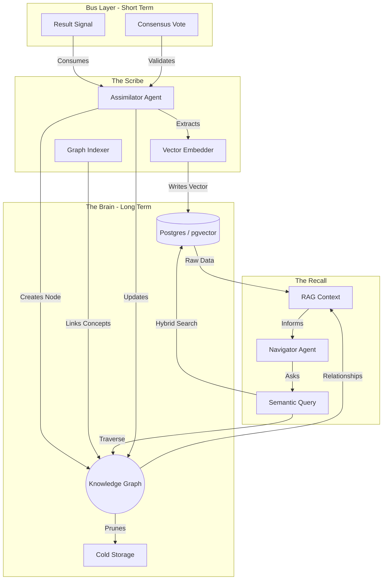

---
hexagon:
  ontos:
    id: 3b317733-9620-46c5-89ef-d325f16be4e7
    type: md
    owner: Swarmlord
  chronos:
    status: active
    urgency: 0.5
    decay: 0.5
    created: '2025-11-23T10:21:06.996111+00:00'
    generation: 51
  topos:
    address: memory/episodic/gen_50_archive/memory_architecture.md
    links: []
  telos:
    viral_factor: 0.0
    meme: memory_architecture.md
---

# 🧠 Memory GraphRAG Architecture (The Karmic Web)

> **Status**: Active (Gen 50)
> **Storage**: PostgreSQL (pgvector) + NetworkX (Graph)
> **Flow**: Capture → Structure → Reuse → Improve

## 🧬 Concept: The Quine Loop
The system is a "Quine" (Self-Reproducing Automaton).
1.  **Stigmergy (Short-Term)**: The "Stream of Consciousness" (NATS).
2.  **Memory (Long-Term)**: The "Crystallized Wisdom" (GraphRAG).
3.  **Evolution**: The Graph updates the Agents, who then update the Graph.

## 📊 Data Flow Diagram (Mermaid)

