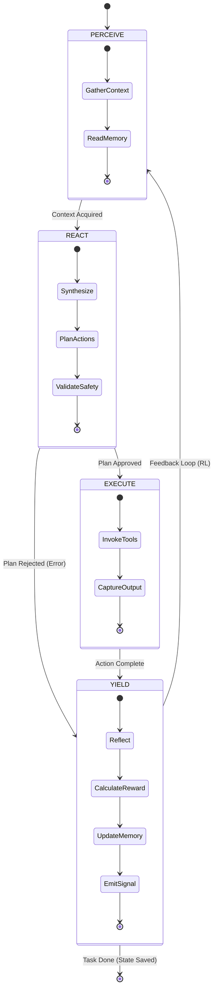

# The PREY Loop: Atomic Cognitive Holon

> **Status**: Active
> **Type**: Level 0 (Atomic Execution)

The **PREY Loop** is the fundamental state machine for all agents in Hive Fleet Obsidian. It represents the smallest unit of "Cognitive Work".

## 🧜‍♀️ State Diagram (Mermaid)

## 🧠 Cognitive Chunking
*   **Perceive**: "What is happening?" (Input)
*   **React**: "What should I do?" (Logic)
*   **Execute**: "Do it." (Action)
*   **Yield**: "What did I learn?" (Reinforcement/Stigmergy)
