---
hexagon:
  ontos:
    id: 4ca4fb67-9e5a-4085-9f79-ea3881c7812b
    type: md
    owner: Swarmlord
  chronos:
    status: active
    urgency: 0.5
    decay: 0.5
    created: '2025-11-23T10:21:07.013620+00:00'
    generation: 51
  topos:
    address: memory/episodic/gen_50_archive/scatter_gather.md
    links: []
  telos:
    viral_factor: 0.0
    meme: scatter_gather.md
---

# 🐍 Hydra Protocol: Scatter-Gather Architecture

> **Status**: Active
> **Type**: Execution Pattern

## Executive Summary
The **Hydra Protocol** is the primary "Scatter-Gather" execution pattern for the Hive. It allows the **Navigator** (Brain) to decompose a high-level intent into parallel tasks, distribute them to **Workers** (Body), and synthesize the results via a **Bridger** (Nerves).

It includes a **Quality Gate** (Carapace) to filter out low-confidence results before synthesis.

## Visualization

```mermaid
graph TD
    %% 🧠 The Brain (Intent)
    subgraph Brain [Navigator]
        Intent[Mission Intent] -->|Gherkin| Planner[Orchestrator Node]
    end

    %% 🦾 The Body (Execution)
    subgraph Body [Hydra Swarm]
        Planner -->|Scatter: Map Tasks| Workers

        subgraph Workers [Parallel Execution]
            W1[Worker 1: Generator]
            W2[Worker 2: Critic]
            W3[Worker 3: Analyst]
        end

        W1 -->|Result| Aggregator
        W2 -->|Result| Aggregator
        W3 -->|Result| Aggregator
    end

    %% âš¡ The Nerves (Synthesis)
    subgraph Nerves [Bridger]
        Aggregator[Synthesizer Node] -->|Reduce: Consensus| FinalOutput[Final Report]
    end

    %% ðŸ›¡ï¸ Carapace (Validation)
    subgraph Carapace [Filter]
        Workers -.->|Confidence Check| Filter{Quality Gate}
        Filter -->|Pass| Aggregator
        Filter -->|Fail| Discard[Discard Result]
    end

    %% Styling
    classDef brain fill:#ffcccc,stroke:#333,stroke-width:2px;
    classDef body fill:#ccffcc,stroke:#333,stroke-width:2px;
    classDef nerves fill:#ccccff,stroke:#333,stroke-width:2px;
    classDef carapace fill:#ffffcc,stroke:#333,stroke-width:2px;

    class Intent,Planner brain;
    class W1,W2,W3 body;
    class Aggregator,FinalOutput nerves;
    class Filter,Discard carapace;
```

