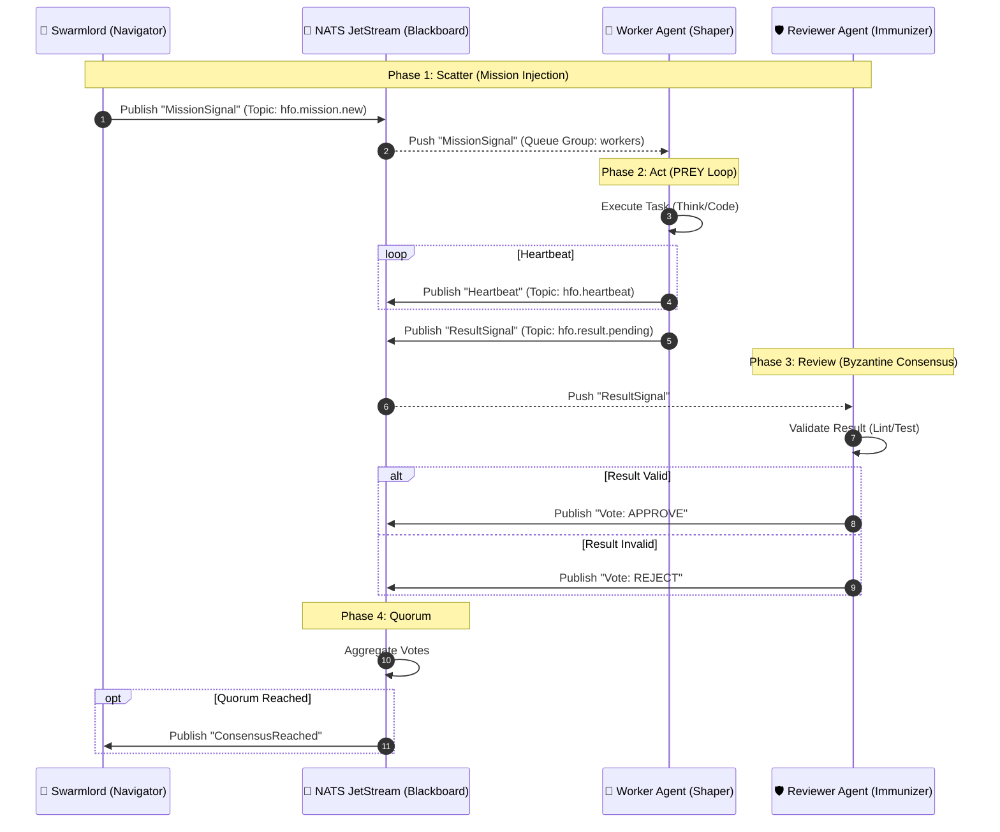

---
hexagon:
  ontos:
    id: 8d83e91d-d38f-4cb6-be18-81bea8509317
    type: md
    owner: Swarmlord
  chronos:
    status: active
    urgency: 0.5
    decay: 0.5
    created: '2025-11-23T10:21:07.014791+00:00'
    generation: 51
  topos:
    address: memory/episodic/gen_50_archive/stigmergy_architecture.md
    links: []
  telos:
    viral_factor: 0.0
    meme: stigmergy_architecture.md
---

# 🚌 Virtual Stigmergy Layer Architecture

> **Status**: Active (Gen 50)
> **Protocol**: NATS JetStream
> **Topology**: Decoupled "Blackboard" Pattern

## 🧠 Concept: "The Bus Builds the Brain"
Agents do not communicate directly. They write to the environment (NATS), and the environment triggers other agents. This ensures:
1.  **Decoupling**: Agents can die/respawn without breaking the loop.
2.  **Scalability**: 10 -> 1M agents via NATS clustering.
3.  **Observability**: We can tap the wire to see the "Thought Process" of the hive.

## 📊 Sequence Diagram (Mermaid)

