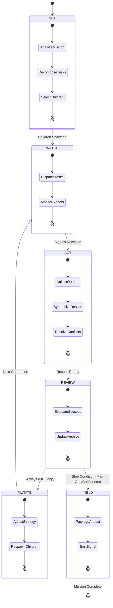
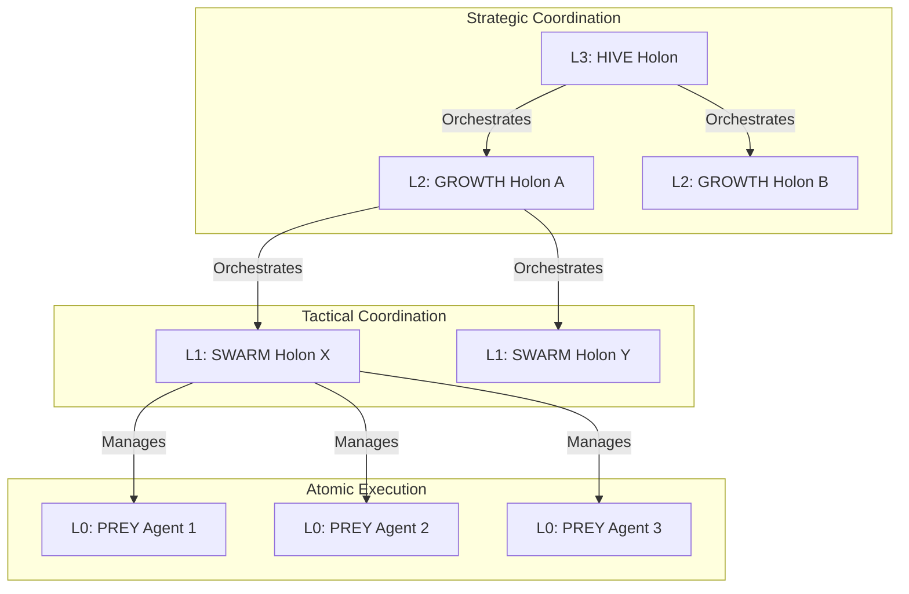

# The SWARM Loop: Fractal Coordination Holon

> **Status**: Active
> **Type**: Level 1+ (Recursive Coordination)

The **SWARM Loop** is the coordination pattern for Hive Fleet Obsidian. It is **Fractal**, meaning a SWARM can coordinate other SWARMs or atomic PREY Agents.

## 🧜‍♀️ State Diagram (Mermaid)

## 🌌 Fractal Holarchy Structure

The system scales by nesting these loops:

*   **Level 3 (HIVE)**: Strategic SWARM. Decomposes "War" into "Battles".
    *   *Children*: Level 2 SWARMs.
*   **Level 2 (GROWTH)**: Operational SWARM. Decomposes "Battle" into "Missions".
    *   *Children*: Level 1 SWARMs.
*   **Level 1 (SWARM)**: Tactical SWARM. Decomposes "Mission" into "Tasks".
    *   *Children*: Level 0 PREY Agents.
*   **Level 0 (PREY)**: Atomic Agent. Executes "Task".
    *   *Children*: None (Tools).

