# 🫀 HFO Biomimetic Organ Registry (Plain Biology)

> **Status**: Draft
> **Context**: Mapping the 8 OBSIDIAN Roles to specific "Organs" (Directories) using generic biological terms. This avoids IP infringement while maintaining the "Living System" metaphor.

## 🧬 The Organ System

We treat the file system as a **Complex Organism**. Each directory is a vital organ with a specific biological function, a designated **Guardian Role**, and a unique **Stigmergy Pheromone**.

| Organ (Directory) | Biological Analog | OBSIDIAN Role | Function | Stigmergy Signal |
| :--- | :--- | :--- | :--- | :--- |
| **`intent/`** | **Cortex** (Brain) | **Navigator** | **Will**: The strategic center. Gherkin features, Registry, Architecture. | `signal:directive` |
| **`ingestion/`** | **Ocelli** (Simple Eyes) | **Observer** | **Sight**: Raw data intake, scrapers, monitors. | `signal:stimulus` |
| **`src/swarm/`** | **Ganglia** (Nerve Clusters) | **Bridger** | **Connection**: The nervous system. Workflows, routing, state machines. | `signal:impulse` |
| **`src/tools/`** | **Mandibles** (Jaws/Limbs) | **Shaper** | **Action**: The tool forge. Execution tools, effectors, scripts. | `signal:action` |
| **`src/config/`** | **Hemolymph** (Blood) | **Injector** | **Genesis**: Resources & DNA. Settings, keys, models (SSOT). | `signal:nutrient` |
| **`tests/`** | **Lysosomes** (Digestive Sacs) | **Disruptor** | **Selection**: The breaker. Breaking things, chaos engineering, recycling. | `signal:catalyst` |
| **`docs/`** | **Carapace** (Exoskeleton) | **Immunizer** | **Protection**: The shield. Standards, governance, boundaries. | `signal:barrier` |
| **`memory/`** | **Mycelium** (Fungal Root) | **Assimilator** | **Digestion**: The learner. Long-term storage, knowledge graph. | `signal:spore` |

---

## 🗺️ The Registry Map (Visualized)

```mermaid
graph TD
    subgraph "The Head (Strategy)"
        Cortex["🧠 Cortex\n(intent/)\nOwner: Navigator"]
        Ocelli["👁️ Ocelli\n(ingestion/)\nOwner: Observer"]
    end

    subgraph "The Body (Execution)"
        Ganglia["🕸️ Ganglia\n(src/swarm/)\nOwner: Bridger"]
        Mandibles["🦀 Mandibles\n(src/tools/)\nOwner: Shaper"]
        Hemolymph["🩸 Hemolymph\n(src/config/)\nOwner: Injector"]
    end

    subgraph "The Resilience (Survival)"
        Lysosomes["🧪 Lysosomes\n(tests/)\nOwner: Disruptor"]
        Carapace["🛡️ Carapace\n(docs/)\nOwner: Immunizer"]
        Mycelium["🍄 Mycelium\n(memory/)\nOwner: Assimilator"]
    end

    Cortex -->|Directs| Ganglia
    Ocelli -->|Feeds| Cortex
    Ganglia -->|Activates| Mandibles
    Hemolymph -->|Fuels| Ganglia
    Lysosomes -->|Tests| Mandibles
    Carapace -->|Protects| All
    Mandibles -->|Outputs to| Mycelium
```

## 📝 Implementation Plan

1.  **Tagging**: Update `intent/registry.yaml` with these Biological Organ names.
2.  **Pheromones**: Implement the `signal:*` types in the Stigmergy Header schema.
3.  **Evolution**:
    *   **Ant Pattern**: Tools in **Mandibles** gain `action` strength when used successfully.
    *   **Termite Pattern**: Files in **Hemolymph** emit `nutrient` signals until configured.
    *   **Mold Pattern**: **Ganglia** connections strengthen with `impulse` flow.

---
**Grafted by Gardener**: [[gen_50_README|Gen 50 Hub]]
