# 🚌 Virtual Stigmergy Layer Architecture

> **Status**: Active (Gen 50)
> **Protocol**: NATS JetStream
> **Topology**: Decoupled "Blackboard" Pattern

## 🧠 Concept: "The Bus Builds the Brain"
Agents do not communicate directly. They write to the environment (NATS), and the environment triggers other agents. This ensures:
1.  **Decoupling**: Agents can die/respawn without breaking the loop.
2.  **Scalability**: 10 -> 1M agents via NATS clustering.
3.  **Observability**: We can tap the wire to see the "Thought Process" of the hive.

## 📊 Sequence Diagram (Mermaid)

```mermaid
sequenceDiagram
    autonumber
    participant Swarmlord as 🦅 Swarmlord (Navigator)
    participant NATS as 🚌 NATS JetStream (Blackboard)
    participant Worker as 🐜 Worker Agent (Shaper)
    participant Reviewer as 🛡️ Reviewer Agent (Immunizer)

    Note over Swarmlord, Reviewer: Phase 1: Scatter (Mission Injection)
    Swarmlord->>NATS: Publish "MissionSignal" (Topic: hfo.mission.new)
    NATS-->>Worker: Push "MissionSignal" (Queue Group: workers)

    Note over Worker: Phase 2: Act (PREY Loop)
    Worker->>Worker: Execute Task (Think/Code)
    loop Heartbeat
        Worker->>NATS: Publish "Heartbeat" (Topic: hfo.heartbeat)
    end
    Worker->>NATS: Publish "ResultSignal" (Topic: hfo.result.pending)

    Note over Reviewer: Phase 3: Review (Byzantine Consensus)
    NATS-->>Reviewer: Push "ResultSignal"
    Reviewer->>Reviewer: Validate Result (Lint/Test)
    alt Result Valid
        Reviewer->>NATS: Publish "Vote: APPROVE"
    else Result Invalid
        Reviewer->>NATS: Publish "Vote: REJECT"
    end

    Note over NATS: Phase 4: Quorum
    NATS->>NATS: Aggregate Votes
    opt Quorum Reached
        NATS->>Swarmlord: Publish "ConsensusReached"
    end
```

---
**Grafted by Gardener**: [[gen_50_README|Gen 50 Hub]]
