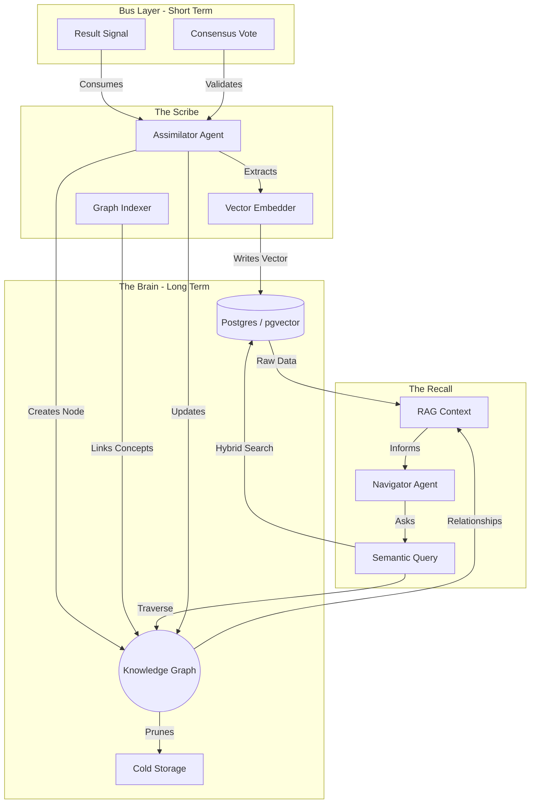

# 🧠 Memory GraphRAG Architecture (The Karmic Web)

> **Status**: Active (Gen 50)
> **Storage**: PostgreSQL (pgvector) + NetworkX (Graph)
> **Flow**: Capture → Structure → Reuse → Improve

## 🧬 Concept: The Quine Loop
The system is a "Quine" (Self-Reproducing Automaton).
1.  **Stigmergy (Short-Term)**: The "Stream of Consciousness" (NATS).
2.  **Memory (Long-Term)**: The "Crystallized Wisdom" (GraphRAG).
3.  **Evolution**: The Graph updates the Agents, who then update the Graph.

## 📊 Data Flow Diagram (Mermaid)

---
**Grafted by Gardener**: [[gen_50_README|Gen 50 Hub]]
