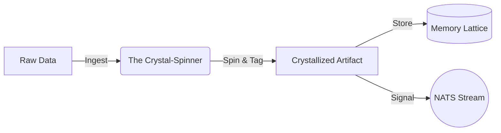

# 🕸️ The Crystal-Spinner: Assimilator Sub-Role

> **Status**: Active Intent
> **Context**: Defining the specialized "Hygiene & Structure" role within the HFO Memory System.

## 🦅 Role Definition

**The Crystal-Spinner** is the specialized caste of the **Assimilator** responsible for turning raw information into structured, permanent memory.
It secretes "liquid memory" (metadata) which hardens into a web of Obsidian glass (The Knowledge Graph).

### 🧬 Biological Analogy
*   **The Spider**: It spins the web that catches the flies (data).
*   **The Geologist**: It ensures the web hardens into permanent crystal (Obsidian).
*   **The Weaver**: It connects every new strand to the existing lattice.

---

## 🐜 Role Specifications

| Attribute | Description |
| :--- | :--- |
| **Parent Role** | **Assimilator** (Memory/Learning) |
| **Domain** | **Memory (Surface & Graph Layer)** |
| **Primary Tool** | **LLM-based Tagging** (Instructor + Pydantic) |
| **Input** | Raw Files (Markdown, Code, Logs) from `eyes/` or `body/` |
| **Output** | Structured Artifacts with **Stigmergic Headers** in `memory/semantic/` |
| **Motto** | *"Spin the thread. Harden the glass. Bind the Hive."* |

---

## 🛠️ Integration with HFO Architecture

The Crystal-Spinner sits at the **Gateway of Memory**.

1.  **The Eyes** see raw data (The Fly).
2.  **The Crystal-Spinner** intercepts it.
3.  **Action**:
    *   **Spin**: Reads the content and extracts concepts.
    *   **Harden**: Generates the immutable **Stigmergic Header** (YAML).
    *   **Weave**: Places the file in the correct `memory/semantic` lattice.
4.  **The Memory** stores the crystallized artifact.

### 📊 Visual Flow

---

## 📋 The Crystal-Spinner's Protocol

### 1. The Spin (Analysis)
*   **Input**: A raw text file.
*   **Process**: LLM Analysis (Summary, Concepts, Domain).
*   **Output**: A `CrystalMetadata` object.

### 2. The Harden (Tagging)
*   **Input**: `CrystalMetadata`.
*   **Process**: Injection of YAML Frontmatter.
*   **Output**: A self-describing file.

### 3. The Weave (Placement)
*   **Input**: The tagged file.
*   **Process**: Moving to `memory/semantic/library/{domain}/{concept}/`.
*   **Output**: A node in the file system graph.

---
**Grafted by Gardener**: [[gen_50_README|Gen 50 Hub]]
