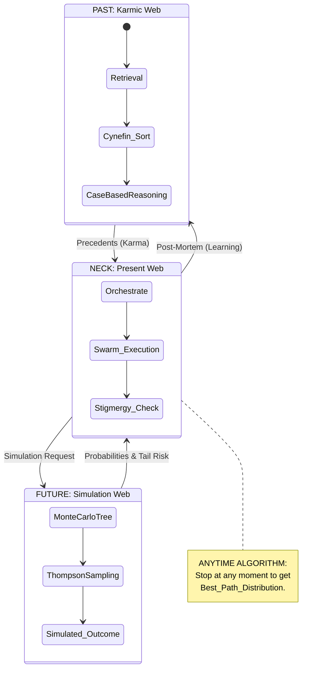

# ⏳ The Obsidian Hourglass: Temporal Traversal Strategy

> **Status**: Draft
> **Type**: Algorithm / Strategy

## Executive Summary
The **Obsidian Hourglass** is the core spatial traversal strategy for Hive Fleet Obsidian. It represents the flow of information through time:
1.  **PAST (Karmic Web)**: Retrieval of precedents and case-based reasoning.
2.  **PRESENT (Neck)**: Real-time orchestration and execution.
3.  **FUTURE (Simulation Web)**: Monte Carlo simulations and predictive modeling.

It is an **Anytime Algorithm**, meaning it can be stopped at any moment to yield the best current path distribution.

## Visualization

